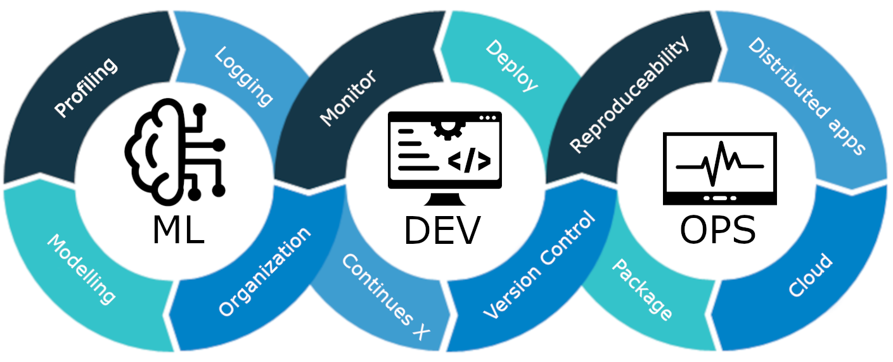

<p align="center">
    <h1 align="center">Machine Learning Operations</h1>
    <h3 align="center">Work in progress for January 2023 version!</h3>
    <p align="center">Repository for <a href="https://kurser.dtu.dk/course/02476">course 02476</a> at DTU.</p>
    <p align="center"><strong><a href="https://skaftenicki.github.io/dtu_mlops/">Checkout the homepage!</a></strong></p>
</p>

<p align="center">
  
</p>

<details open markdown="block">
  <summary>
    Table of contents
  </summary>
  {: .text-delta }
1. TOC
{:toc}
</details>

## Course details

* Course responsible
    * Postdoc [Nicki Skafte Detlefsen](https://skaftenicki.github.io/), nsde@dtu.dk
    * Professor [Søren Hauberg](http://www2.compute.dtu.dk/~sohau/), sohau@dtu.dk
* 5 ECTS (European Credit Transfer System), corresponding to 140 hours of work
* 3 week period of January 2023
* Master course
* Grade: Pass/not passed
* Type of assessment: weekly project updates + final oral examination/presentation
* Recommended prerequisites: DTU course [02456 (Deep Learning)](https://kurser.dtu.dk/course/2021-2022/02456) or
  experience with the following topics:
    * General understanding of machine learning (datasets, probability, classifiers, overfitting ect.)
    * Basic knowledge about deep learning (backpropagation, convolutional neural networks, auto-encoders ect.)
    * Coding in [PyTorch](https://pytorch.org/). The first day we provide a number of exercises in PyTorch to
      get everyone's skills up-to-date as fast as possible.

## Course setup

Start by cloning or downloading this repository

```bash
git clone https://github.com/SkafteNicki/dtu_mlops
```

If you do not have git installed (yet) we will touch upon it in the course. The folder will contain all
exercise material for this course and lectures. Additionally, you should join our Slack channel which
we use for communication:

<https://join.slack.com/t/dtumlops/shared_invite/zt-1j1zx8t4h-nTbUPibR9xCz58erDyyikw>

(link may be expired, write to me to gain access.)

## Course organization

We highly recommend that when going through the material that you use the
[homepage](https://skaftenicki.github.io/dtu_mlops/) which is the corresponding
[Github pages](https://pages.github.com/) version of this repository that is more nicely
rendered, that also includes some special HTML magic provided by
[just the docs](https://github.com/just-the-docs/just-the-docs).

The course is divided into sessions, denoted by capital **S**, and modules, denoted by capital **M**. A session
corresponds to full day of work if you are following the course, meaning approx 9 hours of work. Each session (**S**)
corresponds to topic within MLOps and consist of multiple modules (**M**) that each covers an tool within the session.

Importantly we differ between core modules and optional modules. Core modules will be marked by

{: .important }
> Core module

at the top of their corresponding page. Core modules are importantly to go through to be able to pass the course.
You are highly recommended to still do the optional modules.

## MLOps: What is it?

Machine Learning Operations (MLOps) is a rather new field that has seen its uprise as machine learning and particular
deep learning has become a technology that is widely available. The term itself is a compound of "machine learning"
and "operations" and covers everything that has to do with the management of the production ML lifecycle.

The lifecycle of production ML can largely be divided into three phases:

1. Design: The initial phase starts with a investigation of the problem. Based on this analysis, a number of
requirements can be prioritized of what we want our future model to actual do. Since machine learning requires
data to be trained, we also investigate in this step what data we have and if we need to source it in some other way.

2. Model development: Based on the design phase we can actually begin to conjurer some machine learning algorithm to
solve our problems. As always, the initial step often involve doing some data analysis to make sure that our model
is actually learning the signal that we want it to learn. Secondly, is the machine learning engineering phase, where
the particular model architecture is chosen. Finally, we also need to do validation and testing to make sure that
our model is generalizing well.

3. Operations: Based on the model development phase, we now have a model and we actual want to use. The operations
is where create an automatic pipeline that makes sure that whenever we make changes to our codebase they gets
automatically incorporated into our model, such that we do not slow down production. Equally important is also the
ongoing monitoring of already deployed models to make sure that they behave exactly as we specified them.

It is important to note that the three steps are in fact a *cycle*, meaning that we you have successfully deployed a
machine learning model that is not the end of it. Your initial requirements may change, forcing you to revisit the
design phase. Some new algorithm may show promising results, so you revisit the model development phase to implement
this. And finally, you may try to cut the cost of running your model in production, making you revisit the operations
phase, trying to optimize some steps.

The focus in this course is particular on the **Operations** part of MLOps as this is what many data scientist are
missing in their toolbox to take all the knowledge they have about data processing and model development into a
production setting.

## Learning objectives

General course objective

> Introduce the student to a number of coding practices that will help them organization, scale,
> monitor and deploy machine learning models either in a research or production setting. To provide
> hands-on experience with a number of frameworks, both local and in the cloud, for doing large
> scale machine learning models.

This includes:
* Organize code in a efficient way for easy maintainability and shareability
* Understand the importance of reproducibility and how to create reproducible containerized applications and experiments
* Cable of using version control to efficiently collaborate on code development
* Knowledge of continuous integration (CI) and continuous machine learning (CML) for automating code development
* Being able to debug, profile, visualize and monitor multiple experiments to assess model performance
* Cable of using online cloud based computing services to scale experiments
* Demonstrate knowledge about different distributed training paradigms within  machine learning and how to apply them
* Deploy machine learning models, both locally and in the cloud
* Conduct a research project in collaboration with follow students using the frameworks taught in the course
* Have lots of fun and share memes! :)

## References

Additional reading resources (in no particular order):

* [Ref 1](https://towardsdatascience.com/ml-ops-machine-learning-as-an-engineering-discipline-b86ca4874a3f)
  Introduction blog post for those that have never heard about MLOps and want to get an overview.

* [Ref 2](https://cloud.google.com/architecture/mlops-continuous-delivery-and-automation-pipelines-in-machine-learning)
  Great document from Google about the different levels of MLOps.

* [Ref 3](https://ml-ops.org/content/mlops-principles)
  Another introduction to the principles of MLOps and the different stages of MLOps.

* [Ref 4](https://papers.nips.cc/paper/2015/file/86df7dcfd896fcaf2674f757a2463eba-Paper.pdf)
  Great paper about the technical depth in machine learning.

* [Ref 5](https://arxiv.org/abs/2209.09125)
  Interview study that uncovers many of the pain points that ML engineers go through when doing MLOps.

Other courses with content similar to this:

* [Made with ML](https://madewithml.com). Great online MLOps course that also covers additional topics on the
  foundations of working with ML.

* [Full stack deep learning](https://fullstackdeeplearning.com/). Another MLOps online course the does through the hole
  developer pipeline.

* [MLOps Zoomcamp](https://github.com/DataTalksClub/mlops-zoomcamp). MLOps online course that includes many of the same
  topics.

## License

I highly value open-source, and the content of this course is therefore free to use under the Apache 2.0 license.
If you use parts of this course in your own work, please cite using:

```bibtex
@misc{skafte_mlops,
    author       = {Nicki Skafte Detlefsen},
    title        = {Machine Learning Operations},
    howpublished = {\url{https://github.com/SkafteNicki/dtu_mlops}},
    year         = {2022}
}
```