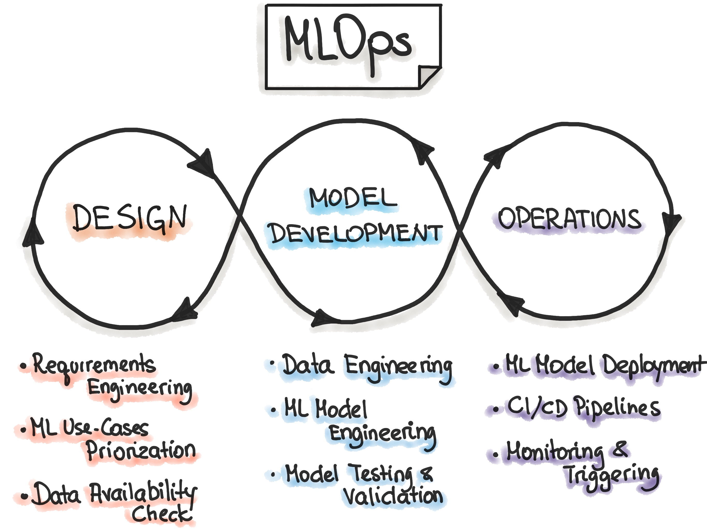

(Image credit to [link](https://ml-ops.org/content/mlops-principles))
# Machine Learning Operations

This repository contains the exercises for the DTU course Machine Learning Operations (MLOps). 
All exercises are written in the [Python](https://www.python.org/) programming language and formatted 
into a combination of scripts and [Jupyter Notebooks](https://jupyter.org/). 

## MLOps: What is it?

A compound of “machine learning” and “operations”, refers to the practice for collaboration and communication 
between data scientists and operations professionals to help manage production ML (or deep learning) lifecycle.
The life cycle consist of a design, development and operations phase that are all equal important to get a
functional machine learning model.

Reading resources:
* https://cloud.google.com/architecture/mlops-continuous-delivery-and-automation-pipelines-in-machine-learning.
  Introduction blog post for those that have never heard about MLOps
* https://towardsdatascience.com/ml-ops-machine-learning-as-an-engineering-discipline-b86ca4874a3f. Great document
  from google about the different levels of MLOps
* https://ml-ops.org/content/mlops-principles. The principles of MLOps
* https://papers.nips.cc/paper/2015/file/86df7dcfd896fcaf2674f757a2463eba-Paper.pdf. Great paper about the
technical "depth" in machine learning (can also be found in the litterature folder)

## Course details

* Course responsable
    * Postdoc Nicki Skafte Detlefsen, nsde@dtu.dk
    * Professor Søren Hauberg, sohau@dtu.dk
* 5 ECTS
* 3 week period of June 2021
* Master course
* Grade: Pass/not passed
* Type of assessment: weekly project updates + final oral examination/presentation
* Recommended prerequisites: [02456 (Deep Learning)](https://kurser.dtu.dk/course/2021-2022/02456) or experience
with the following:
    * General understanding of machine learning (datasets, probability, classifiers, overfitting ect.) and 
    basic knowledge about deep learning (backpropagation, convolutional neural network, auto-encoders ect.)
    * Coding in [Pytorch](https://pytorch.org/)

## Setup

Start by cloning or downloading this repository
```
git clone https://github.com/SkafteNicki/dtu_mlops
```
if you do not have git installed (yet) we will touch upon it in the course.
Additionally, you should join our slack channel which we use for communication:

https://join.slack.com/t/slack-ddr8461/shared_invite/zt-qzk7ho8z-1tBT_SkkkxtpgMU8x197pg

## Course plan

## On-site days:

Each day will start at 9:00 in the morning with an ½-1 hour lecture about the topic of the day.
The the remaining of the day will be spend on solving exercises. We aim that the exercises should
be able to be solved in around 4 hours, meaning that you will be able to get help until 14:00. 
Note that since the material is untested some exercises may take less time and some may take more. 

Lectures and exercises will take place in building 208 auditorium 11. We additionally have room 006
reserved for exercises and other than that you are free to in the connecting study areas.

## Virtual days:

Virtual days are intended for project work and you are therefore responsable for making an agreement
with your group when you are going to work. Please note that on the the first virtual day, a lecture
will be given at 9:00 (zoom link will be sent out) with project information. Two times during each virtual
day we will have office hours where you can ask questions. Please note, that while you will not be able
to get physical help you are more than welcome to still use DTU´s facilities for your group work.

### Week 1

The first week is all about getting set up for the following two weeks. In particular this week focus setting
up a good practise for how to organise and develop code.

Date | Day       |  Presentation topic                 | Framework/exercise       | On-site/Virtual
-----|-----------|-------------------------------------|--------------------------|--------------------
4/6  | Friday    | How autodiff changed the world      | Freshup on pytorch       | On-site
7/6  | Monday    | Code organisation: why it matters   | Conda + Github + docker  | On-site
8/6  | Tuesday   | Debugging and visualization         | Tensorboard, wandb       | On-site
9/6  | Wednesday | Continuous integration              | Pytest + github actions  | on-site
10/6 | Thursday  | Pytorch ecosystem                   | Project work             | Virtual

### Week 2

The second week is about scalability. While many times it does not require huge resources to do development,
there are always certain phases that require you to scale your experiments. In this week we will focus on 
getting comfortable on how to write distributed application and how we can run them

Date | Day       | Presentation topic                   | Framework/exercise      | On-site/Virtual
-----|-----------|--------------------------------------|-------------------------|-------------------
11/6 | Friday    | Training in the sky                  | Azure                   | On-site
14/6 | Monday    | Distributed training: a overview     | Pytorch Lightning       | On-site
15/6 | Tuesday   | Reproducibility                      | Hydra                   | On-site
16/6 | Wednesday | -                                    | Project work            | Virtual
17/6 | Thursday  | -                                    | Project work            | Virtual

### Week 3

The last week is about two important extensions of your workflow: hyperparameter tuning and model
deployment. Mastering both of these topics is both beneficial in production and research settings.

Date | Day       | Presentation topic                   | Framework/exercise    | On-site/Virtual
-----|-----------|--------------------------------------|-----------------------|---------------------
18/6 | Friday    | Cross validation and hyperparameters | Optuna                | On-site
21/6 | Monday    | Deployment                           | Torchserve + bentoml  | On-site
22/6 | Tuesday   | -                                    | Project work          | Virtual
23/6 | Wednesday | -                                    | Project work          | Virtual
24/6 | Thursday  | -                                    | Project presentations | On-site

## Learning objectives

A student who has met the objectives of the course will be able to:

<p align="center">
<b>Demonstrate a broad knowledge of state-of-the-art frameworks for doing research within deep learning</b>
</p>
  
This includes:
* Organise code in a efficient way for easy maintainability and shareability (git, cookiecutter)
* Being able to debug, visualize and monitor multiple experiments to assess model performance (tensorflow, wandb)
* Cable of using online computing services to scale experiments (azure)
* Demonstrate knowledge about different distributed training paradigms (data parallelism, model parallelism, ect) 
with deep learning and how to apply them (pytorch-lightning)
* Understand the importance of reproducibility and how to make sure experiments are reproducible (hydra)
* Efficiently do cross-validation and hyperparameter searched (optuna)
* Deploy deep learning models in the wild (torchserve, azure)
* Conduct a research project in collaboration with follow students using the frameworks teached in the course
