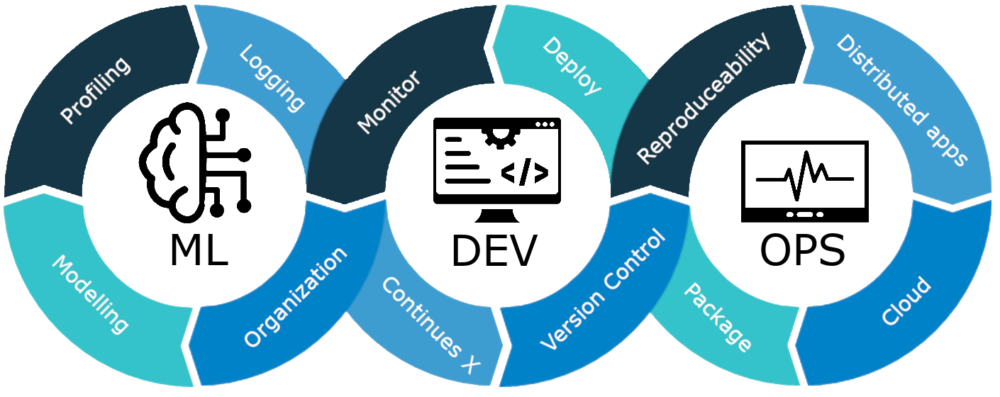

<p align="center">
    <h1 align="center">Machine Learning Operations</h1>
    <p align="center">Repository for <a href="https://kurser.dtu.dk/course/02476">course 02476</a> at DTU.</p>
    <p align="center"><strong><a href="https://skaftenicki.github.io/dtu_mlops/">Checkout the homepage!</a></strong></p>
</p>

<p align="center">
  
</p>

## ℹ️ Course information

* Course responsible
    * Associate Professor [Nicki Skafte Detlefsen](https://skaftenicki.github.io/), <nsde@dtu.dk>
    * Professor [Søren Hauberg](http://www2.compute.dtu.dk/~sohau/), <sohau@dtu.dk>
* 5 ECTS (European Credit Transfer System), corresponding to 140 hours of work
* 3 week period in January
* Master level course
* Grade: Pass/Fail
* Type of assessment: project report
* Recommended prerequisites: DTU course [02456 (Deep Learning)](https://kurser.dtu.dk/course/02456) or
    experience with the following topics:

    * General understanding of machine learning (datasets, probability, classifiers, overfitting, underfitting, etc.)
    * Basic knowledge of deep learning (backpropagation, convolutional neural networks, autoencoders etc.)
    * Coding in [PyTorch](https://pytorch.org/). On the first day, we provide some exercises in PyTorch to
        get everyone's skills up-to-date as fast as possible.

## 💻 Course setup :)

Start by cloning or downloading this repository

```bash
git clone https://github.com/SkafteNicki/dtu_mlops
```

If you do not have git installed (yet) we will touch upon it in the course. The folder will contain all the exercise
material for this course and lectures. Additionally, you should join our
[Slack channel](https://join.slack.com/t/dtumlops/shared_invite/zt-3mgdtd0hw-TXmrOk35_vOFTQvpXb3OWA)
which we use for communication. The link may be expired, write to [me](mailto:nsde@dtu.dk).

## 📂 Course organization

We highly recommend that when going through the material you use the
[homepage](https://skaftenicki.github.io/dtu_mlops/) which is the corresponding
[GitHub Pages](https://pages.github.com/) version of this repository that is more nicely rendered, and also includes
some special HTML magic provided by
[Material for MkDocs](https://squidfunk.github.io/mkdocs-material/).

The course is divided into sessions, denoted by capital **S**, and modules, denoted by capital **M**. A session
corresponds to a full day of work if you are following the course, meaning approximately 9 hours of work. Each session
(**S**) corresponds to a topic within MLOps and consists of multiple modules (**M**) that each cover a specific topic.

Importantly we differ between core modules and optional modules. Core modules will be marked by

!!! info "Core Module"

at the top of their corresponding page. Core modules are important to go through to be able to pass the course.
You are highly recommended to still do the optional modules.

Additionally, be aware of the following icons throughout the course material:

* This icon can be expanded to show code belonging to a given exercise

    ??? example

        I will contain some code for an exercise.

* This icon can be expanded to show a solution for a given exercise

    ??? success "Solution"

        I will present a solution to the exercise.

* This icon (1) can be expanded to show a hint or a note for a given exercise
    { .annotate }

    1. :man_raising_hand: I am a hint or note

## 🆒 MLOps: What is it?

*Machine Learning Operations* (MLOps) is a rather new field that has seen its uprise as machine learning and particularly
deep learning has become a widely available technology. The term itself is a compound of "machine learning"
and "operations" and covers everything that has to do with the management of the production ML lifecycle.

The lifecycle of production ML can largely be divided into three phases:

1. Design: The initial phase starts with an investigation of the problem. Based on this analysis, several requirements
    can be prioritized for what we want our future model to do. Since machine learning requires
    data to be trained, we also investigate in this step what data we have and if we need to source it in some other way.

2. Model development: Based on the design phase we can begin to conjure some machine learning algorithms to solve our
    problems. As always, the initial step often involves doing some data analysis to make sure that our model is
    learning the signal that we want it to learn. Secondly, is the machine learning engineering phase, where the
    particular model architecture is chosen. Finally, we also need to do validation and testing to make sure that
    our model is generalizing well.

3. Operations: Based on the model development phase, we now have a model that we want to use. The operations are where
    we create an automatic pipeline that makes sure that whenever we make changes to our codebase they get automatically
    incorporated into our model, such that we do not slow down production. Equally important is the ongoing monitoring
    of already deployed models to make sure that they behave exactly as we specified them.

It is important to note that the three steps are a *cycle*, meaning that when you have successfully deployed a
machine learning model that is not the end of it. Your initial requirements may change, forcing you to revisit the
design phase. Some new algorithms may show promising results, so you revisit the model development phase to implement
this. Finally, you may try to cut the cost of running your model in production, making you revisit the operations phase,
and trying to optimize some steps.

The focus of this course is particularly on the **Operations** part of MLOps as this is what many data scientists are
missing in their toolbox to implement all the knowledge they have about data processing and model development into a
production setting.

## ❔ Learning objectives

General course objective

> Introduce the student to a number of coding practices that will help them organize, scale,
> monitor and deploy machine learning models either in a research or production setting. To provide
> hands-on experience with a number of frameworks, both local and in the cloud, for doing large
> scale machine learning models.

This includes:

* Organize code in an efficient way for easy maintainability and shareability
* Understand the importance of reproducibility and how to create reproducible containerized applications and experiments
* Capable of using version control to efficiently collaborate on code development
* Knowledge of continuous integration (CI) and continuous machine learning (CML) for automating code development
* Being able to debug, profile, visualize and monitor multiple experiments to assess model performance
* Capable of using online cloud-based computing services to scale experiments
* Demonstrate knowledge about different distributed training paradigms within  machine learning and how to apply them
* Deploy machine learning models, both locally and in the cloud
* Conduct a research project in collaboration with fellow students using the frameworks taught in the course
* Have lots of fun and share memes! :)

## 📓 References

Additional reading resources (in no particular order):

* [Ref 1](https://medium.com/analytics-vidhya/fundamentals-of-mlops-part-1-a-gentle-introduction-to-mlops-1b184d2c32a8)
    Introduction blog post for those who have never heard about MLOps and want to get an overview.

* [Ref 2](https://cloud.google.com/architecture/mlops-continuous-delivery-and-automation-pipelines-in-machine-learning)
    Great document from Google about the different levels of MLOps.

* [Ref 3](https://ml-ops.org/content/mlops-principles)
    Another introduction to the principles of MLOps and the different stages of MLOps.

* [Ref 4](https://papers.nips.cc/paper/2015/file/86df7dcfd896fcaf2674f757a2463eba-Paper.pdf)
    Great paper about the technical debt in machine learning.

* [Ref 5](https://arxiv.org/abs/2209.09125)
    Interview study that uncovers many of the pain points that ML engineers go through when doing MLOps.

Other courses with content similar to this:

* [Made with ML](https://madewithml.com). Great online MLOps course that also covers additional topics on the
    foundations of working with ML.

* [Full stack deep learning](https://fullstackdeeplearning.com/). Another MLOps online course going through the whole
    developer pipeline.

* [MLOps Zoomcamp](https://github.com/DataTalksClub/mlops-zoomcamp). MLOps online course that includes many of the same
    topics.

## 👨‍🏫 Contributing

If you want to contribute to the course, we are happy to have you! Anything from fixing typos to adding new content is
welcome. For building the course material locally, it is a simple two-step process:

Either use `pip` to install the requirements:

```bash
pip install -r requirements.txt
mkdocs serve
```

Or use `uv`

```bash
uv sync
uv run mkdocs serve
```

Which will start a local server that you can access at `http://127.0.0.1:8000` and will automatically update when you
make changes to the course material. When you have something that you want to contribute, please make a pull request.

## ❕ License

I highly value open source, and the content of this course is therefore free to use under the Apache 2.0 license.
If you use parts of this course in your work, please cite using:

```bibtex
@misc{skafte_mlops,
    author       = {Nicki Skafte Detlefsen},
    title        = {Machine Learning Operations},
    howpublished = {\url{https://github.com/SkafteNicki/dtu_mlops}},
    year         = {2024}
}
```
