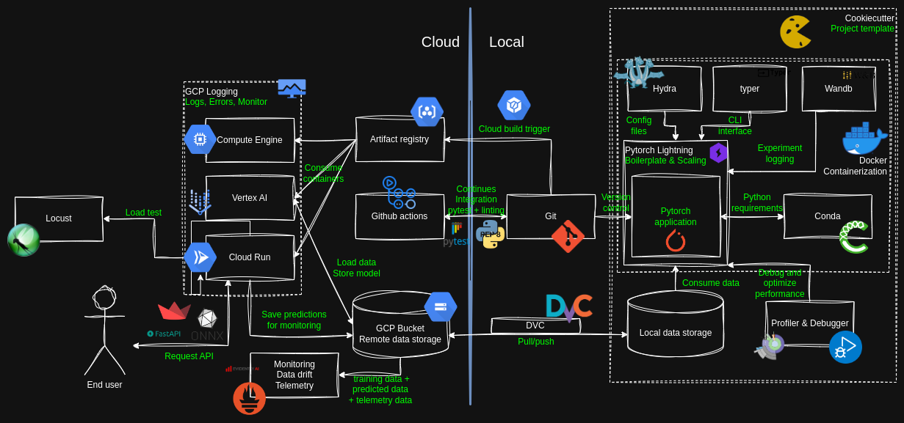
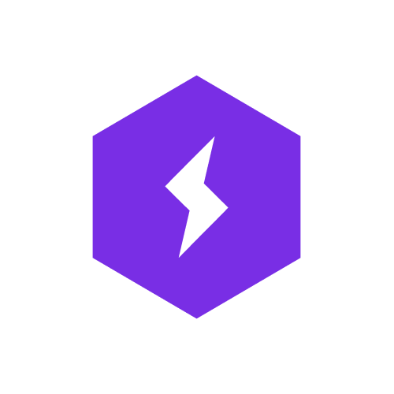
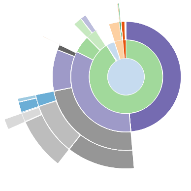

# Summary of course content

There are a lot of moving parts in this course, so it may be hard to understand how it all fits together.
This page provides a summary of the frameworks in this course e.g. the stack of tools used. In the figure below we have
provided an overview on how the different tools of the course interacts with each other. The table after the figure
provides a short description of each of the parts.

<figure markdown>
{ width="1000" }
<figcaption>
The MLOps stack in the course. This is just an example of one stack, and depending on your use case you may want to use
a different stack of tools that better fits your needs. Regardless of the stack, the principles of MLOps are the same.
</figcaption>
</figure>

<!-- markdownlint-disable -->
| Framework                                               | Description                                                |
|---------------------------------------------------------|------------------------------------------------------------|
| { width="50" }  | **PyTorch** is the backbone of our code, it provides the computational engine and the data structures that we need to define our data structures. |
| { width="50" } | **PyTorch lightning** is a framework that provides a high-level interface to PyTorch. It provides a lot of functionality that we need to train our models, such as logging, checkpointing, early stopping, etc. such that we do not have to implement it ourselves. It also allows us to scale our models to multiple GPUs and multiple nodes. |
| { width="50" } | We control the dependencies and Python interpreter using **Conda** that enables us to construct reproducible virtual environments |
| { width="50" } | For configuring our experiments we use **Hydra** that allows us to define a hierarchical configuration structure config files |
| { width="50" } | For creating command line interfaces we can use **Typer** that provides a high-level interface for creating CLIs |
| { width="50" } | Using **Weights and Bias** allows us to track and log any values and hyperparameters for our experiments |
| { width="50" } | Whenever we run into performance bottlenecks with our code we can use the **Profiler** to find the cause of the bottleneck |
| { width="50" } | When we run into bugs in our code we can use the **Debugger** to find the cause of the bug |
| { width="50" } | For organizing our code and creating templates we can use **Cookiecutter** |
| { width="50" } | **Docker** is a tool that allows us to create a container that contains all the dependencies and code that we need to run our code |
| { width="50" } | For controlling the versions of our data and synchronization between local and remote data storage, we can use **DVC** that makes this process easy |
| { width="50" } | For version control of our code we use **Git** (in complement with GitHub) that allows multiple developers to work together on a shared codebase |
| { width="50" } | We can use **Pytest** to write unit tests for our code, to make sure that new changes to the code does break the code base |
| { width="50" } | For linting our code and keeping a consistent coding style we can use tools such as **Pylint** and **Flake8** that checks our code for common mistakes and style issues |
| { width="50" } | For running our unit tests and other checks on our code in a continuous manner e.g. after we commit and push our code we can use **GitHub actions** that automate this process |
| { width="50" } | Using **Cloud build** we can automate the process of building our docker images and pushing them to our artifact registry |
| { width="50" } | **Artifact registry** is a service that allows us to store our docker images for later use by other services |
| { width="50" } | For storing our data and trained models we can use **Cloud storage** that provides a scalable and secure storage solution |
| { width="50" } | For general compute tasks we can use **Compute engine** that provides a scalable and secure compute solution |
| { width="50" } | For training our experiments in a easy and scalable manner we can use **Vertex AI** |
| { width="50" } | For creating a REST API for our model we can use **FastAPI** that provides a high-level interface for creating APIs |
| { width="50" } | For converting our PyTorch model to a format that can be used in production we can use **ONNX** |
| { width="50" } | For creating a frontend for our model we can use **Streamlit** that provides a high-level interface for creating web applications |
| { width="50" } | For simple deployments of our code we can use **Cloud functions** that allows us to run our code in response to events through simple Python functions |
| { width="50" } | For more complex deployments of our code we can use **Cloud run** that allows us to run our code in response to events through docker containers |
| { width="50" } | For load testing our deployed model we can use **Locust** |
| { width="50" } | **Cloud monitoring** gives us the tools to keep track of important logs and errors from the other cloud services |
| { width="50" } | To monitor whether our deployed model is experiencing any drift, we can use **Evidently AI**, which provides a framework and dashboard for drift monitoring |
| { width="50" } | For monitoring the telemetry of our deployed model we can use **OpenTelemetry** that provides a standard for collecting and exporting telemetry data |
<!-- markdownlint-restore -->
