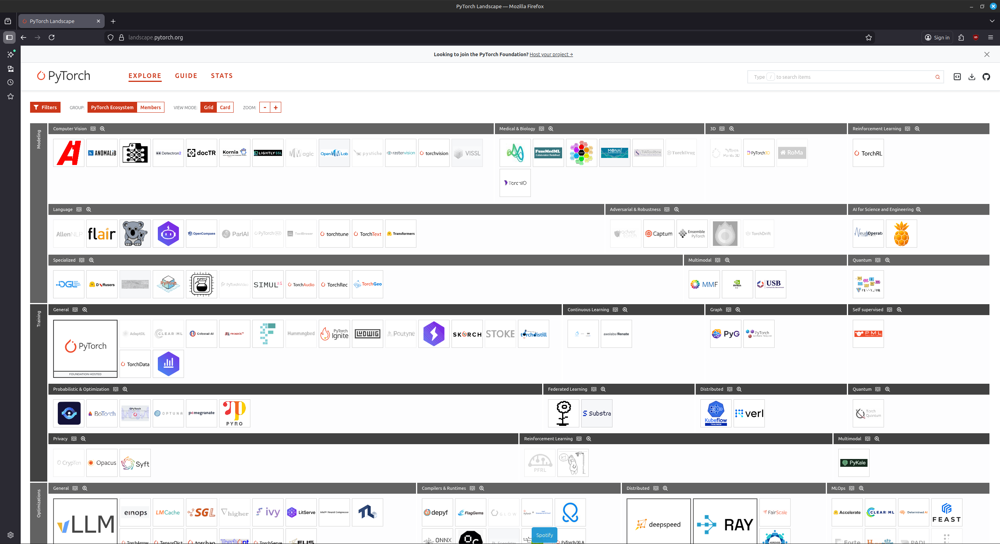

# Project work

[Slides](../slides/day5_project.pdf){ .md-button }

Approximately 1/3 of the course time is dedicated to doing project work. The projects will serve as the basis of your
exam. In the project, you will essentially re-apply everything that you learn throughout the course to a self chosen
project. The overall goals with the project are:

* Being able to work in a group on a larger project
* To formulate a project within the provided guidelines
* Apply the material taught in the course to the problem
* Present your findings

In the projects you are free to work on whatever problem that you want. If you want inspiration for projects, here are
some examples

1. [Classification of tweets](https://github.com/nielstiben/MLOPS-Project)

2. [Translating from English to German](https://github.com/MikkelGodsk/dtu_mlops_exam_project)

3. [Classification of scientific papers](https://github.com/eyhl/group5-pyg-dtu-mlops)

4. [Classification of rice types from images](https://github.com/Snirpurin/MLOPS_group3)

We hope most students will be able to form groups by themselves. Expected group size is between 3 and 5. If you are not
able to form a group, please make sure to post in the `#looking-for-group` channel on Slack or make sure to be present
on the 4th day of the course (the day before the project work starts) where we will help students that have not found a
group yet.

## Open-source tools

We strive to keep the tools taught in this course as open-source as possible. The great thing about the open-source
community is that whatever problem you are working on, there is probably some package out there that can get you
at least some of the way. For the project, we want to encourage you to explore and find frameworks/packages/tools that
are not covered in the course that can help you with your project.

If you have no idea what framework to include, the [PyTorch landscape](https://landscape.pytorch.org/) is a great place
for finding open-source frameworks that can help you accelerate your own projects where PyTorch is the back engine. All
tools in the landscape should work greatly together with PyTorch. However, it is important to note that the landscape is
not a complete list of all the awesome packages that exist to extend the functionality of PyTorch.

<figure markdown>
{ width="1000" }
</figure>

## Project days

Each project day is fully dedicated to project work, except for maybe external inspirational lectures in the morning.
The group decides exactly where they want to work on the project, how they want to work on the project, how do
distribute the workload etc. We encourage strongly to parallelize work during the project, because there are a
lot of tasks to do, but it is important that all group members at least have some understanding of the whole project.

Remember that the focus of the project work is not to demonstrate that you can work with the biggest and baddest deep
learning model, but instead that you show that you can incorporate the tools that are taught throughout the course in a
meaningful way.

Also note that the project is not expected to be very large in scope. It may simply be that you want to train X model
on Y data. You will approximately be given 6 full days to work on the project. It is better that you start out with a
smaller project and then add complexity along the way if you have time.

### Day 1

The first project day is all about getting started on the projects and formulating exactly what you want to work on
as a group.

1. Start by brainstorming projects! Try to figure out exactly what you want to work with and begin to investigate what
    third party package that can support the project.

2. When you have come up with an idea, write a project description. The description is the delivery for today and should
    be at least 300 words. Try to answer the following questions in the description:

    * Overall goal of the project
    * What data are you going to run on (initially, may change)
    * What models do you expect to use

3. (Optional) If you want to think more about the product design of your project, feel free to fill out the
    [MLOps canvas](https://github.com/SkafteNicki/dtu_mlops/blob/main/canvas/canvas_en.pdf) (or part of it). You can
    read more about the different fields in the canvas
    [in this document](https://github.com/SkafteNicki/dtu_mlops/blob/main/canvas/full_mlops_canvas_en.pdf).

4. After having done the project description, you can start on the actual coding of the project. In the next section,
    a to-do list is attached that summaries what we are doing in the course. You are NOT expected to fulfill all bullet
    points from week 1 today.

The project description will serve as a guideline for us at the exam that you have somewhat reached the goals that you
set out to do. By the end of the day, you should commit your project description to the `README.md` file belonging
to your project repository. If you filled out the MLOps canvas, feel free to include that as part of the `README.md`
file. Also remember to commit whatever you have done on the project until now. When you have done this, go to DTU Learn
and hand-in (as a group) the *link to your GitHub repository* as an assignment.

We will briefly (before next Monday) look over your GitHub repository and project description to check that everything
is fine. If we have any questions/concerns we will contact you.

### Day 2

The goal for today is simply to continue working on your project. Start with bullet points in the checklist from week 1
and continue with bullet points for week 2.

### Day 3

Continue working on your project, today you should hopefully focus on the bullet points in the checklist from week 2.
There is no delivery for this week, but make sure that you have committed all your progress at the end of the day. We
will again briefly look over the repositories and will reach out to your group if we are worried about the progression
of your project.

### Day 4

We have now entered the final week of the course and the second last project day. You are most likely continuing with
bullet points from week 2, but should hopefully begin to look at the bullet points from week 3 today. These are in
general much more complex, so we recommend looking at them until you have completed most from week 2. We also recommend
that you begin to fill the [report template](https://github.com/SkafteNicki/dtu_mlops/blob/main/reports/README.md).

### Day 5

Continue working on your project, checking off bullet points from the checklist. We recommend that you start by creating
an architectural overview of your project similar to this [figure](../reports/figures/overview.png), which needs to be
included in your report. I recommend using [draw.io](https://www.drawio.com/) for creating this kind of diagram, but
feel free to use any tool you like.

### Day 6

Today you are finishing your project. Continue working on checking off bullet points and finish up answering the
questions in the report. Remember that you have until midnight, where you need to hand in everything. This means that
code and report should be committed to the main branch of your repository.

## Project hints

Below are listed some hints to prevent you from getting stuck during the project work with problems that previous groups
have encountered.

!!! tip "Data"

    * Start out small! We recommend that you start out with less than 1GB of data. If the dataset you want to work with
        is larger, then subsample it. You can use dvc to version control your data and only download the full dataset
        when you are ready to train the model.

    * Be aware of many smaller files. `DVC` does not handle many small files well, and can take a long time to download.
        If you have many small files, consider zipping them together and then unzip them at runtime.

    * You do not need to use `DVC` for everything regarding data. You workflow is to just use `DVC` for version
        controlling the data, but when you need to get it you can just download it from the source. For example if you
        are storing your data in a GCP bucket, you can use the `gsutil` command to download the data or directly
        accessing the it using the
        [cloud storage file system](https://cloud.google.com/vertex-ai/docs/training/cloud-storage-file-system)

!!! tip "Modelling"

    * Again, start out small! Start with a simple model and then add complexity as you go along. It is better to have a
        simple model that works than a complex model that does not work.

    * Try fine-tuning a pre-trained model. This is often much faster than training a model from scratch.

!!! tip "Deployment"

    * When getting around to deployment always start out by running your application locally first, then run it locally
        inside a docker container and then finally try to deploy it in the cloud. This way you can catch errors early
        and not waste time on debugging cloud deployment issues.

## Project checklist

Please note that all the lists are *exhaustive* meaning that I do not expect you to have completed very point on the
checklist for the exam. The parenthesis at the end indicates what module the bullet point is related to.

### Week 1

* [ ] Create a git repository (M5)
* [ ] Make sure that all team members have write access to the GitHub repository (M5)
* [ ] Create a dedicated environment for you project to keep track of your packages (M2)
* [ ] Create the initial file structure using cookiecutter with an appropriate template (M6)
* [ ] Fill out the `data.py` file such that it downloads whatever data you need and preprocesses it (if necessary) (M6)
* [ ] Add a model to `model.py` and a training procedure to `train.py` and get that running (M6)
* [ ] Remember to either fill out the `requirements.txt`/`requirements_dev.txt` files or keeping your
    `pyproject.toml`/`uv.lock` up-to-date with whatever dependencies that you are using (M2+M6)
* [ ] Remember to comply with good coding practices (`pep8`) while doing the project (M7)
* [ ] Do a bit of code typing and remember to document essential parts of your code (M7)
* [ ] Setup version control for your data or part of your data (M8)
* [ ] Add command line interfaces and project commands to your code where it makes sense (M9)
* [ ] Construct one or multiple docker files for your code (M10)
* [ ] Build the docker files locally and make sure they work as intended (M10)
* [ ] Write one or multiple configurations files for your experiments (M11)
* [ ] Used Hydra to load the configurations and manage your hyperparameters (M11)
* [ ] Use profiling to optimize your code (M12)
* [ ] Use logging to log important events in your code (M14)
* [ ] Use Weights & Biases to log training progress and other important metrics/artifacts in your code (M14)
* [ ] Consider running a hyperparameter optimization sweep (M14)
* [ ] Use PyTorch-lightning (if applicable) to reduce the amount of boilerplate in your code (M15)

### Week 2

* [ ] Write unit tests related to the data part of your code (M16)
* [ ] Write unit tests related to model construction and or model training (M16)
* [ ] Calculate the code coverage (M16)
* [ ] Get some continuous integration running on the GitHub repository (M17)
* [ ] Add caching and multi-os/python/pytorch testing to your continuous integration (M17)
* [ ] Add a linting step to your continuous integration (M17)
* [ ] Add pre-commit hooks to your version control setup (M18)
* [ ] Add a continues workflow that triggers when data changes (M19)
* [ ] Add a continues workflow that triggers when changes to the model registry is made (M19)
* [ ] Create a data storage in GCP Bucket for your data and link this with your data version control setup (M21)
* [ ] Create a trigger workflow for automatically building your docker images (M21)
* [ ] Get your model training in GCP using either the Engine or Vertex AI (M21)
* [ ] Create a FastAPI application that can do inference using your model (M22)
* [ ] Deploy your model in GCP using either Functions or Run as the backend (M23)
* [ ] Write API tests for your application and setup continues integration for these (M24)
* [ ] Load test your application (M24)
* [ ] Create a more specialized ML-deployment API using either ONNX or BentoML, or both (M25)
* [ ] Create a frontend for your API (M26)

### Week 3

* [ ] Check how robust your model is towards data drifting (M27)
* [ ] Setup collection of input-output data from your deployed application (M27)
* [ ] Deploy to the cloud a drift detection API (M27)
* [ ] Instrument your API with a couple of system metrics (M28)
* [ ] Setup cloud monitoring of your instrumented application (M28)
* [ ] Create one or more alert systems in GCP to alert you if your app is not behaving correctly (M28)
* [ ] If applicable, optimize the performance of your data loading using distributed data loading (M29)
* [ ] If applicable, optimize the performance of your training pipeline by using distributed training (M30)
* [ ] Play around with quantization, compilation and pruning for you trained models to increase inference speed (M31)

### Extra

* [ ] Write some documentation for your application (M32)
* [ ] Publish the documentation to GitHub Pages (M32)
* [ ] Revisit your initial project description. Did the project turn out as you wanted?
* [ ] Create an architectural diagram over your MLOps pipeline
* [ ] Make sure all group members have an understanding about all parts of the project
* [ ] Uploaded all your code to GitHub

## Exam

From January 2026 the exam only consist of a project report. The report should be handed in at midnight on the final day
of the course. For January 2026, this means the 23th. We provide template folder called
[reports](https://github.com/SkafteNicki/dtu_mlops/tree/main/reports). As the first task you should copy the folder and
all its content to your project repository. Then, you job is to fill out the `README.md` file which contains the report
template. The file itself contains instructions on how to fill it out and instructions on using the included `report.py`
file for validating your work. You will hand-in the template by simple including it in your project repository. By
midnight on the final day of the course, we will automatically scrape the report and use it as the basis for grading
you. Therefore, changes after this point are not registered.

Importantly, for the scraping to work, your repository should as minimum have the following structure (which it will
have if you have used the template from the
[code organization module](../s2_organisation_and_version_control/code_structure.md)):

```plaintext
<repository-name>
├── README.md
├── reports/
│   ├── README.md
│   ├── figures/
│   │   ├── ...
├── ...
```

Which means that there must be a `reports` folder in the root of your repository and that inside this folder there must
be a `README.md` file, which is your report.
