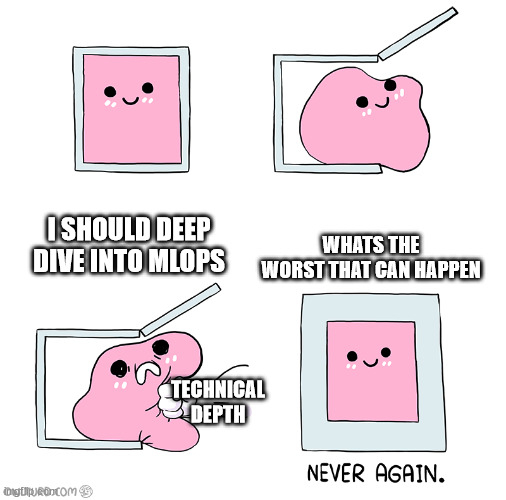

# Challenges

If you have managed to go through all other material, congratulations, you are already a good way to becoming an MLOps
engineer with a great overview of tools, concepts and techniques within the field. Below are listed some technical
hard problems regarding MLOps. These are meant as inspiration to get you to deep dive more into using all the cloud
services that `gcp` offers. You are also free to continue work on your project.

  

* Currently testing takes place in Github, but it should come as no
  surprise that `gcp` can also take care of this. Implementing testing
  on `gcp`. This
  [blogpost](https://mickeyabhi1999.medium.com/basic-ci-cd-on-google-cloud-platform-using-cloud-build-b5c33d6842a7)
  can probably help.

* In the lectures we setup cloud build to automatically build a docker
  container for training whenever we pushed code to our github repository.
  However, we also setup CI testing in github. If tests are failing on
  github the building of the docker image is still being done, essentially
  wasting our precious cloud credit. Setup a system so cloud building only
  commence when all tests are passing.

* Authenticating between `gcp`, `wandb` and `dvc` can be tricky to do in
  a secure way. Figure out how to use the Secret Manager in `gcp` to
  pass secrets e.g. API keys during the build process of docker images.
  This [page](https://docs.docker.com/develop/develop-images/build_enhancements/#new-docker-build-secret-information)
  may help

* We have already done deployment through `Cloud Functions`. The native extension
  to cloud functions is the service `Cloud Run` which allows for more than
  just code snippets to be deployed. Checkout this service and try to deploy
  a container using it.

* All deployments we have done in the course have been serverless, because
  it makes it easier for us to focus on the actual application we are trying
  to deploy instead of focusing on server management. That said, going through
  the trouble of using a server orchestrator yourself can be worth it in many
  situations. Figure out how to use kubernetes in `gcp`. It will involve getting
  familiar with the kubernetes API and probably also kubeflow for managing
  pipelines on the server.

* Vertex AI is the newest ML service on `gcp`. It combines many of the features
  of the AI platform service you have already used with the AutoML service. Figure
  out how to use Vertex AI service to either train a custom model or use their
  AutoML feature. This
  [blogpost](https://cloud.google.com/blog/topics/developers-practitioners/pytorch-google-cloud-how-train-and-tune-pytorch-models-vertex-ai)
  can be a good place to start.

* If you want different services to be able to talk to each other the correct way
  is to setup a system using [Pub and Sub](https://cloud.google.com/pubsub)
  (publish and subscription) service in `gcp`. Essentially it allows a service
  to publish a message and other services to subscribe and react to it. For
  example the AI platform could publish a message every time a model was done
  training and cloud build could subscribe to that, automatically staring to
  build a docker image using the trained model. Investigate Pub and Sub and
  try to make two services talk to each other.

* In the deployment exercises you probably looked at least once on the logs. We can
  automate what we do with the logs using the Logs Explorer service, which collects
  all logs from all services that you are using. Setup
  [Logs routing](https://cloud.google.com/logging/docs/routing/overview) for one of
  your deployed services to your cloud storage. Afterwards setup a VM that consumes
  the logs and accumulate them.
