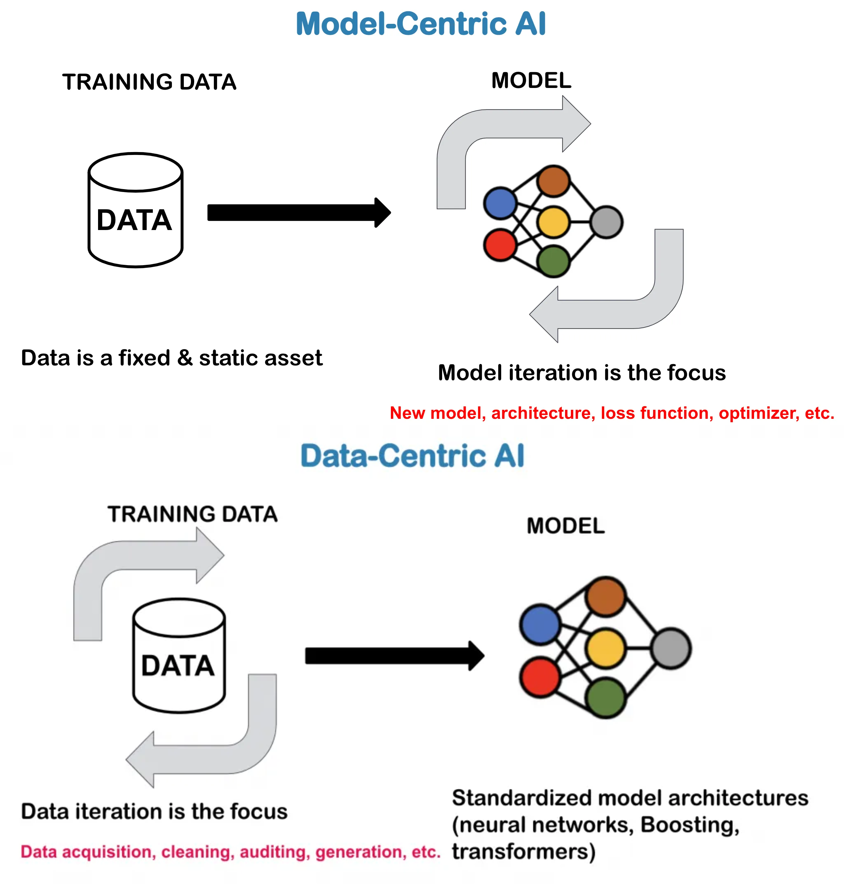

# Data preparation

  
  

This module is all about the foundation for all machine learning models: the data! A general saying within machine
learning is that
> garbage in, garbage out

meaning that if the data we are feeding into our models are of poor quality, then the models will not be able to
perform well. This is why data processing in many companies takes up to 80% of the time spent on machine learning and
only 20% on machine learning model development.

In recent years, the field of machine learning have seen a shift from what is called *model-centric* to *data-centric*
machine learning. This means that the focus is now on the data and not the model. The core part of data-centric machine
learning is to have a good understanding of the data and to have a good data collection and data processing pipeline.
In this session we are going to look into tools that can help us with this.

<figure markdown>
{ width="800" }
<figcaption> In the model-centric view we spend most of our time iterating on the model, trying out new architectures
etc. whereas in the data-centric view, we keep the model fixed (today it is often a transformer-type model) and instead
iterates on the data, trying to gather new data or improve the quality of the data we already have.
<a href="https://www.vanderschaar-lab.com/dc-check/what-is-data-centric-ai/"> Image credit </a> </figcaption>
</figure>

!!! tip "Learning objectives"

    The learning objectives of this session are:

    * Know how to use tools to annotate data and knowledge of data formats
    * Understand how data quality can affect the performance of machine learning models
    * Understand how to use tools to clean data and how to use data augmentation to improve the quality of the data
