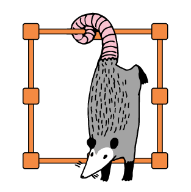

{ align=right width="130"}

# Data annotation

---

!!! info "Core Module"

In this module we are going to look at [label studio](https://github.com/HumanSignal/label-studio) that is a completely
open source annotation tool for all kinds of data.

1. Start with install label studio

    ```bash
    pip install label-studio
    ```

2. Second lets

[dog api](https://dog.ceo/dog-api/)
[cat api](https://cataas.com/)

these images are provided through an API and we can request it using simple request calls. Both topics will be covered
in [module M22](../s7_deployment/apis.md) but for now you can use the following code to get a random cat image

```python
x = 1
```

and the following code to get a random dog image

```python
x = 2
```
