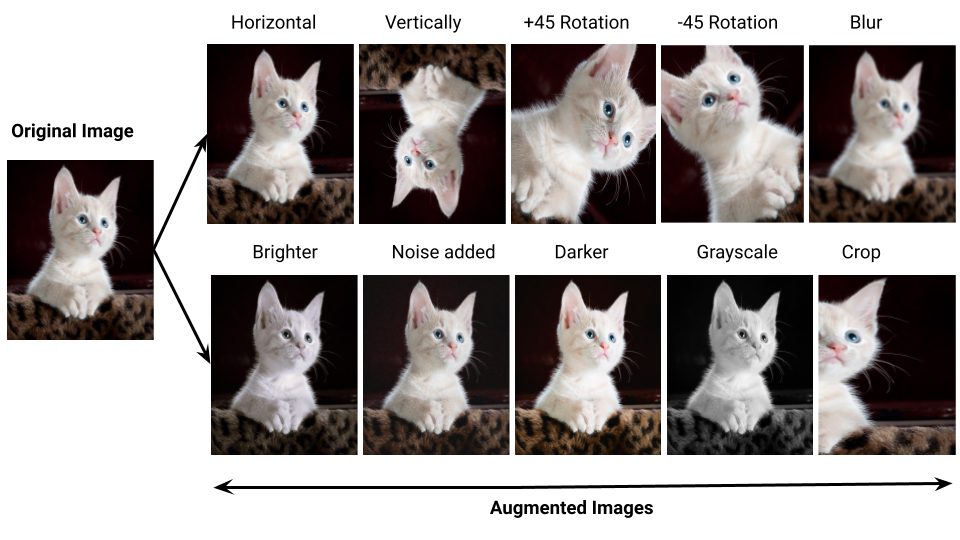

{ align=right width="130"}

# Data augmentation

Data augmentation is a technique that is used to increase the size of a dataset by creating new samples from the samples
that are already in the dataset. This is done to increase the
generalization and robustness of the model. The idea is that by
creating new samples, we can make the model more robust to small
fluctuations in the data. For example, if we are working with images and we have a model that is supposed to classify if
an image contains a cat or a dog, then we can create new images by flipping, rotating, cropping, etc. the images that

<figure markdown>
{ width="800" }
<figcaption>
<a href="https://medium.com/@tagxdata/data-augmentation-for-computer-vision-9c9ed474291e"> Image credit </a>
</figcaption>
</figure>

In this module we are going to be looking at three different tools for data augmentation. The reason for this is that
data augmentation techniques is often tied to the type of data modalities we are working with. For example, if we are
working with images, then we can use techniques such as cropping, flipping, rotating, etc. to create new images. If we
are working with text, then we can use techniques such as back translation, word embeddings, etc. to create new text
samples. We will be focusing

| Tool | Type of data | Description |
| --- | --- | --- |
| albuminations | Images | |
| nlpaug | Text | |
| audiomentations | Audio | |
| tableaug | Tabular data | |

You are ofcause free to work through the exercises of every single tool, but we recommend that you pick the tool that
covers the type of data you like to work with.

## Data augmentation for images

### ❔ Exercises

## Data augmentation for text

### ❔ Exercises

## Data augmentation for audio

### ❔ Exercises

## Data augmentation for tabular data

### ❔ Exercises

## 🧠 Knowledge check
