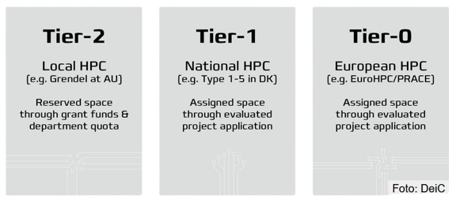

# High Performance Clusters

<details open markdown="block">
  <summary>
    Table of contents
  </summary>
  {: .text-delta }
1. TOC
{:toc}
</details>

---

As discussed in [the intro session on the cloud](../s6_the_cloud/S6.md), cloud providers offers near infinite
compute resources. However, using these resources comes at a hefty price often and it is therefore important to be
aware of another resource many have access to: High Performance Clusters or HPC. HPCs exist all over the world, and
many time you already have access to one or can easily get access to one. If you are an university student you most
likely have a local HPC that you can access through your institution. Else, there exist public HPC resources that
everybody (with a project) can apply for. As an example in the EU we have
[EuroHPC](https://eurohpc-ju.europa.eu/index_en) initiative that currently has 8 different supercomputers with a
centralized location for [applying for resources](https://pracecalls.eu/) that are both open for research projects
and start-ups.

Depending on your application, you may have different needs and it is therefore important to be aware also of the
different tiers of HPC. In Europe, HPC are often categorized such that Tier-0 are European Centers with petaflop
or hexascale machines, Tier 1 are National centers of supercomputers, and Tier 2 are Regional centers. The lower the
Tier, the larger applications it is possible to run.

<p align="center">
  
  <br>
  <a href="https://www.deic.dk/en/Supercomputing/EuroCC/HPC-Landscapes"> Image credit </a>
</p>

## Cluster architectures

In very general terms, cluster can come as two different kind of systems: supercomputers and LSF
(Load Sharing Facility). A supercomputer (as shown below) is organized into different modules, that are seperated by
network link. When you login to a supercomputer you will meet the front end which contains all the software needed to
run computations. When you submit a job it will get sent to the backend modules which in most cases includes: general
compute modules (CPU), acceleration modules (GPU), a memory module (RAM) and finally a storage module (HDD). Depending
on your application you may need one module more than another. For example in deep learning the acceleration module is
important but in physics simulation the general compute module / storage model is probably more important.

<p align="center">
  
  <br>
  Overview of the Meluxina supercomputer thats part of EuroHPC.
  <br>
  <a href="https://hpc.uni.lu/old/blog/2019/luxembourg-meluxina-supercomputer-part-of-eurohpc/"> Image credit </a>
</p>

Alternatively, LSF are a network of computers where each computer has its own CPU, GPU, RAM etc. and the individual
computes (or nodes) are then connected by network. The important different between a supercomputer and as LSF systems
is how the resources are organized. When comparing supercomputers to LSF system it is generally the case that it is
better to run on a LSF system if you are only requesting resources that can be handled by a single node, however it
is better to run on a supercomputer if you have a resource intensive application that requires many devices to
communicate with each others.

Regardless of cluster architechtures, on the software side of HPC, the most important part is whats called the
*HPC scheduler*. Without a HPC scheduler an HPC cluster would just be a bunch of servers with different jobs
interfering with each other. The problem is when you have a large collection of resources and a large collection of
users, you cannot rely on the users just running their applications without interfering with each other. A HPC scheduler
is in charge of managing that whenever an user request to run an application, they get put in a queue and whenever the
resources their application ask for are available the application gets run.

The biggest bach control systems for doing scheduling on HPC are:

* SLURM
* MOAB HPC Suite
* PBS Works

We are going to take a look at PBS works as that is what is installed on our local university cluster.

### Exercises

{: .highlight }
> [Exercise files](https://github.com/SkafteNicki/dtu_mlops/tree/main/s10_extra/exercise_files)

The following exercises are focused on local students at DTU that want to use our local
[HPC resources](https://www.hpc.dtu.dk/). That said, the steps in the exercise are fairly general to other types
of cluster. For the purpose of this exercise we are going to see how we can run this
[image classifier script](exercise_files/image_classifier.py), but feel free to work with whatever application you
want to.

1. Start by accessing the cluster. This can either be through `ssh` in a terminal or if you want a graphical interface
   [thinlinc](https://www.cendio.com/thinlinc/download) can be installed. In general we recommend following the steps
   [here](https://www.hpc.dtu.dk/?page_id=2501) for DTU students as the setup depends on if you are on campus or not.

2. When you have access to the cluster we are going to start with the setup phase. In the setup phase we are going
   to setup the environment necessary for our computations. If you have accessed the cluster through graphical interface
   start by opening a terminal.

   1. Lets start by setting up conda for controlling our dependencies. If you have not already worked with `conda`,
      please checkout module [M2 on conda](../s1_development_environment/conda.md). In general you should be able to
      setup (mini)conda through these two commands:

      ```bash
      wget https://repo.anaconda.com/miniconda/Miniconda3-latest-Linux-x86_64.sh
      sh Miniconda3-latest-Linux-x86_64.sh
      ```

   2. Close the terminal and open a new for the installation to complete. Type `conda` in the terminal to check that
      everything is fine. Go ahead and create a new environment that we can install dependencies in

      ```bash
      conda create -n "hpc_env" python=3.10 --no-default-packages
      ```

      and activate it.

   3. Copy over any files you need. For the image classifier script you need the
      [requirements file](exercise_files/image_classifier_requirements.txt) and the actual
      [application](exercise_files/image_classifier.py).

   4. Next, install all the requirements you need. If you want to run the image classifier script you can run this
      command in the terminal

      ```bash
      pip install -r image_classifier_requirements.txt
      ```

      using this [requirements file](exercise_files/image_classifier_requirements.txt).

3. Thats all the setup needed. You would need to go through the creating of environment and installation of requirements
   whenever you start a new project (no need for reinstalling conda). For the next step we need to look at how to submit
   jobs on the cluster. We are now ready to submit the our first job to the cluster:

   1. Start by checking the statistics for the different clusters. Try to use both the `qstat` command which should give
      an overview of the different cluster, number of running jobs and number of pending jobs. For many system you can
      also try the much more user friendly command `classstat` command.

   2. Figure out which queue you want to use. For the sake of the exercises it needs to be one with GPU support. For
      DTU students, any queue that starts with `gpu` are GPU accelerated.

   3. Now we are going to develop a bash script for submitting our job. We have provided an example of such
      [scripts](exercise_files/jobscript.sh). Take a careful look and go each line and make sure you understand it.
      Afterwards, change it to your needs (queue and student email).

   4. Try to submit the script:

      ```bash
      bsub < jobscript.sh
      ```

      You can check the status of your script by running the `bstat` command. Hopefully, the job should go trough really
      quickly. Take a look at the output file, it should be called something like `gpu_*.out`. Also take a look at the
      `gpu_*.err` file. Does both files look as they should?

4. Lets now try to run our application on the cluster. To do that we need to take care of two things:

   1. First we need to load the correct version of CUDA. A cluster system often contains multiple versions of specific
      software to suit the needs of all their users, and it is the users that are in charge of *loading* the correct
      software during job submission. The only extra software that needs to be loaded for most Pytorch applications are
      a CUDA module. You can check which modules are available on the cluster with

      ```bash
      module avail
      ```

      Afterwards, add the correct CUDA version you need to the `jobscript.sh` file. If you are trying to run the
      provided image classifier script then the correct version is `CUDA/11.7` (can be seen in the requirements file).

      ```bash
      # add to the bottom of the file
      module load cuda/11.7
      ```

   2. We are now ready to add in our application. The only thing we need to take care of is telling the system to run
      it using the `python` version that is connected to our `hpc_env` we created in the beginning. Try typing:

      ```bash
      which python
      ```

      which should give you the full path. Then add to the bottom of the `jobscript` file:

      ```bash
      ~/miniconda3/envs/hpc_env/bin/python \
      image_classifier.py \
      --trainer.accelerator 'gpu' --trainer.devices 1  --trainer.max_epochs 5
      ```

      which will run the image classifier script (change it if you are runnning something else).

   3. Finally submit the job:

      ```bash
      bsub < jobscript.sh
      ```

      and check when it is done that it has produced what you expected.

   4. (Optional) If you application supports multi GPUs also try that out. You would first need to change the jobscript
      to request multiple GPUs and additionally you would need to tell your application to run on multiple GPUs. For the
      image classifier script it can be done by changing the `--trainer.devices` flag to `2` (or higher).

This ends the module on using HPC systems.
