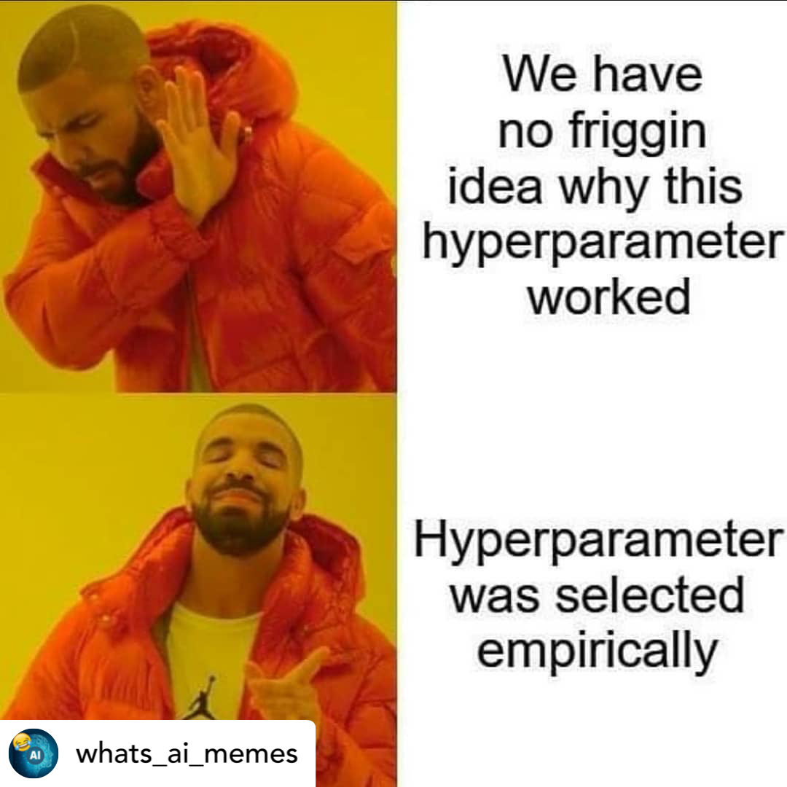

# Hyperparameter optimization
{: .no_toc }

<details open markdown="block">
  <summary>
    Table of contents
  </summary>
  {: .text-delta }
1. TOC
{:toc}
</details>

---

Hyperparameter optimization is not a new idea within machine learning but have somewhat seen a renaissance with
the uprise of deep learning. This can mainly be contributed to the following:

* Trying to beat state-of-the-art often comes down to very small differences in performance, and hyperparameter
  optimization can help squeeze out a bit more
* Deep learning models are in general not that robust towards the choice of hyparameter so choosing the wrong set
  may lead to a model that does not work 

However the problem with doing hyperparameter optimization of a deep learning models is that it can take over a
week to train a single model. In most cases we therefore cannot do a full grid search of all hyperparameter
combinations to get the best model. Instead we have to do some tricks that will help us speed up our searching.
In these exercises we are going to be integrating [optuna](https://optuna.readthedocs.io/en/stable/index.html) into 
our different models, that will provide the tools for speeding up our search.

<p align="center">
  
</p>

It should be noted that a lot of deep learning models does not optimize every hyperparameter that is included
in the model but instead relies on heuristic guidelines ("rule of thumb") based on what seems to be working
in general e.g. a learning rate of 0.01 seems to work great with the Adam optimizer. That said, these rules
probably only apply to 80% of deep learning model, whereas for the last 20% the recommendations may be suboptimal
Here is a great [site](https://jeffmacaluso.github.io/post/DeepLearningRulesOfThumb/) that has collected an 
extensive list of these recommendations, taken from the excellent [deep learning](https://www.deeplearningbook.org/) book by Ian Goodfellow, Yoshua Bengio and Aaron Courville.

In practice, I recommend trying to identify (through experimentation) which hyperparameters that are important for
the performance of your model and then spend your computational budget trying to optimize them while setting the
rest to a "recommended value". 

### Exercises

1. Start by installing optuna:
   `pip install optuna`
   
2. Initially we will look at the `cross_validate.py` file. It implements simple K-fold cross validation of
   a random forest sklearn digits dataset (subset of MNIST). Look over the script and try to run it.
   
3. We will now try to write the same code in optune. Please note that the script have a variable `OPTUNA=False`
   that you can use to change what part of the code should run. The three main concepts of optuna is
   
   * A trial: a single experiment
   
   * A study: a collection of trials
   
   * The objective: function to determine how "good" a trial is
   
   Lets start by writing the objective function, which we have already started in the script. For now you do
   not need to care about the `trial` argument, just assume that it contains the hyperparameters needed to
   define your random forest model. The output of the objective function should be a single number that we
   want to optimize. (HINT: did you remember to do K-fold crossvalidation inside your objective function?)
   
4. Next lets focus on the trial. Inside the `objective` function the trial should be used to suggest what
   parameters to use next. Take a look at the documentation for [trial](https://optuna.readthedocs.io/en/stable/reference/generated/optuna.trial.Trial.html) or take a look at the [code examples](https://optuna.org/#code_examples) and figure out how to define
   the hyperparameter of the model.
   
5. Finally lets launch a study. It can be as simple as

   ```python
   study = optuna.create_study()
   study.optimize(objective, n_trials=100)
   ```
   
   but lets play around a bit with it:
   
   1. By default the `.optimize` method will minimize the objective (by definition the optimum of an objective
      function is at its minimum). Is the score your objective function is returning something that should
      be minimized? If not, a simple solution is to put a `-` in front of the metric. However, look through 
      the documentation on how to change the **direction** of the optimization.
        
   2. Optuna will by default do Bayesian optimization when sampling the hyperparameters (using a evolutionary
      algorithm for suggesting new trials). However, since this example is quite simple, we can actually 
      perform a full grid search. How would you do this in Optuna?
        
   3. Compare the performance of a single optuna run using Bayesian optimization with `n_trials=10` with a
      exhaustive grid search that have search through all hyperparameters. What is the performance/time
      trade-off for these two solutions?

6. In addition to doing baysian optimization, the other great part about Optuna is that it have native support
   for **Pruning** unpromising trials. Pruning refers to the user stopping trials for hyperparameter combinations
   that does not seem to lead anywhere. You may have learning rate that is so high that training is diverging or
   a neural network with too many parameters so it is just overfitting to the training data. This however begs the
   question: what constitutes an unpromising trial? This is up to you to define based on prior experimentation.

   1. Start by looking at the `fashion_trainer.py` script. Its a simple classification network for classifying
      images in the [FashionMNIST](https://github.com/zalandoresearch/fashion-mnist) dataset. Run the script 
      with the default hyperparameters to get a feeling of how the training should be progress.
      Note down the performance on the test set.

   2. Start by defining a validation set and a validation dataloader that we can use for hyperparameter optimization
      (HINT: use 5-10% of you training data).
        
   3. Now, adjust the script to use Optuna. The 5 hyperparameters listed in the table above should at least be included
      in the hyperparameter search. For some we have already defined the search space but for the remaining you need to come
      up with a good range of values to investigate. We done integrating optuna, run a small study (`n_tirals=3`) to check 
      that the code is working.
        
      Hyperparameter                                     | Search space                                                 |
      ---------------------------------------------------|--------------------------------------------------------------| 
      Learning rate                                      | 1e-6 to 1e0                                                  |
      Number of output features in the second last layer | ???                                                          |
      The amount of dropout to apply                     | ???                                                          |
      Batch size                                         | ???                                                          |
      Use batch normalize or not                         | {True, False}                                                |
      (Optional) Different activations functions         | {`nn.ReLU`, `nn.Tanh`, `nn.RReLU`, `nn.LeakyReLU`, `nn.ELU`} |

   4. If implemented correctly the number of hyperparameter combinations should be at least 1000, meaning that
      we not only need baysian optimization but probably also need pruning to succeed. Checkout the page for
      [build-in pruners](https://optuna.readthedocs.io/en/stable/reference/pruners.html) in Optuna. Implement
      pruning in the script. I recommend using either the `MedianPruner` or the `ProcentilePruner`. 

   5. Re-run the study using pruning with a large number of trials (`n_trials>50`) 

   6. Take a look at this [visualization page](https://optuna.readthedocs.io/en/latest/tutorial/10_key_features/005_visualization.html) 
      for ideas on how to visualize the study you just did. Make at least two visualization of the study and
      make sure that you understand them.
   
   7. Pruning is great for better spending your computational budged, however it comes with a trade-off. What is
      it and what hyperparameter should one be especially careful about when using pruning?
   
   8. Finally, what parameter combination achieved the best performance? What is the test set performance for this
      set of parameters. Did you improve over the initial set of hyperparameters?

7. The exercises until now have focused on doing the hyperparameter searching sequentially, meaning that we test one
   set of parameters at the time. It is a fine approach because you can easily let it run for a week without any
   interaction. However, assuming that you have the computational resources to run in parallel, how do you do that?
   
   1. To run hyperparameter search in parallel we need a common database that all experiments can read and
      write to. We are going to use the recommended `mysql`. You do not have to understand what SQL is to
      complete this exercise, but it is [basically](https://en.wikipedia.org/wiki/SQL) a language (like python)
      for managing databases. Install [mysql](https://dev.mysql.com/doc/mysql-installation-excerpt/5.7/en/).
       
   2. Next we are going to initialize a database that we can read and write to. For this exercises we are going
      to focus on a locally stored database but it could of course also be located in the cloud.
      ```bash
      mysql -u root -e "CREATE DATABASE IF NOT EXISTS example"
      ```
      you can also do this directly in python when calling the `create_study` command by also setting the 
      `storage` and `load_if_exists=True` flags.

   3. Now we are going to create a Optuna study in our database
      ```bash
      optuna create-study --study-name "distributed-example" --storage "mysql://root@localhost/example"
      ``` 
      
   4. Change how you initialize the study to read and write to the database. Therefore, instead of doing
       ```python
       study = optuna.create_study()
       ```
       then do
       ```python
       study = optuna.load_study(
        study_name="distributed-example", storage="mysql://root@localhost/example"
       )
       ```
       where the `study_name` and `storage` should match how the study was created. 
   
   5. For running in parallel, you can either open up a extra terminal and simple launch your script once
       per open terminal or you can use the provided `parallel_lancher.py` that will launch multiple executions
       of your script. It should be used as:
       ```bash
       python parallel_lancher.py myscript.py --num_parallel 2
       ```
   
   6. Finally, make sure that you can access the results 

Thats all on how to do hyperparameter optimization in a scalable way. If you feel like it you can try to apply these techniques on the ongoing corrupted MNIST example, where you are free to choose what hyperparameters that you want to use.