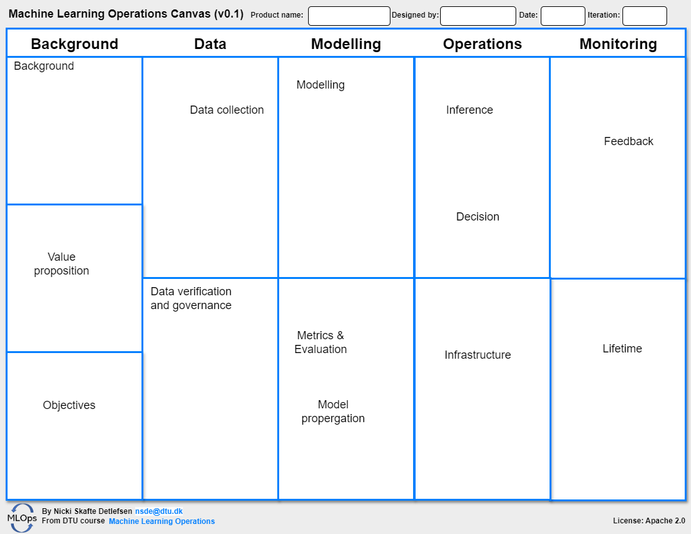

# Designing MLOps pipelines

---

!!! danger
    Module is still under development

"Machine learning engineering is 10% machine learning and 90% engineering." - *Chip Huyen*

We highly recommend that you read the book
*Designing Machine Learning Systems: An Iterative Process for Production-Ready Applications* by Chip Huyen which gives
an fantastic overview of the thought processes that goes into designing moder machine learning systems.

# The stack

Have you ever encountered the concept of **full stack developer**. A full stack developer is an developer who can
both develop client and server software or in more general terms, it is a developer who can take care of the complete
developer pipeline.

Below is seen an image of the massive amounts of tools that exist within the MLOps umbrella.

## Visualizing the design

<figure markdown>
{ width="1000" }
<figcaption>
</figcaption>
</figure>

In this course we have chosen to make our own canvas, but it is highly inspired by
[Machine Learning Canvas](https://madewithml.com/static/templates/ml-canvas.pdf) from the
[Made with ML course](https://madewithml.com/) and the
[Machine Learning Canvas](https://www.ownml.co/machine-learning-canvas) by Louis Dorard.

<!-- markdownlint-disable -->

!!! note "Editing the canvas"

    The canvas is made in [draw.io](https://app.diagrams.net/), which I use for all my diagrams. You can easily begin
    editing the canvas by clicking
    [here](https://app.diagrams.net/?client=1#Uhttps%3A%2F%2Fraw.githubusercontent.com%2FSkafteNicki%2Fdtu_mlops%2Fdesign%2Ffigures%2Fdiagrams%2Fmlops_canvas.drawio#%7B%22pageId%22%3A%22pnmmrmMmQEoPrk8f0Ppy%22%7D) which will open the web version of draw.io with the canvas loaded.

<!-- markdownlint-restore -->
