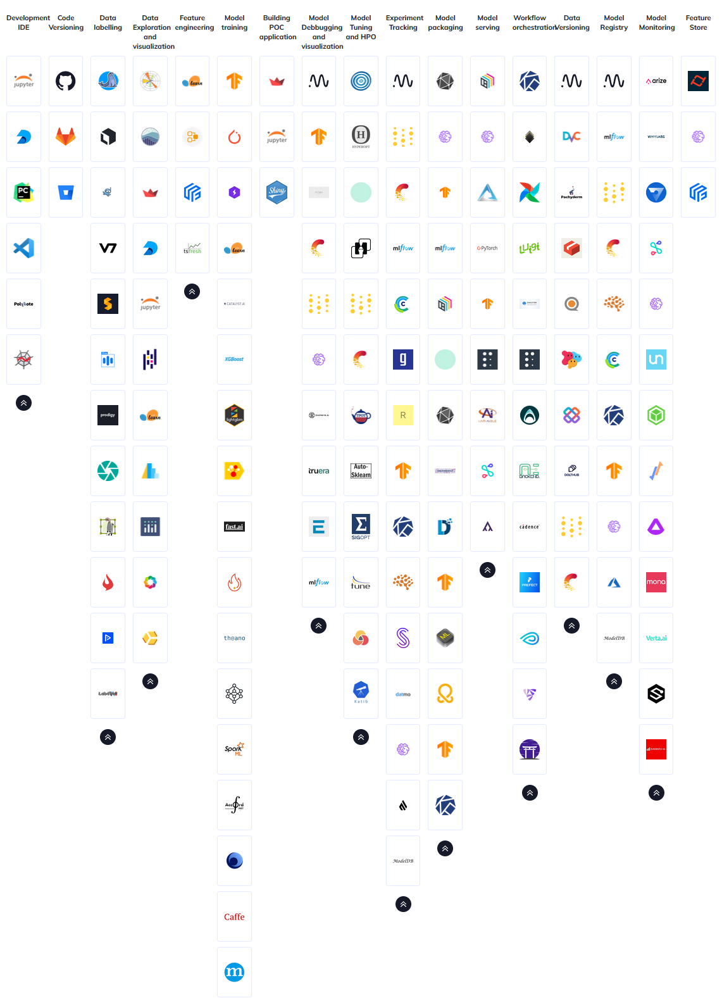

# Designing MLOps pipelines

---

!!! danger
    Module is still under development

"Machine learning engineering is 10% machine learning and 90% engineering." - *Chip Huyen*

We highly recommend that you read the book
*Designing Machine Learning Systems: An Iterative Process for Production-Ready Applications* by Chip Huyen which gives
an fantastic overview of the thought processes that goes into designing moder machine learning systems.

# The stack

Have you ever encountered the concept of **full stack developer**. A full stack developer is an developer who can
both develop client and server software or in more general terms, it is a developer who can take care of the complete
developer pipeline.

Below is seen an image of the massive amounts of tools that exist within the MLOps umbrella.

## Visualizing the design
