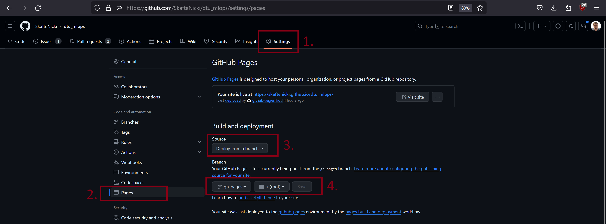

{ align=right width="130"}

# Documentation

---

In today's rapidly evolving software development landscape, effective documentation is a crucial component of any
project. The ability to create clear, concise, and user-friendly technical documentation can make a significant
difference in the success of your codebase. We all probably encountered code that we wanted to use, only for us to
abandon using it because it was missing documentation such that we could get started with it.

Technical documentation or code documentation can be many things:

* Plain text, images and videos explaining core concepts for your software
* Documentation of API on how to call a function or class, what the different parameters are etc.
* Code examples of how to use certain functionality

and many more. We are in this module going to focus on setting up a very basic documentation system that will
automatically help you document the API of your code. For this reason we recommend that before continuing with this
module that you have completed
[module M7 on good coding practices](../s2_organisation_and_version_control/good_coding_practice.md)
or have similar experience with writing docstrings for Python functions and classes.

There are different systems for writing documentation. In fact there is a lot to choose from:

* [MkDocs](https://www.mkdocs.org/)
* [Sphinx](https://www.sphinx-doc.org/en/master/)
* [GitBook](https://www.gitbook.com/)
* [Docusaurus](https://docusaurus.io/)
* [Doxygen](https://www.doxygen.nl/)
* [Jekyll](https://jekyllrb.com/)

Important to note that all these are *static site generators*. The word *static* here refers to that when the content
is generated and served on a webside, the underlying HTML code will not change. It may contain HTML elements that
dynamic (like video), but the site does not change (1).
{ .annotate }

1. :man_raising_hand: Good examples of dynamic sites are any social media or news media where new posts, pages etc.
    are constantly added over time. Good examples of static sites are documentation, blogposts etc.

We are in this module going to look at [Mkdocs](https://www.mkdocs.org/), which (in my opinion) is one of the easiest
systems to get started with because all documentation is written in markdown and the build system is written in Python.
As an alternative, you can consider doing the exercises in [Sphinx](https://www.sphinx-doc.org/en/master/) which is
probably the most used documentation system for Python code. Sphinx offer more customization than Mkdocs, so is
generally preferred for larger projects with complex documentation, but for smaller projects Mkdocs should be easier to
get started with and is sufficient.

Mkdocs by default does not include many features and for that reason we are directly going to dive into using the
[material for mkdocs theme](https://github.com/squidfunk/mkdocs-material) that provides a lot of nice customization
to create professional static sites. In fact, this whole course is written in mkdocs using the material theme.

## Mkdocs

The core file when using mkdocs is the `mkdocs.yaml` file, which is the configuration file for the project:

```yaml
site_name: Documentation of my project
site_author: Jane Doe
docs_dir: source # (1)!

theme:
    language: en
    name: material # (2)!
    features: # (3)!
    - content.code.copy
    - content.code.annotate

plugins: # (4)!
    - search
    - mkdocstrings

nav: # (5)!
  - Home: index.md

```

1. :man_raising_hand: This indicates the source directory of our documentation. If the layout of your documentation is
    a bit different than what described above, you may need to change this.

2. :man_raising_hand: The overall theme of your documentation. We recommend the `material` theme but there are
    [many more to choose from](https://github.com/mkdocs/mkdocs/wiki/MkDocs-Themes) and you can also
    [create your own](https://www.mkdocs.org/dev-guide/themes/).

3. :man_raising_hand: The `features` section is where features that are supported by your given theme can be enabled.
    In this example we have enabled `content.code.copy` feature which adds a small copy button to all code block and the
    `content.code.annotate` feature which allows you to add annotations like this box to code blocks.

4. :man_raising_hand: [Plugins](https://www.mkdocs.org/dev-guide/plugins/) add new functionality to your documentation.
    In this case we have added two plugins that add functionality for searching through our documentation and
    automatically adding documentation from docstrings. Remember that some plugins requires you to install additional
    Python packages with those plugins, so remember to add them to your `requirements.txt` file.

5. :man_raising_hand: The `nav` section is where you define the navigation structure of your documentation. When you
    add new `.md` files to the `source` folder you then need to add them to the `nav` section.

And that is more or less what you need to get started. In general, if you need help with configuration of your
documentation in mkdocs I recommend looking at [this page](https://www.mkdocs.org/getting-started/) and
[this page](https://squidfunk.github.io/mkdocs-material/getting-started/).

## Exercises

In this set of exercises we assume that you have completed
[module M6 on code structure](../s2_organisation_and_version_control/code_structure.md) and therefore have a repository
that at least contains the following:

```txt
├── pyproject.toml     <- Project configuration file with package metadata
│
├── docs               <- Documentation folder
│   │
│   ├── index.md       <- Homepage for your documentation
│   │
│   ├── mkdocs.yaml     <- Configuration file for mkdocs
│   │
│   └── source/        <- Source directory for documentation files
│
└── src                <- Source code for use in this project.
│   │
│   ├── __init__.py    <- Makes src a Python module
│   │
│   ├── models         <- model implementations, training script
│   │   ├── __init__.py
│   │   ├── model.py
│   │   ├── train_model.py
...
```

It is not important exactly what is in the `src` folder for the exercises, but we are going to refer to the above
structure in the exercises, so adjust accordingly if you diviate from this. Additionally, we are going to assume that
your project code is installed in your environment such that it can be imported as normal Python code.

1. We are going to need two Python packages to get started: [mkdocs](https://pypi.org/project/mkdocs/) and
    [material for mkdocs](https://pypi.org/project/mkdocs-material/). Install with

    === "Using pip"

        ```bash
        pip install "mkdocs-material >= 4.8.0" # (1)!
        ```

        1. Since `mkdocs` is a dependency of `mkdocs-material` we only need to install the latter.

    === "Using uv"

        ```bash
        uv add "mkdocs-material >= 4.8.0" # (1)!
        ```

        1. Since `mkdocs` is a dependency of `mkdocs-material` we only need to install the latter.

2. Run in your terminal (from the `docs` folder):

    ```bash
    mkdocs serve # (1)!
    ```

    1. :man_raising_hand: `mkdocs serve` will automatically rebuild the whole site whenever you save a file inside the
        `docs` folder. This is not a problem if you have a fairly small site with not that many pages (or elements), but
        can take a long time for large sites. Consider running with the `--dirty` option for only re-building the site
        for files that have been changed.

    which should render the `index.md` file as the homepage. You can leave the documentation server running during the
    remaining exercises.

3. We are no ready to document the API of our code:

    1. Make sure you at least have one function and class inside your `src` module. If you do not have you can for
        simplicity copy the following module to the `src/models/model.py` file

        ```python
        import torch

        class MyNeuralNet(torch.nn.Module):
            """Basic neural network class.

            Args:
                in_features: number of input features
                out_features: number of output features

            """
            def __init__(self, in_features: int, out_features: int) -> None:
                self.l1 = torch.nn.Linear(in_features, 500)
                self.l2 = torch.nn.Linear(500, out_features)
                self.r = torch.nn.ReLU()

            def forward(self, x: torch.Tensor) -> torch.Tensor:
                """Forward pass of the model.

                Args:
                    x: input tensor expected to be of shape [N,in_features]

                Returns:
                    Output tensor with shape [N,out_features]

                """
                return self.l2(self.r(self.l1(x)))

        ```

        and the following function to add `src/predict_model.py` file:

        ```python

        def predict(
            model: torch.nn.Module,
            dataloader: torch.utils.data.DataLoader
        ) -> None:
            """Run prediction for a given model and dataloader.

            Args:
                model: model to use for prediction
                dataloader: dataloader with batches

            Returns
                Tensor of shape [N, d] where N is the number of samples and d is the output dimension of the model

            """
            return [model(batch) for batch in dataloader]
        ```

    2. Add a markdown file to the `docs/source` folder called `my_api.md` and add that file to the `nav:` section in
        the `mkdocs.yaml` file.

    3. To that file add the following code:

        ```markdown

        # My API

        ::: src.models.model.MyNeuralNet

        ::: src.predict_model.predict

        ```

        The `:::` indicator tells mkdocs that it should look for the corresponding function/module and then render it
        on the given page. Thus, if you have a function/module located in another location change the paths accordingly.

    4. Make sure that the documentation correctly includes your function and module on the given page.

    5. (Optional) Include more functions/modules in your documentation.

4. (Optional) Look through the documentation for [mkdocstrings](https://mkdocstrings.github.io/python/) and try to
    improve the layout a bit. Especially, the
    [headings](https://mkdocstrings.github.io/python/usage/configuration/headings/),
    [docstrings](https://mkdocstrings.github.io/python/usage/configuration/docstrings/) and
    [signatures](https://mkdocstrings.github.io/python/usage/configuration/signatures/) could be of interest to adjust.

5. Finally, try to build a final version of your documentation

    ```bash
    mkdocs build
    ```

    this should result in a `site` folder that contains the actual HTML code for documentation.

## Publish your documentation

To publish your documentation you need a place to host your build documentation e.g. the content of the `site` folder
you build in the last exercise. There are many places to host your documentation, but if you only need a static site
and are already hosting your code through GitHub, then a good option is [GitHub Pages](https://pages.github.com/).
GitHub pages is free to use for your public projects.

Before getting started with this set of exercises you should have completed
[module M16 on GitHub actions](../s5_continuous_integration/github_actions.md) so you already know about workflow files.

### Exercises

1. Start by adding a new file called `deploy_docs.yaml` to the `.github/workflows` folder. Add the following cod to that
    file and save it.

    ```yaml
    name: Deploy docs

    on:
    push:
        branches:
            - main

    permissions:
        contents: write # (1)!

    jobs:
      deploy:
        name: Deploy docs
        runs-on: ubuntu-latest
        steps:
        - name: Checkout code
          uses: actions/checkout@v5
          with:
            fetch-depth: 0

        - name: Set up Python
          uses: actions/setup-python@v5
          with:
            python-version: 3.11
            cache: 'pip'
            cache-dependency-path: setup.py

        - name: Install dependencies
          run: pip install -r requirements.txt

        - name: Deploy docs
          run: mkdocs gh-deploy --force
    ```

    1. :man_raising_hand: It is important to give `write` permissions to this actions because it is not only reading
        your code but it will also push code.

    Before continuing, make sure you understand what the different steps of the workflow does and especially we
    recommend looking at the documentation of the `mkdocs gh-deploy` command.

2. Commit and push the file. Check that the action is executed and if it succeeds, that your build project is pushed to
    a branch called `gh-pages`. If the action does not succeeds, then figure out what is wrong and fix it!

3. After confirming that our action is working, you need to configure GitHub to publish the content being
    build by GitHub Actions. Do the following:

    * Go to the Settings tab and then the Pages subsection
    * In the `Source` setting choose the `Deploy from a branch`
    * In the `Branch` setting choose the `gh-pages` branch and `/(root)` folder and save

    <figure markdown>
    { width="700" }
    </figure>

    This should then start deploying your site to `https://<your-username>.github.io/<your-reponame>/`. If it does not
    do this you may need to recommit and trigger the GitHub actions build again.

4. Make sure your documentation is published and looks as it should.

This ends the module on technical documentation. We cannot stress enough how important it is to write proper
documentation for larger projects that need to be maintained over a longer time. It is often an iterative process, but
it is often best to do it while writing the code.
