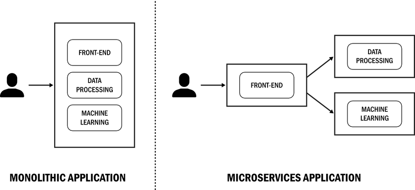

{ align=right width="130"}

# Frontend

If you have gone over the [deployment module](../s7_deployment/README.md) you should be at the point where you have a
machine learning model running in the cloud. The model can be interacted with by sending HTTP requests to the API
endpoint. In general we refer to this as the *backend* of the application. It is the part of our application that are
behind-the-scene that the user does not see and it is not really that user-friendly. Instead we want to create a
*frontend* that the user can interact with in a more user-friendly way. This is what we will be doing in this module.

Another point of splitting our application into a frontend and a backend has to do with scalability. If we have a lot
of users interacting with our application, we might want to scale only the backend and not the frontend, because that
is the part that will be running our heavy machine learning model. In general dividing a application into smaller pieces
are the pattern that is used in [microservice architectures](https://martinfowler.com/articles/microservices.html).

<figure markdown>
{ width="800" }
<figcaption>
In monollithic applications everything the user may be requesting of our application is handled by a single process/
container. In microservice architectures the application is split into smaller pieces that can be scaled independently.
This also leads to easier maintainability and faster development.
</figcaption>
</figure>

Frontends have for the longest time been created using HTML, CSS and JavaScript. This is still the case, but there are
now a lot of frameworks that can help us create a frontend in Python:

* [Django](https://www.djangoproject.com/)
* [Reflex](https://reflex.dev/)
* [Streamlit](https://streamlit.io/)
* [Bokeh](http://bokeh.org/)
* [Gradio](https://www.gradio.app/)

In this module we will be looking at `streamlit`. `streamlit` is a easy to use framework that allows us to create
interactive web applications in Python. It is not at all as powerful as a framework like `Django`, but it is very easy
to get started with and it is very easy to integrate with our machine learning models.

## ❔ Exercises

In these exercises we go through the process of setting up a backend using `fastapi` and a frontend using `streamlit`,
containerizing both applications and then deploying them to the cloud. We have already created an example of this
which can be found in the `samples/frontend_backend` folder.

1. Lets start by creating the backend application in a `backend.py` file. You can use essentially any backend you want,
    but we will be using a simple imagenet classifier that we have created in the `samples/frontend_backend/backend`
    folder.

    1. Create a new file called `backend.py` and implement a FastAPI interface with a single `/predict` endpoint that
        takes a image as input and returns the predicted class (and probabilities) of the image.

        ??? success "Solution"

            ```python linenums="1" title="backend.py"
            --8<-- "samples/frontend_backend/backend.py"
            ```

    2. Run the backend using `uvicorn`

        ```bash
        uvicorn backend:app --reload
        ```

    3. Test the backend by sending a request to the `/predict` endpoint, preferably using `curl` command

        ??? success "Solution"

            In this example we are sending a request to the `/predict` endpoint with a file called `my_cat.jpg`. The
            response should be "tabby cat" for the solution we have provided.

            ```bash
            curl -X 'POST' \
                'http://127.0.0.1:8000/classify/' \
                -H 'accept: application/json' \
                -H 'Content-Type: multipart/form-data' \
                -F 'file=@my_cat.jpg;type=image/jpeg'
            ```

    4. Create a `requirements_backend.txt` file with the dependencies needed for the backend.

        ??? success "Solution"

            ```plaintext linenums="1" title="requirements_backend.txt"
            --8<-- "samples/frontend_backend/requirements_backend.txt"
            ```

    5. Containerize the backend into a file called `backend.dockerfile`.

        ??? success "Solution"

            ```dockerfile linenums="1" title="backend.dockerfile"
            --8<-- "samples/frontend_backend/backend.dockerfile"
            ```

    6. Build the backend image

        ```bash
        docker build -t backend:latest -f backend.dockerfile .
        ```

    7. Recheck that the backend works by running the image in a container

        ```bash
        docker run --rm -p 8000:8000 -e "PORT=8000" backend
        ```

        and test that it works by sending a request to the `/predict` endpoint.

    8. Deploy the backend to Cloud run using the `gcloud` command

        ??? success "Solution"

            Assuming that we have created an artifact registry called `frontend_backend` we can deploy the backend to
            Cloud Run using the following commands:

            ```bash
            docker tag \
                backend:latest \
                <region>-docker.pkg.dev/<project>/frontend-backend/backend:latest
            docker push \
                <region>.pkg.dev/<project>/frontend-backend/backend:latest
            gcloud run deploy backend \
                --image=europe-west1-docker.pkg.dev/<project>/frontend-backend/backend:latest \
                --region=europe-west1 \
                --platform=managed \
            ```

            where `<region>` and `<project>` should be replaced with the appropriate values.

    9. Finally, test that the deployed backend works as expected by sending a request to the `/predict` endpoint

        ??? success "Solution"

            In this solution we are first extracting the url of the deployed backend and then sending a request to the
            `/predict` endpoint.

            ```bash
            export MYENDPOINT=$(gcloud run services describe backend --region=<region> --format="value(status.url)")
            curl -X 'POST' \
                $MYENDPOINT/predict \
                -H 'accept: application/json' \
                -H 'Content-Type: multipart/form-data' \
                -F 'file=@my_cat.jpg;type=image/jpeg'
            ```

2. With the backend taken care of lets now write our frontend. Our frontend just needs to be a "nice" interface to our
    backend. Its main functionality will be to send a request to the backend and display the result.
    [streamlit documentation](https://docs.streamlit.io/library/api-reference)

    1. Start by installing `streamlit`

        ```bash
        pip install streamlit
        ```

    2. Now create a file called `frontend.py` and implement a streamlit application. You can design it as you want,
        but we recommend that the following can be done in the frontend:

        1. Have a file uploader that allows the user to upload an image

        2. Display the image that the user uploaded

        3. Have a button that sends the image to the backend and displays the result

        For now just assume that a environment variable called `BACKEND` is available that contains the URL of the
        backend. We will in the next step show how to get this URL automatically.

        ??? success "Solution"

            ```python linenums="1" title="frontend.py"
            --8<-- "samples/frontend_backend/frontend.py"
            ```

    3. We need to make sure that the frontend knows where the backend is located, and we want that to happen
        automatically so we do not have to hardcode the URL into our frontend. We can do this by using the
        Python SDK for Google Cloud Run. The following code snippet shows how to get the URL of the backend service
        or fall back to an environment variable if the service is not found.

        ```python
        from google.cloud import run_v2
        import streamlit as st

        @st.cache_resource  # (1)!
        def get_backend_url():
            """Get the URL of the backend service."""
            parent = "projects/<project>/locations/<region>"
            client = run_v2.ServicesClient()
            services = client.list_services(parent=parent)
            for service in services:
                if service.name.split("/")[-1] == "production-model":
                    return service.uri
            name = os.environ.get("BACKEND", None)
            return name
        ```

        1. :man_raising_hand: The `st.cache_resource` is a decorator that tells `streamlit` to cache the result of the
            function. This is useful if the function is expensive to run and we want to avoid running it multiple times.

        Add the above code snippet to the top of your `frontend.py` file and replace `<project>` and `<region>` with the
        appropriate values. You will need to install `pip install google-cloud-run` to be able to use the code snippet.

    4. Run the frontend using `streamlit`

        ```bash
        streamlit run frontend.py
        ```

    5. Create a `requirements_frontend.txt` file with the dependencies needed for the frontend.

        ??? success "Solution"

            ```plaintext linenums="1" title="requirements_frontend.txt"
            --8<-- "samples/frontend_backend/requirements_frontend.txt"
            ```

    6. Containerize the frontend into a file called `frontend.dockerfile`.

        ??? success "Solution"

            ```dockerfile linenums="1" title="frontend.dockerfile"
            --8<-- "samples/frontend_backend/frontend.dockerfile"
            ```

    7. Build the frontend image

        ```bash
        docker build -t frontend:latest -f frontend.dockerfile .
        ```

    8. Run the frontend image

        ```bash
        docker run --rm -p 8001:8001 -e "PORT=8001" backend
        ```

        and check in your web browser that the frontend works as expected.

    9. Deploy the frontend to Cloud run using the `gcloud` command

        ??? success "Solution"

            Assuming that we have created an artifact registry called `frontend_backend` we can deploy the backend to
            Cloud Run using the following commands:

            ```bash
            docker tag frontend:latest \
                <region>-docker.pkg.dev/<project>/frontend-backend/frontend:latest
            docker push <region>.pkg.dev/<project>/frontend-backend/frontend:latest
            gcloud run deploy frontend \
                --image=europe-west1-docker.pkg.dev/<project>/frontend-backend/frontend:latest \
                --region=europe-west1 \
                --platform=managed \
            ```

    10. Test that frontend works as expected by opening the URL of the deployed frontend in your web browser.

3. (Optional) If you have gotten this far you have successfully created a frontend and a backend and deployed them to
    the cloud. Finally, it may be worth it to load test your application to see how it performs under load. Write a
    locust file which is covered in [this module](../s7_deployment/testing_apis.md) and run it against your frontend.
    Make sure that it can handle the load you expect it to handle.

4. (Optional) Feel free to experiment further with streamlit and see what you can create. For example, you can try to
    create a option for the user to upload a video and then display the video with the predicted class overlaid on
    top of the video.

## 🧠 Knowledge check

1. We have created separate requirements files for the frontend and the backend. Why is this a good idea?

    ??? success "Solution"

        This is a good idea because the frontend and the backend may have different dependencies. By having separate
        requirements files we can make sure that we only install the dependencies that are needed for the specific
        application. This also has the positive side effect that we can keep the docker images smaller. For example,
        the frontend does not need the `torch` library which is huge and only needed for the backend.

This ends the exercises for this module.
