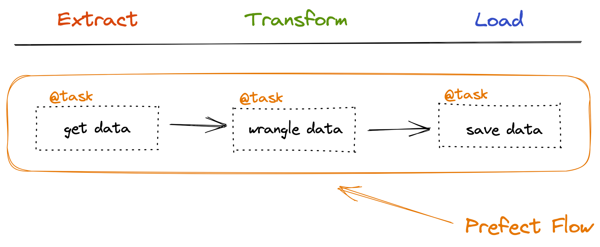

# Pipelines and workflows

---

!!! danger
    Module is still under development

<figure markdown>
{ width="800" }
<figcaption> <a href="https://www.prefect.io/guide/blog/prefect-zero-to-hero/"> Image credit </a> </figcaption>
</figure>

## DAGs

Directed Acyclic Graph (DAG)

### ❔ Exercises

1. Start by installing `prefect`:

    ```bash
    pip install prefect
    ```

2. Start a local Prefect server instance in your virtual environment.

    ```bash
    prefect server start
    ```

3. The great thing about Prefect is that the orchestration tasks and flows are written in pure Python.
