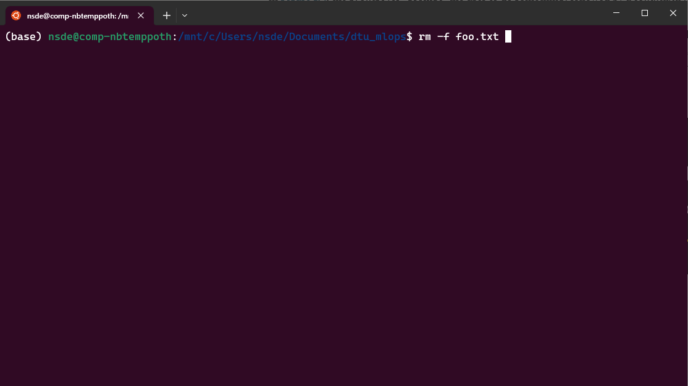
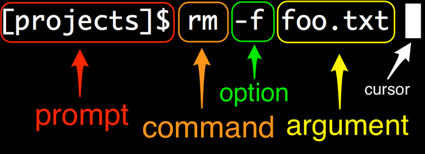

{ align=right width="130"}

# The command line

---

!!! info "Core Module"

<figure markdown>
{ width="500" }
<figcaption> <a href="https://twitter.com/rorypreddy/status/1257336536477171712"> Image credit </a> </figcaption>
</figure>

The command line (also commonly known as the *terminal*) provides a text-based interface for interacting with your
computer. It originated in an era before graphical user interfaces became standard. While Linux users are often familiar
with the terminal, Mac and Windows users may encounter it less frequently. However, a basic understanding of the command
line is valuable for improving workflow, especially in MLOps. Many MLOps tools lack graphical interfaces, making
terminal interaction necessary. Furthermore, working effectively in cloud environments, which we will cover later in the
course, often requires using the command line.

Note that if you're already a terminal wizard then feel free to skip the exercises below. They are very elementary.

## The anatomy of the command line

Regardless of the operating system, all command lines look more or less the same:

<figure markdown>
{ width="800" }
</figure>

As the image illustrates, executing a command involves several components:

1. The **prompt** is the part where you type your commands. It usually contains the name of the current directory you
    are in, followed by some kind of symbol: `$`, `>`, `:` are the usual ones. It can also contain other information,
    such as in the case of the above image, which also shows the current `conda` environment.
2. The **command** is the actual command you want to execute. For example, `ls` or `cd`.
3. The **options** (or flags) modify the command's behavior. They often start with a hyphen (`-`) or double
    hyphen (`--`). For example, `-l` in `ls -l`.
4. The **arguments** specify what the command should operate on. For example, `figures` in `ls -l figures`.

Generally, options are optional modifiers, while arguments provide the necessary inputs for the command.

<figure markdown>
{ width="800" }
<figcaption> <a href="https://www.learnenough.com/command-line-tutorial/basics"> Image credit </a> </figcaption>
</figure>

## ❔ Exercises

We have put a cheat sheet in the
[exercise files folder](https://github.com/SkafteNicki/dtu_mlops/blob/main/s1_development_environment/exercise_files/command_line_cheatsheet.pdf)
belonging to this session that gives a quick overview of the different commands that can be executed in the
command line.

???+ note "Windows users"

    We highly recommend that you install *Windows Subsystem for Linux* (WSL). This will install a full Linux system
    on your Windows machine. Please follow this
    [guide](https://docs.microsoft.com/en-us/windows/wsl/install-win10). Remember to run commands from an elevated
    (as administrator) Windows Command Prompt. You can in general complete all exercises in the course from a normal
    Windows Command Prompt, but some are easier to do if you run from WSL.

    If you decide to run in WSL, you need to remember that you now have two different systems, and installing a package
    on one system does not mean that it is installed on the other. For example, if you install `pip` in WSL, you
    need to install it again in Windows if you want to use it there.

    If you decide to not run in WSL, please always work in a Windows Command Prompt and not Powershell.

1. Start by opening a terminal.

2. To navigate inside a terminal, we rely on the `cd` command and `pwd` command. Make sure you know how to go back and
    forth in your file system. (1)
    { .annotate }

    1. :man_raising_hand: Your terminal should support
        [tab completion](https://en.wikipedia.org/wiki/Command-line_completion) which can help finish commands for you!

3. The `ls` command is important when we want to inspect the content of a folder. Try to use the command, and also try
    it with the additional option `-l`. What does it show?

4. Make sure to familiarize yourself with the `which`, `echo`, `cat`, `wget`, `less`, and `top` commands. Also,
    familiarize yourself with the `>` operator (used for output redirection). You are likely to use some of these
    commands and concepts throughout the course or in your future career. For Windows users, these commands may have
    different names (e.g., `where` corresponds to `which`).

5. It is also important that you know how to edit a file through the terminal. Most systems should have the
    `nano` editor installed; otherwise, try to figure out which one is installed on your system.

    1. Type `nano` in the terminal.

    2. Write the following text in the script

        ```python
        if __name__ == "__main__":
            print("Hello world!")
        ```

    3. Save the script as a `.py` file and try to execute it using `python <filename>.py`.

    4. Afterwards, try to edit the file through the terminal (change `Hello world` to something else).

6. All terminals come with a programming language. The most common system is called `bash`, which can come in handy
    when you're able to write simple programs in bash. For example, if you want to execute multiple Python
    programs sequentially, this can be done through a bash script.

    ??? note "Windows users"

        Bash is not part of Windows, so you need to run this part through WSL. If you did not install WSL, you can
        skip this part or as an alternative do the exercises in
        [Powershell](https://learn.microsoft.com/en-us/training/modules/script-with-powershell/), which is the native
        Windows scripting language (not recommended).

    1. Write a bash script (in `nano`) and try executing it:

        ```bash
        #!/bin/bash
        # A sample Bash script, by Ryan
        echo Hello World!
        ```

    2. Change the bash script to call the Python program you just wrote.

    3. Try to Google how to write a simple for-loop that executes the Python script 10 times in a row.

7. A trick you may need throughout this course is setting *environment variables*. An environment variable is just a
    dynamically named value that may alter the way running processes behave on a computer. The syntax for setting an
    environment variable depends on your operating system:

    === "Windows"

        ```bash
        set MY_VAR=hello
        echo %MY_VAR%
        ```
    === "Linux/Mac"

        ```bash
        export MY_VAR=hello
        echo $MY_VAR
        ```

    1. Try to set an environment variable and print it out.

    2. To use an environment variable in a Python program, you can use the `os.environ` function from the `os` module.
        Write a Python program that prints out the environment variable you just set.

    3. If you have a collection of environment variables, these can be stored in a file called `.env`. The file is
        formatted as follows:

        ```bash
        MY_VAR=hello
        MY_OTHER_VAR=world
        ```

        To load the environment variables from the file, you can use the `python-dotenv` package. Install it with
        `pip install python-dotenv` or `uv add python-dotenv` and then try to load the environment variables from the
        file and print them out.

        ```python
        from dotenv import load_dotenv
        load_dotenv()
        import os
        print(os.environ["MY_VAR"])
        ```

## 🧠 Knowledge check

1. Here is one command from later in the course when we will be working in the cloud

    ```bash
    gcloud compute instances create-with-container instance-1 \
        --container-image=gcr.io/<project-id>/gcp_vm_tester
        --zone=europe-west1-b
    ```

    Identify the command, options, and arguments.

    ??? success "Solution"

        * The command is `gcloud compute instances create-with-container`.
        * The options are `--container-image=gcr.io/<project-id>/gcp_vm_tester` and `--zone=europe-west1-b`.
        * The arguments are `instance-1`.

        The tricky part of this example is that commands can have subcommands, which are also commands. In this case,
        `compute` is a subcommand to `gcloud`, `instances` is a subcommand to `compute`, and `create-with-container`
        is a subcommand to `instances`.

2. Two common options that nearly all commands have are `-h` and `-V`. What does each of them do?

    ??? success "Solution"

        The `-h` (or `--help`) option prints the help message for the command, including subcommands and arguments.
        Try it out by executing `python -h`.
        <br> <br>
        The `-V` (or `--version`) option prints the version of the installed program.
        Try it out by executing `python --version`.

This concludes the module on the command line. Don't worry if you're not yet fully comfortable; we will use the command
line extensively throughout the course, providing ample opportunity for practice. If you want to spend additional time
on this topic, we highly recommend [watching this video](https://www.youtube.com/watch?v=oxuRxtrO2Ag) for a more
in-depth introduction.

If you are interested in personalizing your command line, you can check out the [starship](https://starship.rs/)
project, which allows you to customize your command line with a lot of different options.
