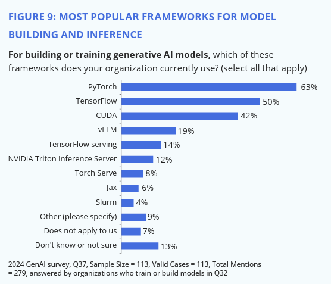
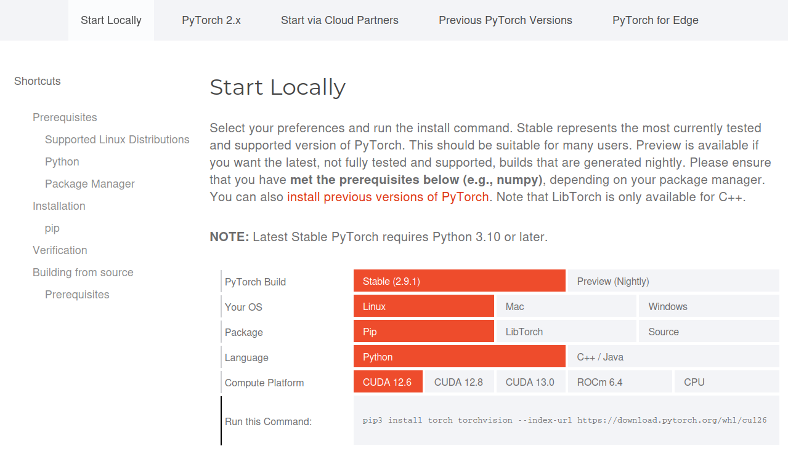
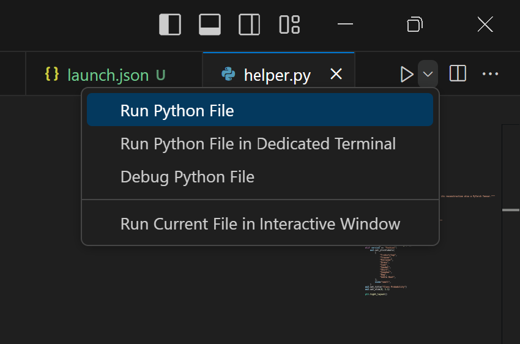
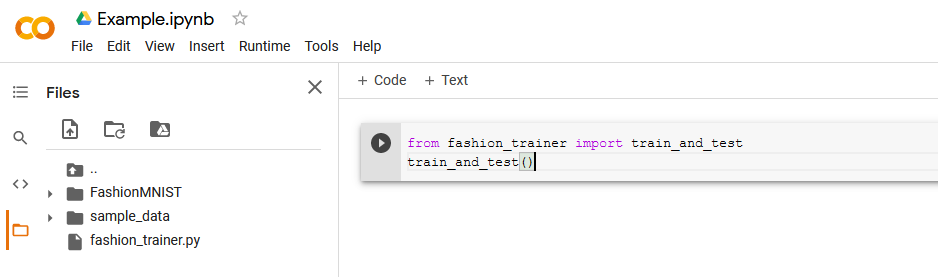

{ align=right width="130"}

# Deep Learning Software

---

!!! info "Core Module"

Since its breakthrough in 2012, deep learning has revolutionized various aspects of our lives, from Google Translate and
driverless cars to personal assistants and protein engineering. It is transforming nearly every sector of the economy.
However, deploying deep learning models in production presents unique challenges. The concept of
[technical debt](https://research.google.com/pubs/pub43146/) highlights the significant maintenance costs associated
with running machine learning systems in production. MLOps, inspired by classical DevOps, aims to address these
challenges by developing methods, processes, and tools to streamline the development and deployment of deep learning
models.

While MLOps concepts and tools can be applied to classical machine learning models (e.g., K-nearest neighbor, Random
Forest), deep learning introduces specific challenges related to the size of data and models. Therefore, this course
focuses on deep learning models.

## Software Landscape for Deep Learning

Regarding software for Deep Learning, the landscape is currently dominated by three software frameworks (listed in order
of when they were published):

{ align=right width="120"}
{ align=right width="130"}
{ align=right width="200"}

* [TensorFlow](https://github.com/tensorflow/tensorflow)

* [PyTorch](https://github.com/pytorch/pytorch)

* [JAX](https://github.com/google/jax)

A detailed comparison of these frameworks is unnecessary. PyTorch and TensorFlow, being the oldest, have larger
communities and comprehensive feature sets for both research and production. JAX, a newer framework, incorporates
improvements over PyTorch and TensorFlow but is still evolving. Given their different programming paradigms
(object-oriented vs. functional), a direct comparison is not particularly meaningful.

This course uses PyTorch due to its intuitive nature and its prevalence in our research. Currently, PyTorch is the
dominant framework for published models, research papers, and competition winners.

<figure markdown>
{ width="800" }
<figcaption>
<a href="https://www.linuxfoundation.org/hubfs/LF%20Research/lfr_genai24_111924.pdf?hsLang=en"> Image credit </a>
</figcaption>
</figure>

The intention behind this set of exercises is to get everyone's PyTorch skills up to date. If you're already a
PyTorch-Jedi, feel free to skip the first set of exercises, but I still recommend that you go through them. The
exercises are in large part taken directly from the
[deep learning course at Udacity](https://github.com/udacity/deep-learning-v2-pytorch). Note that these exercises are
given as notebooks, which is the only time we are going to use them actively in the course. Instead, after this set of
exercises, we are going to focus on writing code in Python scripts.

The notebooks contain a lot of explanatory text. The exercises that you are supposed to complete are inlined in the text
in small "exercise" blocks:

<figure markdown>
{width="1000"}
</figure>

For a refresher on deep learning topics, consult the relevant chapters in the
[deep learning](https://www.deeplearningbook.org/) book by Goodfellow, Bengio, and Courville (also available in the
literature folder). While expertise in deep learning is not required to pass this course, a basic understanding of the
concepts is beneficial. The course focuses on the software aspects of deploying deep learning models in production.

## A note on installing Pytorch

Pytorch is a huge library with many dependencies. As writing this, if you naively install Pytorch like this

```bash
pip install torch
```

in a new virtual environment, this will result in a disk usage of around 6.6 GB! This is not a problem if you have to
do it one time, but what you will experience throughout this course you will end up downloading and installing your
project dependencies over and over again for different reasons (new virtual environments, containers, continues
integration systems etc.). For this reason, it is worth considering how you install Pytorch.

When naively installing Pytorch, you will fetch whatever build is available on PyPI which is most likely a GPU enabled
build. But if you do not have a GPU in your computer, you should instead install the CPU only build. For comparison,
the CPU only build of Pytorch is around 729 MB on disk. Usually, I always recommend going to Pytorch's
[homepage](https://pytorch.org/get-started/locally/) and use their selector to get the correct installation command for
your system.

<figure markdown>
{ width="800" }
<figcaption>
<a href="https://pytorch.org/get-started/locally/"> Image credit </a>
</figcaption>
</figure>

Here are some general installation commands for Pytorch:

=== "Using pip"

    For `pip` install you can basically follow the instructions on the Pytorch homepage. Here are some common
    installation commands:

    ```bash
    # CPU only
    pip install torch torchvision torchaudio --index-url https://download.pytorch.org/whl/cpu
    # GPU enabled
    pip install torch torchvision --index-url https://download.pytorch.org/whl/cu126
    ```

    If you want this to be part of your `requirements.txt` file, it needs to looks something like this:

    ```txt
    --index-url https://download.pytorch.org/whl/cu126
    --extra-index-url https://pypi.org/simple

    torch
    # other dependencies
    ```

    The reason we need both `--index-url` and `--extra-index-url` is that we need to force `pip` to look for Pytorch
    packages in the Pytorch repository, but we also want to be able to install other packages from PyPI.

=== "Using uv"

    `uv` has dedicated a [full page](https://docs.astral.sh/uv/guides/integration/pytorch/) to installing Pytorch, which
    I recommend you check out. Here is an example of how to configure your `pyproject.toml` file to install only CPU
    version of Pytorch using `uv`:

    ```toml
    [project]
    name = "project"
    version = "0.1.0"
    requires-python = ">=3.14.0"
    dependencies = [
        "torch>=2.9.1",
    ]

    [tool.uv.sources]
    torch = [
        { index = "pytorch-cpu" },
    ]

    [[tool.uv.index]]
    name = "pytorch-cpu"
    url = "https://download.pytorch.org/whl/cpu"
    explicit = true
    ```

### ❔ Exercises

<!-- markdownlint-disable -->
[Exercise files](https://github.com/SkafteNicki/dtu_mlops/tree/main/s1_development_environment/exercise_files){ .md-button }
<!-- markdownlint-restore -->

!!! tip "Notebooks and `uv`

    If you are using `uv` as your package manager, you may need to restart the Jupyter Notebook kernel after installing
    new packages to ensure that the newly installed packages are recognized within the notebook environment.

1. Start a Jupyter Notebook session in your terminal (assuming you are at the root of the course material).
    Alternatively, you should be able to open the notebooks directly in your code editor. For VS Code users you can read
    more about how to work with Jupyter Notebooks in VS code
    [in page from VScode documentation](https://code.visualstudio.com/docs/datascience/jupyter-notebooks)

2. Complete the
    [Tensors in PyTorch](https://github.com/SkafteNicki/dtu_mlops/tree/main/s1_development_environment/exercise_files/1_Tensors_in_PyTorch.ipynb)
    notebook. It focuses on basic manipulation of PyTorch tensors. You can skip this notebook if you are comfortable
    doing this.

3. Complete the
    [Neural Networks in PyTorch](https://github.com/SkafteNicki/dtu_mlops/tree/main/s1_development_environment/exercise_files/2_Neural_Networks_in_PyTorch.ipynb)
    notebook. It focuses on building a very simple neural network using the PyTorch `nn.Module` interface.

4. Complete the
    [Training Neural Networks](https://github.com/SkafteNicki/dtu_mlops/tree/main/s1_development_environment/exercise_files/3_Training_Neural_Networks.ipynb)
    notebook. It focuses on how to write a simple training loop for training a neural network.

5. Complete the
    [Fashion MNIST](https://github.com/SkafteNicki/dtu_mlops/tree/main/s1_development_environment/exercise_files/4_Fashion_MNIST.ipynb)
    notebook, which summarizes concepts learned in notebooks 2 and 3 on building a neural network for classifying the
    [Fashion MNIST](https://github.com/zalandoresearch/fashion-mnist) dataset.

6. Complete the
    [Inference and Validation](https://github.com/SkafteNicki/dtu_mlops/tree/main/s1_development_environment/exercise_files/5_Inference_and_Validation.ipynb)
    notebook. This notebook adds important concepts on how to do inference and validation on our neural network.

7. Complete the
    [Saving_and_Loading_Models](https://github.com/SkafteNicki/dtu_mlops/tree/main/s1_development_environment/exercise_files/6_Saving_and_Loading_Models.ipynb)
    notebook. This notebook addresses how to save and load model weights. This is important if you want to share a
    model with someone else.

### 🧠 Knowledge check

1. If tensor `a` has shape `[N, d]` and tensor `b` has shape `[M, d]` how can we calculate the pairwise distance
    between rows in `a` and `b` without using a for loop?

    ??? success "Solution"

        We can take advantage of [broadcasting](https://pytorch.org/docs/stable/notes/broadcasting.html) to do this

        ```python
        a = torch.randn(N, d)
        b = torch.randn(M, d)
        dist = torch.sum((a.unsqueeze(1) - b.unsqueeze(0))**2, dim=2)  # shape [N, M]
        ```

2. What should be the size of `S` for an input image of size 1x28x28, and how many parameters does the neural network
    then have?

    ```python
    from torch import nn
    neural_net = nn.Sequential(
        nn.Conv2d(1, 32, 3), nn.ReLU(), nn.Conv2d(32, 64, 3), nn.ReLU(), nn.Flatten(), nn.Linear(S, 10)
    )
    ```

    ??? success "Solution"

        Since both convolutions have a kernel size of 3, stride 1 (default value) and no padding that means that we lose
        2 pixels in each dimension, because the kernel cannot be centered on the edge pixels. Therefore, the output
        of the first convolution would be 32x26x26. The output of the second convolution would be 64x24x24. The size of
        `S` must therefore be `64 * 24 * 24 = 36864`. The number of parameters in a convolutional layer is
        `kernel_size * kernel_size * in_channels * out_channels + out_channels` (last term is the bias) and the number
        of parameters in a linear layer is `in_features * out_features + out_features` (last term is the bias).
        Therefore, the total number of parameters in the network is
        `3*3*1*32 + 32 + 3*3*32*64 + 64 + 36864*10 + 10 = 387,466`, which could be calculated by running:

        ```python
        sum([prod(p.shape) for p in neural_net.parameters()])
        ```

3. A working training loop in PyTorch should have these three function calls: `optimizer.zero_grad()`,
    `loss.backward()`, `optimizer.step()`. Explain what would happen in the training loop (or implement it) if you
    forgot each of the function calls.

    ??? success "Solution"

        `optimizer.zero_grad()` is in charge of zeroing the gradient. If this is not done, then gradients would
        accumulate over the steps, leading to exploding gradients. `loss.backward()` is in charge of calculating the
        gradients. If this is not done, then the gradients will not be calculated and the optimizer will not be able
        to update the weights. `optimizer.step()` is in charge of updating the weights. If this is not done, then the
        weights will not be updated and the model will not learn anything.

### ❔ Final exercise

As the final exercise, we will develop a simple baseline model that we will continue to develop during the course.
For this exercise, we provide a corrupted subset of the [MNIST](https://en.wikipedia.org/wiki/MNIST_database) dataset
which can be downloaded from this
[Google Drive folder](https://drive.google.com/drive/folders/1ddWeCcsfmelqxF8sOGBihY9IU98S9JRP?usp=sharing) or using
these two commands:

=== "Using pip"
    ```bash
    pip install gdown
    gdown --folder 'https://drive.google.com/drive/folders/1ddWeCcsfmelqxF8sOGBihY9IU98S9JRP?usp=sharing'
    ```

=== "Using uv"
    ```bash
    uv add gdown
    uv run gdown --folder 'https://drive.google.com/drive/folders/1ddWeCcsfmelqxF8sOGBihY9IU98S9JRP?usp=sharing'
    ```

The data should be placed in a subfolder called `data/corruptmnist` in the root of the project. Your overall
task is the following:

> **Implement an MNIST neural network that achieves at least 85% accuracy on the test set.**

Before any training can start, you should identify the corruption that we have applied to the MNIST dataset to
create the corrupted version. This can help you identify what kind of neural network to use to get good performance, but
any network should be able to achieve this.

One key point of this course is trying to stay organized. Spending time now organizing your code will save time in the
future as you start to add more and more features. As subgoals, please complete the following exercises:

1. Implement your model in a script called `model.py`.

    ??? example "Starting point for `model.py`"

        ```python linenums="1" title="model.py"
        --8<-- "s1_development_environment/exercise_files/final_exercise/model.py"
        ```

    ??? success "Solution"

        The provided solution implements a convolutional neural network with 3 convolutional layers and a single
        fully connected layer. Because the MNIST dataset consists of images, we want an architecture that can take
        advantage of the spatial information in the images.

        ```python linenums="1" title="model.py"
        --8<-- "s1_development_environment/exercise_files/final_exercise/model_solution.py"
        ```

2. Implement your data setup in a script called `data.py`. The data was saved using `torch.save`, so to load it you
    should use `torch.load`.

    !!! warning "Saving the model"

        When saving the model, you should use `#!python torch.save(model.state_dict(), "model.pt")`, and when loading
        the model, you should use `#!python model.load_state_dict(torch.load("model.pt"))`. If you do
        `#!python torch.save(model, "model.pt")`, this can lead to problems when loading the model later on, as it will
        try to not only save the model weights but also the model definition. This can lead to problems if you change
        the model definition later (which you are most likely going to do).

    ??? example "Starting point for `data.py`"

        ```python linenums="1" title="data.py"
        --8<-- "s1_development_environment/exercise_files/final_exercise/data.py"
        ```

    ??? success "Solution"

        Data is stored in `.pt` files which can be loaded using `torch.load` (1). We iterate over the files, load them
        and concatenate them into a single tensor. In particular, we have highlighted the use of `.unsqueeze` function.
        Convolutional neural networks (which we propose as a solution) need the data to be in the shape `[N, C, H, W]`
        where `N` is the number of samples, `C` is the number of channels, `H` is the height of the image and `W` is the
        width of the image. The dataset is stored in the shape `[N, H, W]` and therefore we need to add a channel.
        { .annotate }

        1. :man_raising_hand: The `.pt` files are nothing else than a `.pickle` file in disguise. The
            `torch.save/torch.load` function is essentially a wrapper around the `pickle` module in Python, which
            produces serialized files. However, it is convention to use `.pt` to indicate that the file contains PyTorch
            tensors.

        We have additionally in the solution added functionality for plotting the images together with the labels for
        inspection. Remember: all good machine learning starts with a good understanding of the data.

        ```python linenums="1" hl_lines="17 18" title="data.py"
        --8<-- "s1_development_environment/exercise_files/final_exercise/data_solution.py"
        ```

3. Implement training and evaluation of your model in the `main.py` script. The `main.py` script should be able to take
    additional subcommands indicating if the model is being trained or evaluated. It will look something like this:

    === "Using pip"
        ```bash
        python main.py train --lr 1e-4
        python main.py evaluate model.pth
        ```

    === "Using uv"
        ```bash
        uv run main.py train --lr 1e-4
        uv run main.py evaluate model.pth
        ```

    which can be implemented in various ways. We provide you with a starting script that uses the `typer` library to
    define a command line interface (CLI), which you can learn more about in
    [this module](../s2_organisation_and_version_control/cli.md) later in the course.

    ??? note "VS Code and command line arguments"

        If you try to execute the above code in VS Code using the debugger (F5) or the build run functionality in the
        upper right corner:

        <figure markdown>
        {width="300"}
        </figure>

        you will get an error message saying that you need to select a command to run e.g. `main.py` either needs the
        `train` or `evaluate` command. This can be fixed by adding a `launch.json` to a specialized `.vscode` folder in
        the root of the project. The `launch.json` file should look something like this:

        ```json
        {
            "version": "0.2.0",
            "configurations": [
                {
                    "name": "Train",
                    "type": "debugpy",
                    "request": "launch",
                    "program": "${file}",
                    "args": [
                        "train",
                        "--lr",
                        "1e-4"
                    ],
                    "console": "integratedTerminal",
                    "justMyCode": true
                }
            ]
        }
        ```

        This will inform VS Code that when we execute the current file (in this case `main.py`), we want to run it with
        the `train` command and additionally pass the `--lr` argument with the value `1e-4`. You can read more about
        creating a `launch.json` file [here](https://code.visualstudio.com/docs/python/debugging). If you want to have
        multiple configurations you can add them to the `configurations` list as additional dictionaries.

    ??? example "Starting point for `main.py`"

        ```python linenums="1" title="main.py"
        --8<-- "s1_development_environment/exercise_files/final_exercise/main.py"
        ```

    ??? success "Solution"

        The solution implements a simple training loop and evaluation loop. Furthermore, we have added additional
        hyperparameters that can be passed to the training loop. Highlighted in the solution are the different lines
        where we ensure that our model and data are moved to the GPU (or Apple MPS accelerator if you have a newer Mac)
        if available.

        ```python linenums="1" hl_lines="8 26 38 69 78" title="main.py"
        --8<-- "s1_development_environment/exercise_files/final_exercise/main_solution.py"
        ```

4. As documentation that your model is working when running the `train` command, the script needs to produce a single
    plot with the training curve (training step vs. training loss). When the `evaluate` command is run, it should write
    the test set accuracy to the terminal.

It is part of the exercise not to implement this in notebooks, as code development in real life happens in scripts.
As the model is simple to run (for now), you should be able to complete the exercise on your laptop,
even if you are only training on CPU. That said, you are allowed to upload your scripts to your own "Google Drive" and
then you can call your scripts from a Google Colab notebook, which is shown in the image below where all code is
placed in the `fashion_trainer.py` script and the Colab notebook is just used to execute it.



Be sure to have completed the final exercise before the next session, as we will be building on top of the model
you have created.
