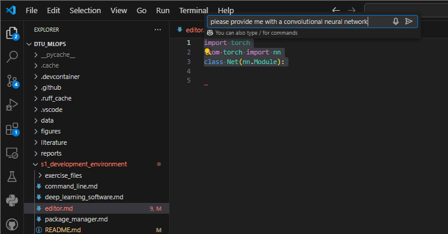

{ align=right width="130"}

# Editor/IDE

---

!!! info "Core Module"

Notebooks can be great for testing out ideas, developing simple code, and explaining and visualizing certain aspects
of a codebase. Remember that [Jupyter Notebook](https://jupyter.org/) was created to "...allows you
to create and share documents that contain live code, equations, visualizations, and narrative text." However,
any larger machine learning project will require you to work in multiple `.py` files, and here notebooks will provide
a suboptimal workflow. Therefore, to truly get "work done," you will need a good editor/IDE.

Many opinions exist on this matter, but for simplicity, we recommend getting started with one of the following 3:

| Editor             | Webpage                              | Comment (Biased opinion)                                                 |
| ------------------ | ------------------------------------ | ------------------------------------------------------------------------ |
| Spyder             | <https://www.spyder-ide.org/>        | A Matlab-like environment that is easy to get started with               |
| Visual Studio Code | <https://code.visualstudio.com/>     | Support for multiple languages with fairly easy setup                    |
| PyCharm            | <https://www.jetbrains.com/pycharm/> | An IDE for Python professionals. Will take a bit of time getting used to |

We highly recommend Visual Studio (VS) Code if you do not already have an editor installed (or just want to try
something new). We, therefore, put additional effort into explaining VS Code.

Below, you see an overview of the VS Code interface

<figure markdown>
{ width="700" }
<figcaption> <a href=" https://www.git-tower.com/learn/cheat-sheets/vscode/"> Image credit </a> </figcaption>
</figure>

The main components of VS Code are:

* The action bar: VS Code is not an editor meant for a single language and can do many things. One of the core reasons
    that VS Code has become so popular is that custom plug-ins called *extensions* can be installed to add
    functionality to VS Code. It is in the action bar that you can navigate between these different applications
    when you have installed them.

* The sidebar: The sidebar has different functionality depending on what extension you have open.
    In most cases, the sidebar will just contain the file explorer.

* The editor: This is where your code is. VS Code supports several layouts in the editor (one column, two columns,
    etc.). You can make a custom layout by dragging a file to where you want the layout to split.

* The panel: The panel contains a terminal for you to interact with. This can quickly be used to try out code by
    opening a `python` interpreter, management of environments, etc.

* The status bar: The status bar contains information based on the extensions you have installed. In particular,
    for Python development, the status bar can be used to change the conda environment.

## ❔ Exercises

The overall goal of the exercises is that you should start familiarizing yourself with the editor you have
chosen. If you are already an expert in one of them, feel free to skip the rest. You should at least be able to:

* Create a new file
* Run a Python script
* Change the Python environment

The instructions below are specific to Visual Studio Code, but we recommend that you try to answer the questions
if using another editor. In the `exercise_files` folder belonging to this session, we have put cheat sheets for VS Code
(one for Windows and one for Mac/Linux) that can give you an easy overview of the different macros in VS Code. The
following exercises are just to get you started, but you can find many more tutorials
[here](https://code.visualstudio.com/docs/python/python-tutorial).

1. VS Code is a general editor for many languages, and to get proper *Python* support, we need to install some
    extensions. In the `action bar`, go to the `extension` tab and search for `python` in the marketplace. From here,
    we highly recommend installing the following packages:

    * [Python](https://marketplace.visualstudio.com/items?itemName=ms-python.python): general Python support for VS Code
    * [Pylance](https://marketplace.visualstudio.com/items?itemName=ms-python.vscode-pylance): language server for
        Python that provides better code completion and type-checking
    * [Jupyter](https://marketplace.visualstudio.com/items?itemName=ms-toolsai.jupyter): support for Jupyter notebooks
        directly in VS Code
    * [Python Environment Manager](https://marketplace.visualstudio.com/items?itemName=donjayamanne.python-environment-manager):
        allows for easy management of virtual environments

2. If you install the `Python` package, you should see something like this in your status bar:

    <figure markdown>
    { width="700" }
    </figure>

    which indicates that you are using the stock Python installation instead of the one you have created using `conda`.
    Click it and change the Python environment to the one you want to use.

3. One of the most useful tools in VS Code is the ability to navigate the whole project using the built-in
    `Explorer`. To take advantage of VS Code, you need to make sure what you are working on is a project.
    Create a folder called `hello` (somewhere on your laptop) and open it in VS Code (Click `File` in the menu and then
    select `Open Folder`). You should end up with a completely clean workspace (as shown below). Click the `New file`
    button and create a file called `hello.py`.

    <figure markdown>
    { width="700" }
    <figcaption> <a href="https://code.visualstudio.com/docs/python/python-tutorial"> Image credit </a> </figcaption>
    </figure>

4. Finally, let's run some code. Add something simple to the `hello.py` file like:

    <figure markdown>
    { width="700" }
    <figcaption> <a href="https://code.visualstudio.com/docs/python/python-tutorial"> Image credit </a> </figcaption>
    </figure>

    and click the `run` button as shown in the image. It should create a new terminal, activate the environment that you
    have chosen, and finally run your script. In addition to clicking the `run` button, you can also:

    * Select some code and press `Shift+Enter` to run it in the terminal
    * Select some code and right-click, choosing to run in an interactive window (where you can interact with the results
        like in a Jupyter Notebook)

That's the basics of using VS Code. We highly recommend that you revisit
[this tutorial](https://code.visualstudio.com/docs/python/python-tutorial) during the course when we get to topics such
as debugging and version control, which VS Code can help with.

## A note on Jupyter notebooks in production environments

As already stated, Jupyter Notebooks are great for development as they allow developers to easily test out new ideas.
However, they often lead to pain points when models need to be deployed. We highly recommend reading section
5.1.1 of [this paper](https://arxiv.org/abs/2209.09125) by Shankar et al. which in more detail discusses the strong
opinions on Jupyter notebooks that exist within the developer community.

All this said, there exists one simple tool to make notebooks work better in a production setting. It's called
`nbconvert` and can be installed with

```bash
pip install nbconvert
```

You may need some further dependencies such as Pandoc, TeX and Pyppeteer for it to work (see install instructions
[here](https://nbconvert.readthedocs.io/en/latest/install.html#installing-nbconvert)). After this, converting a
notebook to a `.py` script is as simple as:

```bash
jupyter nbconvert --to=script my_notebook.ipynb
```

which will produce a similarly named script called `my_notebook.py`. We highly recommend that you stick to developing
scripts directly during the course to get experience with doing so, but `nbconvert` can be a fantastic tool to have
in your toolbox.

## AI assistance

You are probably all familiar with using AI tools for solving different tasks in your daily life and you have most
likely also used AI tools like ChatGPT or similar for programming. However, most of these tools are not directly
integrated into your editor, which can lead to a lot of [context-switching](https://reclaim.ai/blog/context-switching)
that in general leads to lower productivity.

We are therefore in this section going to be looking at [GitHub Copilot](https://github.com/features/copilot), which is
an AI tool that directly integrates into your editor, eliminating the need to switch between browser tabs or external
tools. In addition, the strength of having AI directly in your editor is that it can provide suggestions based on the
code you are currently writing and in general it just has access to a larger context than a standalone tool.

### ❔ Exercises

1. As of writing this GitHub Copilot is free for all students, teachers and maintainers of popular open-source projects.
    As a student, sign up for the [Student Developer Pack](https://education.github.com/pack#offers)

2. Install the [GitHub Copilot extension](https://marketplace.visualstudio.com/items?itemName=GitHub.copilot) in your
    editor

3. GitHub Copilot has many different features, but the most important one is the ability to provide suggestions based
    on the code you are currently writing. Try to write some code in a new Python file and see if you can get some
    suggestions from GitHub Copilot on how to complete the code. If you have no idea what to try out here is a
    simple example of starting out coding a neural network in PyTorch:

    ```python
    import torch
    from torch import nn
    class Net(nn.Module):
    ```

    Github Copilot will most likely suggest you complete the code using linear layers with an input dimension of
    `28*28`. Can you explain why it suggests this and where this bias comes from?

4. The second feature that can be very useful is the ability to directly chat or ask questions regarding
    your code. Try highlighting (in your code editor) the code from the previous exercise and press `Ctrl+i` which
    should open a chat window. Ask it to complete it with a convolutional neural network instead of a linear one.

    <figure markdown>
    { width="700" }
    </figure>

5. Finally, let's try the built-in chat feature. You can get to this by clicking the `Chat` icon in the Activity bar and
    begin to ask questions similar to how you would ask ChatGPT. However, we have also the option to provide context
    either from the code editor or the terminal. Try saving the following code in a Python script `copilot.py`:

    ```python
    import torch
    from torch import nn
    class Net(nn.Module):
        def __init__(self):
            super(Net, self).__init__()
            self.fc1 = nn.Linear(28*28, 128)
            self.fc2 = nn.Linear(128, 64)
            self.fc3 = nn.Linear(64, 10)
        def forward(self, x):
            x = x.view(-1, 28*28)
            x = torch.relu(self.fc1(x))
            x = torch.relu(self.fc2(x))
            x = self.fc3(x)
            return x

    model = Net()
    print(model(torch.randn(1, 1, 14, 14)))
    ```

    and run it in the terminal: `python copilot.py`. It will naturally give you an error, but you can now ask GitHub
    Copilot for help. The easiest way to do this is by highlighting the output in the terminal and then pressing running
    the `Github Copilot: Explain This (Terminal)` command (see the image below, use `Ctrl+Shift+P` to open the command
    palette and search for the command). Does the explanation make sense e.g. can you figure out what to change to get
    the code running?

    <figure markdown>
    { width="700" }
    </figure>

6. (Optional) Just to investigate the difference between using Github Copilot and ChatGPT, try to redo the previous
    exercises using ChatGPT. What are the main differences between the two tools? (1)
    { .annotate }

    1. :man_raising_hand: Remember that ChatGPT is a general AI model, meaning that it was trained to be good at many
        different tasks, whereas GitHub Copilot (which uses OpenAI's Codex model under the hood) was specifically
        trained to be good at coding.

That was a small introduction to GitHub Copilot. We highly recommend that you try to use it during the course to see
how it can help you solve both the exercises and the final project. However, when using AI tools it is always important
to remember that they are not perfect and that you need to critically evaluate the suggestions they provide. In the end,
you are the one responsible for the code you write, not the AI tool.
