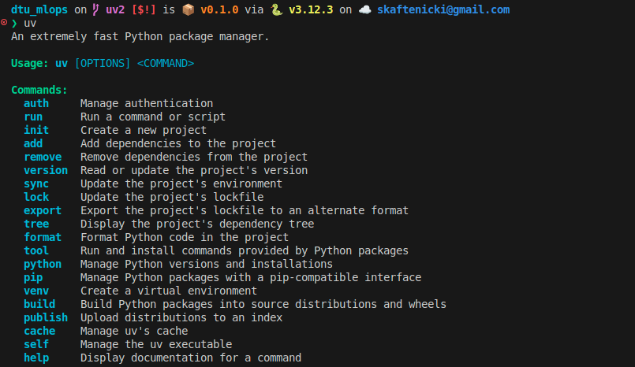
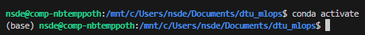

{ align=right width="130"}

# Package managers and virtual environments

---

!!! info "Core Module"

Python's extensive package ecosystem is a major strength. It's rare to write a program relying solely on the
[Python standard library](https://docs.python.org/3/library/index.html). Therefore,
[package managers](https://en.wikipedia.org/wiki/Package_manager) are essential for installing third-party packages.

You've likely used `pip`, the default Python package manager. While suitable for beginners, `pip` lacks a crucial
feature for developers and data scientists: *virtual environments*. Virtual environments prevent dependency conflicts
between projects. For example, if project A requires `torch==1.3.0` and project B requires `torch==2.0`, the following
scenario illustrates the problem:

```bash
cd project_A  # move to project A
pip install torch==1.3.0  # install old torch version
cd ../project_B  # move to project B
pip install torch==2.0  # install new torch version
cd ../project_A  # move back to project A
python main.py  # try executing main script from project A
```

will mean that even though we are executing the main script from project A's folder, it will use `torch==2.0` instead of
`torch==1.3.0` because that is the last version we installed. In both cases, `pip` will install the package into
the same environment, in this case, the global environment. Instead, if we did something like:

=== "Unix/macOS"

    ```bash
    cd project_A  # move to project A
    python -m venv env  # create a virtual environment in project A
    source env/bin/activate  # activate that virtual environment
    pip install torch==1.3.0  # Install the old torch version into the virtual environment belonging to project A
    cd ../project_B  # move to project B
    python -m venv env  # create a virtual environment in project B
    source env/bin/activate  # activate that virtual environment
    pip install torch==2.0  # Install new torch version into the virtual environment belonging to project B
    cd ../project_A  # Move back to project A
    source env/bin/activate  # Activate the virtual environment belonging to project A
    python main.py  # Succeed in executing the main script from project A
    ```

=== "Windows"

    ```bash
    cd project_A  # Move to project A
    python -m venv env  # Create a virtual environment in project A
    .\\env\\Scripts\\activate  # Activate that virtual environment
    pip install torch==1.3.0  # Install the old torch version into the virtual environment belonging to project A
    cd ../project_B  # Move to project B
    python -m venv env  # Create a virtual environment in project B
    .\\env\\Scripts\\activate  # Activate that virtual environment
    pip install torch==2.0  # Install new torch version into the virtual environment belonging to project B
    cd ../project_A  # Move back to project A
    .\\env\\Scripts\\activate  # Activate the virtual environment belonging to project A
    python main.py  # Succeed in executing the main script from project A
    ```

then we would be sure that `torch==1.3.0` is used when executing `main.py` in project A because we are using two
different virtual environments. In the above case, we used the built-in
[venv module](https://docs.python.org/3/library/venv.html), which is the built-in Python module for creating virtual
environments. `venv+pip` is arguably a good combination, but when working on multiple projects it can quickly become a
hassle to manage all the different virtual environments yourself, remembering which Python version to use, which
packages to install and so on.

Therefore, several package managers have been developed to manage virtual environments and dependencies. Some popular
options include:

```python exec="1"
# this code is being executed at build time to get the latest number of stars
import requests

def get_github_stars(owner_repo):
    url = f"https://api.github.com/repos/{owner_repo}"
    response = requests.get(url)
    if response.status_code == 200:
        data = response.json()
        return data.get("stargazers_count", 0)
    else:
        return None

table =  "| 🌟 Framework | 📄 Docs | 📂 Repository | ⭐ GitHub Stars |\n"
table += "|--------------|---------|---------------|----------------|\n"

data = [
    ("Conda", "https://docs.conda.io/en/latest/", "conda/conda"),
    ("Pipenv", "https://pipenv.pypa.io/en/latest/", "pypa/pipenv"),
    ("Poetry", "https://python-poetry.org/", "python-poetry/poetry"),
    ("Pipx", "https://pipx.pypa.io/stable/", "pypa/pipx"),
    ("Hatch", "https://hatch.pypa.io/latest/", "pypa/hatch"),
    ("PDM", "https://pdm.fming.dev/latest/", "pdm-project/pdm"),
    ("uv", "https://docs.astral.sh/uv/", "astral-sh/uv"),
]

for framework, docs, repo in data:
    stars_count = get_github_stars(repo)
    stars = f"{stars_count / 1000:.1f}k" if stars_count is not None else "⭐ N/A"
    table += f"| {framework} | [🔗 Link]({docs}) | [🔗 Link](https://github.com/{repo}) | {stars} |\n"

print(table)
```

The lack of a standard dependency management approach, unlike `npm` for `node.js` or `cargo` for `rust`, is a known
issue in the Python community.

<figure markdown>
{ width="700" }
<figcaption> <a href="https://xkcd.com/927/"> Image credit </a> </figcaption>
</figure>

This course doesn't mandate a specific package manager, but using one is essential. If you're already familiar with a
package manager, continue using it. The best approach is to choose one you like and stick with it. While it's tempting
to find the "perfect" package manager, they all accomplish the same goal with minor differences. For a somewhat recent
comparison of Python environment management and packaging tools, see
[this blog post](https://alpopkes.com/posts/python/packaging_tools/).

If you're new to package managers, I will recommend that you use `uv`. It is becoming the de facto standard in the
Python community due to its speed and ease of use. It combines the best features of `pip` and `conda`, allowing you to
create virtual environments and manage dependencies seamlessly, including for multiple python versions. The alternative
(which has been the recommended approach for many years) is to use `conda` for creating virtual environments and `pip`
for installing packages within those environments.

!!! warning "`uv` and `conda+pip` in this course"

    Until 2026, the recommended package managers for this course have been `conda+pip`. However, starting in 2026, we
    will transition to recommending `uv` as the primary package manager, and conda will probably be phased out of the
    course in a few years. Therefore, we try to as much as possible to provide instructions for both `conda+pip` and
    `uv`. However, I still expect to have missed a couple of places where only instructions for `conda+pip` are given.
    If you find such places, please report them on the course GitHub repository (or directly to me) so that I can fix
    them.

## Python dependencies

Before we get started with the exercises, let's first talk a bit about Python dependencies. One of the most common ways
to specify dependencies in the Python community is through a `requirements.txt` file, which is a simple text file that
contains a list of all the packages that you want to install. The format allows you to specify the package name and
version number you want, with 7 different operators:

```txt
package1           # any version
package2 == x.y.z  # exact version
package3 >= x.y.z  # at least version x.y.z
package4 >  x.y.z  # newer than version x.y.z
package4 <= x.y.z  # at most version x.y.z
package5 <  x.y.z  # older than version x.y.z
package6 ~= x.y.z  # install version newer than x.y.z and older than x.y+1
```

In general, all packages (should) follow the [semantic versioning](https://semver.org/) standard, which means that the
version number is split into three parts: `x.y.z` where `x` is the major version, `y` is the minor version and `z` is
the patch version. Specifying version numbers ensures code reproducibility. Without version numbers, you risk API
changes by package maintainers. This is especially important in machine learning, where reproducing the exact same model
is crucial. The most common alternative to semantic versioning is [calendar versioning](https://calver.org/), where the
version number is based on the date of release, e.g., `2023.4.1` for a release on April 1st, 2023.

Finally, we also need to discuss *dependency resolution*, which is the process of figuring out which packages are
compatible. This is a complex problem with various algorithms. If a package manager takes a long time to install
a package, it's likely due to the dependency resolution process. For example, attempting to install

```bash
pip install "matplotlib >= 3.8.0" "numpy <= 1.19" --dry-run
```

then it would simply fail because there are no versions of `matplotlib` and `numpy` under the given
constraints that are compatible with each other. In this case, we would need to relax the constraints to something like

```bash
pip install "matplotlib >= 3.8.0" "numpy <= 1.21" --dry-run
```

to make it work.

!!! tip

    You are only supposed to use one package manager in the course and therefore you should either do the `uv` exercises
    or the `conda+pip` exercises, not both. The most clear difference between the two approaches is that `uv` forces you
    to use a project-based approach e.g. anything you do with `uv` should be done inside a project folder even for one
    off scripts, while with `conda+pip` you can just create a virtual environment anywhere on your system and use that
    wherever you want. For this reason, `conda+pip` may seem a bit more flexible and easier to use initially, while
    `uv` has a bit of a learning curve but is more structured and easier to manage in the long run. In the end, both
    approaches are valid and it is mostly a matter of personal preference which one you choose.

## ❔ Exercises (uv)

1. Download and install `uv` following the
    [official installation guide](https://docs.astral.sh/uv/getting-started/installation/). Verify your installation
    by running `uv --version` in a terminal, it should display the `uv` version number.

2. If you have successfully installed `uv`, then you should be able to execute the `uv` command in a terminal. You
    should see something like this:

    <figure markdown>
    { width="700" }
    </figure>

3. I cannot recommend the [uv documentation](https://docs.astral.sh/uv/) enough. It will essentially go through all
    the features of `uv` we will be using in the course. That said, let's first try to see how we can use `uv` to create
    virtual environments and manage dependencies:

    1. Try creating a new virtual environment called using Python 3.11. What command should you execute to do this?

        !!! warning "Use Python 3.10 or higher"

            We recommend using Python 3.10 or higher for this course. Generally, using the second latest Python version
            (currently 3.13) is advisable, as the newest version may lack support from all dependencies. Check the status
            of different Python versions [here](https://devguide.python.org/versions/).

        ??? success "Solution"

            ```bash
            uv venv --python 3.13
            ```

    2. After creating the virtual environment, a folder called `.venv` should have been created in your current
        directory (check this!). To run a script using the virtual environment, you can use the `uv run` command:

        ```bash
        uv run script.py
        ```

        you can think of `uv run` = `python` inside the virtual environment.

    3. `uv pip` is a 1-to-1 replacement for `pip` that works directly within the virtual environment created by `uv`.
        Try installing a package using `uv pip`, for example `numpy`.

        ??? success "Solution"

            ```bash
            uv pip install numpy
            ```

    4. Instead of calling `uv run` every time you want to execute a command in the virtual environment, you can also
        activate the virtual environment like with `venv` or `conda`.

        === "Unix/macOS"
            ```bash
            source .venv/bin/activate
            ```

        === "Windows"
            ```bash
            .venv\Scripts\activate
            ```

        which will change your terminal prompt to indicate that you are now inside the virtual environment. Instead of
        running `uv pip install` and `uv run`, you can now simply use `pip install` and `python` as you would normally
        do.

    5. Which `uv` command gives you a list of all packages installed in your virtual environment?

        ??? success "Solution"

            ```bash
            uv pip list
            # or
            uv tree
            ```

4. The above is the very basic of `uv` and is actually not the recommended way of using `uv`. Instead, `uv` works best
    as a project-based package manager. Let's try that out:

    1. When you start a new project, you can initialize it with `uv init <project_name>`, which will create a new folder
        with the given project name and set up a virtual environment for you(1):

        1. :man_raising_hand: If you already have a pre-existing folder, you can also run `uv init` inside that folder
            to set it up as a `uv` project.

        ```bash
        uv init my_project
        ```

        which files have been created in the `my_project` folder and what do they do?

        ??? success "Solution"

            The following has been created:

            * A `.venv` folder containing the virtual environment as above
            * A `README.md` file for documenting your project
            * a `pyproject.toml` file for managing your project, more on this file later

    2. To add dependencies to your project, you can use the `uv add` command:

        ```bash
        uv add numpy pandas
        ```

        which will install the packages in your virtual environment and also add them to the `pyproject.toml` file
        (check this out!). An additional file have been created called `uv.lock`, can you figure out what the purpose of
        this file is?

        ??? success "Solution"

            The `uv.lock` file is used to ensure *reproducibility* between different users of the project. It contains
            the exact versions of all packages installed in the virtual environment, including sub-dependencies. When
            another user wants to set up the same environment, they can use the `uv sync` command to install the exact
            same versions of all packages as specified in the `uv.lock` file.

    3. Another, way to add dependencies to your project is to directly edit the `pyproject.toml` file. Try adding
        `scikit-learn` version `1.2.2` to your `pyproject.toml` file. Afterwards, what command should you execute to
        install the dependencies specified in the `pyproject.toml` file?

        ??? success "Solution"

            Add the following line under the `[project.dependencies]` section:

            ```toml
            dependencies = [
                "numpy>=2.4.0",
                "scikit-learn==1.2.2"
            ]
            ```

            Afterwards, execute:

            ```bash
            uv sync
            ```

            which will sync your virtual environment with the dependencies specified in the `pyproject.toml` file.

    4. Make sure that everything works as expected by creating a new script that imports all the packages you have
        installed and try running it using `uv run`. It should run without any import errors if the previous steps
        were successful.

    5. Something you will encounter later in the course is the need to install dependencies for the development of
        your project, e.g., testing frameworks, linters, formatters and so on, which are not needed for the actual
        execution of your project. `uv` has a built-in way to handle this:

        ```bash
        uv add --dev <dependency1> <dependency2> ...
        ```

        Try adding at least two development dependencies to your project and check how they are stored in the
        `pyproject.toml` file.

        ??? success "Solution"

            ```bash
            uv add --dev pytest ruff
            ```

            which will add the following section to your `pyproject.toml` file:

            ```toml
            [dependency-groups]
            dev = [
                "ruff>=0.14.10",
            ]
            ```

    6. `uv` also supports for defining optional dependencies e.g. dependencies that are only needed for specific
        use-cases. For example, `pandas` support the optional dependency `excel` for reading and writing Excel files.
        Try adding an optional dependency to your project and check how it is stored in the `pyproject.toml` file.

        ??? success "Solution"

            ```bash
            uv add pandas --optional dataframes
            ```

            in this case we are adding an optional dependency group called `dataframes` and to that group we are adding
            the package `pandas`. Check the `pyproject.toml` file afterwards.

            which will add the following line to your `pyproject.toml` file:

            ```toml
            [project.optional-dependencies]
            dataframes = [
                "pandas>=2.0.3",
            ]
            ```

            1. Optional dependencies are, as the name suggests, not installed by default when you call `uv run` or
                `uv sync`. How do you install optional dependencies?

                ??? success "Solution"

                    ```bash
                    # to install optional dependencies from the "dataframes" group
                    uv sync --group dataframes
                    # to install all optional dependencies
                    uv sync --all-groups
                    ```

            2. Finally, how do you specify which optional dependencies should be installed when executing
                `uv run`?

                ??? success "Solution"

                    You can specify this in the `pyproject.toml` file under the `[tool.uv]` section (see
                    [docs](https://docs.astral.sh/uv/concepts/projects/dependencies/#default-groups)):

                    ```toml
                    [tool.uv]
                    default-groups = ["dev", "dataframes"]
                    ```

                    alternatively, setting `default-groups = "all"` will install all optional dependencies by default.

    7. Let's say that you want to upgrade or downgrade the python version you are running inside your `uv` project.
        How do you do that?

        ??? success "Solution"

            The [recommended way](https://docs.astral.sh/uv/concepts/python-versions/#requesting-a-version) is to pin
            the python version by having a `.python-version` file in the root of your project with the desired
            python version. This file can easily be created with the command:

            ```bash
            uv python pin 3.13
            ```

    8. Assume you have a friend wonking on the same project as you and they are using `pip` together with good old
        `requirements.txt` files. How do you create a `requirements.txt` file from your `uv` project?

        ??? success "Solution"

            Relevant documentation can be found
            [here](https://docs.astral.sh/uv/concepts/projects/sync/#exporting-the-lockfile).

            ```bash
            uv export --format requirements.txt
            ```

    9. (Optional) `uv` also supports the notion of *tools* which are external command line tools that you may use in
        multiple projects. Examples of such tools are `black`, `ruff`, `pytest` and so on (all which you will encounter
        later in the course). These tools can be installed globally on your system by using the `uvx` (or `uv tool`):
        command:

        ```bash
        uvx cowsay -t "muuh"
        ```

        which will install the `cowsay` tool globally on your system and then execute it with the argument `"muuh"`. Try
        installing at least one tool and executing it.

!!! tip "Alias `uvr=uv run`"

    I have personally found that typing `uv run` before every command can get a bit tedious. Therefore, I recommend
    creating a shell alias to simplify this. For example, in `bash` or `zsh`, you can add the following line to your
    `.bashrc` or `.zshrc` file:

    ```bash
    alias uvr='uv run'
    ```

    and then you can simply use `uvr` instead of `uv run`.

## ❔ Exercises (conda+pip)

!!! note "Conda vs. Mamba"

    If you are using `conda` then you can also use `mamba` which is a drop-in replacement `conda` that is faster.
    This means that any `conda` command can be replaced with `mamba` and it should work. Feel free to use `mamba` if
    you are already familiar with `conda` or after having gone through the exercises below. Install instructions can
    be found [here](https://mamba.readthedocs.io/en/latest/installation/mamba-installation.html).

For guidance on using `conda`, refer to the
[cheat sheet](https://github.com/SkafteNicki/dtu_mlops/blob/main/s1_development_environment/exercise_files/conda_cheatsheet.pdf)
in the exercise folder.

1. Download and install `conda`. You are free to either install full `conda` or the much simpler version `miniconda`.
    Conda includes many pre-installed packages, while Miniconda is a smaller, minimal installation. Conda's larger size
    can be a disadvantage on smaller devices. Verify your installation by running `conda help` in a terminal; it should
    display the conda help message. If it doesn't work, you may need to configure a system variable to point to the
    [conda installation](https://stackoverflow.com/questions/44597662/conda-command-is-not-recognized-on-windows-10).

2. If you have successfully installed conda, then you should be able to execute the `conda` command in a terminal.

    <figure markdown>
    { width="700" }
    </figure>

    Conda will always tell you what environment you are currently in, indicated by the `(env_name)` in the prompt. By
    default, it will always start in the `(base)` environment.

3. Try creating a new virtual environment. Make sure that it is called `my_environment` and that it installs version
   3.11 of Python. What command should you execute to do this?

    !!! warning "Use Python 3.10 or higher"

        We recommend using Python 3.10 or higher for this course. Generally, using the second latest Python version
        (currently 3.12) is advisable, as the newest version may lack support from all dependencies. Check the status
        of different Python versions [here](https://devguide.python.org/versions/).

    ??? success "Solution"

        ```bash
        conda create --name my_environment python=3.13
        ```

4. Which `conda` command gives you a list of all the environments that you have created?

    ??? success "Solution"

        ```bash
        conda env list
        ```

5. Which `conda` command gives you a list of the packages installed in the current environment?

    ??? success "Solution"

        ```bash
        conda list
        ```

    1. How do you easily export this list to a text file? Do this, and make sure you export it to
        a file called `environment.yaml`, as conda uses another format by default than `pip`.

        ??? success "Solution"

            ```bash
            conda list --explicit > environment.yaml
            ```

    2. Inspect the file to see what is in it.

    3. The `environment.yaml` file you have created is one way to secure *reproducibility* between users because
        anyone should be able to get an exact copy of your environment if they have your `environment.yaml` file.
        Try creating a new environment directly from your `environment.yaml` file and check that the packages being
        installed exactly match what you originally had.

        ??? success "Solution"

            ```bash
            conda env create --name <environment-name> --file environment.yaml
            ```

6. As the introduction states, it is fairly safe to use `pip` inside `conda` today. What is the corresponding `pip`
    command that gives you a list of all `pip` installed packages? And how do you export this to a `requirements.txt`
    file?

    ??? success "Solution"

        ```bash
        pip list # List all installed packages
        pip freeze > requirements.txt # Export all installed packages to a requirements.txt file
        ```

7. If you look through the requirements that both `pip` and `conda` produce, you will see that they
    are often filled with a lot more packages than what you are using in your project. What you are interested in are
    the packages that you import in your code: `from package import module`. One way to get around this is to use the
    package `pipreqs`, which will automatically scan your project and create a requirements file specific to that.
    Let's try it out:

    1. Install `pipreqs`:

        ```bash
        pip install pipreqs
        ```

    2. Either try out `pipreqs` on one of your own projects or try it out on some other online project.
        What does the `requirements.txt` file that `pipreqs` produces look like compared to the files produced
        by either `pip` or `conda`?

## 🧠 Knowledge check

1. Try executing the command

    === "Using pip"
        ```bash
        pip install "pytest < 4.6" pytest-cov==2.12.1
        ```

    === "Using uv"
        ```bash
        uv pip install "pytest < 4.6" pytest-cov==2.12.1
        ```

    based on the error message you get, what would be a compatible way to install these?

    ??? success "Solution"

        As `pytest-cov==2.12.1` requires a version of `pytest` newer than `4.6`, we can simply change the command to be:

        === "Using pip"
            ```bash
            pip install "pytest >= 4.6" pytest-cov==2.12.1
            ```

        === "Using uv"
            ```bash
            uv pip install "pytest >= 4.6" pytest-cov==2.12.1
            ```

        but there of course exist other solutions as well.

This ends the module on setting up virtual environments. While the methods mentioned in the exercises are great ways
to construct requirement files automatically, sometimes it is just easier to sit down and manually create the files, as
you in that way ensure that only the most necessary requirements are installed when creating a new environment.
