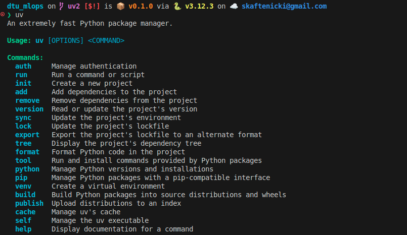

{ align=right width="130"}

# Package managers and virtual environments

---

!!! info "Core Module"

Python's extensive package ecosystem is a major strength. It's rare to write a program relying solely on the
[Python standard library](https://docs.python.org/3/library/index.html). Therefore,
[package managers](https://en.wikipedia.org/wiki/Package_manager) are essential for installing third-party packages.

You may be familiar with `pip`, Python's default package manager. While suitable for basic use, `pip` alone lacks
crucial features for professional development: integrated *virtual environment* management. Virtual environments prevent
dependency conflicts between projects. For example, if project A requires `torch==1.3.0` and project B requires
`torch==2.0`, installing both globally creates a problem - only one version can exist in the global environment at
a time.

Virtual environments solve this by creating isolated Python installations for each project. Several modern package
managers combine dependency management with virtual environment handling. Popular options include:

```python exec="1"
# this code is being executed at build time to get the latest number of stars
import requests

def get_github_stars(owner_repo):
    url = f"https://api.github.com/repos/{owner_repo}"
    response = requests.get(url)
    if response.status_code == 200:
        data = response.json()
        return data.get("stargazers_count", 0)
    else:
        return None

table =  "| 🌟 Framework | 📄 Docs | 📂 Repository | ⭐ GitHub Stars |\n"
table += "|--------------|---------|---------------|----------------|\n"

data = [
    ("uv", "https://docs.astral.sh/uv/", "astral-sh/uv"),
    ("Poetry", "https://python-poetry.org/", "python-poetry/poetry"),
    ("Pipenv", "https://pipenv.pypa.io/en/latest/", "pypa/pipenv"),
    ("Hatch", "https://hatch.pypa.io/latest/", "pypa/hatch"),
    ("PDM", "https://pdm.fming.dev/latest/", "pdm-project/pdm"),
    ("Rye", "https://rye.astral.sh/", "astral-sh/rye"),
]

for framework, docs, repo in data:
    stars_count = get_github_stars(repo)
    stars = f"{stars_count / 1000:.1f}k" if stars_count is not None else "⭐ N/A"
    table += f"| {framework} | [🔗 Link]({docs}) | [🔗 Link](https://github.com/{repo}) | {stars} |\n"

print(table)
```

The lack of a standard dependency management approach, unlike `npm` for `node.js` or `cargo` for `rust`, is a known
issue in the Python community.

<figure markdown>
{ width="700" }
<figcaption> <a href="https://xkcd.com/927/"> Image credit </a> </figcaption>
</figure>

This course doesn't mandate a specific package manager, but using one is essential. If you're already familiar with a
package manager, continue using it. The best approach is to choose one you like and stick with it. While it's tempting
to find the "perfect" package manager, they all accomplish the same goal with minor differences. For a somewhat recent
comparison of Python environment management and packaging tools, see
[this blog post](https://alpopkes.com/posts/python/packaging_tools/).

**For this course, we recommend `uv`**. It is rapidly becoming the de facto standard in the Python community due to its
speed, ease of use, and comprehensive feature set. It combines the best aspects of traditional tools, allowing you to
create virtual environments, manage dependencies seamlessly, and handle multiple Python versions with ease.

!!! note "Historical note: conda and pip"

    Prior to 2026, this course recommended using `conda` for creating virtual environments combined with `pip` for
    installing packages. While `conda` remains a valid tool (especially in data science and scientific computing),
    we have transitioned to `uv` as the primary recommendation due to its superior performance, modern design, and
    unified approach to Python project management. If you encounter older tutorials or StackOverflow answers
    mentioning `conda` or `pip`, know that `uv` provides equivalent (and often better) functionality.

## Python dependencies

Before we get started with the exercises, let's first talk a bit about Python dependencies. Modern Python projects
typically specify dependencies in a `pyproject.toml` file, which is the standard defined in
[PEP 518](https://peps.python.org/pep-0518/) and [PEP 621](https://peps.python.org/pep-0621/). This file contains
project metadata and dependency information in a structured format.

When specifying package versions, you can use several operators:

```toml
[project]
dependencies = [
    "package1",              # any version
    "package2 == 1.2.3",     # exact version
    "package3 >= 1.2.3",     # at least version 1.2.3
    "package4 > 1.2.3",      # newer than version 1.2.3
    "package5 <= 1.2.3",     # at most version 1.2.3
    "package6 < 1.2.3",      # older than version 1.2.3
    "package7 ~= 1.2.3",     # install version >=1.2.3 and <1.3.0
]
```

In general, all packages (should) follow the [semantic versioning](https://semver.org/) standard, which means that the
version number is split into three parts: `x.y.z` where `x` is the major version, `y` is the minor version and `z` is
the patch version. Specifying version numbers ensures code reproducibility. Without version numbers, you risk API
changes by package maintainers. This is especially important in machine learning, where reproducing the exact same model
is crucial. The most common alternative to semantic versioning is [calendar versioning](https://calver.org/), where the
version number is based on the date of release, e.g., `2023.4.1` for a release on April 1st, 2023.

Finally, we also need to discuss *dependency resolution*, which is the process of figuring out which packages are
compatible. This is a complex problem with various algorithms. If a package manager takes a long time to install
a package, it's likely due to the dependency resolution process. For example, attempting to install

```bash
uv add "matplotlib >= 3.8.0" "numpy <= 1.19"
```

would fail because there are no versions of `matplotlib` and `numpy` under the given constraints that are compatible
with each other. In this case, we would need to relax the constraints to something like

```bash
uv add "matplotlib >= 3.8.0" "numpy <= 1.21"
```

to make it work.

## ❔ Exercises

1. Download and install `uv` following the
    [official installation guide](https://docs.astral.sh/uv/getting-started/installation/). Verify your installation
    by running `uv --version` in a terminal, it should display the `uv` version number.

2. If you have successfully installed `uv`, then you should be able to execute the `uv` command in a terminal. You
    should see something like this:

    <figure markdown>
    { width="700" }
    </figure>

3. I cannot recommend the [uv documentation](https://docs.astral.sh/uv/) enough. It will essentially go through all
    the features of `uv` we will be using in the course. That said, let's first try to see how we can use `uv` to create
    virtual environments and manage dependencies:

    1. Try creating a new virtual environment called `.venv` using Python 3.11. What command should you execute to do this?

        !!! warning "Use Python 3.10 or higher"

            We recommend using Python 3.10 or higher for this course. Generally, using the second latest Python version
            (currently 3.13) is advisable, as the newest version may lack support from all dependencies. Check the status
            of different Python versions [here](https://devguide.python.org/versions/).

        ??? success "Solution"

            ```bash
            uv venv --python 3.13
            ```

    2. After creating the virtual environment, a folder called `.venv` should have been created in your current
        directory (check this!). To run a script using the virtual environment, you can use the `uv run` command:

        ```bash
        uv run script.py
        ```

        you can think of `uv run` = `python` inside the virtual environment.

    3. `uv pip` is a drop-in replacement for `pip` that works directly within the virtual environment created by `uv`.
        Try installing a package using `uv pip`, for example `numpy`.

        ??? success "Solution"

            ```bash
            uv pip install numpy
            ```

    4. Instead of calling `uv run` every time you want to execute a command in the virtual environment, you can also
        activate the virtual environment manually.

        === "Unix/macOS"
            ```bash
            source .venv/bin/activate
            ```

        === "Windows"
            ```bash
            .venv\Scripts\activate
            ```

        which will change your terminal prompt to indicate that you are now inside the virtual environment. Instead of
        running `uv pip install` and `uv run`, you can now simply use `uv add` and `python` as you would normally
        do.

    5. Which `uv` command gives you a list of all packages installed in your virtual environment?

        ??? success "Solution"

            ```bash
            uv pip list
            # or for a tree view showing dependencies
            uv tree
            ```

4. The above is the very basic of `uv` and is actually not the recommended way of using `uv`. Instead, `uv` works best
    as a project-based package manager. Let's try that out:

    1. When you start a new project, you can initialize it with `uv init <project_name>`, which will create a new folder
        with the given project name and set up a virtual environment for you(1):

        1. :man_raising_hand: If you already have a pre-existing folder, you can also run `uv init` inside that folder
            to set it up as a `uv` project.

        ```bash
        uv init my_project
        ```

        which files have been created in the `my_project` folder and what do they do?

        ??? success "Solution"

            The following has been created:

            * A `.venv` folder containing the virtual environment as above
            * A `README.md` file for documenting your project
            * a `pyproject.toml` file for managing your project, more on this file later
            * a `hello.py` file with a simple example script

    2. To add dependencies to your project, you can use the `uv add` command:

        ```bash
        uv add numpy pandas
        ```

        which will install the packages in your virtual environment and also add them to the `pyproject.toml` file
        (check this out!). An additional file have been created called `uv.lock`, can you figure out what the purpose of
        this file is?

        ??? success "Solution"

            The `uv.lock` file is used to ensure *reproducibility* between different users of the project. It contains
            the exact versions of all packages installed in the virtual environment, including sub-dependencies. When
            another user wants to set up the same environment, they can use the `uv sync` command to install the exact
            same versions of all packages as specified in the `uv.lock` file.

    3. Another, way to add dependencies to your project is to directly edit the `pyproject.toml` file. Try adding
        `scikit-learn` version `1.2.2` to your `pyproject.toml` file. Afterwards, what command should you execute to
        install the dependencies specified in the `pyproject.toml` file?

        ??? success "Solution"

            Add the following line under the `[project]` section:

            ```toml
            dependencies = [
                "numpy>=2.4.0",
                "pandas>=2.2.3",
                "scikit-learn==1.2.2"
            ]
            ```

            Afterwards, execute:

            ```bash
            uv sync
            ```

            which will sync your virtual environment with the dependencies specified in the `pyproject.toml` file.

    4. Make sure that everything works as expected by creating a new script that imports all the packages you have
        installed and try running it using `uv run`. It should run without any import errors if the previous steps
        were successful.

    5. Something you will encounter later in the course is the need to install dependencies for the development of
        your project, e.g., testing frameworks, linters, formatters and so on, which are not needed for the actual
        execution of your project. `uv` has a built-in way to handle this:

        ```bash
        uv add --dev <dependency1> <dependency2> ...
        ```

        Try adding at least two development dependencies to your project and check how they are stored in the
        `pyproject.toml` file.

        ??? success "Solution"

            ```bash
            uv add --dev pytest ruff
            ```

            which will add the following section to your `pyproject.toml` file:

            ```toml
            [dependency-groups]
            dev = [
                "pytest>=8.3.4",
                "ruff>=0.14.10",
            ]
            ```

    6. `uv` also supports for defining optional dependencies e.g. dependencies that are only needed for specific
        use-cases. For example, `pandas` support the optional dependency `excel` for reading and writing Excel files.
        Try adding an optional dependency to your project and check how it is stored in the `pyproject.toml` file.

        ??? success "Solution"

            ```bash
            uv add pandas --optional dataframes
            ```

            in this case we are adding an optional dependency group called `dataframes` and to that group we are adding
            the package `pandas`. Check the `pyproject.toml` file afterwards.

            which will add the following line to your `pyproject.toml` file:

            ```toml
            [project.optional-dependencies]
            dataframes = [
                "pandas>=2.0.3",
            ]
            ```

            1. Optional dependencies are, as the name suggests, not installed by default when you call `uv run` or
                `uv sync`. How do you install optional dependencies?

                ??? success "Solution"

                    ```bash
                    # to install optional dependencies from the "dataframes" group
                    uv sync --group dataframes
                    # to install all optional dependencies
                    uv sync --all-groups
                    ```

            2. Finally, how do you specify which optional dependencies should be installed when executing
                `uv run`?

                ??? success "Solution"

                    You can specify this in the `pyproject.toml` file under the `[tool.uv]` section (see
                    [docs](https://docs.astral.sh/uv/concepts/projects/dependencies/#default-groups)):

                    ```toml
                    [tool.uv]
                    default-groups = ["dev", "dataframes"]
                    ```

                    alternatively, setting `default-groups = "all"` will install all optional dependencies by default.

    7. Let's say that you want to upgrade or downgrade the python version you are running inside your `uv` project.
        How do you do that?

        ??? success "Solution"

            The [recommended way](https://docs.astral.sh/uv/concepts/python-versions/#requesting-a-version) is to pin
            the python version by having a `.python-version` file in the root of your project with the desired
            python version. This file can easily be created with the command:

            ```bash
            uv python pin 3.13
            ```

    8. Assume you have a friend working on the same project as you and they are still using the older `pip` package
        manager with `requirements.txt` files. How do you create a `requirements.txt` file from your `uv` project?

        ??? success "Solution"

            Relevant documentation can be found
            [here](https://docs.astral.sh/uv/concepts/projects/sync/#exporting-the-lockfile).

            ```bash
            uv export --format requirements.txt > requirements.txt
            ```

    9. (Optional) `uv` also supports the notion of *tools* which are external command line tools that you may use in
        multiple projects. Examples of such tools are `black`, `ruff`, `pytest` and so on (all which you will encounter
        later in the course). These tools can be installed globally on your system by using the `uvx` (or `uv tool`)
        command:

        ```bash
        uvx cowsay -t "muuh"
        ```

        which will install the `cowsay` tool globally on your system and then execute it with the argument `"muuh"`. Try
        installing at least one tool and executing it.

!!! tip "Alias `uvr=uv run`"

    I have personally found that typing `uv run` before every command can get a bit tedious. Therefore, I recommend
    creating a shell alias to simplify this. For example, in `bash` or `zsh`, you can add the following line to your
    `.bashrc` or `.zshrc` file:

    ```bash
    alias uvr='uv run'
    ```

    and then you can simply use `uvr` instead of `uv run`.

## 🧠 Knowledge check

1. Try executing the command

    ```bash
    uv add "pytest < 4.6" pytest-cov==2.12.1
    ```

    based on the error message you get, what would be a compatible way to install these?

    ??? success "Solution"

        As `pytest-cov==2.12.1` requires a version of `pytest` newer than `4.6`, we can simply change the command to be:

        ```bash
        uv add "pytest >= 4.6" pytest-cov==2.12.1
        ```

        but there of course exist other solutions as well.

This ends the module on setting up virtual environments. The project-based approach with `uv` ensures that your
dependencies are properly managed and reproducible across different machines and collaborators.
