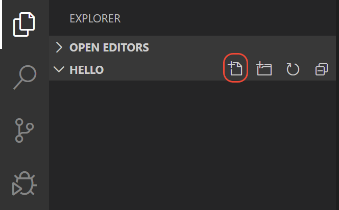
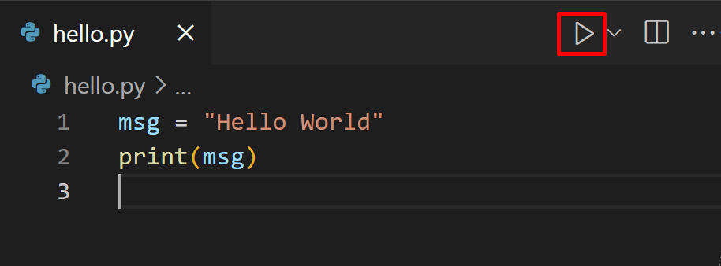

# Editor/IDE
{: .no_toc }

  

    Table of contents
  

  {: .text-delta }
1. TOC
{:toc}

---
Notebooks can be great for testing out ideas, developing simple code and explaining and visualizing certain aspects
of a codebase. Remember that [Jupyter notebook](https://jupyter.org/) was created with intention to "...allows you 
to create and share documents that contain live code, equations, visualizations and narrative text." However, 
any larger machine learning project will require you to work in multiple `.py` files and here notebooks will provide 
a suboptimal workflow. Therefore, to for truly getting "work done" you will need a good editor / IDE. 

Many opinions exist on this matter, but for simplicity we recommend getting started with one of the following 3:

Editor		         | Webpage  	                  			| Comment (Biased opinion)
-------------------|------------------------------------|----------------------------------------------------------------------
Spyder             | <https://www.spyder-ide.org/>        | Matlab like environment that is easy to get started with
Visual studio code | <https://code.visualstudio.com/>     | Support for multiple languages with fairly easy setup
PyCharm            | <https://www.jetbrains.com/pycharm/> | IDE for python professionals. Will take a bit of time getting used to

We highly recommend Visual studio (vs) code  if you do not already have a editor installed (or just want to try something new.). We therefore put additional effort into explaining vs code.

Below you see an overview of the vs code interface

  

The main components of VS code are:
* The action bar: VS code is not an editor meant for a single language and can do many things. One of the core reasons that VC code have become so popular is that custom plug-ins called **extensions** can be installed to add functionality to VS code. It is in the action bar that you can navigate between these different applications when you have installed them.

* The side bar: The side bar has different functionality depending on what extension that you have open. In most cases, the side bar will just contain the file explorer.

* The editor: This where you code is. VS code supports a number of layouts in the editor (one column, two column ect.). You can make a custom layout by dragging a file to where you want the layout to split.

* The panel: The panel contains a terminal for you to interact with. This can quickly be used to try out code by opening a `python` interpreter, management of environments etc.

* The status bar: The status bar contains information based on the extensions that you have installed. In particular for python development, the status bar can be used to change conda enviroment.

### Exercise

1. Download and install one of the editors / IDE and make yourself familiar with it e.g. try out the editor
   on the files that you created in the final exercise in the last lecture.

 The remaining of the exercises are specific to Visual studio code but we recommend that you try to answer the questions
 if using another editor. In the `exercise_files` folder belonging to this session we have put cheat sheets for vs code
 (one for windows and one for mac/linux), that can give you an easy overview of the different macros in vs code. The
 following exercises are just to get you started but you can find many more tutorials [here](https://code.visualstudio.com/docs/python/python-tutorial).

2. VS code is a general editor for many languages and to get proper *python* support we need to install some
extensions. In the `action bar` go to the `extension` tap and search for `python` in the marketplace. For here
we highly recommend installing the following packages:
   * `Python`: general python support
   * `Python for VSCode`: python syntax support
   * `Python Test Explorer for Visual Studio Code`: support for testing of python code (we get to that in a later lecture)
   * `Jupyter`: support for jupyter notebooks directly in VSCode

3. If you install the `Python` package you should see something like this in your status bar:

   

     
   

   which indicates that you are using the stock python installation, instead of the one you have created using `conda`. Click it and change the python environment to the one you actually want to use.

4. One of the most useful tools in VSCode is the ability to navigate a hole project using the build-in
`Explorer`. To really take advantage of the VC code you need to make sure what you are working on is a project.
Create a folder called `hallo` (somewhere on your laptop) and open it in VScode (Click `File` in the menu and then select `Open Folder`). You should end up with a completly clean workspace (as shown below). Click the `New file` button and create a file called `hallo.py`.

   

     
   

5. Finally, lets run some code. Add something simple to the `hallo.py` file like:
   

     
   

   and click the `run` button as shown in the image. It should create a new terminal, activate the environment that you have
   chosen and finally run your script. In addition to clicking the `run` button, you can also
  
   * Select some code and press `Shift+Enter` to run it in the terminal
   * Select some code and right click, choosing to run in a interactive window (where you can interact with the results like in a jupyter notebook)

Thats, the basic of using VScode. We recommend highly that you revisit [this tutorial](https://code.visualstudio.com/docs/python/python-tutorial) during the course when we get to topics such as debugging and version control which VScode can help with.

