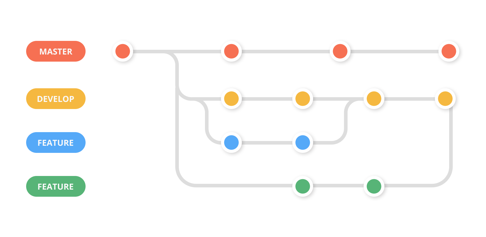
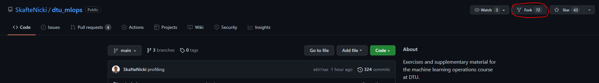

# Git
{: .no_toc }

<details open markdown="block">
  <summary>
    Table of contents
  </summary>
  {: .text-delta }
1. TOC
{:toc}
</details>

---

Proper collaboration with other people will require that you can work on the same codebase in an organized manner.
This is the reason that **version control** exist. Simply stated, it is a way to keep track of:

* Who made changes to the code
* When did the change happen
* What changes were made

For a full explanation please see this [page](https://git-scm.com/book/en/v2/Getting-Started-What-is-Git%3F)

Secondly, it is important to note that Github is not git! Github is the dominating player when it comes to
hosting repositories but that does not mean that they are the only one providing free repository hosting (see [bitbucket](https://bitbucket.org/product/ or [gitlab](https://about.gitlab.com/)) for some other examples).

That said we will be using git and github throughout this course. It is a requirement for passing this course that you create a public repository with your code and use git to upload any code changes. How much you choose to integrate this into your own projects depends, but you are at least expected to be familiar with git+github.

## Initial config

1. [Install git](https://git-scm.com/book/en/v2/Getting-Started-Installing-Git) on your computer and make sure
   that your installation is working by writing `git help` in a terminal and it should show you the help message for git.

2. Create a [github](github.com/) account

3. To make sure that we do not have to type in our github username every time that we want to do some changes, we can once and for all set them on our local machine

```bash
# type in a terminal
git config credential.helper store
git config --global user.email <email>
```

## Git overview

The most simple way to think of version control, is that it is just nodes with lines connecting them

<p align="center">
  
</p>

Each node, which we call a *commit* is uniquely identified by a hash string. Each node, stores what our code
looked like at that point in time (when we made the commit) and using the hash codes we can easily
revert to a specific point in time.

The commits are made up of local changes that we make to our code. A basic workflow for
adding commits are seen below

<p align="center">
  
</p>

Assuming that we have made some changes to our local *working directory* and that we 
want to get this updates to be online in the *remote repository* we have to do the following steps:

* First we run the command `git add`. This will move our changes to the *staging area*. While changes are in the staging area we can very easily revert them (using `git restore`). There have therefore not been assigned a unique hash to the code yet, and we can therefore still overwrite it.

* To take our code from the *staging area* and make it into a commit, we simply run `git commit` which will locally add a note to the graph. It is important again, that we have not pushed the commit to the online *repository* yet.

* Finally, we want other to be able to use the changes that we made. We do a simple `git push` and our commit gets online

Of course, the real power of version control is the ability to make branches, as in the image below

<p align="center">
  
</p>

Each branch can contain code that are not present on other branches. This is usefull when you are many developers working together on the same project.

## Exercise

1. In your github account create an repository, where the intention is that you upload the code from the final exercise from yesterday  

   1. After creating the repository, clone it to your computer
      ```git clone https://github.com/my_user_name/my_repository_name.git```

   2. Move/copy the three files from yesterday into the repository (and any other that you made)

   3. Add the files to a commit by using `git add` command

   4. Commit the files using `git commit`

   5. Finally push the files to your repository using `git push`. Make sure to check online that the files have been updated in your repository.

   6. You can always use the commando `git status` to check where you are in the process of making a commit.

2. Make sure that you understand how to make branches, as this will allow you to try out code changes without messing with your working code.
   Creating a new branch can be done using:
   ```bash
   # create a new branch
   git checkout -b <my_branch_name>
   ```
   Afterwards, you can use `git checkout` to change between branches (remember to commit your work!)
   Try adding something (a file, a new line of code etc.) to the newly created branch, commit it and
   try changing back to master afterwards. You should hopefully see whatever you added on the branch
   is not present on the main branch.

2. If you do not already have a cloned version of this repository belonging to the course, make sure to make one!
   I am continuously updating/changing some of the material during the course and I therefore recommend that you
   each day before the lecture do a `git pull` on your local copy

3. Git may seems like a waste of time when solutions like dropbox, google drive ect exist, and it is
   not completely untrue when you are only one or two working on a project. However, these file management
   systems falls short when we hundred to thousand of people work to together. For this exercise you will
   go through the steps of sending an open-source contribution:

   1. Go online and find a project you do not own, where you can improve the code. For simplicity you can
      just choose the repository belonging to the course. Now fork the project by clicking the *Fork* botton.
      
      This will create a local copy of the repository which you have complete writing access to. Note that
      code updates to the original repository does not update code in your local repository.

   2. Clone your local fork of the project using ```git clone```.

   3. As default your local repository will be on the ```main branch``` (HINT: you can check this with the
      ```git status``` commando). It is good practise to make a new branch when working on some changes. Use
      the ```git branch``` command followed by the ```git checkout``` command to create a new branch.

   4. You are now ready to make changes to repository. Try to find something to improve (any spelling mistakes?).
      When you have made the changes, do the standard git cycle: ```add -> commit -> push```

   5. Go online to the original repository and go the ```Pull requests``` tab. Find ```compare``` botton and
      choose the to compare the ```master branch``` of the original repo with the branch that you just created
      in your own repository. Check the diff on the page to make sure that it contains the changes you have made.

   6. Write a bit about the changes you have made and click `Create pull request` :)

4. Forking a repository has the consequence that your fork and the repository that you forked can diverge. To mitigate this
   we can set what is called an *remote upstream*. Take a look on this
   [page](https://docs.github.com/en/pull-requests/collaborating-with-pull-requests/working-with-forks/configuring-a-remote-for-a-fork)
   , and set a remote upstream for the repository you just forked.

5. After setting the upstream branch, we need to pull and merge any update. Take a look on this
   [page](https://docs.github.com/en/pull-requests/collaborating-with-pull-requests/working-with-forks/syncing-a-fork) and
   figure out how to do this.

6. (Optional) The above exercises have focused on how to use git from the terminal, which I highly recommend learning. However, if you are using a proper editor they also have build in support for version control. We recommend getting familiar with these features (here is a tutorial for [VS Code](https://code.visualstudio.com/docs/editor/versioncontrol))

That covers the basics of git to get you stated. In the exercise folder you can find a [git cheat sheet](exercise_files/git_cheat_sheet.pdf) with the most useful commands for future reference.
