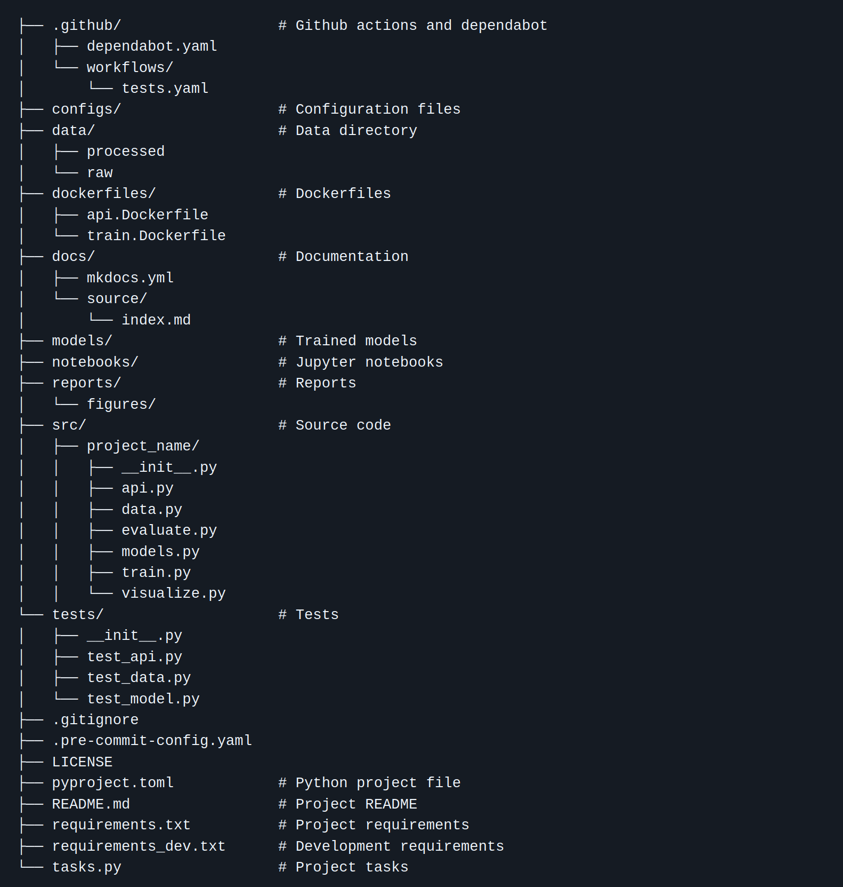

{ align=right width="130"}

# Code organization

---

!!! info "Core Module"

With a basic understanding of version control, it is now time to really begin filling up our code repository. However,
the question then remains: how to organize our code? As developers, we tend to not think about code organization that
much. It is instead something that is just dynamically created as we may need it. However, maybe we should spend
some time initially getting organized with the chance of this making our code easier to develop and maintain in the
long run. If we do not spend time organizing our code, we may end up with a mess of code that is hard to understand
or maintain

!!! quote "Big Ball of Mud"
    *A Big Ball of Mud is a haphazardly structured, sprawling, sloppy, duct-tape-and-baling-wire, spaghetti-code*
    *jungle. These systems show unmistakable signs of unregulated growth, and repeated, expedient repair. Information*
    *is shared promiscuously among distant elements of the system, often to the point where nearly all the important*
    *information becomes global or duplicated.* <br>
    *The overall structure of the system may never have been well defined.* <br>
    *If it was, it may have eroded beyond recognition. Programmers with a shred of architectural sensibility shun these*
    *quagmires. Only those who are unconcerned about architecture, and, perhaps, are comfortable with the inertia of*
    *the day-to-day chore of patching the holes in these failing dikes, are content to work on such systems.*
    <br> <br>
    Brian Foote and Joseph Yoder, Big Ball of Mud. Fourth Conference on Patterns Languages of Programs
    (PLoP '97/EuroPLoP '97) Monticello, Illinois, September 1997

We are here going to focus on the organization of data science projects and machine learning projects. The core
difference these kinds of projects introduce compared to more traditional systems is *data*. The key to modern machine
learning is without a doubt the vast amounts of data that we have access to today. It is therefore not unreasonable that
data should influence our choice of code structure. If we had another kind of application, then the layout of our
codebase should probably be different.

## Cookiecutter

We are in this course going to use the tool [cookiecutter](https://cookiecutter.readthedocs.io/en/latest/README.html),
which is a tool for creating projects from *project templates*. A project template is in short just an overall structure
for how you want your folders, files, etc. to be organized from the beginning. For this course we are going to be using
a custom [MLOps template](https://github.com/SkafteNicki/mlops_template). The template is essentially a fork of the
[cookiecutter data science template](https://github.com/drivendata/cookiecutter-data-science) that has been used for a
couple of years in the course, but specialized a bit more towards MLOps instead of general data science.

We are not going to argue that this template is better than every other template; it is just a
**standardized** way of creating project structures for machine learning projects. By standardized we mean that if two
people are using `cookiecutter` with the same template, the layout of their code follows some specific rules,
enabling them to understand each other's code faster. Code organization is therefore not only to make the
code easier for you to maintain but also for others to read and understand.

Shown below is the default code structure of cookiecutter for data science projects.

<figure markdown>
{ width="1000" }
</figure>

What is important to keep in mind when using a template is that it is precisely a template. By definition, a template is
a *guide* to making something. Therefore, not all parts of a template may be important for your project at hand. Your job
is to pick the parts from the template that are useful for organizing your machine learning project and add the parts
that are missing.

## Python projects

While the same template in principle could be used regardless of what language we were using for our machine learning
or data science application, there are certain considerations to take into account based on what language we are using.
Python is the dominant language for machine learning and data science currently, which is why we in this section are
focusing on some special files you will need for your Python projects.

The first file you may or may not know about is the `__init__.py` file. In Python the `__init__.py` file is used to mark
a directory as a Python package. Therefore, as a bare minimum, any Python package should look something like this:

```txt
├── src/
│   ├── __init__.py
│   ├── file1.py
│   ├── file2.py
├── pyproject.toml
```

The second file to focus on is the `pyproject.toml`. This file is important for actually converting your code into a
Python project. Essentially, whenever you run `pip install`, `pip` is in charge of both downloading the package you want
but also in charge of *installing* it. For `pip` to be able to install a package it needs instructions on what part of
the code it should install and how to install it. This is the job of the `pyproject.toml` file.

Below we have both added a description of the structure of the `pyproject.toml` file but also `setup.py + setup.cfg`
which is the "old" way of providing project instructions regarding Python projects. However, you may still encounter
a lot of projects using `setup.py + setup.cfg`, so it is good to at least know about them.

=== "pyproject.toml"

    `pyproject.toml` is the new standardized way of describing project metadata in a declarative way, introduced in
    [PEP 621](https://peps.python.org/pep-0621/). It is written in [toml format](https://toml.io/en/) which is easy to
    read. At the very least your `pyproject.toml` file should include the `[build-system]` and `[project]` sections:

    ```toml
    [build-system]
    requires = ["setuptools", "wheel"]
    build-backend = "setuptools.build_meta"

    [project]
    name = "my-package-name"
    version = "0.1.0"
    authors = [{name = "EM", email = "me@em.com"}]
    description = "Something cool here."
    requires-python = ">=3.8"
    dynamic = ["dependencies"]

    [tool.setuptools.dynamic]
    dependencies = {file = ["requirements.txt"]}
    ```

    The `[build-system]` informs `pip`/`python` that to build this Python project it needs the two packages
    `setuptools` and `wheel` and that it should call the
    [setuptools.build_meta](https://setuptools.pypa.io/en/latest/build_meta.html) function to actually build the
    project. The `[project]` section essentially contains metadata regarding the package, what it's called, etc. for if
    we ever want to publish it to [PyPI](https://pypi.org/).

    For specifying dependencies of your project you have two options. Either you specify them in a `requirements.txt`
    file and put that as a dynamic field in `pyproject.toml` as shown above. Alternatively, you can add a `dependencies`
    field under the `[project]` header like this (similar to how `uv` does it):

    ```toml
    [project]
    dependencies = [
        'torch==2.1.0',
        'matplotlib>=3.8.1'
    ]
    ```

    The improvement over `setup.py + setup.cfg` is that `pyproject.toml` also allows for metadata from other tools to
    be specified in it, essentially making sure you only need a single file for your project. For example, in the next
    [module M7 on good coding practices] you will learn about the tool `ruff` and how it can help format your code. If
    we want to configure `ruff` for our project we can do that directly in `pyproject.toml` by adding additional
    headers:

    ```toml
    [ruff]
    ruff_option = ...
    ```

    To read more about how to specify `pyproject.toml` this
    [page](https://packaging.python.org/en/latest/specifications/declaring-project-metadata/#declaring-project-metadata)
    is a good place to start.

=== "setup.py + setup.cfg"

    `setup.py` is the original way to describe how a Python package should be built. The most basic `setup.py` file
    will look like this:

    ```python
    from setuptools import setup
    from pip.req import parse_requirements
    requirements = [str(ir.req) for ir in parse_requirements("requirements.txt")]
    setup(
        name="my-package-name",
        version="0.1.0",
        author="EM",
        description="Something cool here."
        install_requires=requirements,
    )
    ```

    Essentially, it is the exact same meta information as in `pyproject.toml`, just written directly in Python
    syntax instead of `toml`. Because there was a desire to separate this meta information into its own file, the
    `setup.cfg` file was created which can contain the exact same information as `setup.py` just in a declarative
    config.

    ```toml
    [metadata]
    name = my-package-name
    version = 0.1.0
    author = EM
    description = "Something cool here."
    # ...
    ```

    This non-standardized way of providing meta information regarding a package was essentially what led to the
    creation of `pyproject.toml`.

Regardless of what way a project is configured, after creating the above files, the correct way to install them would be
the same

=== "Using pip"

    ```bash
    pip install .
    # or in developer mode
    pip install -e .
    ```

    !!! note "Developer mode in Python"

        The `-e` is short for `--editable` mode also called
        [developer mode](https://setuptools.pypa.io/en/latest/userguide/development_mode.html). Since we will
        continuously be iterating on our package this is the preferred way to install our package, because that means
        that we do not have to run `pip install` every time we make a change. Essentially, in developer mode changes in
        the Python source code can immediately take place without requiring a new installation.

=== "Using uv"

    TLDR: `uv` takes care of this for you when you run `uv sync`.

    `uv` distinguishes between a project being an
    [application or being a library/package](https://docs.astral.sh/uv/concepts/projects/init/#creating-projects). The
    core difference is if the project was created using `uv init --app` or `uv init --lib` with `--app` being the
    default. The core difference is that applications are not installed as packages, while libraries/packages are.
    Concreatly this comes down to these lines in the `pyproject.toml` file being added or not:

    ```toml
    [build-system]
    requires = ["uv_build>=0.9.21,<0.10.0"]
    build-backend = "uv_build"
    ```

After running this your code should be available to import as `from project_name import ...` like any other Python
package you use. This is the most essential information you need to know about creating Python packages.

## ❔ Exercises

After having installed cookiecutter and created your first template project (exercise 1 and 2 below), the remaining
exercises are intended to be used on the simple CNN MNIST classifier from yesterday's exercise, with the goal of forcing
it into this structure. You are not required to fill out every folder and file in the project structure, but try to at
least follow the steps in the exercises. Whenever you need to run a file I recommend always doing so from the root
directory e.g.

=== "Using pip"
    ```bash
    python src/<project_name>/data.py data/raw data/processed
    python src/<project_name>/train_model.py <arguments>
    ```

=== "Using uv"
    ```bash
    uv run src/<project_name>/data.py data/raw data/processed
    uv run src/<project_name>/train_model.py <arguments>
    ```

In this way paths (for saving and loading files) are always relative to the root, and it is in general easier to wrap
your head around where files are located.

1. Install the [cookiecutter](https://cookiecutter.readthedocs.io/en/stable/) framework

    === "Using pip"
        ```bash
        pip install cookiecutter
        ```

    === "Using uv"
        ```bash
        # install as global tool
        uvx cookiecutter
        ```

2. Start a new project using [this template](https://github.com/SkafteNicki/mlops_template), which is specialized for
    this course (1).
    { .annotate }

    1. If you feel like the template can be improved in some way, feel free to either open an issue with the proposed
        improvement or directly send a pull request to the repository 😄.

    You do this by running the cookiecutter command using the template URL:

    === "Using pip"

        ```bash
        cookiecutter <url-to-template>
        ```

    === "Using uv"

        ```
        uvx cookiecutter <url-to-template>
        ```

    !!! note "Valid project names"

        When asked for a project name you should follow the
        [PEP8](https://peps.python.org/pep-0008/#package-and-module-names) guidelines for naming packages. This means
        that the name should be all lowercase and if you want to separate words, you should use underscores. For example
        `my_project` is a valid name, while `MyProject` is not. Additionally, the package name cannot start with a
        number.

    ??? note "Flat-layout vs. src-layout"

        There are two common choices on how layout your source directory. The first is called *src-layout*
        where the source code is always placed in a `src/<project_name>` folder and the second is called *flat-layout*
        where the source code is just placed in a `<project_name>` folder. The template we are using in this
        course uses the src-layout, but there are
        [pros and cons](https://packaging.python.org/en/latest/discussions/src-layout-vs-flat-layout/) to both.

3. After having created your new project, the first step is to also create a corresponding virtual environment and
    install any needed requirements. If you have a virtual environment from yesterday feel free to use that. Otherwise,
    create a new one. Then install the project in that environment.

    === "Using pip"

        ```bash
        pip install -e .
        ```

    === "Using uv"

        ```bash
        uv sync
        ```

4. Start by filling out the `src/<project_name>/data.py` file. When this file runs, it should take the raw data, e.g. the
    corrupted MNIST files from yesterday (`../data/corruptmnist`), which now should be located in a `data/raw` folder and
    process them into a single tensor, normalize the tensor and save this intermediate representation to the
    `data/processed` folder. By normalization here we refer to making sure the images have mean 0 and standard
    deviation 1.

    ??? success "Solution"

        ```python linenums="1" title="data.py"
        --8<-- "s2_organisation_and_version_control/exercise_files/data_solution.py"
        ```

5. This template comes with `tasks.py`, which uses the [invoke](https://www.pyinvoke.org/) framework to define project
    tasks. You can learn more about the framework in the last optional [module](cli.md) in today's session. However, for
    now just know that `tasks.py` is a file that can be used to specify common tasks that you want to run in your
    project. It is similar to `Makefile`s if you are familiar with them. Try out some of the pre-defined tasks:

    === "Using pip"

        ```bash
        # first install invoke
        pip install invoke
        # then you can execute the tasks
        invoke preprocess-data  # runs the data.py file
        invoke requirements     # installs all requirements in the requirements.txt file
        invoke train            # runs the train.py file
        # or get a list of all tasks
        invoke --list
        ```

    === "Using uv"

        ```bash
        # first install invoke
        uvx invoke
        # then you can execute the tasks
        uvx invoke preprocess-data  # runs the data.py file
        uvx invoke train            # runs the train.py file
        # or get a list of all tasks
        uvx invoke --list
        ```

    In general, we recommend that you add commands to the `tasks.py` file as you move along in the course.

6. Transfer your model file `model.py` into the `src/<project_name>/model.py` file. When you call the script, e.g.

    === "Using pip"
        ```bash
        python src/<project_name>/model.py
        ```

    === "Using uv"
        ```bash
        uv run src/<project_name>/model.py
        ```

    it should print out the model architecture and number of parameters in the model.

    ??? success "Solution"

        This is the CNN solution from yesterday and it may differ from the model architecture you have created.

        ```python linenums="1" title="model.py"
        --8<-- "s2_organisation_and_version_control/exercise_files/model_solution.py"
        ```

7. Transfer the relevant parts of the `main.py` script to the `src/<project-name>/train.py` script, i.e. the parts that
    have to do with training the model. In addition, make sure it also does the following two things when run:

    * Saves the trained model to the `models` folder
    * Saves some statistics/visualizations from training to the `reports/figures` folder. This could be a simple

    ??? success "Solution"

        ```python linenums="1" title="train.py"
        --8<-- "s2_organisation_and_version_control/exercise_files/train_solution.py"
        ```
8. Transfer the remaining parts of the `main.py` script into the `src/<project-name>/evaluate.py` script, i.e. the parts
    that have to do with evaluating the model. When run, it should load the model from the `models` folder and print out
    the accuracy of the model on the test set.

    ??? success "Solution"

        ```python linenums="1" title="evaluate.py"
        --8<-- "s2_organisation_and_version_control/exercise_files/evaluate_solution.py"
        ```

9. Fill out the file `src/<project-name>/visualize.py` with this (as minimum, feel free to add more visualizations)

    * Loads a pre-trained network.
    * Extracts some intermediate representation of the data (your training set) from your CNN. This could be the
        features just before the final classification layer.
    * Visualize features in 2D space using
        [t-SNE](https://scikit-learn.org/stable/modules/generated/sklearn.manifold.TSNE.html) to do the dimensionality
        reduction.
    * Save the visualization to a file in the `reports/figures/` folder.

    ??? success "Solution"

        The solution here depends a bit on the choice of model. However, in most cases the
        last layer in the model will be a fully connected layer, which we assume is named `fc`. The easiest way to get
        the features before this layer is to replace the layer with `torch.nn.Identity` which essentially does nothing
        (see the highlighted line below). Alternatively, if you implemented everything in `torch.nn.Sequential` you can
        just remove the last layer from the `Sequential` object: `model = model[:-1]`.

        ```python linenums="1" hl_lines="23" title="visualize.py"
        --8<-- "s2_organisation_and_version_control/exercise_files/visualize_solution.py"
        ```
10. Make sure to update the `README.md` file with a short description of how your scripts should be run.

11. Finally, make sure to update the `requirements.txt` file with any packages that are necessary for running your
    code (see [this set of exercises](../s1_development_environment/package_manager.md) for help).

12. (Optional) Feel free to create more files/visualizations (what about investigating/exploring the data distribution?).

13. (Optional) Let's say that you are not satisfied with the template I have recommended that you use, which is
    completely fine. What should you then do? You should of course create your own template! This is actually not that
    hard to do.

    1. Just as a starting point I would recommend that you fork either the
        [mlops template](https://github.com/SkafteNicki/mlops_template) which you have already been using or
        alternatively fork the [data science template](https://github.com/drivendata/cookiecutter-data-science).

    2. After forking the template, clone it locally and let's start modifying it. The first step is changing
        the `cookiecutter.json` file. For the MLOps template it looks like this:

        ```json
        {
            "repo_name": "repo_name",
            "project_name": "project_name",
            "author_name": "Your name (or your organization/company/team)",
            "description": "A short description of the project.",
            "python_version": "3.11",
            "open_source_license": ["No license file", "MIT", "BSD-3-Clause"],
        }
        ```

        Simply add a new line to the JSON file with the name of the variable you want to add and the default value you
        want it to have.

    3. The actual template is located in the `{{ cookiecutter.project_name }}` folder. `cookiecutter` works by replacing
        everywhere that it sees `{{ cookiecutter.<variable_name> }}` with the value of the variable. Therefore, if you
        want to add a new file to the template, just add it to the `{{ cookiecutter.project_name }}` folder and make
        sure to add the `{{ cookiecutter.<variable_name> }}` where you want the variable to be replaced.

    4. After you have made the changes you want to the template, you should test it locally. Just run

        === "Using pip"

            ```bash
            cookiecutter . -f --no-input
            ```

        === "Using uv"

            ```bash
            uvx cookiecutter . -f --no-input
            ```

        And it should create a new folder using the default values of the `cookiecutter.json` file.

    5. Finally, make sure to push any changes you made to the template to GitHub, so that you in the future can use it
        by simply running

        === "Using pip"

            ```bash
            cookiecutter https://github.com/<username>/<my_template_repo>
            ```

        === "Using uv"

            ```bash
            uvx cookiecutter https://github.com/<username>/<my_template_repo>
            ```

## 🧠 Knowledge check

1. Starting completely from scratch, what are the steps needed to create a new GitHub repository and push a specific
    template to it as the very first commit?

    ??? success "Solution"

        1. Create a completely barebone repository, either using the GitHub UI or if you have the GitHub CLI installed
            (not `git`) you can run

            ```bash
            gh repo create <repo_name> --public --confirm
            ```

        2. Run `cookiecutter` with the template you want to use.

            === "Using pip"

                ```bash
                cookiecutter <template>
                ```

            === "Using uv"

                ```bash
                uvx cookiecutter <template>
                ```

            The name of the folder created by `cookiecutter` should be the same as the <repo_name> you just used.

        3. Run the following sequence of commands.

            ```bash
            cd <project_name>
            git init
            git add .
            git commit -m "Initial commit"
            git remote add origin https://github.com/<username>/<repo_name>
            git push origin master
            ```

        That's it. The template should now have been pushed to the repository as the first commit.

That ends the module on code structure and `cookiecutter`. We again want to stress the point of using `cookiecutter`
is not about following one specific template, but instead just to use any template for organizing your code. What often
happens in a team is that multiple templates are needed in different stages of the development phase or for different
product types because they share a common structure, while still having some specifics. Keeping templates up-to-date
then becomes critical such that no team member is using an outdated template. If you ever end up in this situation, we
highly recommend to checkout [cruft](https://github.com/cruft/cruft) that works alongside `cookiecutter` to not only
make projects but also update existing ones as the template evolves. Cruft additionally also has template validation
capabilities to ensure projects match the latest version of a template.
