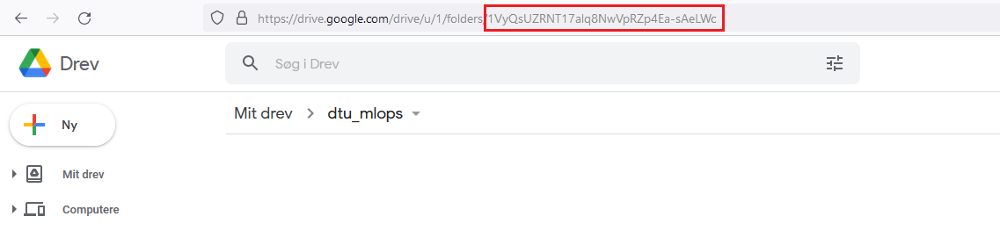

# Data Version Control
{: .no_toc }

<details open markdown="block">
  <summary>
    Table of contents
  </summary>
  {: .text-delta }
1. TOC
{:toc}
</details>

---

{: .important }
> Core module

In this module we are going to return to version control. However, this time we are going to focus on version control
of data. The reason we need to separate between standandard version control and data version control comes down to one
problem: size.

Classic version control was developed to keep track of code files, which all are simple text files. Even a codebase that
contains 1000+ files with million lines of codes can probably be stored in less than a single gigabyte (GB). On the
other hand, the size of data can be drastically bigger. As most machine learning algorithms only gets better with the
more data that you feed them, we are seeing models today that are being trained on petabytes of data (1.000.000 GB).

Because this is a important concept there exist a couple of frameworks that have specialized in versioning data such as
[dvc](https://dvc.org/), [DAGsHub](https://dagshub.com/), [Hub](https://www.activeloop.ai/),
[Modelstore](https://modelstore.readthedocs.io/en/latest/) and [ModelDB](https://github.com/VertaAI/modeldb/). We are
here going to use `dvc` provided by [iterative.ai](https://iterative.ai/) as they also provide tools for automatizing
machine learning, which we are going to focus on later.

## DVC: What is it?

DVC (Data Version Control) is simply an extension of `git` to not only take versioning data but also models and
experiments in general. But how does it deal with these large data files? Essentially, `dvc` will just keep track of a
small *metafile* that will then point to some remote location where you original data is store. *metafiles* essentially
works as placeholders for your datafiles. Your large datafiles are then stored in some remote location such as Google
drive or an `S3` bucket from Amazon.

<p align="center">
  
  <br>
  <a href="https://www.analyticsvidhya.com/blog/2021/06/mlops-versioning-datasets-with-git-dvc/"> Image credit </a>
</p>

As the figure shows, we now have two remote locations: one for code and one for data. We use `git pull/push` for the
code and `dvc pull/push` for the data. The key concept is the connection between the data file `model.pkl` that is
fairly large and its respective *metafile* `model.pkl.dvc` that is very small. The large file is stored in the data
remote and the metafile is stored in code remote.

## Exercises

If in doubt about some of the exercises, we recommend checking out the [documentation for dvc](https://dvc.org/doc) as
it contains excellent tutorials.

1. For these exercises we are going to use [Google drive](https://www.google.com/intl/da/drive/) as remote storage
   solution for our data. If you do not already have a Google account, please create one (we are going to use it again
   in later exercises). Please make sure that you at least have 1GB of free space.

2. Next, install dvc and the Google drive extension

   ```bash
   pip install dvc
   pip install "dvc[gdrive]"
   ```

   If you installed DVC via pip and plan to use cloud services as remote storage, you might need to install these
   optional dependencies: [s3], [azure], [gdrive], [gs], [oss], [ssh]. Alternatively, use [all] to include them all.
   If you encounter that the installation fails, we recommend that you start by updating pip and then trying to
   update `dvc`:

   ```bash
   pip install -U pip
   pip install -U ”dvc[gdrive]”
   ```

   If this does not work for you, it is most likely due to a problem with `pygit2` and in that case we recommend that
   you follow the instructions [here](https://github.com/libgit2/pygit2/blob/master/docs/install.rst#advanced).

3. In your MNIST repository run the following command from the terminal

   ```bash
   dvc init
   ```

   this will setup `dvc` for this repository (similar to how `git init` will initialize a git repository).
   These files should be committed using standard `git` to your repository.

4. Go to your Google drive and create a new folder called `dtu_mlops_data`. Then copy the unique identifier
   belonging to that folder as shown in the figure below

   <p align="center">
     
   </p>

   Using this identifier, add it as a remote storage

   ```bash
   dvc remote add -d storage gdrive://<your_identifier>
   ```

5. Check the content of the file `.dvc/config`. Does it contain a pointer to your remote storage? Afterwards make sure
   to add this file to the next commit we are going to make:

   ```bash
   git add .dvc/config
   ```

6. Call the `dvc add` command on your data files exactly like you would add a file with `git` (you do not need to
   add every file by itself as you can directly add the `data/` folder). Doing this should create a human-readable
   file with the extension `.dvc`. This is the *metafile*  as explained earlier that will serve as a placeholder for
   your data. If you are on Windows and this step fail you may need to install `pywin32`. At the same time the `data/`
   folder should have been added to the `.gitignore` file that marks which files should not be tracked by git. Confirm
   that this is correct.

7. Now we are going to add, commit and tag the *metafiles* so we can restore to this stage later on. Commit and tag
   the files, should look something like this:

   ```bash
   git add data.dvc .gitignore
   git commit -m "First datasets, containing 25000 images"
   git tag -a "v1.0" -m "data v1.0"
   ```

8. Finally, push your data to the remote storage using `dvc push`. You will be asked to authenticate, which involves
   copy-pasting the code in the link prompted. Checkout your Google drive folder. You will see that the data is not
   in a recognizable format anymore due to the way that `dvc` packs and tracks the data. The boring details is that
   `dvc` converts the data into [content-addressable storage](https://en.wikipedia.org/wiki/Content-addressable_storage)
   which makes data much faster to get. Finally, make sure that your data is not stored in your github repository.

9. After completing the above steps, it is very easy for others (or yourself) to get setup with both
   code and data by simply running

   ```bash
   git clone <my_repository>
   dvc pull
   ```

   (assuming that you give them access right to the folder in your drive). Try doing this (in some other location
   than your standard code) to make sure that the two commands indeed downloads both your code and data.

10. Lets look about the process of updating our data. Remember the important aspect of version control is that we do not
    need to store explicit files called `data_v1.pt`, `data_v2.pt` ect. but just have a single `data.pt` that where we
    can always checkout earlier versions. Initially start by copying the data `data/corruptmnist_v2` folder from this
    repository to your MNIST code. This contains 3 extra datafiles with 15000 additional observations. Rerun your data
    pipeline so these gets incorporated into the files in your `processed` folder.

11. Redo the above steps, adding the new data using `dvc`, committing and tagging the metafiles e.g. the following
    commands should be executed (with appropriate input):
    `dvc add -> git add -> git commit -> git tag -> dvc push -> git push`.

12. Lets say that you wanted to go back to the state of your data in v1.0. If the above steps have been done correctly,
    you should be able to do this using:

    ```bash
    git checkout v1.0
    dvc checkout
    ```

    confirm that you have reverted back to the original data.

13. (Optional) Finally, it is important to note that `dvc` is not only intended to be used to store data files but also
    any other large files such as trained model weights (with billion of parameters these can be quite large). For
    example if we always stored out best performing model in a file called `best_model.ckpt` then we can use `dvc` to
    version control it, store it online and make it easy for other to download. Feel free to experiment with this using
    your own model checkpoints.

Thats all for today. With the combined power of `git` and `dvc` we should be able to version control everything in
our development pipeline such that no changes are lost (assuming we commit regularly). It should be noted that `dvc`
offers such more than just data version control, so if you want to deep dive into `dvc` we recommend their
[pipeline](https://dvc.org/doc/user-guide/project-structure/pipelines-files) feature and how this can be used to setup
version controlled [experiments](https://dvc.org/doc/command-reference/exp). Note that we are going to revisit `dvc`
later for a more permanent (and large scale) storage solution.
