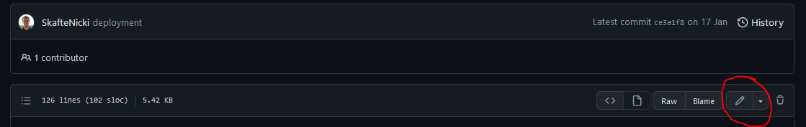

{ align=right width="130"}

# Git

---

!!! info "Core Module"

Proper collaboration with other people will require that you can work on the same codebase in an organized manner.
This is the reason that **version control** exists. Simply stated, it is a way to keep track of:

* Who made changes to the code
* When did the change happen
* What changes were made

For a full explanation, please see this [page](https://git-scm.com/book/en/v2/Getting-Started-What-is-Git%3F).

Secondly, it is important to note that GitHub is not git! GitHub is the dominating player when it comes to
hosting repositories, but that does not mean that they are the only ones providing free repository hosting
(see [bitbucket](https://bitbucket.org/product/) or [gitlab](https://about.gitlab.com/) for some other examples).

That said, we will be using git and GitHub throughout this course. It is a requirement for passing this course that
you create a public repository with your code and use git to upload any code changes. How much you choose to integrate
this into your own projects depends, but you are at least expected to be familiar with git+GitHub.

<figure markdown>
{ width="400" }
<figcaption> <a href="https://xkcd.com/1597/"> Image credit </a> </figcaption>
</figure>

## Initial config

!!! quote "What does Git stand for?"

    The name "git" was given by Linus Torvalds when he wrote the very first version. He described the tool as
    "the stupid content tracker" and the name as (depending on your mood):

    * Random three-letter combination that is pronounceable, and not actually used by any common UNIX command. The fact
        that it is a mispronunciation of "get" may or may not be relevant.
    * Stupid. Contemptible and Despicable. Simple. Take your pick from the dictionary of slang.
    * "Global information tracker": you're in a good mood, and it actually works for you.
        Angels sing, and a light suddenly fills the room.
    * "Goddamn idiotic truckload of sh*t": when it breaks

1. [Install git](https://git-scm.com/book/en/v2/Getting-Started-Installing-Git) on your computer and make sure
    that your installation is working by writing `git help` in a terminal and it should show you the help message for
    git.

2. Create a [GitHub](https://github.com/) account if you do not already have one.

3. To make sure that we do not have to type in our GitHub username every time that we want to make some changes,
    we can once and for all set it on our local machine.

    ```bash
    # type in a terminal
    git config credential.helper store
    git config --global user.email <email>
    ```

## Git overview

The most simple way to think of version control is that it is just nodes with lines connecting them:

<figure markdown>
  {width="1000," }
</figure>

Each node, which we call a *commit*, is uniquely identified by a hash string. Each node stores what our code
looked like at that point in time (when we made the commit) and using the hash codes we can easily
revert to a specific point in time.

The commits are made up of local changes that we make to our code. A basic workflow for
adding commits can be seen below:

<figure markdown>
{width="1000," }
</figure>

Assuming that we have made some changes to our local *working directory* and that we
want to get these updates to be online in the *remote repository* we have to do the following steps:

* First we run the command `git add`. This will move our changes to the *staging area*. While changes are in the
    staging area we can very easily revert them (using `git restore`). There has therefore not been assigned a unique
    hash to the code yet, and so we can still overwrite it.

* To take our code from the *staging area* and make it into a commit, we simply run `git commit` which will locally
    add a node to the graph. Note again that we have not pushed the commit to the online *repository* yet.

* Finally, we want others to be able to use the changes that we made. We do a simple `git push` and our
    commit goes online.

Of course, the real power of version control is the ability to make branches, as in the image below.

<figure markdown>
{ width="1000" }
<figcaption>
<a href="https://dev.to/juanbelieni/creating-an-alias-for-deleting-useless-git-branches-105j"> Image credit </a>
</figcaption>
</figure>

Each branch can contain code that is not present on other branches. This is useful when you are many developers
working together on the same project.

### ❔ Exercises

1. In your GitHub account create a repository, where the intention is that you upload the code from the final
    exercise from yesterday.

    1. After creating the repository, clone it to your computer.

        ```bash
        git clone https://github.com/my_user_name/my_repository_name.git
        ```

    2. Move/copy the three files from yesterday into the repository (and any others that you made).

    3. Add the files to a commit by using the `git add` command.

    4. Commit the files using the `git commit` command where you use the `-m` argument to provide a commit message (1).
        { .annotate }

        1. :man_raising_hand: Writing a good commit message is a skill in and of itself. A commit message should be
            short but informative about the work you are trying to commit. Try to practice writing good commit messages
            throughout the course. You can see
            [this guideline](https://github.com/joelparkerhenderson/git-commit-message) for help.

    5. Finally push the files to your repository using `git push`. Make sure to check online that the files have been
        updated in your repository (1).
        { .annotate }

        1. :man_raising_hand: Be aware that you either need to generate a token to remote push from you local
            [terminal](https://github.com/settings/tokens) or install the
            [GitHub CLI](https://docs.github.com/en/github-cli/github-cli/quickstart).

    6. You can always use the command `git status` to check where you are in the process of making a commit.

    7. Also checkout the `git log` command, which will show you the history of commits that you have made.

2. Make sure that you understand how to make branches, as this will allow you to try out code changes without
    messing with your working code. Creating a new branch can be done using:

    ```bash
    # create a new branch
    git checkout -b <my_branch_name>
    ```

    Afterwards, you can use `git checkout` (1) to change between branches (remember to commit your work!).
    Try adding something (a file, a new line of code, etc.) to the newly created branch, commit it and
    try changing back to main afterwards. You should hopefully see whatever you added on the branch
    is not present on the main branch.
    { .annotate}

    1. :man_raising_hand: The `git checkout` command is used for a lot of different things in git. It can be used to
        change branches, to revert changes and to create new branches. An alternative is using `git switch` and
        `git restore` which are more modern commands.

3. If you do not already have a cloned version of the repository belonging to the course, make sure to make one!
    I am continuously updating/changing some of the material during the course and I therefore recommend that you
    each day before the lecture do a `git pull` on your local copy.

4. Git may seem like a waste of time when solutions like Dropbox, Google Drive, etc. exist, and it is
    not completely untrue when you are only one or two working on a project. However, these file management
    systems fall short when hundreds to thousands of people work together. For this exercise you will
    go through the steps of sending an open-source contribution:

    1. Go online and find a project you do not own, where you can improve the code. You can either look at this
        [page](https://goodfirstissue.dev/) of good issues to get started with or for simplicity you can just choose
        [the repository belonging to the course](https://github.com/SkafteNicki/dtu_mlops). Now fork the project by
        clicking the *fork* button.

        

        This will create a local copy of the repository which you have complete writing access to. Note that
        code updates to the original repository do not update code in your local repository.

    2. Clone your local fork of the project using `git clone`.

    3. As default your local repository will be on the `main branch` (HINT: you can check this with the
        `git status` command). It is good practice to make a new branch when working on some changes. Use
        the `git branch` command followed by the `git checkout` command to create a new branch.

    4. You are now ready to make changes to the repository. Try to find something to improve (any spelling mistakes?).
        When you have made the changes, do the standard git cycle: `add -> commit -> push`.

    5. Go online to the original repository and go to the `Pull requests` tab. Find the `compare` button and
        choose the button to compare the `master branch` of the original repo with the branch that you just created
        in your own repository. Check the diff on the page to make sure that it contains the changes you have made.

    6. Write a bit about the changes you have made and click `Create pull request` :).

5. Forking a repository has the consequence that your fork and the repository that you forked can diverge. To
    mitigate this we can set what is called a *remote upstream*. Take a look at this
    [page](https://docs.github.com/en/pull-requests/collaborating-with-pull-requests/working-with-forks/configuring-a-remote-repository-for-a-fork)
    , and set a remote upstream for the repository you just forked.

    ??? success "Solution"

        ```bash
        git remote add upstream <url-to-original-repo>
        ```

6. After setting the upstream branch, we need to pull and merge any updates. Take a look at this
    [page](https://docs.github.com/en/pull-requests/collaborating-with-pull-requests/working-with-forks/syncing-a-fork)
    and figure out how to do this.

    ??? success "Solution"

        ```bash
        git fetch upstream
        git checkout main
        git merge upstream/main
        ```

7. As a final exercise we want to simulate a *merge conflict*, which happens when two users try to commit changes
    to exactly the same lines of code in the codebase, and git is not able to resolve how the different commits should be
    integrated.

    1. In your browser, open your favorite repository (it could be the one you just worked on), go to any file of
        your choosing and click the edit button (see image below) and make some change to the file. For example, if
        you choose a Python file you can just import some random packages at the top of the file. Commit the change.

        <figure markdown>
        { width="1000" }
        </figure>

    2. Make sure not to pull the change you just made to your local computer. Locally make changes to the same
        file in the same lines and commit them afterwards.

    3. Now try to `git pull` the online changes. What should (hopefully) happen is that git will tell you that it found
        a merge conflict that needs to be resolved. Open the file and you should see something like this

        ```txt
        <<<<<<< HEAD
        this is some content to mess with
        content to append
        =======
        totally different content to merge later
        >>>>>>> master
        ```

        this should be interpreted as: everything that's between `<<<<<<<` and `=======` are the changes made by your
        local commit and everything between `=======` and `>>>>>>>` are the changes you are trying to pull. To fix
        the merge conflict you simply have to make the code in the two "cells" work together. When you are done,
        remove the identifiers `<<<<<<<`, `=======` and `>>>>>>>`.

        !!! note "Merge, rebase or fast-forward?"

            On a `git pull` you can get messages like this the first time you try to pull after a merge conflict:

            ```txt
            hint: You have divergent branches and need to specify how to reconcile them.
            hint: You can do so by running one of the following commands sometime before
            hint: your next pull:
            hint:
            hint:   git config pull.rebase false  # merge
            hint:   git config pull.rebase true   # rebase
            hint:   git config pull.ff only       # fast-forward only
            hint:
            hint: You can replace "git config" with "git config --global" to set a default
            hint: preference for all repositories. You can also pass --rebase, --no-rebase,
            hint: or --ff-only on the command line to override the configured default per
            hint: invocation.
            ```

            In general we recommend setting `git config pull.rebase false` to merge the changes. This is the default
            behavior of git and is the most common way to resolve merge conflicts. However, if you are working on a
            project with many people and you want to keep the commit history clean, you can use
            `git config pull.rebase true` to rebase the changes. This will make it look like you made the changes
            directly on top of the latest commit. The last option `git config pull.ff only` will only allow you to
            pull changes that can be fast-forwarded. This is the most strict option and will not allow you to pull
            changes that have been made to the same lines of code as you have made changes to.

    4. Finally, commit the merge and try to push.

8. (Optional) The above exercises have focused on how to use git from the terminal, which I highly recommend learning.
    However, if you are using a proper editor they also have built-in support for version control. We recommend getting
    familiar with these features (here is a tutorial for
    [VS Code](https://code.visualstudio.com/docs/editor/versioncontrol)).

## 🧠 Knowledge check

1. How do you know if a certain directory is a git repository?

    ??? success "Solution"

        You can check if there is a ".git" directory. Alternatively you can use the `git status` command.

2. Explain what the file `gitignore` is used for?

    ??? success "Solution"

        The file `gitignore` is used to tell git which files to ignore when doing a `git add .` command. This is
        useful for files that are not part of the codebase, but are needed for the code to run (e.g. data files)
        or files that contain sensitive information (e.g. `.env` files that contain API keys and passwords).

3. You have two branches - *main* and *devel*. What sequence of commands would you need to execute to make sure that
    *devel* is in sync with *main*?

    ??? success "Solution"

        ```bash
        git checkout main
        git pull
        git checkout devel
        git merge main
        ```

4. What best practices are you familiar with regarding version control?

    ??? success "Solution"

        * Use a descriptive commit message
        * Make each commit a logical unit
        * Incorporate others' changes frequently
        * Share your changes frequently
        * Coordinate with your co-workers
        * Don't commit generated files

That covers the basics of git to get you started. In the exercise folder you can find a
[git cheat sheet](https://github.com/SkafteNicki/dtu_mlops/tree/main/s2_organisation_and_version_control/exercise_files/git_cheat_sheet.pdf)
with the most useful commands for future reference. Finally, we want to point out another awesome feature of GitHub:
in-browser editor. Sometimes you have a small edit that you want to make, but still would like to do this in an
IDE/editor. Or you may be in the situation where you are working from a device other than your usual developer machine.
GitHub has a built-in editor that can simply be enabled by changing any URL from

```bash
https://github.com/username/repository
```

to

```bash
https://github.dev/username/repository
```

Try it out on your newly created repository.
