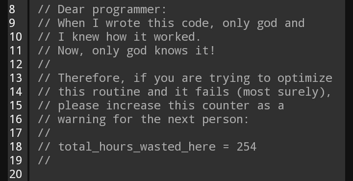

{ align=right width="130"}

# Good coding practice

---

!!! quote
    *Code is read more often than it is written.* <br> <br>
    Guido Van Rossum (author of Python)

It is hard to define exactly what good coding practises are. But the above quote by Guido does hint at what it could be,
namely that it has to do with how others observe and persive your code. In general, good coding practice is about making
sure that you code is easy to read and understand, not only by others but also by your future self. The key concept to
keep in mind with we are talking about good coding practice is *consistency*. In many cases it does not matter exactly
how you choose to style your code etc., the important part is that you are consistent about it.

<figure markdown>
{ width="500" }
<figcaption>
<a href="https://www.reddit.com/r/ProgrammerHumor/comments/8pdebc/only_god_and_i_knew/"> Image credit </a>
</figcaption>
</figure>

## Documentation

Most programmers have a love-hate relationship with documentation: We absolute hate writing it ourself, but love
when someone else has actually taken time to add it to their code. There is no doubt about that well documented
code is much easier to maintain, as you do not need to remember all details about the code to still maintain it.
It is key to remember that good documentation saves more time, than it takes to write.

The problem with documentation is that there is no right or wrong way to do it. You can end up doing:

* Under documentation: You document information that is clearly visible from the code and not the complex
    parts that are actually hard to understand.

* Over documentation: Writing too much documentation will have the opposite effect on most people than
    what you want: there is too much to read, so people will skip it.

Writing good documentation is a skill that takes time to train, so lets try to do it.

!!! quote
    *Code tells you how; Comments tell you why.* <br> <br>
    Jeff Atwood

### ❔ Exercises

1. Go over the most complicated file in your project. Be critical and add comments where the logic
    behind the code is not easily understandable. (1)
    { .annotate }

    1. :man_raising_hand: In deep learning we often work with multi-dimensional tensors that constantly changes shape
        after each operation. It is good practise to annotate with comments when tensors undergoes some reshaping.
        In the following example we compute the pairwise euclidean distance between two tensors using broadcasting
        which results in multiple shape operations.

        ```python
        x = torch.randn(5, 10)  # N x D
        y = torch.randn(7, 10)  # M x D
        xy = x.unsqueeze(1) - y.unsqueeze(0)  # (N x 1 x D) - (1 x M x D) = (N x M x D)
        pairwise_euc_dist = xy.abs().pow(2.0).sum(dim=-1)  # N x M
        ```

2. Add [docstrings](https://www.python.org/dev/peps/pep-0257/) to at least two Python function/methods.
    You can see [here (example 5)](https://www.programiz.com/python-programming/docstrings) a good example
    how to use identifiable keywords such as `Parameters`, `Args`, `Returns` which standardizes the way of
    writing docstrings.

## Styling

While Python already enforces some styling (e.g. code should be indented in a specific way), this is not enough
to secure that code from different users actually look like each other. Maybe even more troubling is that you
will often see that your own style of coding changes as you become more and more experienced. This kind of
difference in coding style is not that important to take care of when you are working on a personal project,
but when working multiple people together on the same project it is important to consider.

The question then remains what styling you should use. This is where [Pep8](https://www.python.org/dev/peps/pep-0008/)
comes into play, which is the  official style guide for python. It is essentially contains what is considered
"good practice" and "bad practice" when coding python.

The many years the most commonly used tool to check if you code is PEP8 compliant is to use
[flake8](https://flake8.pycqa.org/en/latest/). However, we are in this course going to be using
[ruff](https://github.com/astral-sh/ruff) that are quickly gaining popularity due to how fast it is and how quickly the
developers are adding new features. (1)
{ .annotate }

1. :man_raising_hand: both `flake8` and `ruff` is what is called a
    [linter or lint tool](https://en.wikipedia.org/wiki/Lint_(software)), which is any kind of static code analyze
    program that is used to flag programming errors, bugs, and styling errors.

### ❔ Exercises

1. Install `ruff`

    ```bash
    pip install ruff
    ```

2. Run `ruff` on your project or part of your project

    ```bash
    ruff check .  # Lint all files in the current directory (and any subdirectories)
    ruff check path/to/code/  # Lint all files in `/path/to/code` (and any subdirectories).
    ```

    are you PEP8 compliant or are you a normal mortal?

You could go and fix all the small errors that `ruff` is giving. However, in practice large projects instead relies
on some kind of code formatter, that will automatically format your code for you to be PEP8 compliant. Some of the
biggest formatters for the longest time in Python have been [black](https://github.com/psf/black) and
[yapf](https://github.com/google/yapf), but we are going to use `ruff` which also have a build in formatter that should
be a drop-in replacement for `black`.

1. Try to use `ruff format` to format your code

    ```bash
    ruff format .  # Format all files in the current directory.
    ruff format /path/to/file.py  # Format a single file.
    ```

By default `ruff` will apply a selection of rules when we are either checking it or formatting it. However, many more
rules can be activated through [configuration](https://docs.astral.sh/ruff/configuration/).  If you have completed
module [M6 on code structure](code_structure.md) you will have encountered the `pyproject.toml` file, which can store
both build instructions about our package but also configuration of developer tools. Lets try to configure `ruff` using
the `pyproject.toml` file.

1. One aspect that is not covered by PEP8 is how `import` statements in Python should be organized. If you are like
    most people, you place your `import` statements at the top of the file and they are ordered simply by when you
    needed them. A better practice is to introduce some clear structure in our imports. In older versions of this course
    we have used [isort](https://github.com/PyCQA/isort) to do the job, but we are here going to configure `ruff` to do
    the job. In your `pyproject.toml` file add the following lines

    ```toml
    [tool.ruff]
    select = ["I"]
    ```

    and try re-running `ruff check` and `ruff format`. Hopefully this should reorganize your imports to follow common
    practice. (1)
    { .annotate }

    1. :man_raising_hand: the common practise is to first list built-in Python packages (like `os`) in one block,
        followed by third-party dependencies (like `torch`) in a second block and finally imports from your own package
        in a third block. Each block is then put in alphabetical order.

2. One PEP8 styling rule that is often diverged from is the recommended line length of 79 characters, which by many
    (including myself) is considered very restrictive. If you code consist of multiple levels of indentation, you can
    quickly run into 79 characters being limiting. For this reason many projects increase it, often to 120 characters
    which seems to be the sweet spot of how many characters fits in a coding window on a laptop.
    Add the line

    ```toml
    line-length=120
    ```

    under the `[tool.ruff]` section in the `pyproject.toml` file and rerun `ruff check` and `ruff format` on your code.

3. Experiment yourself with further configuration of `ruff`. In particular we recommend adding more
    [rules](https://docs.astral.sh/ruff/rules/) and looking `[tool.ruff.pydocstyle]` configuration to indicate how you
    have styled your documentation.

## Typing

In addition to writing documentation and following a specific styling, in Python we have a third way of improving the
quality of our code: [through typing](https://docs.python.org/3/library/typing.html). Typing goes back to the earlier
programming languages like `c`, `c++` etc. where [data types](https://www.scaler.com/topics/cpp/data-types-in-cpp/)
needed to be explicit stated for variables:

```cpp
int main() {
    int x = 5 + 6;
    float y = 0.5;
    cout << "Hello World! " << x << std::endl();
}
```

This is not required by Python but it can really improve the readability of code, that you can directly read from the
code what the expected types of input arguments and returns are. In Python the `:` character have been reserved for
type hints. Here is one example of adding typing to a function:

```python
def add2(x: int, y: int) -> int:
    return x+y
```

here we mark that both `x` and `y` are integers and using the arrow notation `->` we mark that the output type is also
an integer. Assuming that we are also going to use the function for floats and `torch.Tensor`s we could improve the
typing by specifying a *union* of types. Depending on the version of Python you are using the syntax for this can be
different.

<!-- markdownlint-disable -->

=== "python <3.10"

    ```python
    from torch import Tensor  # note it is Tensor with upper case T. This is the base class of all tensors
    from typing import Union
    def add2(x: Union[int, float, Tensor], y: Union[int, float, Tensor]) -> Union[int, float, Tensor]:
        return x+y
    ```

=== "python >=3.10"

    ```python
    from torch import Tensor  # note it is Tensor with upper case T. This is the base class of all tensors
    def add2(x: int | float | Tensor, y: int | float | Tensor) -> int | float | Tensor:
        return x+y
    ```

<!-- markdownlint-restore -->

Finally, since this is a very generic function it also works on `numpy` arrays etc. we can always default to the `Any`
type if we are not sure about all the specific types that a function can take

```python
from typing import Any
def add2(x: Any, y: Any) -> Any:
    return x+y
```

However, in this case we basically is in the same case as if our function were not typed, as the type hints does not
help us at all. Therefore, use `Any` only when necessary.

### ❔ Exercises

<!-- markdownlint-disable -->
[Exercise files](https://github.com/SkafteNicki/dtu_mlops/tree/main/s2_organisation_and_version_control/exercise_files){ .md-button }
<!-- markdownlint-restore -->

1. We provide a file called `typing_exercise.py`. Add typing everywhere in the file. Please note that you will
    need the following import:

    ```python
    from typing import Callable, Optional, Tuple, Union, List  # you will need all of them in your code
    ```

    for it to work. This [cheat sheet](https://mypy.readthedocs.io/en/stable/cheat_sheet_py3.html) is a good resource on
    typing. We also provide `typing_exercise_solution.py`, but try to solve the exercise yourself.

    ??? example "`typing_exercise.py`"

        ```python linenums="1" title="typing_exercise.py"
        --8<-- "s2_organisation_and_version_control/exercise_files/typing_exercise.py"
        ```

    ??? success "Solution"

        ```python linenums="1" title="typing_exercise_solution.py"
        --8<-- "s2_organisation_and_version_control/exercise_files/typing_exercise_solution.py"
        ```

2. [mypy](https://mypy.readthedocs.io/en/stable/index.html) is what is called a static type checker. If you are using
    typing in your code, then a static type checker can help you find common mistakes. `mypy` does not run your code,
    but it scans it and checks that the types you have given are compatible. Install `mypy`

    ```bash
    pip install mypy
    ```

3. Try to run `mypy` on the `typing.py` file

    ```bash
    mypy typing_exercise.py
    ```

    If you have solved exercise 11 correctly then you should get no errors. If not `mypy` should tell you where your
    types are incompatible.

## 🧠 Knowledge check

1. According to PEP8 what is wrong with the following code?

    ```python
    class myclass(nn.Module):
        def TrainNetwork(self, X, y):
            ...
    ```

    ??? success "Solution"

        According to PEP8 classes should follow the CapWords convention, meaning that the first letter in each word of
        the class name should be capitalized. Thus `myclass` should therefore be `MyClass`. On the other hand, functions
        and methods should be full lowercase with words separated by underscore. Thus `TrainNetwork` should be
        `train_network`.

2. What would be the of argument `x` for a function `def f(x):` if it should support the following input

    ```python
    x1 = [1, 2, 3, 4]
    x2 = (1, 2, 3, 4)
    x3 = None
    x4 = {1: "1", 2: "2", 3: "3", 4: "4"}
    ```

    ??? success "Solution"

        The easy solution would be to do `def f(x : Any)`. But instead we could also go with:

        ```python
        def f(x: None | Tuple[int, ...] | List[int] | Dict[int, str]):
        ```

        alternatively, we could also do

        ```python
        def f(x: None | Iterable[int]):
        ```

        because both `list`, `tuple` and `dict` are iterables and therefore can be covered by one type
        (in this specific case).

This ends the module on coding style. We again want to emphazize that a good coding style is more about having a
consistent style than strictly following PEP8. A good example of this is Google, that have their own
[style guide for Python](https://google.github.io/styleguide/pyguide.html). This guide does not match PEP8 exactly, but
it makes sure that different teams within google that are working on different projects are still to a large degree
following the same style and therefore if a project is handed from one team to another then at least that will not be a
problem.
