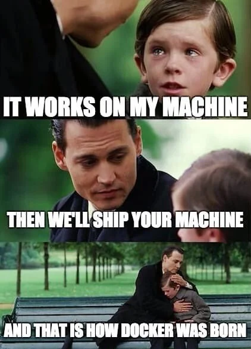
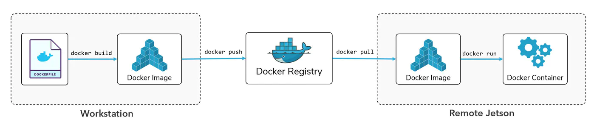

# Docker
{: .no_toc }

<details open markdown="block">
  <summary>
    Table of contents
  </summary>
  {: .text-delta }
1. TOC
{:toc}
</details>

---

<p align="center">
  
</p>

While the above picture may seem silly at first, it is actually pretty close to how [docker](https://www.docker.com/) came to existence. A big part of creating a MLOps pipeline, is that you are able to **reproduce** it. Reproducibility goes beyond versioning our code with `git` and using `conda` enviroment to keep track of our python installations. To really get reproducibility we need to also capture also system level components like

* operating system
* software dependencies (other than python packages)

Docker provides this kind of system-level reproducibility by creating isolated programs dependencies. In addition to docker providing reproduceability, one of the key features are also scaleability which is important when we later on are going to discuss deployment. Because docker is system-level reproduceable, it does not (conceptually) matter if we try to start our program on a single machine or a 1000 machines at once.

## Docker overview

Docker has three main concepts: **docker file**, **docker image** and **docker container**:

<p align="center">
  
</p>

* A **docker file** is a basic text document that contains all the commands a user could call on the commandline to run an application. This includes installing dependencies, pulling data from online storage, setting up code and what commands that you want to run (e.g. `python train.py`)

* Running, or more correctly *building* a docker file will create a **docker image**. An image is a lightweight, standalone/containerized, executable package of software that includes everything (appBülowsvej 17lication code, libraries, tools, dependencies etc.) necessary to make an application run. 

* Actually *running* an image will create a **docker container**. This means that the same image can be launched multiple times, creating multiple containers.

The exercises today will focus on how to construct the actual docker file, as this is the first step to constructing your own container.

## Docker sharing
The hole point of using docker is that sharing applications becomes much easier. In general, we have two options

* After creating the `Dockerfile` we can simply commit it to github (its just a text file) and then ask other users
to simple build the image themself.

* After building the image ourself, we can choose to upload it to a *image registry* such as [Docker Hub](https://hub.docker.com/)
where other can get our image by simply running `docker pull`, making them able to instantinius running it as a container, as shown in the figure below

 <p align="center">
   
 </p>


## Exercises

In the following exercises we guide you how to build a docker file for your mnist reposatory that will make the training and prediction a self contained application. Please make sure that you somewhat understand each step and do not just copy of the exercise. Also note that you probably need to execute the exercise from a elevated terminal e.g. with 
administrative privilege.

The exercises today are only an introduction to docker and some of the steps are going to be unoptimized from a production setting view. For example we often want to keep the size of docker image as small as possible, which we are not focusing on for these exercises.

If you are using `VScode` then we recommend install the [docker VCcode extension](https://code.visualstudio.com/docs/containers/overview) for easy getting an overview of which images have been build and which are running. Additionally the extension named *Remote - Containers* may also be beneficial for you to download.

1. Start by [installing docker](https://docs.docker.com/get-docker/). How much trouble that you need to go through depends on your operating system. Windows users that have not installed WSL yet are going to have to do it now.

2. After installing docker we will begin to construct a docker file for our MNIST project. Create a file called `trainer.dockerfile`. Then intention is that we want to develop one dockerfile for running our training script and one for doing predictions.

3. Instead of starting from scratch we nearly always want to start from some base image. For this exercise we are going to start from a simple `python` image. Add the following to your `Dockerfile`
   ```docker
   # Base image
   FROM python:3.7-slim
   ```

4. Next we are going to install some essentials in our image. The essentials more or less consist of a python installation. These instructions may seem familiar if you are using linux:
   ```docker
   # install python 
   RUN apt update && \
       apt install --no-install-recommends -y build-essential gcc && \
       apt clean && rm -rf /var/lib/apt/lists/*
   ```

5. The privious two steps are common for any docker application where you want to run python. All the remaining steps are application specific (to some degree):

   1. Lets copy over our application (the essential parts) from our computer to the container:
      ```docker
      COPY requirements.txt requirements.txt
      COPY setup.py setup.py
      COPY src/ src/
      COPY data/ data/
      ```
      Remember that we only want the essential parts to keep our docker image as small as possible. Why do we need each of these files/folders to run training in our docker container?

   2. Lets set the working directory in our container and add commands that install the dependencies:
      ```docker
      WORKDIR /
      RUN pip install -r requirements.txt --no-cache-dir
      ```
      the `--no-cache-dir` is quite important. Can you explain what it does and why it is important in relation to docker.

   3. Finally, we are going to name our training script as the *entrypoint* for our docker image. The *entrypoint* is the application that we want to run when the image is being executed:
      ```docker
      ENTRYPOINT ["python", "-u", "src/models/train_model.py"]
      ```
      the `"u"` here makes sure that any output from our script e.g. any `print(...)` statements gets redirected to out consol. If not included you would need to use `docker logs` to inspect your run.

6. We are now ready to building our docker file into a docker image
   ```bash
   docker build -f train.dockerfile . -t trainer:latest
   ```
   please note here we are providing two extra arguments to `docker build`. The `-f train.dockerfile .` (the dot is important to remember) indicates which dockerfile that we want to run (except if you named it just `Dockerfile`) and the `-t trainer:latest` is the respective name and tag that we se afterwards when running `docker images` (see image below). Please note that building a docker image can take a couple of minutes.

 <p align="center">
   
 </p>

7. Try running `docker images` and confirm that you get output similar to the one above. If you succeeds with this, then try running the image
   docker image
   ```bash
   docker run --name experiment1 trainer:latest
   ```
   you should hopefully see your training starting. Please note that we can start as many containers that we want at the same time by giving them all different names using the `--name` tag.

8. While running (or after) your container try out this command in another terminal
   ```bash
   docker ps -a  # note, same as "docker container ls -a"
   ```
   what is the command showing?

9. When your training has completed you will notice that any files that is created when running your training script is not present on your laptop (for example if your script is saving the trained model to file). This is because the files were created inside your container (which is its own little machine). To get the files you have two options:

   1. If you already have a completed run then you can use
      ```bash
      docker cp
      ```
      to copy the files between your container and laptop. For example to copy a file called `trained_model.pt` from a folder you would do:
      ```bash
      docker cp {container_name}:{dir_path}/{file_name} {local_dir_path}/{local_file_name}
      ```
      Try this out.

   2. A much more efficient strategy is to mount a volume that is shared between the host (your laptop) and the container. This can be done with the `-v` option for the `docker run` command. For example, if we want to automatically get the `trained_model.pt` file after running our training script we could simply execute the container as
      ```bash
      docker run --name {container_name} -v %cd%/models:/models/ trainer:lates
      ```
      this command mounts our local `models` folder as a corresponding `models` folder in the container. Any file save by the container to this folder will be synchronized back to our host machine. Try this out! 
      Note if you have multiple files/folders that you want to mount (if in doubt about file organization in the container try to do the next exercise first). Also note that the `%cd%` need to change depending on your OS, see this [page](https://stackoverflow.com/questions/41485217/mount-current-directory-as-a-volume-in-docker-on-windows-10) for help.

10. If you ever are in doubt how files are organized inside a docker image you always have the option to start the image in interactive mode:
    ```bash
    docker run -it --entrypoint sh {container_name}:{container_tag}
    ```
    try this out!

11. With training done we also need to write an application for prediction. Create a new docker image called `predict.dockerfile`. This file should call your `src/models/predict_model.py` script instead. This image will need some trained model weights to work. Feel free to either includes these during the build process or mount them afterwards. When you When you created the file try to `build` and `run` it to confirm that it works. Hint: if you are passing in the model checkpoint and prediction data as arguments to your script, your `docker run` probably need to look something like
```bash
docker run --name predict --rm \
  -v %cd%/trained_model.pt:/models/trained_model.pt \  # mount trained model file
  -v %cd%/data/example_images.npy:/example_images.npy \  # mount data we want to predict on
  predict:latest \
  ../../models/trained_model.pt \  # argument to script, path relative to script location in container
  ../../example_images.npy
```

12. By default a virtual machine created by docker only have access to your `cpu` and not your `gpu`. While you do not necessarily have a laptop with a GPU that supports training of neural network (e.g. one from Nvidia) it is beneficial that you understand how to construct a docker image that can take advantage of a GPU if you were to run this on a machine in the future that have a GPU (e.g. in the cloud). Luckily for us there is someone else that have already done the hard part and shared their work through [Docker hub](https://hub.docker.com/).

  1. Go to Docker hub and find the hub page belonging to this person: `anibali`. It both contains base images with and without CUDA support.

  2. Next pull a relevant image. The relevant command is
     ```bash
     docker pull anibali/pytorch:{version}-{cuda}
     ```
     where `{version}` refers to the version of pytorch that you want and `{cuda}` is the specific cuda version you want. Some examples
     ```bash
     docker pull anibali/pytorch:1.8.1-cuda11.1  # pytorch 1.8.1 with cuda 11.1
     docker pull anibali/pytorch:1.10.0-nocuda  # pytorch 1.10.0 with no cuda support
     docker pull anibali/pytorch  # get the latest version of pytorch with 
     ```

  3. Lets say that we just wanted to execute an simple `Pytorch` application. Then we can use these base images directly
     ```bash
      docker run --rm -it --init \
        --gpus=all \  # only if cuda version
        --ipc=host \  # only if using multiprocessing
        --user="$(id -u):$(id -g)" \  # optional, useful for writing files with correct ownership
        --volume="$PWD:/app" \  # optional, mount additional files
        {pulled_docker_image_name} python3 main.py
     ```
     try executing the `pytorch_docker.py` file from this sessions exercise folder with the pulled docker image.
     This script should only exit successfully if the image indeed contains an Pytorch installation.
  
  4. Finally, we can also use these Pytorch images for building our own images. We simply need to change the first
     line in our docker files from
     ```docker
     FROM python:3.7-slim
     ```
     to
     ```docker
     FROM anibali/pytorch:1.8.1-cuda11.1-ubuntu20.04  # or whatever image you want to use
     ```
     Try building a new image doing this. Make sure that you do not end up downloading Pytorch again when installing
     the requirements during the build process.

The covers the absolute minimum you should know about docker to get a working image and container. That said, if you are actively going to be using docker in the near future, one thing to consider is the image size. Even these simple images that we have build still takes up GB in size. A number of optimizations steps can be taken to reduce the image size for you or your end user.
