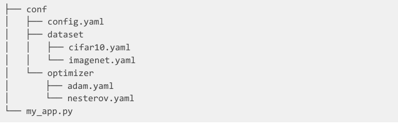

{ align=right width="130"}

# Config files

---

With docker we can make sure that our compute environment is reproducible, but that does not mean that all our
experiments magically become reproducible. There are other factors that are important for creating reproducible
experiments.

In [this paper](https://arxiv.org/abs/1909.06674) (highly recommended read) the authors tried to reproduce the results
of 255 papers and tried to figure out which factors were significant to succeed. One of those factors was
"Hyperparameters Specified" e.g. whether or not the authors of the paper had precisely specified the hyperparameters that
were used to run the experiments. It should come as no surprise that this can be a determining factor for
reproducibility. However it is not a given that hyperparameters are always well specified.

## Configure experiments

There is really no way around it: deep learning contains *a lot* of hyperparameters. In general, a *hyperparameter* is
any parameter that affects the learning process (e.g. the weights of a neural network are not hyperparameters because
they are a consequence of the learning process). The problem with having many hyperparameters to control in your code
is that if you are not careful and structure them it may be hard after running an experiment to figure out which
hyperparameters were actually used. Lack of proper configuration management can cause serious problems with reliability,
uptime, and the ability to scale a system.

One of the most basic ways of structuring hyperparameters is just to put them directly into your `train.py` script in
some object:

```python
class my_hp:
    batch_size: 64
    lr: 128
    other_hp: 12345

# easy access to them
dl = DataLoader(Dataset, batch_size=my_hp.batch_size)
```

the problem here is configuration is not easy. Each time you want to run a new experiment, you basically have to
change the script. If you run the code multiple times without committing the changes in between then the exact
hyperparameter configuration for some experiments may be lost. Alright, with this in mind you change strategy to use
an [argument parser](https://docs.python.org/3/library/argparse.html) e.g. run experiments like this:

=== "Using pip"

    ```bash
    python train.py --batch_size 256 --learning_rate 1e-4 --other_hp 12345
    ```

=== "Using uv"

    ```bash
    uv run train.py --batch_size 256 --learning_rate 1e-4 --other_hp 12345
    ```

This at least solves the problem with configurability. However, we again can end up losing experiments if we are
not careful.

What we really want is some way to easily configure our experiments where the hyperparameters are systematically saved
with the experiment. For this we turn our attention to [Hydra](https://hydra.cc/), a configuration tool that is based
around writing config files to keep track of hyperparameters. Hydra operates on top of
[OmegaConf](https://github.com/omry/omegaconf) which is a `yaml` based hierarchical configuration system.

A simple `yaml` configuration file could look like

```yaml
#config.yaml
hyperparameters:
  batch_size: 64
  learning_rate: 1e-4
```

with the corresponding Python code for loading the file

```python
from omegaconf import OmegaConf
# loading
config = OmegaConf.load('config.yaml')

# accessing in two different ways
dl = DataLoader(dataset, batch_size=config.hyperparameters.batch_size)
optimizer = torch.optim.Adam(model.parameters(), lr=config['hyperparameters']['learning_rate'])
```

or using `hydra` for loading the configuration

```python
import hydra

@hydra.main(config_name="config.yaml")
def main(cfg):
    print(cfg.hyperparameters.batch_size, cfg.hyperparameters.learning_rate)

if __name__ == "__main__":
    main()
```

The idea behind refactoring our hyperparameters into `.yaml` files is that we disentangle the model configuration from
the model. In this way it is easier to do version control of the configuration because we have it in a separate file.

### ❔ Exercises

[Exercise files](https://github.com/SkafteNicki/dtu_mlops/tree/main/s3_reproducibility/exercise_files){ .md-button }

The main idea behind the exercises is to take a single script (that we provide) and use Hydra to make sure that
everything gets correctly logged such that you would be able to exactly report to others how each experiment was
configured. In the provided script, the hyperparameters are hardcoded into the code and your job will be to separate
them out into a configuration file.

Note that we provide a solution (in the `vae_solution` folder) that can help you get through the exercise, but try to
look online for your answers before looking at the solution. Remember: it's not about the result; it's about the journey.

1. Start by installing hydra.

    === "Using pip"

        ```bash
        pip install hydra-core
        ```

    === "Using uv"

        ```bash
        uv add hydra-core
        ```

    Remember to add it to your `requirements.txt` file.

2. Next, take a look at the `vae_mnist.py` and `model.py` files and understand what is going on. It is a model we will
    revisit during the course.

3. Identify the key hyperparameters of the script. Some of them should be easy to find, but at least three have made it
    into the core part of the code. One essential hyperparameter is also not included in the script but is needed for
    the code to be completely reproducible (HINT: the weights of any neural network are initialized at random).

    ??? success "Solution"

        From the top of the file `batch_size`, `x_dim`, `hidden_dim` can be found as hyperparameters. Looking through
        the code it can be seen that the `latent_dim` of the encoder and decoder, `lr` for the optimizer, and `epochs` in
        the training loop are also hyperparameters. Finally, the `seed` is not included in the script but is needed to
        make the script fully reproducible, e.g. `torch.manual_seed(seed)`.

4. Write a configuration file `config.yaml` where you write down the hyperparameters that you have found.

5. Get the script running by loading the configuration file inside your script (using hydra) that incorporates the
    hyperparameters into the script. Note: you should only edit the `vae_mnist.py` file and not the `model.py` file.

6. Run the script.

7. By default hydra will write the results to an `outputs` folder, with a sub-folder for the day the experiment was
    run and further the time it was started. Inspect your run by going over each file that hydra has generated and
    check that the information has been logged. Can you find the hyperparameters?

8. Hydra also allows for dynamically changing and adding parameters on the fly from the command-line:

    1. Try changing one parameter from the command-line.

        === "Using pip"
            ```bash
            python vae_mnist.py hyperparameters.seed=1234
            ```

        === "Using uv"
            ```bash
            uv run vae_mnist.py hyperparameters.seed=1234
            ```

    2. Try adding one parameter from the command-line.

        === "Using pip"
            ```bash
            python vae_mnist.py +experiment.stuff_that_i_want_to_add=42
            ```

        === "Using uv"
            ```bash
            uv run vae_mnist.py +experiment.stuff_that_i_want_to_add=42
            ```

9. By default the file `vae_mnist.log` should be empty, meaning that whatever you printed to the terminal did not get
    picked up by Hydra. This is due to Hydra under the hood making use of the native python
    [logging](https://docs.python.org/3/library/logging.html) package. This means that to also save all printed output
    from the script we need to convert all calls to `print` with `log.info`

    1. Create a logger in the script.

        ```python
        import logging
        log = logging.getLogger(__name__)
        ```

    2. Replace all calls to `print` with calls to `log.info`.

    3. Try re-running the script and make sure that the output printed to the terminal also gets saved to the
        `vae_mnist.log` file.

10. Make sure that your script is fully reproducible. To check this you will need two runs of the script to compare.
    Then run the `reproducibility_tester.py` script as

    === "Using pip"
        ```bash
        python reproducibility_tester.py path/to/run/1 path/to/run/2
        ```

    === "Using uv"
        ```bash
        uv run reproducibility_tester.py path/to/run/1 path/to/run/2
        ```

    the script will go over trained weights to see if they match and that the hyperparameters are the same.
    Note: for the script to work, the weights should be saved to a file called `trained_model.pt` (this is the default
    of the `vae_mnist.py` script, so only relevant if you have changed the saving of the weights).

11. Make a new experiment using a new configuration file where you have changed a hyperparameter of your own
    choice. You are not allowed to change the configuration file in the script but should instead be able to provide it
    as an argument when launching the script e.g. something like

    ```bash
    python vae_mnist.py experiment=exp2
    ```

    We recommend that you use a file structure like this

    ```bash
    |--conf
    |  |--config.yaml
    |  |--experiments
    |     |--exp1.yaml
    |     |--exp2.yaml
    |--my_app.py
    ```

12. Finally, an awesome feature of hydra is the
    [instantiate](https://hydra.cc/docs/advanced/instantiate_objects/overview/) feature. This allows you to define a
    configuration file that can be used to directly instantiate objects in python. Try to create a configuration file
    that can be used to instantiate the `Adam` optimizer in the `vae_mnist.py` script.

    ??? success "Solution"

        The configuration file could look like this

        ```yaml
        optimizer:
          _target_: torch.optim.Adam
          lr: 1e-3
          betas: [0.9, 0.999]
          eps: 1e-8
          weight_decay: 0
        ```

        and the python code to load the configuration file and instantiate the optimizer could look like this

        ```python
        import os

        import hydra
        import torch.optim as optim

        @hydra.main(config_name="adam.yaml", config_path=f"{os.getcwd()}/configs")
        def main(cfg):
            model = ...  # define the model we want to optimize
            # the first argument of any optimize is the parameters to optimize
            # we add those dynamically when we instantiate the optimizer
            optimizer = hydra.utils.instantiate(cfg.optimizer, params=model.parameters())
            print(optimizer)

        if __name__ == "__main__":
            main()
        ```

        This will print the optimizer object that is created from the configuration file.

### Final exercise

Make your MNIST code reproducible! Apply what you have just done to the simple script to your MNIST code. The only
requirement is that you this time use multiple configuration files, meaning that you should have at least one
`model_conf.yaml` file and a `training_conf.yaml` file that separates out the hyperparameters that have to do with
the model definition and those that have to do with the training. You can also choose to work with even more complex
config setups: in the image below the configuration has two layers such that we individually can specify
hyperparameters belonging to a specific model architecture and hyperparameters for each individual optimizer
that we may try.

<!-- markdownlint-disable -->
<figure markdown>
  { width="1000" }
  <figcaption> <a href="https://medium.com/pytorch/hydra-a-fresh-look-at-configuration-for-machine-learning-projects-50583186b710"> Image credit </a> </figcaption>
</figure>
<!-- markdownlint-restore -->
