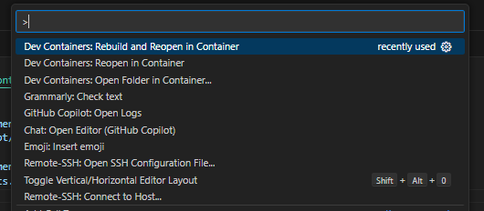

{ align=right width="130"}

# Docker

---

!!! info "Core Module"

<figure markdown>
{ width="400" }
<figcaption>
<a href="https://www.reddit.com/r/ProgrammerHumor/comments/cw58z7/it_works_on_my_machine/"> Image credit </a>
</figcaption>
</figure>

While the above picture may seem silly at first, it is actually pretty close to how [Docker](https://www.docker.com/)
came into existence. A big part of creating an MLOps pipeline is being able to **reproduce** it. Reproducibility
goes beyond versioning our code with `git` and using `conda` environments to keep track of our Python installations.
To truly achieve reproducibility, we need to capture system-level components such as:

* Operating system
* Software dependencies (other than Python packages)

Docker provides this kind of system-level reproducibility by creating isolated program dependencies. In addition to
providing reproducibility, one of the key features of Docker is scalability, which is important when we later discuss
deployment. Because Docker ensures system-level reproducibility, it does not (conceptually) matter whether we try to
start our program on a single machine or on 1,000 machines at once.

## Docker Overview

Docker has three main concepts: **Dockerfile**, **Docker image**, and **Docker container**:

<figure markdown>
{ width="800" }
</figure>

* A **Dockerfile** is a basic text document that contains all the commands a user could call on the command line to
    run an application. This includes installing dependencies, pulling data from online storage, setting up code, and
    specifying commands to run (e.g., `python train.py`).

* Running, or more correctly, *building* a Dockerfile will create a **Docker image**. An image is a lightweight,
    standalone/containerized, executable package of software that includes everything (application code, libraries,
    tools, dependencies, etc.) necessary to make an application run.

* Actually *running* an image will create a **Docker container**. This means that the same image can be launched
    multiple times, creating multiple containers.

The exercises today will focus on how to construct the actual Dockerfile, as this is the first step to constructing
your own container.

## Docker Sharing

The whole point of using Docker is that sharing applications becomes much easier. In general, we have two options:

* After creating the `Dockerfile`, we can simply commit it to GitHub (it's just a text file) and then ask other users
    to simply build the image themselves.

* After building the image ourselves, we can choose to upload it to an *image registry* such as
    [Docker Hub](https://hub.docker.com/), where others can get our image by simply running `docker pull`, allowing them
    to instantaneously run it as a container, as shown in the figure below:

<figure markdown>
{ width="1000" }
<figcaption> <a href="https://deep-learning-blogs.vercel.app/blog/mlops-docker"> Image credit </a> </figcaption>
</figure>

## ❔ Exercises

In the following exercises, we guide you on how to build a dockerfile for your MNIST repository that will make the
training and prediction a self-contained application. Please make sure that you somewhat understand each step and do
not just copy the exercise. Also, note that you probably need to execute the exercise from an elevated terminal, i.e.
with administrative privilege.

The exercises today are only an introduction to docker and some of the steps are going to be unoptimized from a
production setting view. For example, we often want to keep the size of the docker image as small as possible, which we
are not focusing on for these exercises.

If you are using `VScode` then we recommend installing the
[VScode docker extension](https://code.visualstudio.com/docs/containers/overview) for easily getting an overview of
which images have been building and which are running. Additionally, the extension named *Dev Containers* may also be
beneficial for you to download.

1. Start by [installing docker](https://docs.docker.com/get-docker/). How much trouble you need to go through
    depends on your operating system. For Windows and Mac, we recommend you install *Docker Desktop*, which comes with
    a graphical user interface (GUI) for quickly viewing docker images and docker containers currently built/in use.
    Windows users that have not installed WSL yet are going to have to do it now (as docker needs it as a backend for
    starting virtual machines) but you do not need to install docker in WSL. After installing docker we recommend that
    you restart your laptop.

2. Try running the following to confirm that your installation is working:

    ```bash
    docker run hello-world
    ```

    which should give the message

    ```bash
    Hello from Docker!
    This message shows that your installation appears to be working correctly.
    ```

3. Next, let's try to download an image from Docker Hub. Download the `busybox` image:

    ```bash
    docker pull busybox
    ```

    which is a very small (1-5Mb) containerized application that contains the most essential GNU file utilities,
    shell utilities, etc.

4. After pulling the image, write

    ```bash
    docker images
    ```

    which should show you all available images. You should see the `busybox` image that we just downloaded.

5. Let's try to run this image.

    ```bash
    docker run busybox
    ```

    You will see that nothing happens! The reason for that is we did not provide any commands to `docker run`. We
    essentially just ask it to start the `busybox` virtual machine, do nothing, and then close it again. Now, try
    again, this time with

    ```bash
    docker run busybox echo "hello from busybox"
    ```

    Note how fast this process is. In just a few seconds, Docker is able to start a virtual machine, execute a command,
    and kill it afterward.

6. Try running:

    ```bash
    docker ps
    ```

    What does this command do? What if you add `-a` to the end?

7. If we want to run multiple commands within the virtual machine, we can start it in *interactive mode*.

    ```bash
    docker run -it busybox
    ```

    This can be a great way to investigate what the filesystem of our virtual machine looks like.

8. As you may have already noticed by now, each time we execute `docker run`, we can still see small remnants of the
    containers using `docker ps -a`. These stray containers can end up taking up a lot of disk space. To remove them,
    use `docker rm` where you provide the container ID that you want to delete.

    ```bash
    docker rm <container_id>
    ```

    In general we recommend using the `--rm` flag when running a container, e.g.

    ```bash
    docker run --rm <image>
    ```

    which will automatically remove the container after it has finished running.

9. Let's now move on to trying to construct a Dockerfile ourselves for our MNIST project. Create a file called
    `train.dockerfile`. The intention is that we want to develop one Dockerfile for running our training script and
    one for making predictions.

10. Instead of starting from scratch, we nearly always want to start from some base image. For this exercise, we have
    two options: using a simple `python` image or using a `uv`-based image for faster dependency installation:

    === "Using pip"

        ```docker
        # Base image
        FROM python:3.12-slim
        ```

    === "Using uv"

        ```docker
        # Base image
        FROM ghcr.io/astral-sh/uv:python3.12-bookworm-slim
        ```

        The `uv` image comes with both Python and `uv` pre-installed, which will significantly speed up dependency
        installation.

11. Next, we are going to install some essentials in our image. The essentials more or less consist of a Python
    installation and build tools. These instructions may seem familiar if you are using Linux:

    ```docker
    RUN apt update && \
        apt install --no-install-recommends -y build-essential gcc && \
        apt clean && rm -rf /var/lib/apt/lists/*
    ```

12. The previous two steps are common for any Docker application where you want to run Python. All the remaining steps
    are application-specific (to some degree):

    1. Let's copy over our application (the essential parts) from our computer to the container:

        === "Using pip"

            ```docker
            COPY requirements.txt requirements.txt
            COPY pyproject.toml pyproject.toml
            COPY src/ src/
            COPY data/ data/
            ```

        === "Using uv"

            ```docker
            COPY uv.lock uv.lock
            COPY pyproject.toml pyproject.toml
            COPY README.md README.md
            COPY src/ src/
            COPY data/ data/
            ```

        Remember that we only want the essential parts to keep our Docker image as small as possible. Why do we need
        each of these files/folders to run training in our Docker container?

    2. Let's set the working directory in our container and add commands that install the dependencies (1):
        { .annotate }

        1. :man_raising_hand: We split the installation into two steps so that Docker can cache our project dependencies
            separately from our application code. This means that if we change our application code, we do not need to
            reinstall all the dependencies. This is a common strategy for Docker images.

            :man_raising_hand: As an alternative, you can use `RUN make requirements` if you have a `Makefile` that
            installs the dependencies. Just remember to also copy over the `Makefile` into the Docker image.

        === "Using pip"

            ```dockerfile
            WORKDIR /
            RUN pip install -r requirements.txt --no-cache-dir
            RUN pip install . --no-deps --no-cache-dir
            ```

            The `--no-cache-dir` is quite important. Can you explain what it does and why it is important in relation to
            Docker?

        === "Using uv"

            ```dockerfile
            WORKDIR /
            RUN uv sync --locked --no-cache --no-install-project
            ```

            The `--no-cache` is quite important. Can you explain what it does and why it is important in relation to
            Docker? And what does the `--locked` flag do?

    3. Finally, we are going to name our training script as the *entrypoint* for our Docker image. The *entrypoint* is
        the application that we want to run when the image is executed:

        === "Using pip"

            ```docker
            ENTRYPOINT ["python", "-u", "src/<project-name>/train.py"]
            ```

            The `"u"` here makes sure that any output from our script, e.g., any `print(...)` statements, gets
            redirected to our terminal. If not included, you would need to use `docker logs` to inspect your run.

        === "Using uv"

            ```docker
            ENTRYPOINT ["uv", "run", "src/<project-name>/train.py"]
            ```

13. We are now ready to build our Dockerfile into a Docker image.

    ```bash
    docker build -f train.dockerfile . -t train:latest
    ```

    ??? warning "MAC M1/M2 users"

        In general, Docker images are built for a specific platform. For example, if you are using a Mac with an M1/M2
        chip, then you are running on an ARM architecture. If you are using a Windows or Linux machine, then you are
        running on an AMD64 architecture. This is important to know when building Docker images. Thus, Docker images
        you build may not work on platforms different than the ones you build on. You can specify which platform you want
        to build for by adding the `--platform` argument to the `docker build` command:

        ```bash
        docker build --platform linux/amd64 -f train.dockerfile . -t train:latest
        ```

        and also when running the image:

        ```bash
        docker run --platform linux/amd64 train:latest
        ```

        Note that this will significantly increase the build and run time of your Docker image when running locally,
        because Docker will need to emulate the other platform. In general, for the exercises today, you should not need
        to specify the platform, but be aware of this if you are building Docker images on your own.

    Please note that here we are providing two extra arguments to `docker build`. The `-f train.dockerfile .` (the dot
    is important to remember) indicates which Dockerfile we want to run (except if you just named it `Dockerfile`) and
    the `-t train:latest` is the respective name and tag that we see afterward when running `docker images` (see
    image below). Please note that building a Docker image can take a couple of minutes.

    <figure markdown>
    {width="800" }
    </figure>

    ??? warning "Docker images and space"

        Docker images can take up a lot of space on your computer, especially the Docker images we are trying to build
        because PyTorch is a huge dependency. If you are running low on space, you can try to

        ```bash
        docker system prune
        ```

        Alternatively, you can manually delete images using `docker rm {image_name}:{image_tag}`.

14. Try running `docker images` and confirm that you get output similar to the above. If you succeed with this,
    then try running the docker image.

    ```bash
    docker run --name experiment1 train:latest
    ```

    You should hopefully see your training starting. Please note that we can start as many containers as we want at
    the same time by giving them all different names using the `--name` tag.

    1. You are most likely going to rebuild your Docker image multiple times, either due to an implementation error
        or the addition of new functionality. Therefore, instead of watching your package manager download `torch` for
        the 20th time, you can reuse the cache from the last time the Docker image was built. To do this, replace the
        line in your Dockerfile that installs your requirements with:

        === "Using pip"
            ```dockerfile
            RUN --mount=type=cache,target=/root/.cache/pip pip install -r requirements.txt --no-cache-dir
            ```

            which mounts your local pip cache to the Docker image.

        === "Using uv"
            ```dockerfile
            ENV UV_LINK_MODE=copy
            RUN --mount=type=cache,target=/root/.cache/uv uv sync
            ```

            which mounts your local uv cache to the Docker image, see
            [documentation](https://docs.astral.sh/uv/guides/integration/docker/#caching).

        For building the image with cache mounts, you need to have enabled the
        [BuildKit](https://docs.docker.com/develop/develop-images/build_enhancements/) feature. If you have Docker
        version v23.0 or later (you can check this by running `docker version`), then this is enabled by default.
        Otherwise, you need to enable it by setting the environment variable `DOCKER_BUILDKIT=1` before building the
        image.

        Try changing your Dockerfile and rebuild the image twice e.g. first time running `docker build ...` it will
        still take some time as it needs to fill up the cache. The second time you run `docker build ...` you should see
        that the build process is much faster.

15. Remember, if you are ever in doubt about how files are organized inside a Docker image, you always have the option
    of starting the image in interactive mode:

    ```bash
    docker run --rm -it --entrypoint sh {image_name}:{image_tag}
    ```

16. When your training has completed you will notice that any files that are created when running your training script
    are not present on your laptop (for example if your script is saving the trained model to a file). This is because
    the files were created inside your container (which is a separate little machine). To get the files you have two
    options:

    1. If you already have a completed run then you can use

        ```bash
        docker cp
        ```

        to copy the files between your container and laptop. For example to copy a file called `trained_model.pt` from a
        folder you would do:

        ```bash
        docker cp {container_name}:{dir_path}/{file_name} {local_dir_path}/{local_file_name}
        ```

        Try this out.

    2. A much more efficient strategy is to mount a volume that is shared between the host (your laptop) and the
        container. This can be done with the `-v` option for the `docker run` command. For example, if we want to
        automatically get the `trained_model.pt` file after running our training script we could simply execute the
        container as

        ```bash
        docker run --name {container_name} -v %cd%/models:/models/ train:latest
        ```

        This command mounts our local `models` folder as a corresponding `models` folder in the container. Any file saved
        by the container to this folder will be synchronized back to our host machine. Try this out! Note if you have
        multiple files/folders that you want to mount (if in doubt about file organization in the container try to do
        the next exercise first). Also note that the `%cd%` needs to change depending on your OS, see this
        [page](https://stackoverflow.com/questions/41485217/mount-current-directory-as-a-volume-in-docker-on-windows-10)
        for help.

17. With training done we also need to write an application for prediction. Create a new docker image called
    `evaluate.dockerfile`. This file should call your `src/<project-name>/evaluate.py` script instead. This image
    will need some trained model weights to work. Feel free to either include these during the build process or mount
    them afterwards. When you create the file try to `build` and `run` it to confirm that it works. Hint: if
    you are passing in the model checkpoint and evaluation data as arguments to your script, your `docker run` probably
    needs to look something like

    ```bash
    docker run --name evaluate --rm \
        -v %cd%/trained_model.pt:/models/trained_model.pt \  # mount trained model file
        -v %cd%/data/test_images.pt:/test_images.pt \  # mount data we want to evaluate on
        -v %cd%/data/test_targets.pt:/test_targets.pt \
        evaluate:latest \
        ../../models/trained_model.pt \  # argument to script, path relative to script location in container
    ```

18. (Optional, requires GPU support) By default, a virtual machine created by docker only has access to your `cpu` and
    not your `gpu`. While you do not necessarily have a laptop with a GPU that supports the training of neural networks
    (e.g. one from Nvidia) it is beneficial that you understand how to construct a docker image that can take advantage
    of a GPU if you were to run this on a machine in the future that has a GPU (e.g. in the cloud). It does take a bit
    more work, but many of the steps will be similar to building a normal docker image.

    1. There are three prerequisites for working with Nvidia GPU-accelerated docker containers. First, you need to have
        the Docker Engine installed (already taken care of), have an Nvidia GPU with updated GPU drivers and finally have
        the [Nvidia container toolkit](https://docs.nvidia.com/datacenter/cloud-native/container-toolkit/install-guide.html#docker)
        installed. The last part you likely have not installed and need to do. Some distros of Linux have known
        problems with the installation process, so you may have to search through known issues in
        [nvidia-docker repository](https://github.com/NVIDIA/nvidia-docker/issues) to find a solution.

    2. To test that everything is working start by pulling a relevant Nvidia docker image. In my case this is
        the correct image:

        ```bash
        docker pull nvidia/cuda:11.0.3-base-ubuntu20.04
        ```

        but it may differ based on what Cuda version you have. You can find all the different official Nvidia images
        [on Docker Hub](https://hub.docker.com/r/nvidia/cuda). After pulling the image, try running the `nvidia-smi`
        command inside a container based on the image you just pulled. It should look something like this:

        ```bash
        docker run --rm --gpus all nvidia/cuda:11.0.3-base-ubuntu20.04 nvidia-smi
        ```

        and should show an image like below:

        <figure markdown>
        { width="600" }
        </figure>

        If it does not work, try redoing the steps.

    3. We should hopefully have a working setup now for running Nvidia accelerated docker containers. The next step is
        to get PyTorch inside our container, such that our PyTorch implementation also correctly identifies the GPU.
        Luckily for us, Nvidia provides a set of docker images for GPU-optimized software for AI, HPC and visualizations
        through their [NGC Catalog](https://docs.nvidia.com/ngc/ngc-catalog-user-guide/index.html#what-is-nvidia-ngc).
        The containers that have to do with PyTorch can be seen
        [in the PyTorch release notes](https://docs.nvidia.com/deeplearning/frameworks/pytorch-release-notes/index.html).
        Try pulling the latest one:

        ```bash
        docker pull nvcr.io/nvidia/pytorch:22.07-py3
        ```

        It may take some time because the NGC images include a lot of other software for optimizing PyTorch
        applications. It may be possible for you to find other images for running GPU-accelerated applications that have
        a smaller memory footprint, but NGC is the recommended and supported way.

    4. Let's test that this container works:

        ```bash
        docker run --gpus all -it --rm nvcr.io/nvidia/pytorch:22.07-py3
        ```

        This should run the container in interactive mode attached to your current terminal. Try opening `python` in
        the container and try writing:

        ```python
        import torch
        print(torch.cuda.is_available())
        ```

        which should hopefully return `True`.

    5. Finally, we need to incorporate all this into our already developed docker files for our application. This is
        also fairly easy as we just need to change our `FROM` statement at the beginning of our docker file:

        ```docker
        FROM python:3.11-slim
        ```

        change to

        ```docker
        FROM  nvcr.io/nvidia/pytorch:22.07-py3
        ```

        try doing this to one of your dockerfiles, build the image and run the container. Remember to check that your
        application is using GPU by printing `torch.cuda.is_available()`.

19. (Optional) Another way you can use Dockerfiles in your day-to-day work is for Dev-containers. Developer containers
    allow you to develop code directly inside a container, making sure that your code is running in the same
    environment as it will when deployed. This is especially useful if you are working on a project that has a lot of
    dependencies that are hard to install on your local machine. Setup instructions for VS Code and PyCharm can be found
    here (should be simple since we have already installed Docker):

    * [VS Code](https://code.visualstudio.com/docs/devcontainers/containers)
    * [PyCharm](https://www.jetbrains.com/help/pycharm/connect-to-devcontainer.html#create_dev_container_inside_ide)

    We will focus on the VS Code setup here.

    1. First, install the
        [Remote - Containers](https://marketplace.visualstudio.com/items?itemName=ms-vscode-remote.remote-containers)
        extension.

    2. Create a `.devcontainer` folder in your project root and create a `Dockerfile` inside it. We will keep this file
        very barebones for now, so let's just define a base installation of Python:

        === "Using pip"
            ```docker
            FROM python:3.12-slim

            RUN apt update && \
                apt install --no-install-recommends -y build-essential gcc && \
                apt clean && rm -rf /var/lib/apt/lists/*
            ```

        === "Using uv"
            ```docker
            FROM ghcr.io/astral-sh/uv:python3.12-bookworm-slim

            RUN apt update && \
                apt install --no-install-recommends -y build-essential gcc && \
                apt clean && rm -rf /var/lib/apt/lists/*
            ```

    3. Create a `devcontainer.json` file in the `.devcontainer` folder. This file should look something like this:

        === "Using pip"
            ```json
            {
                "name": "my_working_env",
                "dockerFile": "Dockerfile",
                "postCreateCommand": "pip install -r requirements.txt"
            }
            ```

        === "Using uv"
            ```json
            {
                "name": "my_working_env",
                "dockerFile": "Dockerfile",
                "postCreateCommand": "uv sync --locked"
            }
            ```

        This file tells VS Code that we want to use the `Dockerfile` that we just created and that we want to install
        our Python dependencies after the container has been created.

    4. After creating these files, you should be able to open the command palette in VS Code (F1) and search for the
        option `Remote-Containers: Reopen in Container` or `Remote-Containers: Rebuild and Reopen in Container`. Choose
        either of these options.

        <figure markdown>
        { width="600" }
        </figure>

        This will start a new VS Code instance inside a Docker container. You should be able to see this in the bottom
        left corner of your VS Code window. You should also be able to see that the Python interpreter has changed to
        the one inside the container.

        You are now ready to start developing inside the container. Try opening a terminal and run `python` and
        `import torch` to confirm that everything is working.

20. (Optional) In [M8 on Data version control](../s2_organisation_and_version_control/dvc.md) you learned about the
    framework `dvc` for version controlling data. A natural question at this point would then be how to incorporate
    `dvc` into our docker image. We need to do two things:

    * Make sure that `dvc` has all the correct files to pull data from our remote storage
    * Make sure that `dvc` has the correct credentials to pull data from our remote storage

    We are going to assume that `dvc` (and any `dvc` extension needed) is part of your `requirements.txt` file and that
    it is already being installed in a `RUN pip install -r requirements.txt` command in your Dockerfile. If not, then
    you need to add it.

    1. Add the following lines to your Dockerfile

        === "Using pip"

            ```dockerfile
            RUN dvc init --no-scm
            COPY .dvc/config .dvc/config
            COPY *.dvc .dvc/
            RUN dvc config core.no_scm true
            RUN dvc pull
            ```

        === "Using uv"

            ```dockerfile
            RUN uv run dvc init --no-scm
            COPY .dvc/config .dvc/config
            COPY *.dvc .dvc/
            RUN uv run dvc config core.no_scm true
            RUN uv run dvc pull
            ```

        The first line initializes `dvc` in the Docker image. The `--no-scm` option is needed because normally `dvc` can
        only be initialized inside a git repository, but this option allows initializing `dvc` without being in one.
        The second and third lines copy over the `dvc` config file and the `dvc` metadata files that are needed to pull
        data from your remote storage. The last line pulls the data.

    2. If your data is not public, we need to provide credentials in some way to pull the data. We are for now going to
        do it in a not-so-secure way. When `dvc` first connected to your drive, a credential file was created. This file
        is located in `$CACHE_HOME/pydrive2fs/{gdrive_client_id}/default.json` where `$CACHE_HOME`.

        === "macOS"
            ```~/Library/Caches```

        === "Linux"
            ```~/.cache``` <br>
            This is the typical location, but it may vary depending on what distro you are running.

        === "Windows"
            ```{user}/AppData/Local```

        Find the file. The content should look similar to this (only some fields are shown):

        ```json
        {
            "access_token": ...,
            "client_id": ...,
            "client_secret": ...,
            "refresh_token": ...,
            ...
        }
        ```

        We are going to copy the file into our Docker image. This, of course, is not a secure way of doing it, but it is
        the easiest way to get started. As long as you are not sharing your Docker image with anyone else, then it is
        fine. Add the following lines to your Dockerfile before the `RUN dvc pull` command:

        ```dockerfile
        COPY <path_to_default.json> default.json
        dvc remote modify myremote --local gdrive_service_account_json_file_path default.json
        ```

        where `<path_to_default.json>` is the path to the `default.json` file that you just found. The last line tells
        `dvc` to use the `default.json` file as the credentials for pulling data from your remote storage. You can
        confirm that this works by running `dvc pull` in your Docker image.

## 🧠 Knowledge check

1. What is the difference between a docker image and a docker container?

    ??? success "Solution"

        A Docker image is a template for a Docker container. A Docker container is a running instance of a Docker
        image. A Docker image is a static file, while a Docker container is a running process.

2. What are the 3 steps involved in containerizing an application?

    ??? success "Solution"

        1. Write a Dockerfile that includes your app (including the commands to run it) and its dependencies.
        2. Build the image using the Dockerfile you wrote.
        3. Run the container using the image you've built.

3. What advantage is there to running your application inside a Docker container instead of running the application
    directly on your machine?

    ??? success "Solution"

        Running inside a Docker container gives you a consistent and independent environment for your application.
        This means that you can be sure that your application will run the same way on your machine as it will on
        another machine. Thus, Docker gives the ability to abstract away the differences between different machines.

4. A Docker container is built from a series of layers that are stacked on top of each other. This should be clear if
    you look at the output when building a Docker image. What is the advantage of this?

    ??? success "Solution"

        The advantage is efficiency and reusability. When a change is made to a Docker image, only the layer(s) that are
        changed need to be updated. For example, if you update the application code in your Docker image, which usually
        is the last layer, then only that layer needs to be rebuilt, making the process much faster. Additionally, if
        you have multiple Docker images that share the same base image, then the base image only needs to be downloaded
        once.

This covers the absolute minimum you should know about Docker to get a working image and container. If you want to really
deep dive into this topic, you can find a copy of the *Docker Cookbook* by Sébastien Goasguen in the literature folder.

If you are actively going to be using Docker in the future, one thing to consider is the image size. Even these
simple images that we have built still take up GB in size. Several optimization steps can be taken to reduce the
image size for you or your end user. If you have time, you can read
[this article](https://devopscube.com/reduce-docker-image-size/) on different approaches to reducing image size.
Additionally, you can take a look at the
[dive-in extension](https://www.docker.com/blog/reduce-your-image-size-with-the-dive-in-docker-extension/) for Docker
Desktop that lets you explore your Docker images in depth.
