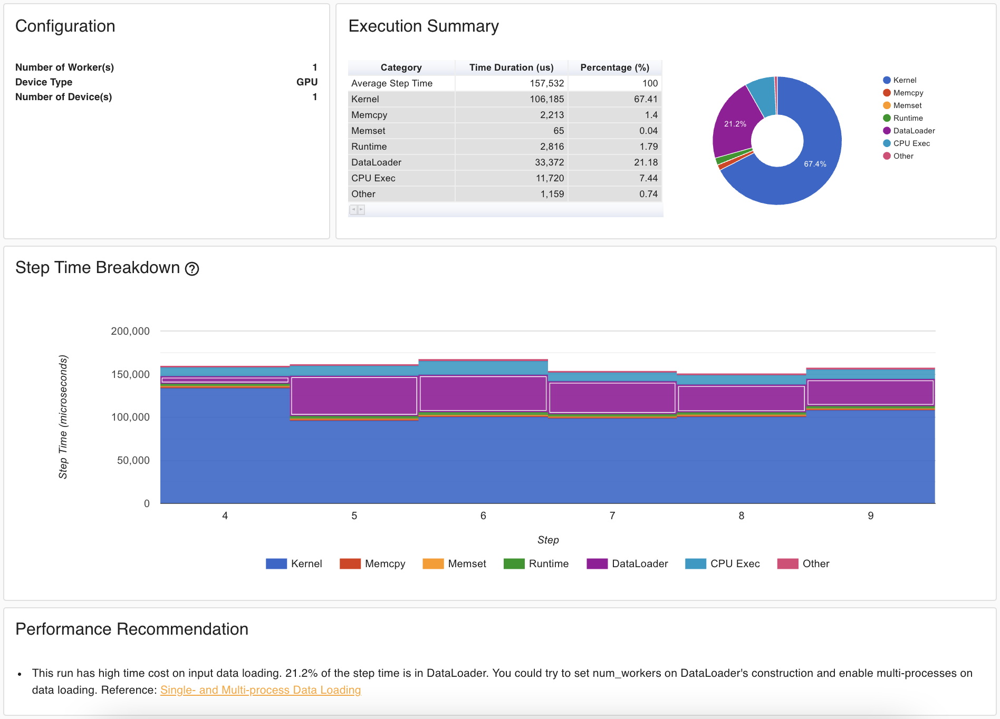

# Profilers
{: .no_toc }

<details open markdown="block">
  <summary>
    Table of contents
  </summary>
  {: .text-delta }
1. TOC
{:toc}
</details>

---

## Profilers

In general profiling code is about improving the performance of your code. In this session we are going to take a somewhat narrow approach to what "performance" is: runtime, meaning the time it takes to execute your program. 

At the bare minimum, the two questions a proper profiling of your program should be able to answer is:

* *“How many times is each method in my code called?”*
* *“How long do each of these methods take?”*

The first question is important to priorities optimization. If two methods `A` and `B` have approximately the same runtime, but `A` is called 1000 more times than `B` we should propably spend time optimizing `A` over `B` if we want to speedup our code. The second question is gives itself, directly telling us which methods are the expensive to call.

Using profilers can help you find bottlenecks in your code. In this exercise we will look at two different
profilers, with the first one being the [cProfile](https://docs.python.org/3/library/profile.html), pythons
build in profiler.

### Exercises

1. Run the `cProfile` on the `vae_mnist_working.py` script. Hint: you can directly call the profiler on a
   script using the `-m` arg
   `python -m cProfile [-o output_file] [-s sort_order] (-m module | myscript.py) `
   
2. Try looking at the output of the profiling. Can you figure out which function took the longest to run?

3. Can you explain the difference between `tottime` and `cumtime`? Under what circumstances does these differ and when are they equal.

4. To get a better feeling of the profiled result we can try to visualize it. Python does not
   provide a native solution, but open-source solutions such as [snakeviz](https://jiffyclub.github.io/snakeviz/)
   exist. Try installing `snakeviz` and load a profiled run into it (HINT: snakeviz expect the run to have the file
   format `.prof`).

5. Try optimizing the run! (Hint: The data is not stored as torch tensor). After optimizing the code make sure (using `cProfile` and `snakeviz`) that the code actually runs faster.

## Pytorch profiling

Profiling machine learning code can become much more complex because we are suddenly beginning to mix different devices (CPU+GPU), that can (and should) overlap some of their computations. When profiling this kind of machine learning code we are often looking for *bottlenecks*. A bottleneck is simple the place in your code that is preventing other processes from performing their best. This is the reason that all major deep learning frameworks also include their own profilers that can help profiling more complex applications.

The image below show a typical report afeter using the [build in profiler in pytorch](https://www.google.com/search?client=firefox-b-d&q=pytorch+profiling). As the image shows the profiler looks both a the `kernel` time (this is the time spend doing actual computations) and also transfer times such as `memcpy` (where we are copying data between devices). It can even analyze your code and give recommendations.

<p align="center">
  
</p>

Using the profiler can be as simple as wrapping the code that you want to profile with the `torch.profiler.profile` decorator

```python
with torch.profiler.profile(...) as prof:
   # code that I want to profile
   output = model(data)
```

### Exercises (optional)

In these investigate the profiler that is build into PyTorch already. Note that these exercises requires that you have PyTorch v1.8.1 installed (or higher). You can always check which version you currently have installed by writing (in a python interpreter):

```python
import torch
print(torch.__version__)
```

Additionally, to display the result nicely (like `snakeviz` for `cProfile`) we are also going to use the tensorboard profiler extension

```bash 
pip install torch_tb_profiler
```

Finally, the profiler requires that it is a Pytorch version that is build using [Kineto](https://github.com/pytorch/kineto) (the internal tool pytorch uses for profiling). This have the sad consequence that if you get the following error when
trying to do the exercises:

```bash
Requested Kineto profiling but Kineto is not available, make sure PyTorch is built with USE_KINETO=1
```

You will sadly not be able to complete them. For this exercise we have provided the solution in form of the script `vae_mnist_pytorch_profiler.py` where we have already implemented the PyTorch profiler in the script. 
However, try to solve the exercise yourself!

1. The documentation on the new profiler is sparse but take a look at this
   [blogpost](https://pytorch.org/blog/introducing-pytorch-profiler-the-new-and-improved-performance-tool/)
   and the [documentation](https://pytorch.org/docs/stable/profiler.html) which should give you an idea of 
   how to use the PyTorch profiler.

2. Secondly try to implement the profile in the `vae_mnist_working.py` script from the debugging exercises 
   (HINT: run the script with `epochs = 1`) and run the script with the profiler on.
   
3. Try loading the saved profiling run in tensorboard by writing
   ```
   tensorboard --logdir=./log  
   ```
   in a terminal. Inspect the results in the `pytorch_profiler` tab. What is the most computational expensive
   part of the code? What does the profiler recommend that you improve? Can you improve something in the code?

3. Apply the profiler to your own MNIST code.
