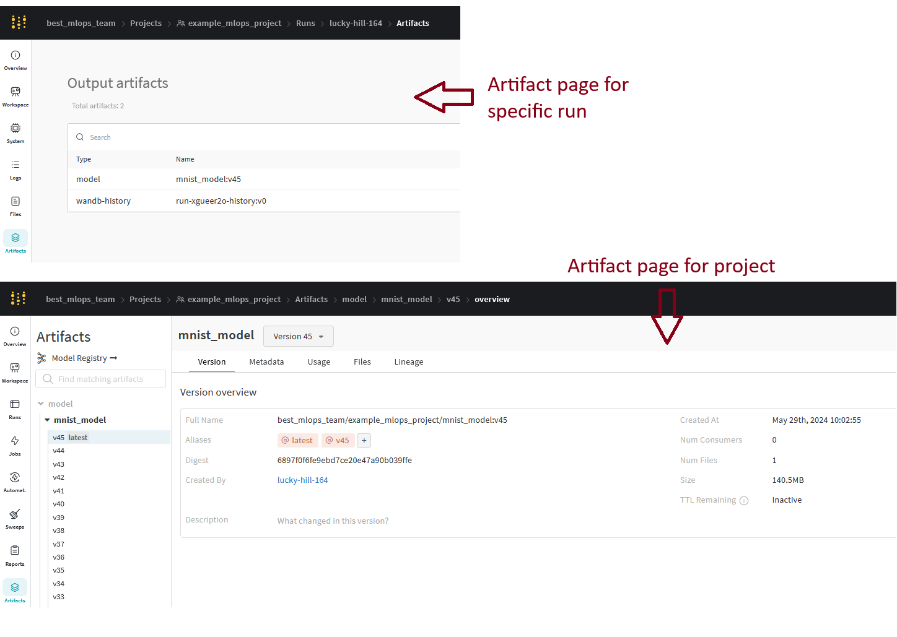
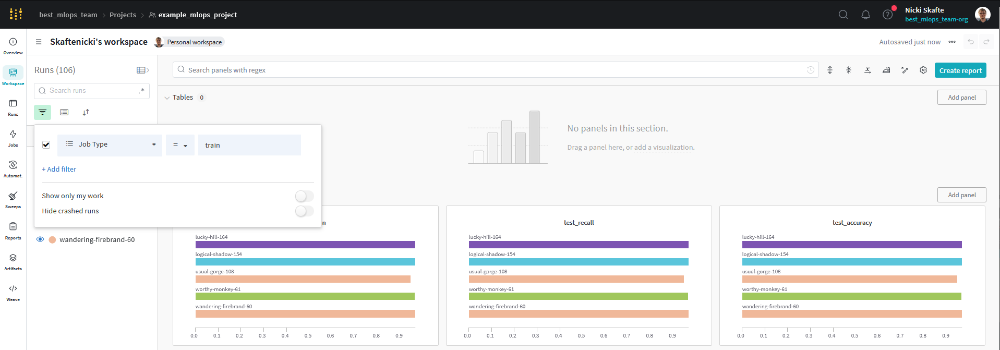
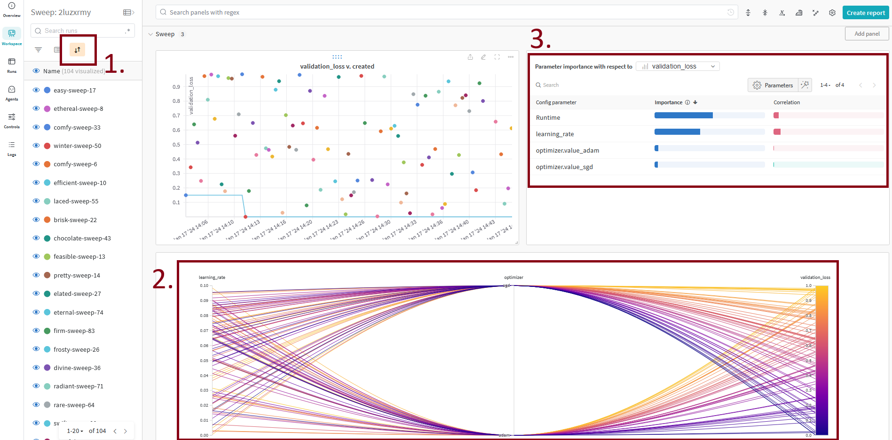
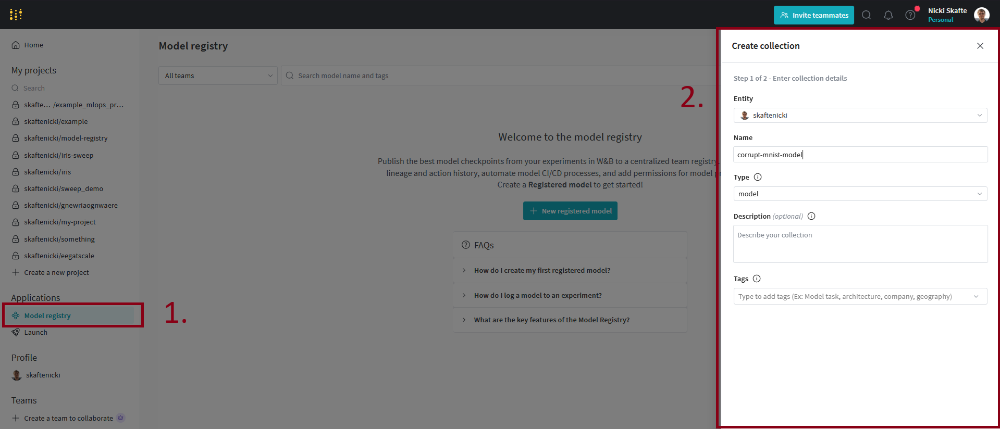

{ align=right width="130"}

# Logging

---

!!! info "Core Module"

[Logging](https://en.wikipedia.org/wiki/Logging_(computing)) in general refers to the practise of recording events
activities over time. Having proper logging in your applications can be extremely beneficial for a few reasons:

* *Debugging* becomes easier because we in a more structure way can output information about the state of our program,
    variables, values etc. to help identify and fix bugs or unexpected behavior.

* When we move into a more production environment, proper logging is essential for *monitoring* the health and
    performance of our application.

* It can help in *auditing* as logging info about specific activities etc. can help keeping a record of who did what
    and when.

* Having proper logging means that info is saved for later, that can be *analysed* to gain insight into the behavior of
    our application, such as trends.

We are in this course going to divide the kind of logging we can do into categories: application logging and experiment
logging. In general application logging is important regardless of the kind of application you are developing, whereas
experiment logging is important machine learning based projects where we are doing experiments.

## Application logging

The most basic form of logging in Python applications is the good old `print` statement:

```python
for batch_idx, batch in enumerate(dataloader):
    print(f"Processing batch {batch_idx} out of {len(dataloader)}")
    ...
```

This will keep a "record" of the events happening in our script, in this case how far we have progressed. We could even
change the print to include something like `batch.shape` to also have information about the current data being
processed.

Using `print` statements is fine for small applications, but to have proper logging we need a bit more functionality
than what `print` can offer. Python actually comes with a great
[logging](https://docs.python.org/3/library/logging.html) module, that defines functions for flexible
logging. It is exactly this we are going to look at in this module.

The four main components to the Python logging module are:

1. *Logger*: The main entry point for using the logging system. You create instances of the Logger class to emit log
    messages.

2. *Handler*: Defines where the log messages go. Handlers send the log messages to specific destinations, such as the
    console or a file.

3. *Formatter*: Specifies the layout of the log messages. Formatters determine the structure of the log records,
    including details like timestamps and log message content.

4. *Level*: Specifies the severity of a log message.

Especially, the last point is important to understand. Levels essentially allows of to get rid of statements like this:

```python
if debug:
    print(x.shape)
```

where the logging is conditional on the variable `debug` which we can set a runtime. Thus, it is something we can
disable for users of our application (`debug=False`) but have enabled when we develop the application (`debug=True`).
And it makes sense that not all things logged, should be available to all stakeholders of a codebase. We as developers
probably always wants the highest level of logging, whereas users of the our code need less info and we may want to
differentiate this based on users.

<figure markdown>
{ width="800" }
</figure>

It is also important to understand the different between logging and error handling. Error handling
Python is done using `raise` statements and `try/catch` like:

```python
def f(x: int):
    if not isinstance(x, int):
        raise ValueError("Expected an integer")
    return 2 * x

try:
    f(5):
except ValueError:
    print("I failed to do a thing, but continuing.")
```

Why would we evere need log `warning`, `error`, `critical` levels of information, if we are just going to handle it?
The reason is that raising exceptions are meant to change the *program flow at runtime* e.g. things we do not want the
user to do, but we can deal with in some way. Logging is always for *after* a program have run, to inspect what went
wrong. Sometimes you need one, sometimes the other, sometimes both.

### ❔ Exercises

Exercises are inspired by this [made with ml](https://madewithml.com/courses/mlops/logging/) module on the same topic.
If you need help for the exercises you can find a simple solution script
[here](https://github.com/SkafteNicki/dtu_mlops/tree/main/s4_debugging_and_logging/exercise_files).

1. As logging is a built-in module in Python, nothing needs to be installed. Instead start a new file called
    `my_logger.py` and start out with the following code:

    ```python
    import logging
    import sys

    # Create super basic logger
    logging.basicConfig(stream=sys.stdout, level=logging.DEBUG)
    logger = logging.getLogger(__name__) # (1)

    # Logging levels (from lowest to highest priority)
    logger.debug("Used for debugging your code.")
    logger.info("Informative messages from your code.")
    logger.warning("Everything works but there is something to be aware of.")
    logger.error("There's been a mistake with the process.")
    logger.critical("There is something terribly wrong and process may terminate.")
    ```

    1. :man_raising_hand: The built-in variable `__name__` always contains the record of the script or module that is
        currently being run. Therefore if we initialize our logger base using this variable, it will always be unique
        to our application and not conflict with logger setup by any third-party package.

    Try running the code. Than try changing the argument `level` when creating the logger. What happens when you do
    that?

2. Instead of sending logs to the terminal, we may also want to send them to a file. This can be beneficial, such that
    only `warning` level logs and higher are available to the user, but `debug` and `info` is still saved when the
    application is running.

    1. Try adding the following dict to your `logger.py` file:

        ```python
        logging_config = {
            "version": 1,
            "formatters": { # (1)
                "minimal": {"format": "%(message)s"},
                "detailed": {
                    "format": "%(levelname)s %(asctime)s [%(name)s:%(filename)s:%(funcName)s:%(lineno)d]\n%(message)s\n"
                },
            },
            "handlers": { # (2)
                "console": {
                    "class": "logging.StreamHandler",
                    "stream": sys.stdout,
                    "formatter": "minimal",
                    "level": logging.DEBUG,
                },
                "info": {
                    "class": "logging.handlers.RotatingFileHandler",
                    "filename": Path(LOGS_DIR, "info.log"),
                    "maxBytes": 10485760,  # 1 MB
                    "backupCount": 10,
                    "formatter": "detailed",
                    "level": logging.INFO,
                },
                "error": {
                    "class": "logging.handlers.RotatingFileHandler",
                    "filename": Path(LOGS_DIR, "error.log"),
                    "maxBytes": 10485760,  # 1 MB
                    "backupCount": 10,
                    "formatter": "detailed",
                    "level": logging.ERROR,
                },
            },
            "root": {
                "handlers": ["console", "info", "error"],
                "level": logging.INFO,
                "propagate": True,
            },
        }
        ```

        1. :man_raising_hand: The [formatter](https://docs.python.org/3/library/logging.html#formatter-objects) section
            determines how logs should be formatted. Here we define two separate formatters, called `minimal` and
            `detailed` which we can use in the next part of the code.

        2. :man_raising_hand: The [handlers](https://docs.python.org/3/library/logging.html#handler-objects) is in
            charge of what should happen to different level of logging. `console` uses the `minimal` format we defined
            and sens logs to the `stdout` stream for messages of level `DEBUG` and higher. The `info` handler uses
            the `detailed` format and sends messages of level `INFO` and higher to a separate `info.log` file. The
            `error` handler does the same for messages of level `ERROR` and higher to a file called `error.log`.

        you will need to set the `LOGS_DIR` variable and also figure out how to add this `logging_config` using the
        [logging config](https://docs.python.org/3/library/logging.config.html#module-logging.config) submodule to your
        logger.

    2. When the code successfully runs, check the `LOGS_DIR` folder and make sure that a `info.log` and `error.log` file
        was created with the appropriate content.

3. Finally, lets try to add a little bit of style and color to our logging. For this we can use the great package
    [rich](https://github.com/Textualize/rich) which is a great package for *rich* text and beautiful formatting in
    terminals. Install `rich` and add the following line to your `my_logger.py`
    script:

    ```python
    logger.root.handlers[0] = RichHandler(markup=True)  # set rich handler
    ```

    and try re-running the script. Hopefully you should see something beautiful in your terminal like this:

    <figure markdown>
    { width="700" }
    </figure>

4. (Optional) We already briefly touched on logging during the
    [module on config files using hydra](../s3_reproducibility/config_files.md). If you want to configure hydra to use
    custom logging scheme as the one we setup in the last two exercises, you can take a look at this
    [page](https://hydra.cc/docs/configure_hydra/logging/). In hydra you will need to provide the configuration of the
    logger as config file. You can find examples of such config file
    [here](https://github.com/SkafteNicki/dtu_mlops/tree/main/s4_debugging_and_logging/exercise_files).

## Experiment logging

When most people think machine learning, we think about the training phase. Being able to track and log experiments
is an important part of understanding what is going on with your model while you are training. It can help you debug
your model and help tweak your models to perfection. Without proper logging of experiments, it can be really hard to
iterate on the model because you do not know what changes lead to increase or decrease in performance.

The most basic logging we can do when running experiments is writing the metrics that our model is producing e.g. the
loss or the accuracy to the terminal or a file for later inspection. We can then also use tools such as
[matplotlib](https://matplotlib.org/) for plotting the progression of our metrics over time. This kind of workflow may
be enough when doing smaller experiments or working alone on a project, but there is no way around using a proper
experiment tracker and visualizer when doing large scale experiments in collaboration with others. It especially becomes
important when you want to compare performance between different runs.

There exist many tools for logging your experiments, with some of them being:

* [Tensorboard](https://www.tensorflow.org/tensorboard)
* [Comet](https://www.comet.ml/site/)
* [MLFlow](https://mlflow.org/)
* [Neptune](https://neptune.ai/)
* [Weights and Bias](https://wandb.ai/site)

All of the frameworks offers many of the same functionalities, you can see a (bias) review
[here](https://dagshub.com/blog/best-8-experiment-tracking-tools-for-machine-learning-2023/). We are going to use
Weights and Bias (wandb), as it support everything we need in this course. Additionally, it is an excellent tool for
collaboration and sharing of results.

<figure markdown>
{ width="700" }
<figcaption>
Using the Weights and Bias (wandb) dashboard we can quickly get an overview and compare many runs over different
metrics. This allows for better iteration of models and training procedure.
</figure>

### ❔ Exercises

1. Start by creating an account at [wandb](https://wandb.ai/site). I recommend using your GitHub account but feel
    free to choose what you want. When you are logged in you should get an API key of length 40. Copy this for later
    use (HINT: if you forgot to copy the API key, you can find it under settings), but make sure that you do not share
    it with anyone or leak it in any way.

    ??? tip ".env file"

        A good place to store not only your wandb API key but also other sensitive information is in a `.env` file.
        This file should be added to your `.gitignore` file to make sure that it is not uploaded to your repository.
        You can then load the variables in the `.env` file using the `python-dotenv` package. For more information
        see this [page](https://pypi.org/project/python-dotenv/).

        ```txt title=".env" linenums="1"
        WANDB_API_KEY=your-api-key
        WANDB_PROJECT=my_project
        WANDB_ENTITY=my_entity
        ...
        ```
        ```python title="load_from_env_file.py" linenums="1"
        from dotenv import load_dotenv
        load_dotenv()
        import os
        api_key = os.getenv("WANDB_API_KEY")
        ```

2. Next install wandb on your laptop

    ```bash
    pip install wandb
    ```

3. Now connect to your wandb account

    ```bash
    wandb login
    ```

    you will be asked to provide the 40 length API key. The connection should be remain open to the wandb server
    even when you close the terminal, such that you do not have to login each time. If using `wandb` in a notebook
    you need to manually close the connection using `wandb.finish()`.

4. We are now ready for incorporating `wandb` into our code. We are going to continue development on our corrupt MNIST
    codebase from the previous sessions. For help, we recommend looking at this
    [quickstart](https://docs.wandb.ai/quickstart) and this [guide](https://docs.wandb.ai/guides/integrations/pytorch)
    for Pytorch applications. You first job is to alter your training script to include `wandb` logging, at least for
    the training loss.

    ??? success "Solution"

        ```python linenums="1" title="train.py"
        --8<-- "s4_debugging_and_logging/exercise_files/weights_and_bias_solution.py"
        ```

    1. After running your model, checkout the webpage. Hopefully you should be able to see at least one run with
        something logged.

    2. Now log something else than scalar values. This could be a image, a histogram or a matplotlib figure. In all
        cases the logging is still going to use `wandb.log` but you need extra calls to `wandb.Image` etc. depending
        on what you choose to log.

        ??? success "Solution"

            In this solution we log the input images to the model every 100 step. Additionally, we also log a histogram
            of the gradients to inspect if the model is converging. Finally, we create a ROC curve which is a matplotlib
            figure and log that as well.

            ```python linenums="1" title="train.py"
            --8<-- "s4_debugging_and_logging/exercise_files/weights_and_bias_solution2.py"
            ```

    3. Finally, we want to log the model itself. This is done by saving the model as an artifact and then logging the
        artifact. You can read much more about what artifacts are [here](https://docs.wandb.ai/guides/artifacts) but
        they are essentially one or more files logged together with runs that can be versioned and equipped with
        metadata. Log the model after training and see if you can find it in the wandb dashboard.

        ??? success "Solution"

            In this solution we have added the calculating of final training metrics and when we then log the model
            we add these as metadata to the artifact.

            ```python linenums="1" title="train.py"
            --8<-- "s4_debugging_and_logging/exercise_files/weights_and_bias_solution3.py"
            ```

            After running the script you should be able to see the logged artifact in the wandb dashboard.

            <figure markdown>
            { width="600" }
            </figure>

5. Weights and bias was created with collaboration in mind and lets therefore share our results with others.

    1. Lets create a report that you can share. Click the **Create report** button (upper right corner when you are in
        a project workspace) and include some of the graphs/plots/images that you have generated in the report.

    2. Make the report shareable by clicking the *Share* button and create *view-only-link*. Send a link to your report
        to a group member, fellow student or a friend. In the worst case that you have no one else to share with you can
        send a link to my email `nsde@dtu.dk`, so I can checkout your awesome work 😃

6. When calling `wandb.init` you can provide many additional argument. Some of the most important are

    * `project`
    * `entity`
    * `job_type`

    Make sure you understand what these arguments do and try them out. It will come in handy for your group work as they
    essentially allows multiple users to upload their own runs to the same project in `wandb`.

    ??? success "Solution"

        Relevant documentation can be found [here](https://docs.wandb.ai/ref/python/init). The `project` indicates what
        project all experiments and artifacts are logged to. We want to keep this the same for all group members. The
        `entity` is the username of the person or team who owns the project, which should also be the same for all group
        members. The job type is important if you have different jobs that log to the same project. A common example is
        one script that trains a model and another that evaluates it. By setting the job type you can easily filter the
        runs in the wandb dashboard.

        <figure markdown>
        { width="600" }
        </figure>

7. Wandb also comes with build in feature for doing [hyperparameter sweeping](https://docs.wandb.ai/guides/sweeps)
    which can be beneficial to get a better working model. Look through the documentation on how to do a hyperparameter
    sweep in Wandb. You at least need to create a new file called `sweep.yaml` and make sure that you call `wandb.log`
    in your code on an appropriate value.

    1. Start by creating a `sweep.yaml` file. Relevant documentation can be found
        [here](https://docs.wandb.ai/guides/sweeps/define-sweep-configuration). We recommend placing the file in a
        `configs` folder in your project.

        ??? success "Solution"

            The `sweep.yaml` file will depend on kind of hyperparameters your model accepts as arguments and how they
            are passed to the model. For this solution we assume that the model accepts the hyperparameters `lr`,
            `batch_size` and `epochs` and that they are passed as `--args` (with hyphens) (1) e.g. this would be how we
            run the script
            {.annotate}

            1. :man_raising_hand: If the script you want to run hyperparameter sweeping is configured using
                [hydra](../s3_reproducibility/config_files.md) then you will need to change the default `command` config
                in your `sweep.yaml` file. This is because `wandb` uses `--args` to pass hyperparameters to the script,
                whereas `hydra` uses `args` (without the hyphen). See this
                [page](https://docs.wandb.ai/guides/sweeps/define-sweep-configuration) for more information.

            ```bash
            python train.py --lr=0.01 --batch_size=32 --epochs=10
            ```

            The `sweep.yaml` could then look like this:

            ```yaml
            program: train.py
            name: sweepdemo
            project: my_project  # change this
            entity: my_entity  # change this
            metric:
                goal: minimize
                name: validation_loss
            parameters:
                learning_rate:
                    min: 0.0001
                    max: 0.1
                    distribution: log_uniform
                batch_size:
                    values: [16, 32, 64]
                epochs:
                    values: [5, 10, 15]
            run_cap: 10
            ```

    2. Afterwards, you need to create a sweep using the `wandb sweep` command:

        ```bash
        wandb sweep configs/sweep.yaml
        ```

        this will output a sweep id that you need to use in the next step.

    3. Finally, you need to run the sweep using the `wandb agent` command:

        ```bash
        wandb agent <sweep_id>
        ```

        where `<sweep_id>` is the id of the sweep you just created. You can find the id in the output of the
        `wandb sweep` command. The reason that we first lunch the sweep and then the agent is that we can have multiple
        agents running at the same time, parallelizing the search for the best hyperparameters. Try this out by opening
        a new terminal and running the `wandb agent` command again (with the same `<sweep_id>`).

    4. Inspect the sweep results in the wandb dashboard. You should see multiple new runs under the project you are
        logging the sweep to, corresponding to the different hyperparameters you tried. Make sure you understand the
        results and can answer what hyperparameters gave the best results and what hyperparameters had the largest
        impact on the results.

        ??? success "Solution"

            In the sweep dashboard you should see something like this:

            <figure markdown>
            { width="600" }
            </figure>

            Importantly you can:

            1. Sort the runs based on what metric you are interested in, thereby quickly finding the best runs.
            2. Look at the parallel coordinates plot to see if there are any tendencies in the hyperparameters that
                gives the best results.
            3. Look at the importance/correlation plot to see what hyperparameters have the largest impact on the
                results.

8. Next we need to understand the model registry, which will be very important later on when we get to the deployment
    of our models. The model registry is a centralized place for storing and versioning models. Importantly, any model
    in the registry is immutable, meaning that once a model is uploaded it cannot be changed. This is important for
    reproducibility and traceability of models.

    <figure markdown>
    { width="600" }
    <figcaption>
    The model registry is in general a repository of a teams trained models where ML practitioners publish candidates
    for production and share them with others. Figure from [wandb](https://docs.wandb.ai/guides/model_registry).
    </figure>

    1. The model registry builds on the artifact registry in wandb. Any model that is uploaded to the model registry is
        stored as an artifact. This means that we first need to log our trained models as artifacts before we can
        register them in the model registry. Make sure you have logged at least one model as an artifact before
        continuing.

    2. Next lets create a registry. Go to the model registry tab (left pane, visible from your homepage) and then click
        the `New Registered Model` button. Fill out the form and create the registry.

        <figure markdown>
        { width="600" }
        </figure>

    3. When then need to link our artifact to the model registry we just created. We can do this in two ways: either
        through the web interface or through the `wandb` API. In the web interface, go to the artifact you want to link
        to the model registry and click the `Link to registry` button (upper right corner). If you want to use the
        API you need to call the [link method](https://docs.wandb.ai/ref/python/artifact#link) on a artifact object.

        ??? success "Solution"

            To use the API, create a new script called `link_to_registry.py` and add the following code:

            ```python linenums="1" title="link_to_registry.py"
            import wandb
            api = wandb.Api()
            artifact_path = "<entity>/<project>/<artifact_name>:<version>"
            artifact = api.artifact(artifact_path)
            artifact.link(target_path="<entity>/model-registry/<my_registry_name>")
            artifact.save()
            ```

            In the code `<entity>`, `<project>`, `<artifact_name>`, `<version>` and `<my_registry_name>` should be
            replaced with the appropriate values.

    4. We are now ready to consume our model, which can be done by downloading the artifact from the model registry. In
        this case we use the wandb API to download the artifact.

        ```python
        import wandb
        run = wandb.init()
        artifact = run.use_artifact('<entity>/model-registry/<my_registry_name>:<version>', type='model')
        artifact_dir = artifact.download("<artifact_dir>")
        model = MyModel()
        model.load_state_dict(torch.load("<artifact_dir>/model.ckpt"))
        ```

        Try running this code with the appropriate values for `<entity>`, `<my_registry_name>`, `<version>` and
        `<artifact_dir>`. Make sure that you can load the model and that it is the same as the one you trained.

    5. Each model in the registry have at least one alias, which is the version of the model. The most recently added
        model also receives the alias `latest`. Aliases are great for indicating where in workflow a model is, e.g. if
        it is a candidate for production or if it is a model that is still being developed. Try adding an alias to one
        of your models in the registry.

    6. (Optional) A model always corresponds to an artifact, and artifacts can contain metadata that we can use to
        automate the process of registering models. We could for example imaging that we at the end of each week run
        a script that registers the best model from the week. Try creating a small script using the `wandb` API that
        goes over a collection of artifacts and registers the best one.

        ??? success "Solution"

            ```python linenums="1" title="auto_register_best_model.py"
            --8<-- "s4_debugging_and_logging/exercise_files/wandb_register_auto_script.py"
            ```

9. In the future it will be important for us to be able to run Wandb inside a docker container (together with whatever
    training or inference we specify). The problem here is that we cannot authenticate Wandb in the same way as the
    previous exercise, it needs to happen automatically. Lets therefore look into how we can do that.

    1. First we need to generate an authentication key, or more precise an API key. This is in general the way any
        service (like a docker container) can authenticate. Start by going <https://wandb.ai/home>, click your profile
        icon in the upper right corner and then go to settings. Scroll down to the danger zone and generate a new API
        key and finally copy it.

    2. Next create a new docker file called `wandb.docker` and add the following code

        ```dockerfile
        FROM python:3.10-slim
        RUN apt update && \
            apt install --no-install-recommends -y build-essential gcc && \
            apt clean && rm -rf /var/lib/apt/lists/*
        RUN pip install wandb
        COPY s4_debugging_and_logging/exercise_files/wandb_tester.py wandb_tester.py
        ENTRYPOINT ["python", "-u", "wandb_tester.py"]
        ```

        please take a look at the script being copied into the image and afterwards build the docker image.

    3. When we want to run the image, what we need to do is including a environment variables that contains the API key
        we generated. This will then authenticate the docker container with the wandb server:

        ```bash
        docker run -e WANDB_API_KEY=<your-api-key> wandb:latest
        ```

        Try running it an confirm that the results are uploaded to the wandb server (1).
        {.annotate}

        1. :man_raising_hand: If you have stored the API key in a `.env` file you can use the `--env-file` flag instead
            of `-e` to load the environment variables from the file e.g. `docker run --env-file .env wandb:latest`.

10. Feel free to experiment more with `wandb` as it is a great tool for logging, organizing and sharing experiments.

That is the module on logging. Please note that at this point in the course you will begin to see some overlap between
the different frameworks. While we mainly used `hydra` for configuring our Python scripts it can also be used to save
metrics and hyperparameters similar to how `wandb` can. Similar arguments holds for `dvc` which can also be used to
log metrics. In our opinion `wandb` just offers a better experience when interacting with the results after logging.
We want to stress that the combination of tools presented in this course may not be the best for all your future
projects, and we recommend finding a setup that fits you. That said, each framework provide specific features
that the others does not.

Finally, we want to note that we during the course really try to showcase a lot of open source frameworks, Wandb is not
one. It is free to use for personal usage (with a few restrictions) but for enterprise it does require a license. If you
are eager to only work with open-source tools we highly recommend trying out [MLFlow](https://mlflow.org/) which offers
the same overall functionalities as Wandb.
