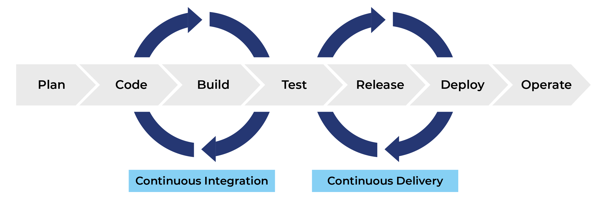

# Continuous Integration

[Slides](../slides/day6_continuous_integration.pdf){ .md-button }

- {align=right : style="height:100px;width:100px"}
    Learn how to write unit tests that cover both data and models in your ML pipeline.

    [:octicons-arrow-right-24: M16: Unit testing](unittesting.md)

- {align=right : style="height:100px;width:100px"}
    Learn how to implement continuous integration using GitHub actions such that tests are automatically executed upon
    code changes.

    [:octicons-arrow-right-24: M17: GitHub Actions](github_actions.md)

- {align=right : style="height:100px;width:100px"}
    Learn how to use pre-commit to ensure that code that is not up to standard does not get committed.

    [:octicons-arrow-right-24: M18: Pre-commit](pre_commit.md)

- {align=right : style="height:100px;width:100px"}

    Learn how to implement continuous machine learning pipelines in GitHub actions.

    [:octicons-arrow-right-24: M19: Continuous Machine Learning](cml.md)

Continuous integration is a sub-discipline of the general field of *Continuous X*. Continuous X is one of the core
elements of modern DevOps, and by extension MLOps. Continuous X assumes that we have a (long) developer pipeline
(see image below) where we want to make some changes to our code, e.g:

- Update our training data or data processing
- Update our model architecture
- Something else...

Basically, any code change we expect will have an influence on the final result. The problem with
making changes to the start of our pipeline is that we want the change to propagate all the way through
to the end of the pipeline.

<figure markdown>
{ width="1000" }
<figcaption>
<a href="https://faun.pub/most-popular-ci-cd-pipelines-and-tools-ccfdce429867"> Image credit </a>
</figcaption>
</figure>

This is where *continuous X* comes into play. The word *continuous* here refers to the fact that the
pipeline should *continuously* be updated as we make code changes. You can also choose to think of this as the
*automatization* of processes. The *X* then covers that the process we need to go through to
automate steps in the pipeline depends on where we are in the pipeline, e.g. the tools needed to
do continuous integration are different from the tools needed to do continuous delivery.

In this session, we are going to focus on *continuous integration (CI)*. As indicated in the image above, continuous
integration usually takes care of the first part of the developer pipeline which has to do with the code base, code
building and code testing. This is paramount to automatization as we would rather catch bugs at the beginning
of our pipeline than at the end.

!!! tip "Learning objectives"

    The learning objectives of this session are:

    * Be able to write unit tests that cover both data and models in your ML pipeline
    * Know how to implement continuous integration using GitHub actions such that tests are automatically executed on
        code changes
    * Be able to use pre-commit to ensure that code that is not up to standard does not get committed
    * Know how to implement continuous integration for continuous building of containers
    * Basic knowledge of how machine learning processes can be implemented in a continuous way
