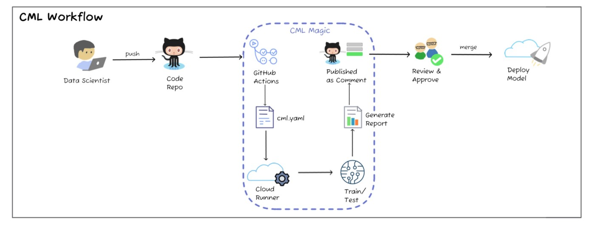
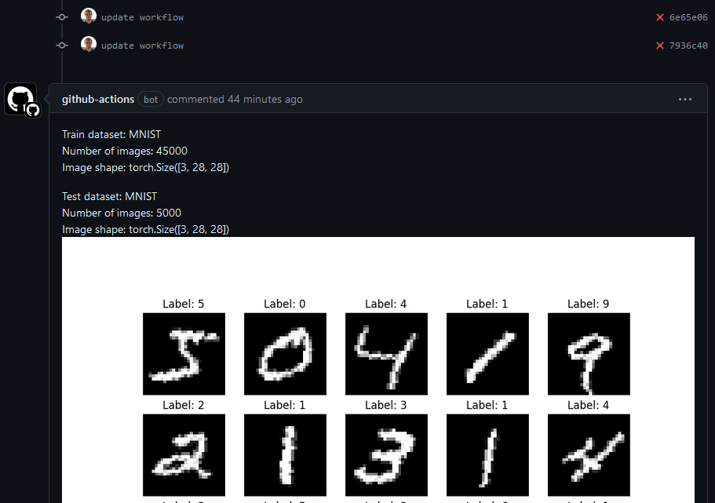
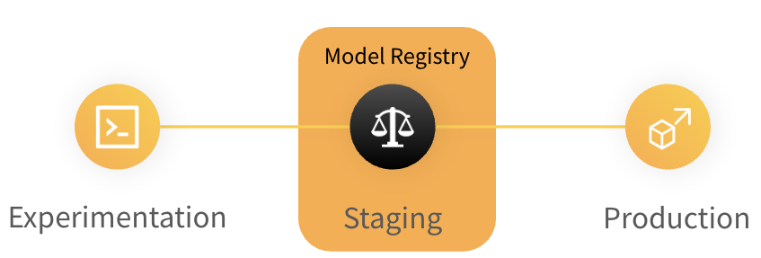
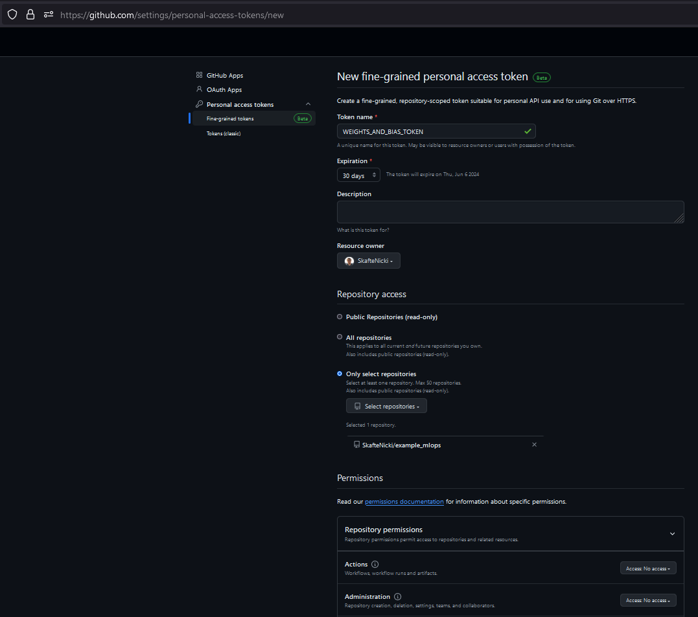
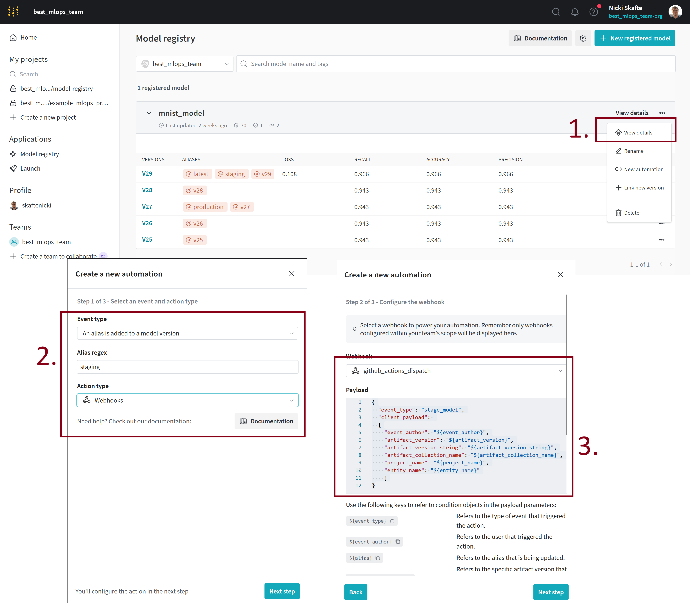

{ align=right width="130"}

# Continuous Machine Learning

---

The continuous integration we have looked at until now is what we can consider "classical" continuous integration, which
has its roots in DevOps and not MLOps. While the tests that we have written and the containers we have developed in the
previous session have been about machine learning, everything we have done translates completely to how it would be
done if we had developed any other application that did not include machine learning.

In this session, we are now going to change gears and look at **continuous machine learning** (CML). As the name may
suggest we are now focusing on automating actual machine learning processes. The reason for doing this is the same
as with continuous integration, namely that we often have a bunch of checks that we want our newly trained model to pass
before we trust it to be ready for deployment. Writing unit tests ensures that the code that we use for training our
model is not broken, but there exist other failure modes of a machine learning pipeline:

* Did I train on the correct data?
* Did my model converge at all?
* Did a metric that I care about improve?
* Did I overfit?
* Did I underfit?
* ...

All these questions are questions that we can answer by writing tests that are specific to machine learning. In this
session, we are going to look at how we can begin to use [GitHub Actions](github_actions.md) to automate these tests.

## MLOps maturity model

Before getting started with the exercises, let's first take a side step and look at what is called the MLOps maturity
model. The reason here is to get a better understanding of when continuous machine learning is relevant. The main idea
behind the MLOps maturity model is to help organizations understand where they are in their machine learning operations
journey and what the next logical steps are. The model is divided into five stages:

<figure markdown>
{ width="1000" }
<figcaption>
<a href="https://learn.microsoft.com/en-us/azure/architecture/ai-ml/guide/mlops-maturity-model"> Image credit </a>
</figcaption>
</figure>

`Level 0`

: At this level, organizations are doing machine learning in an ad-hoc manner. There is no standardization, no version
    control, no testing, and no monitoring.

`Level 1`

: At this level, organizations have started to implement DevOps practices in their machine learning workflows. They have
    started to use version control and maybe basic continuous integration practices.

`Level 2`

: At this level, organizations have started to standardize the training process and tackle the problem of creating
    reproducible experiments. Centralization of model artifacts and metadata is common at this level. They have started
    to implement model versioning and model registry practices.

`Level 3`

: At this level, organizations have started to implement continuous integration and continuous deployment practices.
    They have started to automate the testing of their models and have started to monitor their models in production.

`Level 4`

: At this level, organizations have started to implement continuous machine learning practices. They have started to
    automate the training, evaluation, and deployment of their models. They have started to implement automated
    retraining and model updates.

The MLOps maturity model tells us that continuous machine learning is the highest form of maturity in MLOps. It is the
stage where we have automated the entire machine learning pipeline and the cases we will be going through in the
exercises are therefore some of the last steps in the MLOps maturity model.

## ❔ Exercises

In the following exercises, we are going to look at two different cases where we can use continuous machine learning.
The first one is a simple case where we are automatically going to trigger some workflow (like model training)
whenever we make changes to our data. This is a very common use case in machine learning where we have a data pipeline
that is continuously updating our data. The second case is connected to staging and deploying models. In this case, we
are going to look at how we can automatically do further processing of our model whenever we push a new model to our
repository.

1. For the first set of exercises, we are going to rely on the `cml` framework by [iterative.ai](https://iterative.ai/),
    which is a framework that is built on top of GitHub actions. The figure below describes the overall process using
    the `cml` framework. It should be clear that it is the very same process that we go through in the other
    continuous integration sessions: `push code` -> `trigger GitHub actions` -> `do stuff`. The new part in this
    session is that we are only going to trigger whenever data changes.

    <figure markdown>
    { width="1000" }
    <figcaption>
    <a href="https://towardsdatascience.com/continuous-machine-learning-e1ffb847b8da"> Image credit </a>
    </figcaption>
    </figure>

    1. If you have not already created a dataset class for the corrupted MNIST data, start by doing that. Essentially,
        it is a class that should inherit from `torch.utils.data.Dataset` and should have `__getitem__` and `__len__`.

        ??? success "Solution"

            ```python linenums="1" title="dataset.py"
            --8<-- "s5_continuous_integration/exercise_files/dataset.py"
            ```

    2. Then let's create a function that can report basic statistics such as the number of training samples, number
        of test samples and generate figures of sample images in the dataset and distribution of classes in the
        dataset. This function should be called `dataset_statistics` and should take a path to the dataset as input.

        ??? success "Solution"

            ```python linenums="1" title="dataset.py"
            --8<-- "s5_continuous_integration/exercise_files/dataset_statistics.py"
            ```

    3. Next, we are going to implement a GitHub actions workflow that only activates when we make changes to our data.
        Create a new workflow file (call it `cml_data.yaml`) and make sure it only activates on push/pull-request events
        when `data/` changes. Relevant
        [documentation](https://docs.github.com/en/actions/using-workflows/workflow-syntax-for-github-actions#onpushpull_requestpull_request_targetpathspaths-ignore)

        ??? success "Solution"

            The secret is to use the `paths` keyword in the workflow file. We here specify that the workflow should only
            trigger when the `.dvc` folder or any file with the `.dvc` extension changes, which is the case when we
            update our data and call `dvc add data/`.

            ```yaml

            name: DVC Workflow

            on:
              pull_request:
                branches:
                - main
                paths:
                - '**/*.dvc'
                - '.dvc/**'
            ```

    4. The next step is to implement steps in our workflow that do something when data changes. This is the reason
        why we created the `dataset_statistics` function. Implement a workflow that:

        1. Checks out the code
        2. Sets up Python
        3. Installs dependencies
        4. Downloads the data
        5. Runs the `dataset_statistics` function on the data

        ??? success "Solution"

            This solution assumes that data is stored in a GCP bucket and that the credentials are stored in a secret
            called `GCP_SA_KEY`. If this is not the case for you, you need to adjust the workflow accordingly with
            the correct way to pull the data.

            ```yaml
            jobs:
              run_data_checker:
                runs-on: ubuntu-latest
                steps:
                - name: Checkout code
                  uses: actions/checkout@v5

                - name: Set up Python
                  uses: actions/setup-python@v5
                  with:
                    python-version: 3.11
                    cache: 'pip'
                    cache-dependency-path: setup.py

                - name: Install dependencies
                  run: |
                    make dev_requirements
                    pip list

                - name: Auth with GCP
                  uses: google-github-actions/auth@v2
                  with:
                    credentials_json: ${{ secrets.GCP_SA_KEY }}

                - name: Pull data
                  run: |
                    dvc pull --no-run-cache

                - name: Check data statistics
                  run: |
                    python dataset_statistics.py
            ```

    5. Let's make sure that the workflow works as expected for now. Create a new branch and either add or remove a file
        in the `data/` folder. Then run

        ```bash
        dvc add data/
        git add data.dvc
        git commit -m "Update data"
        git push
        dvc push
        ```

        to commit the changes to data. Open a pull request with the branch and make sure that the workflow activates
        and runs as expected.

    6. Let's now add the `cml` framework such that we can comment the results of the `dataset_statistics` function in
        the pull request automatically. Look at the
        [getting started guide](https://github.com/iterative/cml#getting-started) for help on how to do this. You will
        need to write all the content of the `dataset_statistics` function to a file called `report.md` and then use the
        `cml comment create` command to create a comment in the pull request with the content of the file.

        ??? success "Solution"

            ```yaml
            jobs:
              dataset_statistics:
                runs-on: ubuntu-latest
                steps:
                # ...all the previous steps
                - name: Check data statistics & generate report
                run: |
                  python src/example_mlops/data.py > data_statistics.md
                  echo '' >> data_statistics.md
                  echo '' >> data_statistics.md
                  echo '' >> data_statistics.md

                - name: Setup cml
                  uses: iterative/setup-cml@v2

                - name: Comment on PR
                  env:
                    REPO_TOKEN: ${{ secrets.GITHUB_TOKEN }}
                  run: |
                    cml comment create data_statistics.md --watermark-title="Data Checker" # (1)!
            ```

            1. :man_raising_hand: The `--watermark-title` flag is used to watermark the comment created by `cml`. It is
                to make sure that no new comments are created every time the workflow runs.

    7. Make sure that the workflow works as expected. You should see a comment created by `github-actions (bot)` like
        this if you have done everything correctly:

        <figure markdown>
        { width="600" }
        </figure>

    8. (Optional) Feel free to add more checks to the workflow. For example, you could add a check that runs a small
        baseline model on the updated data and checks that the model converges. This is a very common sanity check that
        is done in machine learning pipelines.

2. For the second set of exercises, we are going to look at how to automatically run further testing of our models
    whenever we add them to our model registry. For that reason, do not continue with this set of exercises before you
    have completed the exercises on the model registry in [this module](../s4_debugging_and_logging/logging.md).

    <figure markdown>
    { width="600" }
    <figcaption>
    The model registry is in general a repository of a team's trained models where ML practitioners publish candidates
    for production and share them with others. Figure from [wandb](https://docs.wandb.ai/guides/model_registry).
    </figure>

    !!! warning "Wandb updates their interface regularly"

        The interface of wandb is updated regularly. Therefore, it is possible that some of the screenshots and precise
        instructions are slightly out of date. However, the overall process should still be the same.

    1. The first step is in our weights and bias account to create a team. Some of these more advanced features are only
        available for teams, however every user is allowed to create one team for free. Go to your weights and bias
        account and create a team (the option should be on the left side of the UI). Give a team name and select W&B
        cloud storage.

    2. Now we need to generate a personal access token that can link our weights and bias account to our GitHub account.
        Go to [this page](https://github.com/settings/personal-access-tokens/new) and generate a new token. You can also
        find the page by clicking your profile icon in the upper right corner of GitHub and selecting
        `Settings`, then `Developer settings`, then `Personal access tokens` and finally choose either
        `Tokens (classic)` or `Fine-grained tokens` (which is the safer option, which is also what the link points to).

        <figure markdown>
        { width="500" }
        </figure>

        Give it a name, set what repositories it should have access to and select the permissions you want it to have.
        In our case if you choose to create a `Fine-grained token` then it needs access to the `contents:write`
        permission. If you choose `Tokens (classic)` then it needs access to the `repo` permission. After you have
        created the token, copy it and save it somewhere safe.

    3. Go to the settings of your newly created team: <https://wandb.ai/teamname/settings> and scroll down to the
        `Team secrets` section. Here add the token you just created as a secret with the name `GITHUB_ACTIONS_TOKEN`.
        WANDB will now be able to use this token to trigger actions in your repository.

    4. On the same settings page, scroll down to the `Webhooks` settings. Click the `New webhook` button in fill in the
        following information:

        * Name: `github_actions_dispatch`
        * URL: `https://api.github.com/repos/<owner>/<repo>/dispatches`
        * Access token: `GITHUB_ACTIONS_TOKEN`
        * Secret: leave empty

        Here you need to replace `<owner>` and `<repo>` with your own information. The `/dispatches` endpoint is a
        special endpoint that all GitHub action workflows can listen to. Thus, if you ever want to set up a webhook in
        some other framework that should trigger a GitHub action, you can use this endpoint.

    5. Next, navigate to your model registry. It should hopefully contain at least one registry with at least one model
        registered. If not, go back to the previous module and do that.

    6. When you have a model in your registry, click on the `View details` button. Then click the `New automation`
        button. On the first page, select that you want to trigger the automation when an alias is added to a model
        version, set that alias to `staging` and select the action type to be `Webhook`. On the next page, select the
        `github_actions_dispatch` webhook that you just created and add this as the payload:

        ```json
        {
            "event_type": "staged_model",
            "client_payload":
            {
                "event_author": "${event_author}",
                "artifact_version": "${artifact_version}",
                "artifact_version_string": "${artifact_version_string}",
                "artifact_collection_name": "${artifact_collection_name}",
                "project_name": "${project_name}",
                "entity_name": "${entity_name}"
            }
        }
        ```

        Finally, on the next page give the automation a name and click `Create automation`.

        <figure markdown>
        { width="500" }
        </figure>

        Make sure you understand overall what is happening here.

        ??? success "Solution"

            The automation is set up to trigger a webhook whenever the alias `staging` is added to a model version. The
            webhook is set up to trigger a GitHub action workflow that listens to the `/dispatches` endpoint and has
            the event type `staged_model`. The payload that is sent to the webhook contains information about the model
            that was staged.

    7. We are now ready to create the `GitHub actions workflow` that listens to the `/dispatches` endpoint and triggers
        whenever a model is staged. Create a new workflow file (called `stage_model.yaml`) and make sure it only
        activates on the `staged_model` event. Hint: relevant
        [documentation](https://docs.github.com/en/actions/using-workflows/events-that-trigger-workflows)

        ??? success "Solution"

            ```yaml
            name: Check staged model

            on:
              repository_dispatch:
                types: staged_model
            ```

            Do note that the `repository_dispatch` event will only trigger a workflow run if the workflow file exists
            on the default branch. Therefore, if you are testing this on a branch, you need to push the workflow file
            to the default branch.

    8. Next, we need to implement the steps in our workflow that do something when a model is staged. The payload that
        is sent to the webhook contains information about the model that was staged. Implement a workflow that:

        1. Identifies the model that was staged
        2. Sets an environment variable with the corresponding artifact path
        3. Outputs the model name

        ??? success "Solution"

            ```yaml
            jobs:
              identify_event:
                runs-on: ubuntu-latest
                outputs:
                  model_name: ${{ steps.set_output.outputs.model_name }}
                steps:
                  - name: Check event type
                    run: |
                      echo "Event type: repository_dispatch"
                      echo "Payload Data: ${{ toJson(github.event.client_payload) }}"

                  - name: Setting model environment variable and output
                    id: set_output
                    run: |
                      echo "model_name=${{ github.event.client_payload.artifact_version_string }}" >> $GITHUB_OUTPUT
            ```

    9. We now need to write a script that can be executed on our staged model. In this case, we are going to run some
        performance tests on it to check that it is fast enough for deployment. Therefore, do the following:

        1. In a `tests/performancetests` folder, create a new file called `test_model.py`.

        2. Implement a test that loads the model from a wandb artifact path e.g.
            <team-name>/<project-name>/<artifact-name>:<version> and runs it on a random input. Importantly, the
            artifact path should be read from an environment variable called `MODEL_NAME`.

        3. The test should assert that the model can do 100 predictions in less than X amount of time.

        ??? success "Solution"

            In this solution we assume that 4 environment variables are set: `WANDB_API`, `WANDB_ENTITY`,
            `WANDB_PROJECT` and `MODEL_NAME`.

            ```python linenums="1" title="test_model.py"
            import wandb
            import os
            import time
            from my_project.models import MyModel

            def load_model(artifact):
                api = wandb.Api(
                    api_key=os.getenv("WANDB_API_KEY"),
                    overrides={"entity": os.getenv("WANDB_ENTITY"), "project": os.getenv("WANDB_PROJECT")},
                )
                artifact = api.artifact(model_checkpoint)
                artifact.download(root=logdir)
                file_name = artifact.files()[0].name
                return MyModel.load_from_checkpoint(f"{logdir}/{file_name}")

            def test_model_speed():
                model = load_model(os.getenv("MODEL_NAME"))
                start = time.time()
                for _ in range(100):
                    model(torch.rand(1, 1, 28, 28))
                end = time.time()
                assert end - start < 1
            ```

    10. Let's now add another job that calls the script we just wrote. It needs to:

        * Set the correct environment variables
        * Checkout the code
        * Setup Python
        * Install dependencies
        * Run the test

        which is very similar to the kind of jobs we have written before.

        ??? success "Solution"

            ```yaml
            jobs:
              identify_event:
                ...
              test_model:
                runs-on: ubuntu-latest
                needs: identify_event
                env:
                  WANDB_API_KEY: ${{ secrets.WANDB_API_KEY }}
                  WANDB_ENTITY: ${{ secrets.WANDB_ENTITY }}
                  WANDB_PROJECT: ${{ secrets.WANDB_PROJECT }}
                  MODEL_NAME: ${{ needs.identify_event.outputs.model_name }}
                steps:
                - name: Echo model name
                  run: |
                    echo "Model name: $MODEL_NAME"
                - name: Checkout code
                  uses: actions/checkout@v5

                - name: Set up Python
                  uses: actions/setup-python@v5
                  with:
                    python-version: 3.11
                    cache: 'pip'
                    cache-dependency-path: setup.py

                - name: Install dependencies
                  run: |
                    pip install -r requirements.txt
                    pip list

                - name: Test model
                  run: |
                    pytest tests/performancetests/test_model.py
            ```

    11. Finally, we are going to assume in this setup that if the model gets this far then it is ready for deployment.
        We are therefore going to add a final job that will add a new alias to the model called `production`. Here is
        some relevant Python code that can be used to add the alias:

        ```python
        import typer
        import os
        import wandb


        def link_model(artifact_path: str, aliases: list[str] = ["staging"]) -> None:
            """
            Stage a specific model to the model registry.

            Args:
                artifact_path: Path to the artifact to stage.
                    Should be of the format "entity/project/artifact_name:version".
                aliases: List of aliases to link the artifact with.

            Example:
                model_management link-model entity/project/artifact_name:version -a staging -a best

            """
            if artifact_path == "":
                typer.echo("No artifact path provided. Exiting.")
                return

            api = wandb.Api(
                api_key=os.getenv("WANDB_API_KEY"),
                overrides={"entity": os.getenv("WANDB_ENTITY"), "project": os.getenv("WANDB_PROJECT")},
            )
            _, _, artifact_name_version = artifact_path.split("/")
            artifact_name, _ = artifact_name_version.split(":")

            artifact = api.artifact(artifact_path)
            artifact.link(target_path=f"{os.getenv('WANDB_ENTITY')}/model-registry/{artifact_name}", aliases=aliases)
            artifact.save()
            typer.echo(f"Artifact {artifact_path} linked to {aliases}")

        if __name__ == "__main__":
            typer.run(link_model)
        ```

        For example, you can run this script with the following command:

        ```bash
        python link_model.py entity/project/artifact_name:version -a staging -a production
        ```

        Implement a final job that calls this script and adds the `production` alias to the model.

        ??? success "Solution"

            ```yaml
            jobs:
              identify_event:
                ...
              test_model:
                ...
              add_production_alias:
                runs-on: ubuntu-latest
                needs: identify_event
                env:
                  WANDB_API_KEY: ${{ secrets.WANDB_API_KEY }}
                  WANDB_ENTITY: ${{ secrets.WANDB_ENTITY }}
                  WANDB_PROJECT: ${{ secrets.WANDB_PROJECT }}
                  MODEL_NAME: ${{ needs.identify_event.outputs.model_name }}
                steps:
                - name: Echo model name
                  run: |
                    echo "Model name: $MODEL_NAME"

                - name: Checkout code
                  uses: actions/checkout@v5

                - name: Set up Python
                  uses: actions/setup-python@v5
                  with:
                    python-version: 3.11
                    cache: 'pip'
                    cache-dependency-path: setup.py

                - name: Install dependencies
                  run: |
                    pip install -r requirements.txt
                    pip list

                - name: Add production alias
                  run: |
                    python link_model.py $MODEL_NAME -a production
            ```

    12. Finally, make sure the workflow works as expected. To try it out again and again for testing purposes, you can
        just manually add and then delete the `staging` alias to any model version in the model registry.

    13. (Optional) Consider adding more checks to the workflow. For example, you could add a step that checks if the
        model is too large for deployment, runs some further evaluation scripts, or checks if the model is robust to
        adversarial attacks. Only the imagination sets the limits here.

3. (Optional) If you have gotten this far, consider combining principles from the two exercises. Here is an idea: we use
    the workflow from the second exercise to trigger a workflow that checks a staged model for performance. We then
    use the `cml` framework to automatically create a pull request e.g. use `cml pr create` instead of
    `cml comment create` to create a pull request with the results of the performance test. Then if we are happy with
    the performance, we can then approve that pull request and the production alias is added to the model. This is a
    better workflow because it allows for human intervention before the model is deployed.

### 🧠 Knowledge check

1. What is the difference between continuous integration and continuous machine learning?

    ??? success "Solution"

        There are three key differences between continuous integration and continuous machine learning:

        * Scope: CI focuses on integrating and testing software code, while CML encompasses the entire lifecycle of
            machine learning models, including data handling, model training, evaluation, deployment, and monitoring.
        * Automation Focus: CI automates code testing and integration, whereas CML automates the training, evaluation,
            deployment, and monitoring of machine learning models.
        * Feedback Mechanisms: CI primarily uses automated tests to provide feedback on code quality. CML uses
            performance metrics from deployed models to provide feedback and trigger retraining or model updates.

2. Imagine you get hired in the pharmaceutical industry and are asked to develop a machine learning pipeline that can
    automatically determine which drugs are safe and which are not. What level of the MLOps maturity model would you
    strive to reach?

    ??? success "Solution"

        There is really no right or wrong answer here, but in most cases we would actually not aim for level 4. The
        reason is that the consequences of a bad model in this case can be severe. Therefore, we would probably not want
        automated retraining and model updates, which is what level 4 is about. Instead, we would probably aim for level
        3 where we have automated testing and monitoring of our models but there is still human oversight in the
        process.

This ends the module on continuous machine learning. As we have hopefully convinced you, it is only the imagination that
sets the limits for what you can use GitHub actions for in your machine learning pipeline. However, we do want to stress
that it is important that human oversight is always present in the process. Automation is great, but it should never
replace human judgement. This is especially true in machine learning where the consequences of a bad model can be
severe if it is used in critical decision making.

Finally, if you have completed the exercises on [using the cloud](../s6_the_cloud/using_the_cloud.md) consider checking
out the [cml runner lunch](https://cml.dev/doc/ref/runner#--cloud) command that allows you to run your workflows on
cloud resources instead of the GitHub action runners.
