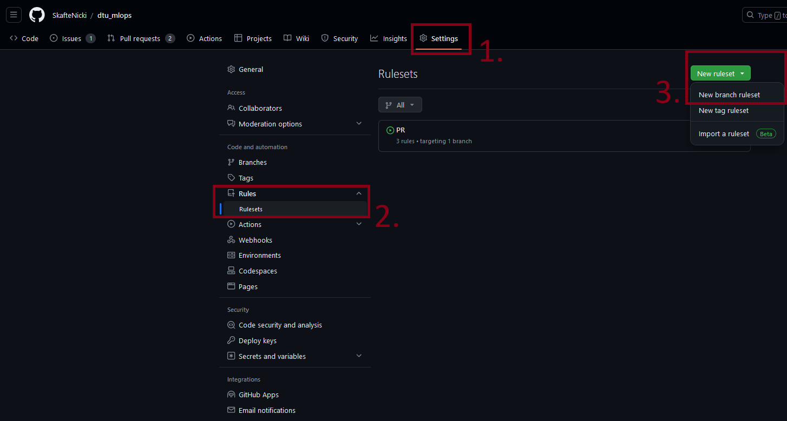
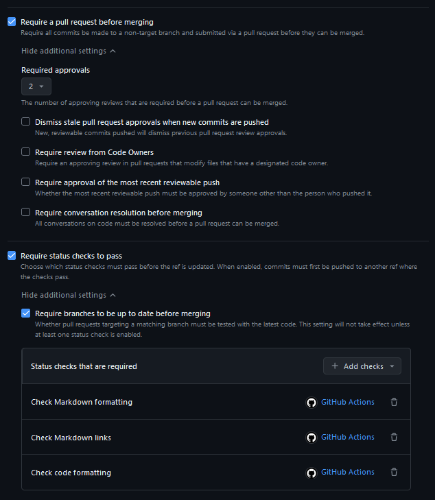
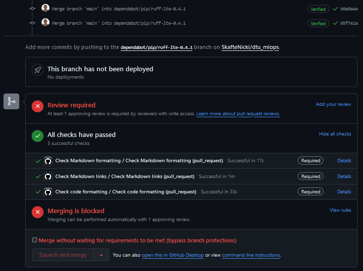
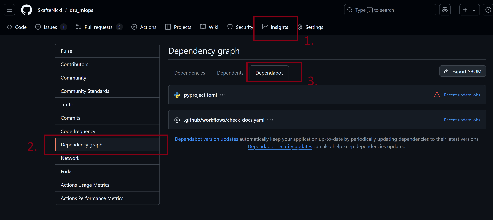
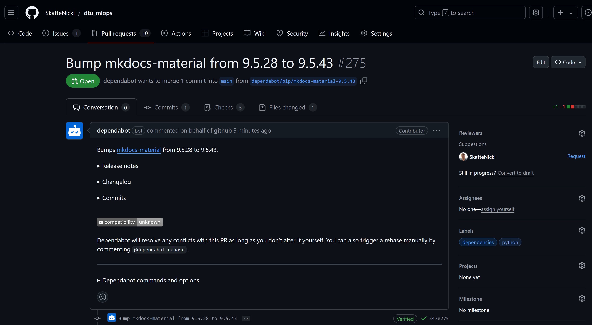
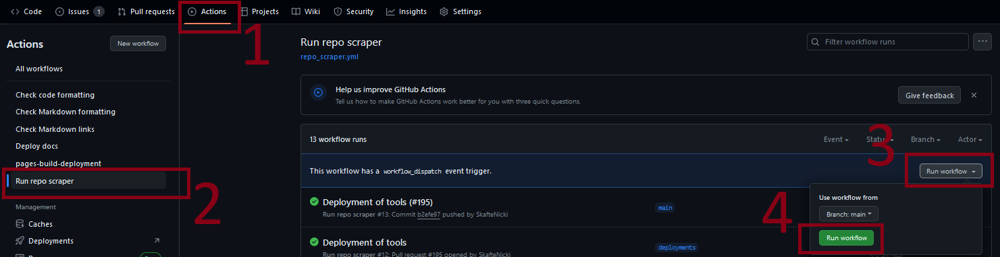

{ align=right width="130"}

# GitHub actions

---

!!! info "Core Module"

With the tests established in the previous module, we are now ready to move on to implementing some continuous
integration in our pipeline. As you probably have already realized testing your code locally may be cumbersome to do,
because

* You need to run it often to make sure to catch bugs early on
* If you want to have high code coverage of your code base, you will need many tests that take a long time to run

For these reasons, we want to automate the testing, such that it is done every time we push to our repository. If we
combine this with only pushing to branches and then only merging these branches whenever all automated testing has
passed, our code should be fairly safe against unwanted bugs (assuming your tests are well covering your code).

## GitHub actions

GitHub actions are the continuous integration solution that GitHub provides. Each of your repositories gets 2,000
minutes of free testing per month which should be more than enough for the scope of this course (and probably
all personal projects you do). Getting GitHub actions set up in a repository may seem complicated at
first, but workflow files that you create for one repository can more or less be reused for any
other repository that you have.

Let's take a look at how a GitHub workflow file is organized:

* Initially, we start by giving the workflow a `name`
* Next, we specify what events the workflow should be triggered. This includes both the action
    (pull request, push etc) and on what branches it should activate
* Next, we list the jobs that we want to do. Jobs are by default executed in parallel but can
    also be dependent on each other
* In the `runs-on`, we can specify which operation system we want the workflow to run on.
* Finally, we have the `steps`. This is where we specify the actual commands that should be
    run when the workflow is executed.

<figure markdown>
{ width="1000" }
<figcaption>
<a href="https://madewithml.com/courses/mlops/cicd/#github-actions"> Image credit </a>
</figcaption>
</figure>

### ❔ Exercises

1. Start by creating a `.github` folder in the root of your repository. Add a sub-folder to that called `workflows`.

2. Go over this [page](https://docs.github.com/en/actions/guides/building-and-testing-python) that explains how to do
    automated testing of Python code in GitHub actions. You do not have
    to understand everything, but at least get a feeling of what a workflow file should look like.

3. We have provided a workflow file called `tests.yaml` that should run your tests for you. Place
    this file in the `.github/workflows/` folder. The workflow file consists of three steps

    * First, a Python environment is initiated (in this case Python 3.8)

    * Next all dependencies required to run the test are installed

    * Finally, `pytest` is called and our tests will be run

    Go over the file and try to understand the overall structure and syntax of the file.

    ??? example "`tests.yaml`"

        ```python linenums="1" title="tests.yaml"
        --8<-- "s5_continuous_integration/exercise_files/tests.yaml"
        ```

4. For the script to work you need to define the `requirements.txt` and `requirements_tests.txt`. The first file should
    contain all packages required to run your code. The second file contains all *additional* packages required to run
    the tests. In your simple case, it may very well be that the second file is empty, however, sometimes additional
    packages are used for testing that are not strictly required for the scripts to run.

5. Finally, try pushing the changes to your repository. Hopefully, your tests should just start, and you will after some
    time see a green check mark next to the hash of the commit. Also, try to inspect the *Actions* tap where you can see
    the history of actions run.

    <figure markdown>
    { width="1000" }
    </figure>

6. Normally we develop code on only one operating system and just hope that it will work on other operating systems.
    However, continuous integration enables us to automatically test on other systems than the one we are using.

    1. The provided `tests.yaml` only runs on one operating system. Which one?

    2. Alter the file such that it executes the test on the two other main operating systems that exist. You can find
        information on available operating systems also called *runners*
        [here](https://docs.github.com/en/actions/using-github-hosted-runners/about-github-hosted-runners/about-github-hosted-runners#standard-github-hosted-runners-for-public-repositories)

        ??? success "Solution"

            We can "parametrize" of script to run on different operating systems by using the `strategy` attribute. This
            attribute allows us to define a matrix of values that the workflow will run on. The following code will run
            the tests on `ubuntu-latest`, `windows-latest`, and `macos-latest`:

            ```yaml linenums="1" title="tests.yaml"
            jobs:
              build:
                runs-on: ${{ matrix.os }}
                strategy:
                  matrix:
                    os: ["ubuntu-latest", "windows-latest", "macos-latest"]
            ```

    3. Can you also figure out how to run the tests using different Python versions?

        ??? success "Solution"

            Just add another line to the `strategy` attribute that specifies the Python version and use the value in the
            setup Python action. The following code will run the tests on Python versions

            ```yaml linenums="1" title="tests.yaml"
            jobs:
              build:
                runs-on: ${{ matrix.os }}
                strategy:
                  matrix:
                    os: ["ubuntu-latest", "windows-latest", "macos-latest"]
                    python-version: ["3.10", "3.11", "3.12"]

                steps:
                - uses: actions/checkout@v4
                - name: Set up Python
                  uses: actions/setup-python@v5
                  with:
                    python-version: ${{ matrix.python-version }}
            ```

    4. If you push the changes above you will maybe see that whenever one of the tests in the matrix fails, it will
        automatically cancel the other tests. This is for saving time and resources. However, sometimes you want all the
        tests to run even if one fails. Can you figure out how to do that?

        ??? success "Solution"

            You can set the `fail-fast` attribute to `false` under the `strategy` attribute:

            ```yaml linenums="1" title="tests.yaml"
            jobs:
              build:
                runs-on: ${{ matrix.os }}
                strategy:
                  fail-fast: false
                  matrix:
                    os: ["ubuntu-latest", "windows-latest", "macos-latest"]
                    python-version: ["3.10", "3.11", "3.12"]
            ```

7. As the workflow is currently implemented, GitHub actions will destroy every downloaded package
    when the workflow has been executed. To improve this we can take advantage of `caching`:

    1. Figure out how to implement `caching` in your workflow file. You can find a guide
        [here](https://docs.github.com/en/actions/guides/caching-dependencies-to-speed-up-workflows) and
        [here](https://github.com/actions/setup-python#caching-packages-dependencies).

        ??? success "Solution"

            ```yaml linenums="1" title="tests.yaml"
            steps:
            - uses: actions/checkout@v4
            - uses: actions/setup-python@v5
              with:
                python-version: 3.11
                cache: 'pip' # caching pip dependencies
            - run: pip install -r requirements.txt
            ```

    2. When you have implemented a caching system go to `Actions->Caches` in your repository and make sure that they
        are correctly added. It should look something like the image below

        <figure markdown>
        { width="1000" }
        </figure>

    3. Measure how long your workflow takes before and after adding `caching` to your workflow. Did it improve the
        runtime of your workflow?

8. (Optional) Code coverage can also be added to the workflow file by uploading it as an artifact
    after running the coverage. Follow the instructions in this
    [post](https://about.codecov.io/blog/python-code-coverage-using-github-actions-and-codecov/)
    on how to do it.

9. With different checks in place, it is a good time to learn about *branch protection rules*. A branch
    protection rule is essentially some kind of guarding that prevents you from merging code into a branch before
    certain conditions are met. In this exercise, we will create a branch protection rule that requires all checks to
    pass before merging code into the main branch.

    1. Start by going into your `Settings -> Rules -> Rulesets` and create a new *branch* ruleset. See the image below.

        <figure markdown>
        { width="800" }
        </figure>

    2. In the ruleset start by giving it a name and then set the target branches to be `Default branch`. This means that
        the ruleset will be applied to your master/main branch. As shown in the image below, two rules may be
        particularly beneficial when you later start working with other people:

        * The first rule to consider is *Require a pull request before merging*. As the name suggests this rule
            requires that changes that are to be merged into the main branch must be done through a pull request. This
            is a good practice as it allows for code review and testing before the code is merged into the main branch.
            Additionally, this opens the option to specify that the code must be reviewed (or at least approved) by
            a certain number of people.

        * The second rule to consider is *Require status checks to pass*. This rule makes sure that our workflows
            are passing before we can merge code into the main branch. You can select which workflows are required, as
            some may be nice to have passing but not strictly needed.

        <figure markdown>
        { width="800" }
        </figure>

        Finally, if you think the rules are a bit too restrictive you can always add that the repository admin e.g. you
        can bypass the rules by adding `Repository admin` to the bypass list. Implement the following rules:

        * At least one person needs to approve any PR
        * All your workflows need to pass
        * All conversations need to be resolved

    3. If you have created the rules correctly you should see something like the image below when you try to merge a
        pull request. In this case, all three checks are required to pass before the code can be merged. Additionally,
        a single reviewer is required to approve the code. A bypass rule is also setup for the repository admin.

        <figure markdown>
        { width="800" }
        </figure>

10. One problem you may have encountered is running your tests that have to do with your data, with the core problem
    being that your data is not stored in GitHub (assuming you have done module
    [M8 - DVC](../s2_organisation_and_version_control/dvc.md)) and therefore cannot be tested. However, we can download
    data while running our continuous integration. Let's try to create that:

    1. The first problem is that we need our continuous integration pipeline to be able to authenticate with our storage
        solution. We can take advantage of an authentication file that is created the first time we push with DVC. It is
        located in `$CACHE_HOME/pydrive2fs/{gdrive_client_id}/default.json` where `$CACHE_HOME` depends on your
        operating system:

        === "macOS"
            ```~/Library/Caches```

        === "Linux"
            ```~/.cache``` <br>
            This is the typical location, but it may vary depending on what distro you are running

        === "Windows"
            ```{user}/AppData/Local```

        Find the file. The content should look similar to this (only some fields are shown):

        ```json
        {
            "access_token": ...,
            "client_id": ...,
            "client_secret": ...,
            "refresh_token": ...,
            ...
        }
        ```

    2. The content of that file should be treated as a password and not shared with the world and the relevant
        question is therefore how to use this info in a *public* repository. The answer is GitHub *secrets*, where we
        can store information, and access it in our workflow files and it is still not public. Navigate to the secrets
        option (as shown below) and create a secret with the name `GDRIVE_CREDENTIALS_DATA` that contains the content
        of the file you found in the previous exercise.

        <figure markdown>
        { width="1000" }
        </figure>

    3. Afterward, add the following code to your workflow file:

        ```yaml
        - uses: iterative/setup-dvc@v1
        - name: Get data
          run: dvc pull
          env:
            GDRIVE_CREDENTIALS_DATA: ${{ secrets.GDRIVE_CREDENTIALS_DATA }}
        ```

        that runs `dvc pull` using the secret authentication file. For help you can visit this
        [small repository](https://github.com/SkafteNicki/gha_dvc_test) that implements the same workflow.

    4. Finally, add the changes, commit, push and confirm that everything works as expected. You should now be able to
        run unit tests that depend on your input data.

11. In [module M6 on good coding practices](../s2_organisation_and_version_control/good_coding_practice.md)
    (optional module) of the course you were introduced to a couple of good coding practices such as being consistent
    with your coding style, how your Python packages are sorted and that your code follows certain standards. All this
    was done using the `ruff` framework. In this set of exercises, we will create GitHub workflows that will
    automatically test for this.

    1. Create a new workflow file called `codecheck.yaml`, that implements the following three steps

        * Setup Python environment

        * Installs `ruff`

        * Runs `ruff check` and `ruff format` on the repository

        (HINT: You should be able to just change the last steps of the `tests.yaml` workflow file)

        ??? success "Solution"

            ```yaml linenums="1" title="codecheck.yaml"
            name: Code formatting

            on:
              push:
                branches:
                - main
              pull_request:
                branches:
                - main

            jobs:
              format:
                  runs-on: ubuntu-latest
                  steps:
                  - name: Checkout code
                    uses: actions/checkout@v4
                  - name: Set up Python
                    uses: actions/setup-python@v5
                    with:
                      python-version: 3.11
                      cache: 'pip'
                      cache-dependency-path: setup.py
                  - name: Install dependencies
                    run: |
                      pip install ruff
                      pip list
                  - name: Ruff check
                    run: ruff check .
                  - name: Ruff format
                    run: ruff format .
            ```

    2. In addition to `ruff` we also used `mypy` in those sets of exercises for checking if the typing we added to our
        code was good enough. Add another step to the `codecheck.yaml` file which runs `mypy` on your repository.

    3. Try to make sure that all steps are passed on repository. Especially `mypy` can be hard to get a passing, so this
        exercise formally only requires you to get `ruff` passing.

12. (Optional) As you have probably already experienced in module [M9 on docker](../s3_reproducibility/docker.md) it can
    be cumbersome to build docker images, sometimes taking a couple of minutes to build each time we make changes to our
    code base. For this reason, we just want to build a new image every time we commit our code because that should mark
    that we believe the code to be working at that point. Thus, let's automate the process of building our docker images
    using GitHub actions. Do note that in a [future module](../s6_the_cloud/using_the_cloud.md) will look at how to
    build containers using cloud providers, and this exercise is therefore very much optional.

    1. Start by making sure you have a dockerfile in your repository. If you do not have one, you can use the following
        simple dockerfile:

        ```dockerfile
        FROM busybox
        CMD echo "Howdy cowboy"
        ```

    2. Push the dockerfile to your repository

    3. Next, create a [Docker Hub account](https://hub.docker.com/)

    4. Within Docker Hub create an access token by going to `Settings -> Security`. Click the `New Access Token` button
        and give it a name that you recognize.

    5. Copy the newly created access token and head over to your GitHub repository online. Go to
        `Settings -> Secrets -> Actions` and click the `New repository secret`. Copy over the access token and give
        it the name `DOCKER_HUB_TOKEN`. Additionally, add two other secrets `DOCKER_HUB_USERNAME` and
        `DOCKER_HUB_REPOSITORY` that contain your docker username and docker repository name respectively.

    6. Next, we are going to construct the actual GitHub actions workflow file

        ```yaml
        name: Docker Image continuous integration

        on:
          push:
            branches: [ master ]

        jobs:
            build:
            runs-on: ubuntu-latest
            steps:
            - uses: actions/checkout@v4
            - name: Build the Docker image
              run: |
                echo "${{ secrets.DOCKER_HUB_TOKEN }}" | docker login \
                  -u "${{ secrets.DOCKER_HUB_USERNAME }}" --password-stdin docker.io
                docker build . --file Dockerfile \
                  --tag docker.io/${{ secrets.DOCKER_HUB_USERNAME }}/${{ secrets.DOCKER_HUB_REPOSITORY }}:$GITHUB_SHA
                docker push \
                  docker.io/${{ secrets.DOCKER_HUB_USERNAME }}/${{ secrets.DOCKER_HUB_REPOSITORY }}:$GITHUB_SHA
        ```

        The first part of the workflow file should look somewhat recognizable. However, the last three lines are where
        all the magic happens. Carefully go through them and figure out what they do. If you want some help you can look
        at the help page for `docker login`, `docker build` and `docker push`.

    7. Upload the workflow to your GitHub repository and check that it is being executed. If everything works you should
        be able to see the build docker image in your container repository in the docker hub.

    8. Make sure that you can execute `docker pull` locally to pull down the image that you just continuously build

    9. (Optional) To test that the container works directly in GitHub you can also try to include an additional
        step that runs the container.

        ```yaml
            - name: Run container
              run: |
                docker run ...
        ```

## Dependabot

A great feature that GitHub provides is the ability to have bots help you with maintaining your repository. One of the
most useful bots is called `Dependabot`. As the name suggests, `Dependabot` helps you keep your dependencies up to date.
This is important because dependencies often either contain fixes for bugs or security vulnerabilities that you want to
have in your code.

### ❔ Exercises

1. To get dependabot working in your repository, we need to add a single configuration file to your repository. Create
    a file called `.github/dependabot.yaml`. Look through the
    [documentation](https://docs.github.com/en/code-security/dependabot/dependabot-version-updates/) for how to set up
    the file such that it updates your Python dependencies on a weekly basis.

    ??? success "Solution"

        The following code will check for updates in the `pip` ecosystem every week e.g. it automatically will look
        for `requirements.txt` files and update the packages in there.

        ```yaml
        version: 2
        updates:
          - package-ecosystem: "pip"
            directory: "/"
            schedule:
              interval: "weekly"
        ```
2. Push the changes to your repository and check that the dependabot is working by going to the `Insights` tab and
    then the `Dependency graph` tab. From here you under the `Dependabot` tab should be able to see if the bot has
    correctly identified what files to track and if it has found any updates.

    <figure markdown>
    { width="1000" }
    </figure>

    Click the `Recent update jobs` to see the history of Dependabot checking for updates. If there are no updates you
    can try to click the `Check for updates` button to force Dependabot to check for updates.

3. At this point the Dependabot should hopefully have found some updates and created one or more pull requests. If it
    has not done so you most likely need to update your requirement file such that your dependencies are correctly
    restricted/specified e.g.

    ```txt
    # lets assume pytorch v2.5 is the latest version

    # these different specifications will not trigger dependabot because
    # the latest version is included in the specification
    torch
    torch == 2.5
    torch >= 2.5
    torch ~= 2.5

    # these specifications will trigger dependabot because the latest
    # version is not included
    torch < 2.5
    torch == 2.4
    torch <= 2.4
    ```

    If you have a pull request from Dependabot, check it out and see if it looks good. If it does, you can merge it.

    <figure markdown>
    { width="1000" }
    </figure>

4. (Optional) Dependabot can also help keeping our GitHub Actions pipelines up-to-date. As you may have realized
    during this module, when we write statements like in our workflow files:

    ```yaml
    ...
    jobs:
      build:
        runs-on: ubuntu-latest
        steps:
        - uses: actions/checkout@v4
    ...
    ```

    The `@v4` specifies that we are using version 4 of the `actions/checkout` action. This means that if a new version
    of the action is released, we will not automatically get the new version. Dependabot can help us with this. Try
    adding to the `dependabot.yaml` file that Dependabot should also check for updates in the GitHub Actions ecosystem.

    ??? success "Solution"

        ```yaml
        version: 2
        updates:
          - package-ecosystem: "pip"
            directory: "/"
            schedule:
              interval: "weekly"
          - package-ecosystem: "github-actions"
            schedule:
              interval: "weekly"
        ```

## 🧠 Knowledge check

1. When working with GitHub actions you will often encounter the following 4 concepts:

    * Workflow
    * Runner
    * Job
    * Action

    Try to define them in your own words.

    ??? success "Solution"

        * Workflow: A `yaml` file that defines the instructions to be executed on specific events. Needs to be placed in
            the `.github/workflows` folder.
        * Runner: Workflows need to run somewhere. The environment that the workflow is being executed on is called the
            runner. Most commonly the runner is hosted by GitHub but can also hosted by yourself.
        * Job: A series of steps that are executed on the same runner. A workflow must include at least one job but
            often contains many.
        * Action: An action is the smallest unit in a workflow. Jobs often consist of multiple actions that are
            executed sequentially.

2. The `on` attribute specifies upon which events the workflow will be triggered. Assume you have set the `on` attribute
    to the following:

    ```yaml
    on:
        push:
          branches: [main]
        pull_request:
          branches: [main]
        schedule:
          - cron: "0 0 * * *"
        workflow_dispatch: {}
    ```

    What 4 events would trigger the execution of that action?

    ??? success "Solution"

        1. Direct push to branch `main` would trigger it
        2. Any pull request opened that will merge into `main` will trigger it
        3. At the end of the day the action would trigger, see [cron](https://en.wikipedia.org/wiki/Cron) for more info
        4. The trigger can be executed by manually triggering it through the GitHub UI, for example, shown below

            <figure markdown>
            { width="800" }
            </figure>

This ends the module on GitHub workflows. If you are more interested in this topic you can check out module
[M31 on documentation](../s10_extra/documentation.md) which first includes locally building some documentation for your
project and afterward use GitHub actions for deploying it to GitHub Pages. Additionally, GitHub also has a lot of
templates already for running different continuous integration tasks. If you try to create a workflow file directly in
GitHub you may encounter the following page


We highly recommend checking this out if you want to write any other kind of continuous integration pipeline in GitHub
actions. We can also recommend this [repository](https://github.com/sdras/awesome-actions) that has a list of awesome
actions and check out the [act](https://github.com/nektos/act) repository which is a tool for running your GitHub
Actions locally!
