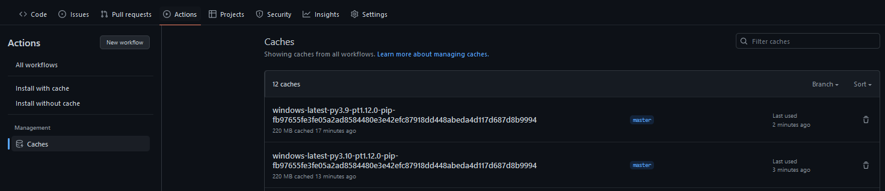
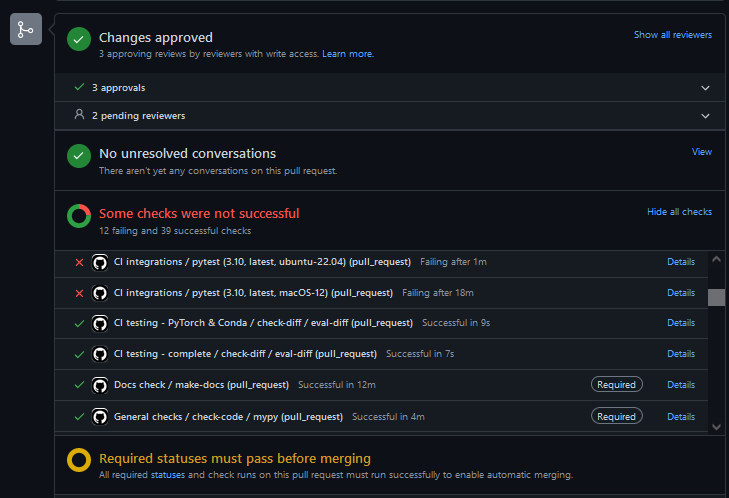
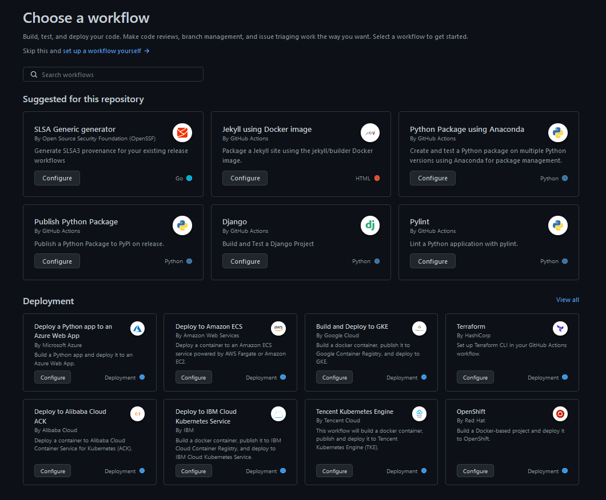

# Github actions
{: .no_toc }

<details open markdown="block">
  <summary>
    Table of contents
  </summary>
  {: .text-delta }
1. TOC
{:toc}
</details>

---

{: .important }
> Core module

With the tests established in the previous module we are now ready to move on to actually implementing some continuous
integration in our pipeline. As you probably have already realized testing your code locally may take cumbersome to do,
because

* You need to run it often to make sure to catch bugs early on
* If you want to have high code coverage of your code base, you will need many tests that takes a long time to run

For these reasons we want to automatize the testing, such that it done every time we push to our repository. If we
combine this with only pushing to branches and then only merging these branches whenever all automatized testing have
passed, our code should be fairly safe against unwanted bugs (assuming your tests are well covering your code).

## Github actions
Github actions are the CI solution that Github provides. Each of your repositories gets 2,000 minutes
of free testing per month which should be more than enough for the scope of this course (and probably
all personal projects you do). Getting Github actions setup in a repository may seem complicated at
first, but workflow files that you create for one repository can more or less be reused for any
other repository that you have.

Lets take a look at how a github workflow file is organized:

* Initially we start by giving the workflow a `name`
* Next we specify on what events the workflow should be triggered. This includes both the action
  (pull request, push ect) and on what branches is should activate
* Next we list the jobs that we want to do. Jobs are by default executed in parallel but can
  also be dependent on each other
* In the `runs-on` we can specify which operation system we want the workflow to run on. We also
  have the possibility to specify multiple.
* Finally we have the `steps`. This is where we specify the actual commands that should be
  run when the workflow is executed.

<p align="center">
  
</p>

### Exercises

1. Start by creating a `.github` folder in the root of your repository.
   Add a sub-folder to that called `workflows`.

2. Go over this [page](https://docs.github.com/en/actions/guides/building-and-testing-python)
   that explains how to do automated testing of python code in github actions. You do not have
   to understand everything, but at least get a feeling of what a workflow file should look like.

3. We have provided a workflow file called `tests.yml` that should run your tests for you. Place
   this file in the `.github/workflows/` folder. The workflow file consist of three steps

   * First a python environment is setup (in this case python 3.8)

   * Next all dependencies required to run the test are installed

   * Finally, `pytest` is called and test will be run

4. For the script to work you need to define the `requirements.txt` and `requirements_tests.txt`.
   The first file should contain all packages required to run your code. The second file is all
   *additional*  packages required to run the tests. In your simple case it may very well be that
   the second file is empty, however sometimes additional packages are used for testing that are
   not strictly required for the scripts to run.

5. Finally, try pushing the changes to your repository. Hopefully your tests should just start,
   and you will after sometime see a green check mark next to hash of the commit. Also try to
   checkout the *Actions*  tap where you can see the history of actions run.

   <p align="center">
      
   </p>

6. Normally we develop code one operating system and just hope that it will work on other operating
   systems. However, CI enables us to automatically test on other systems than ourself.

   1. The provided `tests.yml` only runs on one operating system. Which one?

   2. Alter the file (or write a new) that executes the test on the two other main operating
      systems that exist.

7. As the workflow is currently setup, github actions will destroy every downloaded package
   when the workflow has been executed. To improve this we can take advantage of `caching`:

   1. Figure out how to implement `caching` in your workflow file. Hint: checkout this guide
      [page](https://docs.github.com/en/actions/advanced-guides/caching-dependencies-to-speed-up-workflows) .
      If you need help, you can check out [this small repository](https://github.com/SkafteNicki/gh_tester) where
      I have setup a simple caching vs non-caching experiment with all the requirements that are installed throughout
      this course.

   2. When you have implemented a caching system go to `Actions->Caches` in your repository and make sure that they
      are correctly added. It should look something like the image below

      <p align="center">
         
      </p>

   3. Measure how long your workflow takes before and after adding `caching` to your workflow. Did it improve the
      runtime of your workflow?

8. (Optional) Code coverage can also be added to the workflow file by uploading it as an artifact
   after running the coverage. Follow the instructions in this
   [post](https://about.codecov.io/blog/python-code-coverage-using-github-actions-and-codecov/)
   on how to do it.

9. As stated in the introduction, ideally we want to only push our code to branches, such that our workflows run
   before we actually merge code into our codebase. We can directly prevent bad behavior by adding *branch
   protection rules* to our repository. Take the image below as an example from one of my own PRs:

   <p align="center">
     
   </p>

   In this example, the PR cannot be merge to the *main* branch before the following is fulfilled: At least 2 reviewers
   with write access have approved the PR, all Github actions marked as *Required* are passing and all conversations
   needs to be resolved. Since not all important tests are passing, further changes are necessary. We want to
   implement something similar. Do the following:

   1. On your Github repository of choice, go to `Settings -> Branches -> Add branch protection rule`:

   2. To your main/master branch add the following rules:
      * Atleast one person needs to approve any PR
      * All your workflows has to pass
      * All conversations needs to be resolved

   3. To test that everything works, try creating a PR (possibly with a small bug) and see that your main/master
      branch is protected

10. One problem you may have encountered is running your tests that have to do with your data, with the core problem
    being that your data is actually not stored in github (assuming you have done module
    [M8 - DVC](../s2_organisation_and_version_control/dvc.md)) and therefore cannot be tested. However, it is possible
    for us to download data while running our CI. Lets try to setup that:

    1. The first problem is that we need our CI needs to be able to authenticate with the our storage solution. We can
       take advantage of an authentication file that is created the first time we push with DVC. It is located in
       `$CACHE_HOME/pydrive2fs/{gdrive_client_id}/default.json` where `$CACHE_HOME` depends on your operating system:

       macOS            | Linux (*typical) | Windows
       -----------------|------------------|----------
       ~/Library/Caches | ~/.cache         |	{user}/AppData/Local

       Find the file. The content should look similar to this (only some fields are shown):

       ```json
       {"access_token": ...,
        "client_id": ...,
        "client_secret": ...,
        "refresh_token": ...,
        ...
       }
       ```

    2. The content of that file is should be treated as an password an not shared with the world and the relevant
       question is therefore how to use this info in *public* repository. The answer is github *secrets*, where we can
       store information, access it in our workflow files and it is still not public. Navigate to the secrets option
       (as shown below) and create a secret with the name `GDRIVE_CREDENTIALS_DATA` that contains the content of the
       file you found in the previous exercise.

       <p align="center">
         
       </p>

    3. Afterwards, add the following code to your workflow file:

       ```yaml
       - uses: iterative/setup-dvc@v1

       - name: Get data
         run: dvc pull
         env:
           GDRIVE_CREDENTIALS_DATA: ${{ secrets.GDRIVE_CREDENTIALS_DATA }}
       ```

       that runs `dvc pull` using the secret authentication file. For help you can visit this
       [small repository](https://github.com/SkafteNicki/gha_dvc_test) that implements the same workflow.

    4. Finally, add the changes, commit, push and confirm that everything works as expected. You should now be able to
       run unit tests that depends on your input data.

## Auto linter

In [this module](../s2_organisation_and_version_control/good_coding_practice.md) of the course
you where introduced to a couple of good coding practices such as being consistent with how your
python packages are sorted and that your code follows certain standards. In this set of exercises
we will setup github workflows that will automatically test for this.

### Exercises

1. Create a new workflow file called `isort.yml`, that implements the following three steps

   * Setup python environment

   * Installs `isort`

   * Runs `isort` on the repository

   (HINT: You should be able to just change the last steps of the `tests.yml` workflow file)

2. Create a new workflow file called `flake8.yml`, that implements the following three steps

   * Setup python environment

   * Installs `flake8`

   * Runs `flake8` on the repository

   (HINT: You should be able to just change the last steps of the `tests.yml` workflow file)

3. Create a new workflow file  called `mypy.yml`, that implements the following three steps

   * Setup python environment

   * Installs `mypy`

   * Runs `mypy` on the repository

4. Try to make sure that all tests are passing on repository. Especially `mypy` can be hard
   to get passing, so this exercise formally only requires you to get `isort` and `flake8`
   passing.

This ends the module on Github workflows. If you have not already stumbled across this feature, if you try to create
a workflow file directly in Github you may encounter the following page



Github comes with many templates for writing actions file for whatever you may need, to make sure you have a good
starting point. We highly recommend checking this out if you want to write any other kind of CI pipeline in
Github actions. Additionally we can also recommend [this repository](https://github.com/sdras/awesome-actions) that
have an list of awesome actions.
