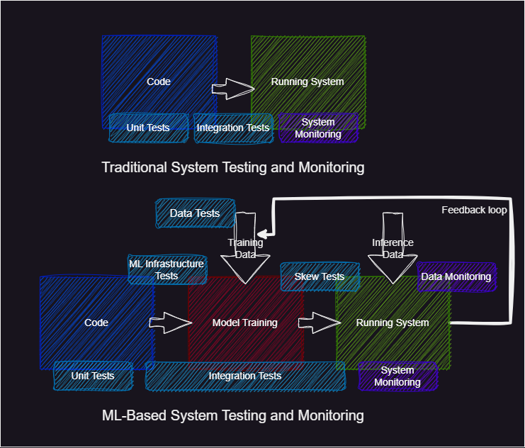

{ align=right width="130"}

# Unit testing

---

!!! info "Core Module"

What often comes to mind for many developers, when discussing continuous integration (CI) is code testing.
Continuous integration should ensure that whenever a codebase is updated it is automatically tested such that if bugs
have been introduced in the codebase it will be caught early on. If you look at the
[MLOps cycle](../figures/mlops-loop-en.jpg), continuous integration is one of the cornerstones of the operations part.
However, it should be noted that applying continuous integration does not magically secure that your code does not
break. Continuous integration is only as strong as the tests that are automatically executed.
Continuous integration simply structures and automates this.

!!! quote
    *Continuous Integration doesn’t get rid of bugs, but it does make them dramatically easier to find and remove.*
    <br> <br>
    Martin Fowler, Chief Scientist, ThoughtWorks

<figure markdown>
{ width="600" }
<figcaption>
<a href="https://devhumor.com/media/tests-won-t-fail-if-you-don-t-write-tests"> Image credit </a>
</figcaption>
</figure>

The kind of tests we are going to look at are called [unit testing](https://en.wikipedia.org/wiki/Unit_testing). Unit
testing refers to the practice of writing test that tests individual parts of your code base to test for correctness. By
unit, you can therefore think of a function, module or in general any object. By writing tests in this way it should be
very easy to isolate which part of the code broke after an update to the code base. Another way to test your code
base would be through [integration testing](https://en.wikipedia.org/wiki/Integration_testing) which is equally
important but we are not going to focus on it in this course.

Unit tests (and integration tests) are not a unique concept to MLOps but are a core concept of DevOps. However, it is
important to note that testing machine learning-based systems is much more difficult than traditional systems. The
reason for this is that machine learning systems depend on *data*, that influences the state of our system. For this
reason, we not only need unit tests and integration tests of our code we also need data testing, infrastructure testing
and more monitoring to check that we stay within the data distribution we are training on (more on this in
[module M25 on data drifting](../s8_monitoring/data_drifting.md)). This added complexity is illustrated in the figure
below.

<figure markdown>
{ width="1000" }
</figure>

## Pytest

Before we can begin to automate testing of our code base we of course need to write the tests first. It is both a hard
and tedious task to do but arguably the most important aspect of continuous integration. Python offers a couple of
different libraries for writing tests. We are going to use `pytest`.

### ❔ Exercises

The following exercises should be applied to your MNIST repository

1. The first part of doing continuous integration is writing the unit tests. We do not expect you to cover every part
    of the code you have developed but try to at least write tests that cover two files. Start by
    creating a `tests` folder.

2. Read the [getting started guide](https://docs.pytest.org/en/6.2.x/getting-started.html) for pytest
    which is the testing framework that we are going to use

3. Install pytest:

    ```bash
    pip install pytest
    ```

4. Write some tests. Below are some guidelines on some tests that should be implemented, but
    you are of course free to implement more tests. You can at any point check if your tests are
    passing by typing in a terminal

    ```bash
    pytest tests/
    ```

    When you implement a test you need to follow two standards, for `pytest` to be able to find your tests. First, any
    files created (except `__init__.py`) should always start with `test_*.py`. Secondly, any test implemented needs to
    be wrapped into a function that again needs to start with `test_*`:

    ```python
    # this will be found and executed by pytest
    def test_something():
        ...

    # this will not be found and executed by pytest
    def something_to_test():
        ...
    ```

    1. Start by creating a `tests/__init__.py` file and fill in the following:

        ```python
        import os
        _TEST_ROOT = os.path.dirname(__file__)  # root of test folder
        _PROJECT_ROOT = os.path.dirname(_TEST_ROOT)  # root of project
        _PATH_DATA = os.path.join(_PROJECT_ROOT, "Data")  # root of data
        ```

        these can help you refer to your data files during testing. For example, in another test file, I could write

        ```python
        from tests import _PATH_DATA
        ```

        which then contains the root path to my data.

    2. Data testing: In a file called `tests/test_data.py` implement at least a test that checks that data gets
        correctly loaded. By this, we mean that you should check

        ```python
        def test_data():
            dataset = MNIST(...)
            assert len(dataset) == N_train for training and N_test for test
            assert that each datapoint has shape [1,28,28] or [784] depending on how you choose to format
            assert that all labels are represented
        ```

        where `N_train` should be either 30.000 or 50.000 depending on if you are just the first
        subset of the corrupted MNIST data or also including the second subset. `N_test` should
        be 5000.

    3. Model testing: In a file called `tests/test_model.py` implement at least a test that
        checks for a given input with shape *X* that the output of the model has shape *Y*.

    4. Training testing: In a file called `tests/test_training.py` implement at least one
        test that asserts something about your training script. You are here given free hands on
        what should be tested but try to test something that risks being broken when developing the code.

    5. Good code raises errors and gives out warnings in appropriate places. This is often in
        the case of some invalid combination of input to your script. For example, your model could check for the size
        of the input given to it (see code below) to make sure it corresponds to what you are expecting. Not
        implementing such errors would still result in Pytorch failing at a later point due to shape errors, however,
        these custom errors will probably make more sense to the end user. Implement at least one raised error or
        warning somewhere in your code and use either `#!python pytest.raises` or `#!python pytest.warns` to check that
        they are correctly raised/warned. As inspiration, the following implements `#!python ValueError` in code
        belonging to the model:

        ```python
        # src/models/model.py
        def forward(self, x: Tensor):
            if x.ndim != 4:
                raise ValueError('Expected input to a 4D tensor')
            if x.shape[1] != 1 or x.shape[2] != 28 or x.shape[3] != 28:
                raise ValueError('Expected each sample to have shape [1, 28, 28]')
        ```

        which would be captured by a test looking something like this:

        ```python
        # tests/test_model.py
        def test_error_on_wrong_shape():
            with pytest.raises(ValueError, match='Expected input to a 4D tensor')
                model(torch.randn(1,2,3))
        ```

    6. A test is only as good as the error message it gives, and by default, `#!python assert` will only report that the
        check failed. However, we can help ourselves and others by adding strings after `#!python assert` like

        ```python
        assert len(train_dataset) == N_train, "Dataset did not have the correct number of samples"
        ```

        Add such comments to the assert statements you just did.

    7. The tests that involve checking anything that has to do with our data, will of course fail
        if the data is not present. To future-proof our code, we can take advantage of the
        `#!python pytest.mark.skipif` decorator. Use this decorator to skip your data tests if the corresponding
        data files do not exist. It should look something like this

        ```python
        import os.path
        @pytest.mark.skipif(not os.path.exists(file_path), reason="Data files not found")
        def test_something_about_data():
            ...
        ```

        You can read more about skipping tests [here](https://docs.pytest.org/en/latest/how-to/skipping.html)

5. After writing the different tests, make sure that they are passing locally.

6. We often want to check a function/module for various input arguments. In this case, you could write the same test
    over and over again for different inputs, but `pytest` also has built-in support for this with the use of the
    [pytest.mark.parametrize decorator](https://docs.pytest.org/en/6.2.x/parametrize.html). Implement a parametrized
    test and make sure that it runs for different inputs.

7. There is no way of measuring how good the test you have written is. However, what we can measure is the
    *code coverage*. Code coverage refers to the percentage of your codebase that gets run when all your
    tests are executed. Having a high coverage at least means that all your code will run when executed.

    1. Install coverage

        ```bash
        pip install coverage
        ```

    2. Instead of running your tests directly with `pytest`, now do

        ```bash
        coverage run -m pytest tests/
        ```

    3. To get a simple coverage report simply type

        ```bash
        coverage report
        ```

        which will give you the percentage of cover in each of your files. You can also write

        ```bash
        coverage report -m
        ```

        to get the exact lines that were missed by your tests.

    4. Finally, try to increase the coverage by writing a new test that runs some
        of the lines in your codebase that are not covered yet.

    5. Often `coverage` reports the code coverage on files that we do not want to get a code coverage for. Figure out
        how to configure `coverage` to exclude some files.

### 🧠 Knowledge check

1. Assuming you have a code coverage of 100%, would you expect that no bugs are present in your code?

    ??? success "Solution"

        No, code coverage is not a guarantee that your code is bug-free. It is just a measure of how many lines
        of code are run when your tests are executed. Therefore, there may still be some corner case that is not
        covered by your tests and will result in a bug. However, having a high code coverage is a good indicator that
        you have tested your code.

2. Consider the following code:

    ```python
    @pytest.mark.parametrize("network_size", [10, 100, 1000])
    @pytest.mark.parametrize("device", ["cpu", "cuda"])
    class MyTestClass:
        @pytest.mark.parametrize("network_type", ["alexnet", "squeezenet", "vgg", "resnet"])
        @pytest.mark.parametrize("precision", [torch.half, torch.float, torch.double])
        def test_network1(self, network_size, device, network_type, precision):
            if device == "cuda" and not torch.cuda.is_available():
                pytest.skip("Test requires cuda")
            model = MyModelClass(network_size, network_type).to(device=device, dtype=precision)
            ...

        @pytest.mark.parametrize("add_dropout", [True, False])
        def test_network2(self, network_size, device, add_dropout):
            if device == "cuda" and not torch.cuda.is_available():
                pytest.skip("Test requires cuda")
            model = MyModelClass2(network_size, add_dropout).to(device)
            ...

    ```

    how many tests are executed when running the above code?

    ??? success "Solution"

        The answer depends on whether or not we are running on a GPU-enabled machine. The `test_network1` has 4
        parameters, `network_size, device, network_type, precision`, that respectively can take on `3, 2, 4, 3` values
        meaning that in total that test will be running `3x2x4x3=72` times with different parameters on a GPU-enabled
        machine and 36 on a machine without a GPU. A similar calculation can be done for `test_network2`, which only has
        three factors `network_size, device, add_dropout` that result in `3x2x2=12` test on a GPU-enabled machine and
        6 on a machine without a GPU. In total, that means 84 tests would run on a machine with a GPU and 42 on a
        machine without a GPU.

That covers the basics of writing unit tests for Python code. We want to note that `pytest` of course is not the only
framework for doing this. Python has a built-in framework called
[unittest](https://docs.python.org/3/library/unittest.html) for doing this also (but `pytest` offers a bit more
features). Another open-source framework that you could choose to check out is
[hypothesis](https://github.com/HypothesisWorks/hypothesis) which can help catch errors in corner cases of your
code. In addition to writing unit tests it is also highly recommended to test code that you include in your
docstring belonging to your functions and modulus to make sure that any code there is in your documentation is also
correct. For such testing, we can highly recommend using Python built-in framework
[doctest](https://docs.python.org/3/library/doctest.html).
