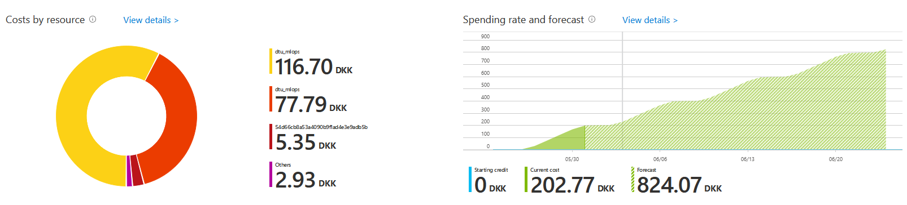

# Training in the sky
Running computations locally is often sufficient when only playing around with code in initial phase of 
development. However, to really scale your experiments you will need more computing power than what your
standard laptop/desktop can offer. You probably already have experience with running on a local cluster
or similar but todays topic is about utilizing cloud computing.

  

There exist a [numerous](https://github.com/zszazi/Deep-learning-in-cloud) amount of cloud compute providers 
with some of the biggest being:
* Azure
* AWS
* Alibaba cloud
* Google Cloud

The all have slight advantages and disadvantages over each others. In this course we are going to focus on Azure, 
the solution from Microsoft. It should be noted that today exercises only will give a glimpse of what Azure can do, 
as they offer much more than just simply training your models in the cloud.

### Exercises

Todays exercises are based on Microsoft own [learning portal](https://docs.microsoft.com/en-us/learn/). The idea
is that you read the tutorials and follow along on your laptop. Additionally, here is a 
[cheatsheet](https://azure.github.io/azureml-cheatsheets/docs/cheatsheets/python/v1/cheatsheet/) that may be useful.

1. Create an account at https://azure.microsoft.com/en-us/free/. If you already have an Azure account make
   sure to sign up with a new account so you are sure that you get the $200 free credit which is necessary to
   complete the exercises.

2. Start with this [exercise](https://docs.microsoft.com/en-us/learn/modules/intro-to-azure-machine-learning-service/2a-create-workspace).
   It will introduce the *Azure Machine Learning studio*  and how to create a workspace and run notebooks in Azure.

3. Next to this [exercise](https://docs.microsoft.com/en-us/learn/modules/intro-to-azure-machine-learning-service/5-using-azure-ml).
   It will describe how to run an Azure machine learning experiment and run a script as an experiment.

4. Next complete this [exercise](https://docs.microsoft.com/en-us/learn/modules/train-local-model-with-azure-mls/5-training-model).
   It will go over how to use a script to train a model, how to parameterize script to train a model and register a model.

5. Finally, complete [this](https://docs.microsoft.com/en-us/learn/modules/intro-to-azure-machine-learning-service/5a-knowledge-check?ns-enrollment-type=LearningPath&ns-enrollment-id=learn.data-ai.build-ai-solutions-with-azure-ml-service) and [this](https://docs.microsoft.com/en-us/learn/modules/train-local-model-with-azure-mls/5a-knowledge-check)
   knowledge check to make sure that you have understand todays exercises.

> WARNING: Remember to close down any compute instance that you have started if you are not going to use them for a longer period of time. Below is shown how the cost can add up by just forgetting to close a single gpu instance (real mistake by me).

### Final exercise

With the above completed exercises, and you still have extra time left then try to get your MNIST code running on Azure. 
It does not have to run for very long time, it is just to check that you understand how to get your own code running on 
Azure. Additionally, you can already start to thick how to get your project running in Azure.
