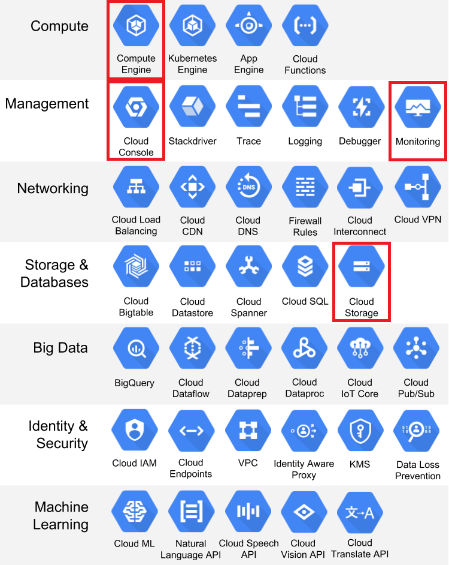

# Cloud setup
{: .no_toc }

<details open markdown="block">
  <summary>
    Table of contents
  </summary>
  {: .text-delta }
1. TOC
{:toc}
</details>

---

Google cloud project is the cloud service provided by Google. The key concept, or selling point, of any cloud 
provider is the idea of near-infinite resources. Without the cloud it simply is not feasible to do many modern 
deep learning and machine learning tasks because they cannot be scaled locally.

The image below shows all the different services that the Google cloud platform offers. The ones marked in red 
is the onces we are actually going to investigate in this course. Therefore, if you get done with exercises early 
I highly recommend that you deep dive more into the Google cloud platform.

<p align="center">
  
</p>

### Exercises

As the first step we are going to get you setup with some Google cloud credits.

1. Go to <https://learn.inside.dtu.dk>. Go to this course. Find the recent message where there should be a download 
   link and instructions on how to claim the $50 cloud credit. Please do not share the link anywhere as there are a 
   limited amount of coupons. 

2. Login to the homepage of gcp. It should look like this:
   <p align="center">
   
   </p>

3. Go to billing and make sure that your account is showing $50 of cloud credit
   <p align="center">
     
   </p>
   make sure to also checkout the `Reports` throughout the course. When you are starting to use some of the cloud 
   services these tabs will update with info about how much time you can use before your cloud credit runs out. 
   Make sure that you monitor this page as you will not be given another coupon.

4. One way to stay organized within GCP is to create projects. 
   <p align="center">
     
   </p>
   Create a new project called `dtumlops`. When you click `create` you should get a notification that the project 
   is being created. The notification bell is good way to make sure how the processes you are running are doing 
   throughout the course.

5. Finally, for setup we are going to install `gcloud`. `gcloud` is the command line interface for working with 
   our Google cloud account. Nearly everything that we can do through the web interface we can also do through 
   the `gcloud` interface. Follow the installation instructions [here](https://cloud.google.com/sdk/docs/install) 
   for your specific OS.

   1. After installation, try in a terminal to type:
      ```bash
      gcloud -h
      ```
      the command should and show the help page. If not, something went wrong in the installation 
      (you may need to restart after installing).

   2. Now login by typing
      ```bash
      gcloud auth login
      ```
      you should be sent to an web page where you link your cloud account to the `gcloud` interface.
      Afterwards, also run this command:
      ```bash
      gcloud auth application-default login
      ```
      If you at some point want to revoke this you can type:
      ```bash
      gcloud auth revoke
      ```

   3. Next you will need to set the project that we just created. In your web browser under project info, 
      you should be able to see the `Project ID` belonging to your `dtumlops` project. Copy this an type 
      the following command in a terminal
      ```bash
      gcloud config set project <project-id>
      ```
      You can also get the project info by running
      ```bash
      gcloud projects list
      ```

   4. Next install the Google cloud python API:
      ```bash
      pip install --upgrade google-api-python-client
      ```
      Make sure that the python interface is also installed. In a python terminal type
      ```python
      import googleapiclient
      ```
      this should work without any errors.

   5. Finally, we need some additional commands for `gcloud` which are part of the `beta` component.
      Install with:
      ```bash
      gcloud components install beta
      ```
      You can get a list of all install components using
      ```bash
      gcloud components list
      ```

   5. (Optional) If you are using VSCode you can also download the relevant 
      [extension](https://marketplace.visualstudio.com/items?itemName=GoogleCloudTools.cloudcode) 
      called `Cloud Code`. After installing it you should see a small `Cloud Code` button in the action bar. 

After following these step your laptop should hopefully be setup for using `gcp` locally. You are now
ready to use their services.


