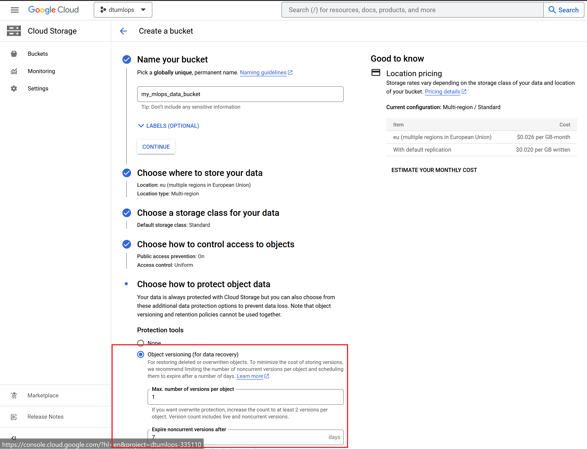
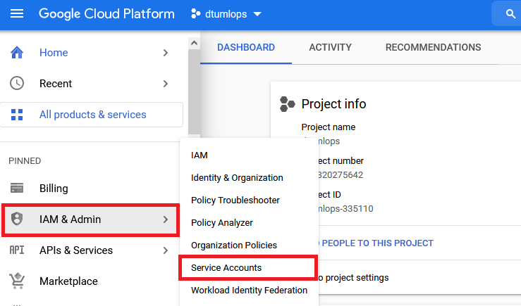
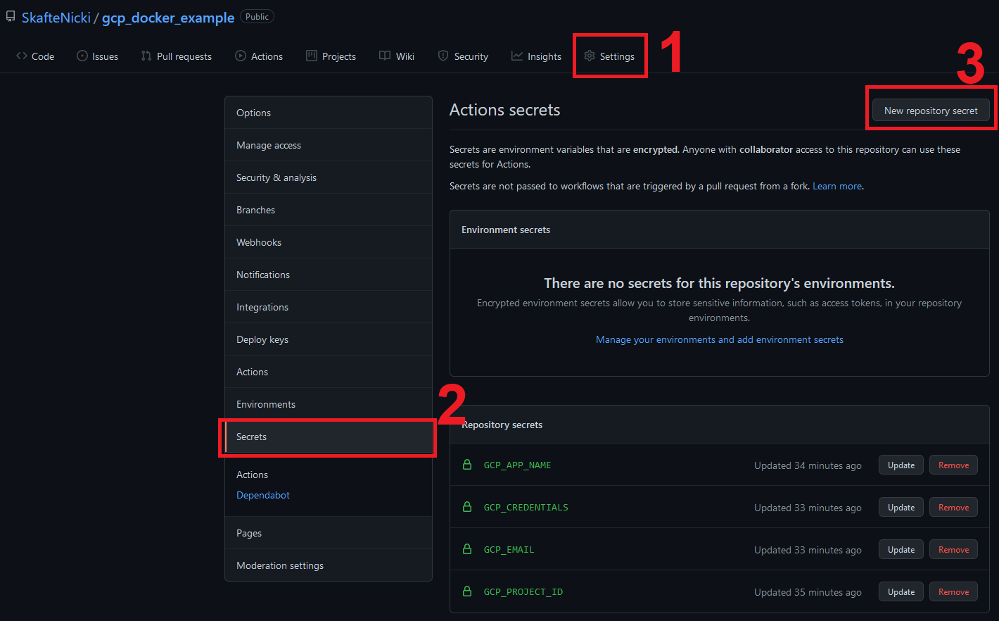

# Using the cloud
{: .no_toc }

<details open markdown="block">
  <summary>
    Table of contents
  </summary>
  {: .text-delta }
1. TOC
{:toc}
</details>

---

In this set of exercises we are going to get more familiar with the using some of the resources that google cloud offers.

## Compute

The most basic service of any cloud provider is the ability to create and run virtual machines. 
In `gcp` this service is called [Compute Engine API](https://cloud.google.com/compute/docs/reference/rest/v1).
A virtual machine allows you to essentially run an operating system that behaves like a completely separate computer.
There are many reasons why one to use virtual machines:
* Virtual machines allow you to scale your operations, essentially giving you access to infinitely many individual computers
* Virtual machines allow you to use large scale hardware. For example if you are developing an deep learning model on your
laptop and want to know the inference time for a specific hardware configuration, you can just create a virtual machine
with those specs and run your model.
* Virtual machines allow you to run processes in the "background". If you want to train a model for a week or more, you
do not want to do this on your own laptop as you cannot really move it or do anything with while it is training. Virtual
machines allow you to just launch a job and forget about it (at least until you run out of credit).

<p align="center">
   
</p>

### Exercises

We are now going to start actually using the cloud.

1. Enable the `Compute Engine API`. You should be able to find it in the sidebar on the homepage of `gcp`.

2. Try to `Create instance`. You will see the following image below.
   <p align="center">
     
   </p>
   Give it a meaningful name, set the location to some location that is closer to where you actually is (to reduce latency). 
   Finally try to adjust the the configuration a bit. What two factors are effecting the price of the compute unit? 
   
3. After figuring this out, create a `e2-medium` instance (leave rest configured as default). Before clicking the `Create` button 
   make sure to check the `Equavalent Command Line` botton. You should see a very long command that you could have typed instead to 
   do the exact same.

4. Now in a local terminal type:
   ```bash
   gcloud compute instances list
   ```
   you should hopefully see the instance you have just created.

5. You can start a terminal directly by typing:
   ```bash
   gcloud beta compute ssh --zone <zone> <name> --project <project-name> 
   ```

6. While logged into the instance you will see that neither python or pytorch is installed. 

```
gcloud compute instances create %INSTANCE_NAME% \
  --zone=%ZONE% 
  --image-family=%IMAGE_FAMILY% 
  --image-project=deeplearning-platform-release
```

7. Finally, everything that you have done locally can also be achieved through the web terminal, which of cause
   comes pre-installed with the `gcloud` command etc. 
   <p align="center">
     
   </p>
   Try out launching this and run some of the commands from the previous exercises.

## Data storage
Another big part of cloud computing is storage of data. There are many reason that you want to store your data in the cloud including:

- Easily being able to share
- Easily expand as you need more
- Data is stored multiple locations, making sure that it is not lost in case of an emergency

Cloud storage is luckily also very cheap. Google cloud only takes around $0.026 per GB per month. This means that around 1 TB of data would cost you $26 which is more than what the same amount of data would cost on Goggle Drive, but the storage in Google cloud is much more focused on enterprise where you have a need for accessing data through an API.

### Exercises
When we did the exercise on data version control, we made `dvc` work together with our own google drive to storage data. However, a big limitation of this is that we need to authentic each time we try to either push or pull the data. The reason is that we need to use an API instead which is offered through google cloud.

We are going to follow the instructions from this [page](https://dvc.org/doc/user-guide/setup-google-drive-remote)

1. Lets start by creating a data storage. On the GCP startpage, in the sidebar, click on the `Cloud Storage`. On the next page click the `Create bucket`:
   <p align="center">
     
   </p>
   Give the bucket an unique name, set it to a region close by and make it of size 20 GB as seen in the image.

2. After creating the storage, you should be able to see it if you type
   ```bash
   gsutil ls
   ```
   `gsutil` is an additional command to `gcloud`, that provides more command line options.

2. Next we need the google storage extension for `dvc`
   ```bash
   pip install dvc[gs]
   ```

3. Now in your mnist reposatory where you have already configured dvc, we are going to change the storage from our google drive to our newly created google cloud storage.
   ```bash
   dvc remote add -d remote_storage <output-from-gsutils>
   ```

4. The above command will change the `.dvc/config` file. Add and commit that file. Finally, push data to the cloud
   ```bash
   dvc push
   ```

5. Finally make sure that you can pull without having to give your credentials. The easiest way to see this is to delete the `.dvc/cache` folder that should
   be locally on your laptop and afterwards do a `dvc pull`.

## Container registry

You should hopefully at this point have seen the strength of using containers e.g. Docker. They allow us 

A container registry 

### Exercises

We are now going to return to docker. We have until now seen how we can automatize building images using github actions. Now, we are going to automatize the
process of uploading the build containers to a so called `container registry`. Exercise more or less follows the instructions listed [here](https://cloud.google.com/community/tutorials/cicd-cloud-run-github-actions)
but replaced with an python example.

1. First we are going to enable a few services. Instead of doing this through the webpage, we are instead going to use `gcloud` this time.
   Enable the following three services
   ```bash
   gcloud services enable cloudbuild.googleapis.com 
   gcloud services enable run.googleapis.com 
   gcloud services enable containerregistry.googleapis.com
   ```
   corresponding to the three services `Cloud Build`, `Cloud Run`, `Container Registry`

2. Next we are going to create an service account. An service account is essentially the way to tell other applications how to gain access to out google cloud account
   and services. 

   1. Navigate to the `service account tab`
      <p align="center">
        
      </p>
   
   2. Next create the service account. Fill out the information as below:
      <p align="center">
        
      </p>
      Note that the name should be all lowercase (not like in the image). We are here allowing the service account full to all services. In general this is bad practice and we can give very fine gained control on what service should have access to what. The corresponding `gcloud` commands for giving exact
      access to what we need are:

      ```bash
      # this creates the service account
      gcloud iam service-accounts create $ACCOUNT_NAME \
         --description="Cloud Run deploy account" \
         --display-name="Cloud-Run-Deploy"
      # this gives the service account access to storage
      gcloud projects add-iam-policy-binding $PROJECT_ID \
         --member=serviceAccount:$ACCOUNT_NAME@$PROJECT_ID.iam.gserviceaccount.com \
         --role=roles/run.admin
      gcloud projects add-iam-policy-binding $PROJECT_ID \
         --member=serviceAccount:$ACCOUNT_NAME@$PROJECT_ID.iam.gserviceaccount.com \
         --role=roles/storage.admin
      gcloud projects add-iam-policy-binding $PROJECT_ID \
         --member=serviceAccount:$ACCOUNT_NAME@$PROJECT_ID.iam.gserviceaccount.com \
         --role=roles/iam.serviceAccountUser
      ```
   3. Finally, we will create a key for later use with github. See instructions below:
      <p align="center">
        
      </p>
      Clicking the `create` button will prompt you to save an `.json` file. 
      DO NOT SHARE this file with anybody. If you know anything about cryptography, this is your
      private key.

3. Next we are going to work on a simple example. Please **fork** [this reposatory](https://github.com/SkafteNicki/gcp_docker_example). The reposatory contains a simple python script that does image classification using sklearn.

   1. Checkout the code and make sure you know what it does.

   2. Now we are going to add secrets to the github reposatory such that it "can talk" to our service account and our
      google cloud resources. Go to the secrets tab and begin to add the following:
      <p align="center">
        
      </p>

      * GCP_APP_NAME: this should be the exact name of your service. In the example above the name was `example-mlops-service`.
      * GCP_CREDENTIALS: this should be the content of the `.json` file you downloaded after creating the service account
      * GCP_EMAIL: this should be the email belonging to your service. It will be called something like: `<service-name>@<project-name>.iam.gserviceaccount.com` and can be seen on the service front page.
      * GCP_PROJECT_ID: you should be able to find this on the front webpage.

## Training 

The exercises largely build on the material in this tutorial: <https://cloud.google.com/ai-platform/training/docs/getting-started-pytorch>

1. Start by enabling the `AI Platform Training & Prediction API.` in the gcp webpage.

2. Next lets create a dedicated storage bucket for out trained models. Instead of using the web interface, lets use the `gsutil` command:
   ```bash
   gsutil mb -l <LOC> gs://<BUCKET_NAME>
   ```
   choose `<LOC>>` as one to be one of available bucket storage locations (see this [page](https://cloud.google.com/storage/docs/locations))
   and set `<BUCKET_NAME>` to some appropriate name like `experiment_storage`.


3. Submit the job to `gcp`
   ```bash

   gcloud ai-platform jobs submit training <JOB_NAME> \
   --region=us-central1 \
   --master-image-uri=gcr.io/cloud-ml-public/training/pytorch-xla.1-10 \
   --scale-tier=BASIC \
   --job-dir=${JOB_DIR} \
   --package-path=./trainer \
   --module-name=trainer.task \
   -- \
   --train-files=gs://cloud-samples-data/ai-platform/chicago_taxi/training/small/taxi_trips_train.csv \
   --eval-files=gs://cloud-samples-data/ai-platform/chicago_taxi/training/small/taxi_trips_eval.csv \
   --num-epochs=10 \
   --batch-size=100 \
   --learning-rate=0.001
   ```

4. After submitting a job you should see a messege like this:
   ```
   Job <JOB_NAME> submitted successfully.
   Your job is still active. You may view the status of your job with the command
   ```

   1. Call the following command
      ```bash
      gcloud ai-platform jobs describe <JOB_NAME>
      ```
      what does the command do?

   2. Call the following command
      ```bash
      gcloud ai-platform jobs stream-logs <JOB_NAME>
      ```
      what does the command do?

5. As a final exericse, Use the ai-platform to train your 


