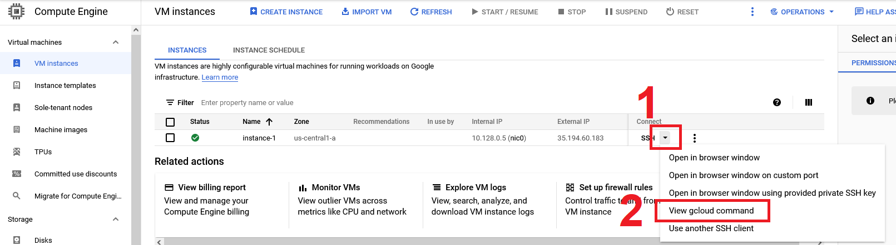
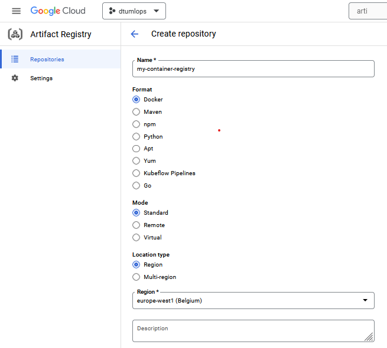
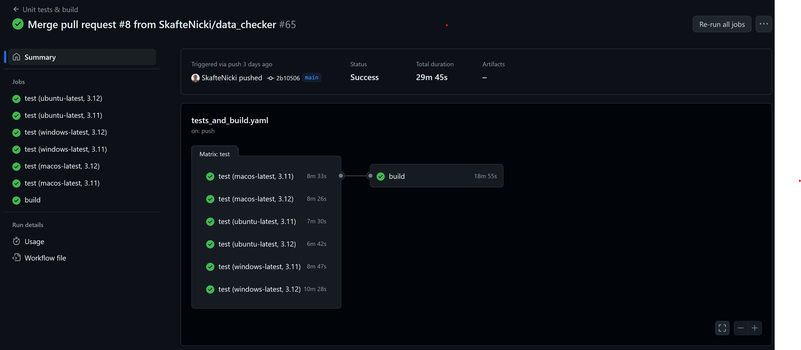
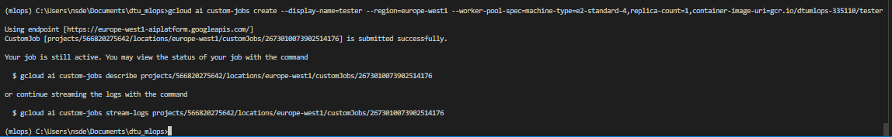
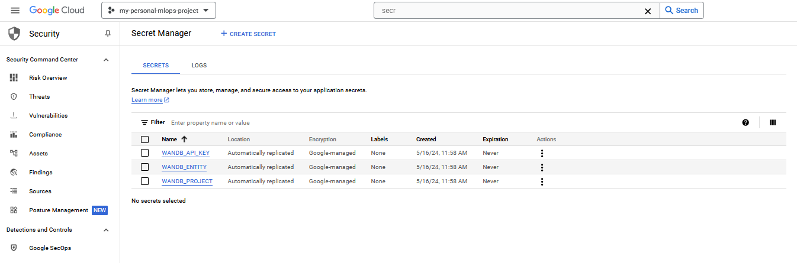

{ align=right width="130"}
{ align=right width="130"}

# Using the cloud

---

!!! info "Core Module"

!!! warning "Interface changes"

    The Google Cloud Platform (GCP) interface is constantly changing. Therefore, some of the screenshots and
    instructions in this module may be slightly outdated. However, the overall concepts and steps should still be
    applicable. If you are ever in doubt about how to do something in GCP, I recommend checking out the official
    [GCP documentation](https://cloud.google.com/docs).

In this set of exercises, we are going to get more familiar with using some of the resources that GCP offers.

## Compute

The most basic service of any cloud provider is the ability to create and run virtual machines.
In GCP this service is called [Compute Engine API](https://cloud.google.com/compute/docs/reference/rest/v1).
A virtual machine allows you to essentially run an operating system that behaves like a completely separate computer.
There are many reasons for using virtual machines:

* Virtual machines allow you to scale your operations, essentially giving you access to infinitely many individual
    computers.

* Virtual machines allow you to use large-scale hardware. For example, if you are developing a deep learning model on
    your laptop and want to know the inference time for a specific hardware configuration, you can just create a virtual
    machine with those specs and run your model.

* Virtual machines allow you to run processes in the "background". If you want to train a model for a week or more, you
    do not want to do this on your laptop as you cannot move it or do anything with it while it is training.
    Virtual machines allow you to just launch a job and forget about it (at least until you run out of credit).

<figure markdown>
{ width="800"  }
</figure>

### ❔ Exercises

We are now going to start using the cloud.

1. Click on the `Compute Engine` tab in the sidebar on the homepage of GCP.

2. Click the `Create Instance` button. You will see the following image below.

    <figure markdown>
    { width="800"  }
    </figure>

    Give the virtual machine a meaningful name, and set the location to some location that is closer to where you are
    (to reduce latency, we recommend `europe-west-1`). Finally, try to adjust the configuration a bit. Can you find
    at least two settings that alter the price of the virtual machine?

    ??? success "Solution"

        In general, the price of a virtual machine is determined by the class of hardware attached to it. Higher class
        CPUs and GPUs mean higher prices. Additionally, the amount of memory and disk space also affects the price.
        Finally, the location of the virtual machine also affects the price.

3. After figuring this out, create a `e2-medium` instance (leave the rest configured as default). Before clicking the
    `Create` button make sure to check the `Equivalent code` button. You should see a very long command that you
    could have typed in the terminal that would create a VM similar to configuring it through the UI.

4. After creating the virtual machine, in a local terminal type:

    ```bash
    gcloud compute instances list
    ```

    You should hopefully see the instance you have just created.

5. You can start a terminal directly by typing:

    ```bash
    gcloud compute ssh --zone <zone> <name> --project <project-id>
    ```

    You can always see the exact command that you need to run to `ssh` into a VM by selecting the
    `View gcloud command` option in the Compute Engine overview (see image below).

    <figure markdown>
    { width="800"  }
    </figure>

6. While logged into the instance, check if Python and PyTorch are installed.
    You should see that neither is installed. The VM we have only specified what
    compute resources it should have, and not what software should be in it. We
    can fix this by starting VMs based on specific docker images (it's all coming together).

    1. GCP comes with several ready-to-go images for doing deep learning.
        More info can be found [in the deep learning containers guide](https://cloud.google.com/deep-learning-containers/docs/choosing-container).
        Try, running this line:

        ```bash
        gcloud container images list --repository="gcr.io/deeplearning-platform-release"
        ```

        What does the output show?

        ??? success "Solution"

            The output should show a list of images that are available for you to use. The images are essentially
            docker images that contain a specific software stack. The software stack is often a specific version of
            Python, PyTorch, TensorFlow, etc. The images are maintained by Google and are updated regularly.

    2. Next, start (in the terminal) a new instance using a PyTorch image. The command for doing it should look
        something like this:

        ```bash
        gcloud compute instances create <instance_name> \
            --zone=<zone> \
            --image-family=<image-family> \
            --image-project=deeplearning-platform-release \
            # add these arguments if you want to run on GPU and have the quota to do so
            --accelerator="type=nvidia-tesla-V100,count=1" \
            --maintenance-policy TERMINATE \
            --metadata="install-nvidia-driver=True" \
        ```

        You can find more info
        [in the PyTorch VM instance guide](https://cloud.google.com/deep-learning-vm/docs/pytorch_start_instance) on
        what `<image-family>` should be and what extra argument you need to add if you want to run on GPU (if you
        have access).

        ??? success "Solution"

            The command should look something like this:

            === "CPU"

                ```bash
                gcloud compute instances create my-instance \
                    --zone=europe-west1-b \
                    --image-family=pytorch-latest-cpu \
                    --image-project=deeplearning-platform-release
                ```

            === "GPU"

                ```bash
                gcloud compute instances create my-instance \
                    --zone=europe-west1-b \
                    --image-family=pytorch-latest-gpu \
                    --image-project=deeplearning-platform-release \
                    --accelerator="type=nvidia-tesla-V100,count=1" \
                    --maintenance-policy TERMINATE
                ```

    3. `ssh` into the VM as in one of the previous exercises. Confirm that the container indeed contains
        both a Python installation and PyTorch is also installed. Hint: you also have the possibility
        through the web page to start a browser session directly to the VMs you create:

        <figure markdown>
        { width="800" }
        </figure>

7. Everything that you have done locally can also be achieved through the web terminal, which of course comes
    pre-installed with the `gcloud` command etc.

    <figure markdown>
    { width="800"  }
    </figure>

    Try launching this and run some of the commands from the previous exercises.

8. Finally, we want to make sure that we do not forget to stop our VMs. VMs are charged by the minute, so even if you
    are not using them you are still paying for them. Therefore, you must remember to stop your VMs when you are not
    using them. You can do this by either clicking the `Stop` button on the VM overview page or by running the following
    command:

    ```bash
    gcloud compute instances stop <instance-name>
    ```

## Data storage

Another big part of cloud computing is the storage of data. There are many reasons that you want to store your
data in the cloud including:

* Easily being able to share
* Easily expand as you need more
* Data is stored in multiple locations, making sure that it is not lost in case of an emergency

Cloud storage is luckily also very cheap. Google Cloud only takes around $0.026 per GB per month. This means that
around 1 TB of data would cost you $26 which is more than what the same amount of data would cost on Google Drive, but
the storage in Google Cloud is much more focused on enterprise usage such that you can access the data through code.

### ❔ Exercises

When we did the exercise on data version control, we made `dvc` work together with our own Google Drive to store data.
However, a big limitation of this is that we need to authenticate each time we try to either push or pull the data. The
reason is that we need to use an API instead which is offered through GCP.

We are going to follow the instructions from this [page](https://dvc.org/doc/user-guide/setup-google-drive-remote)

1. Let's start by creating data storage. On the GCP start page, in the sidebar, click on `Cloud Storage`.
    On the next page click `Create bucket`:

    <figure markdown>
    { width="800" }
    </figure>

    Give the bucket a unique name, set it to a region close by and importantly remember to enable *Object versioning*
    under the last tab. Finally, click `Create`.

2. After creating the storage, you should be able to see it online and you should be able to see it if you type in your
    local terminal:

    ```bash
    gsutil ls
    ```

    [gsutil](https://cloud.google.com/storage/docs/gsutil) is a command line tool that allows you to create, upload,
    download, list, move, rename and delete objects in cloud storage. For example, you can upload a file to
    cloud storage by running:

    ```bash
    gsutil cp <file> gs://<bucket-name>
    ```

3. Next, we need the Google storage extension for `dvc`.

    ```bash
    pip install dvc-gs
    ```

4. Now in your corrupt MNIST repository where you have already configured `dvc`, we are going to change the storage
    from our Google Drive to our newly created Google Cloud storage.

    ```bash
    dvc remote add -d remote_storage <output-from-gsutils>
    ```

    In addition, we are also going to modify the remote to support object versioning (called `version_aware` in `dvc`):

    ```bash
    dvc remote modify remote_storage version_aware true
    ```

    This will change the default way that `dvc` handles data. Instead of just storing the latest version of the data as
    [content-addressable storage](https://dvc.org/doc/user-guide/project-structure/internal-files#structure-of-the-cache-directory),
    it will now store the data as it looks in our local repository, which allows us to not only use `dvc` to download
    our data.

5. The above command will change the `.dvc/config` file. `git add` and `git commit` the changes to that file.
    Finally, push data to the cloud.

    ```bash
    dvc push --no-run-cache  # (1)!
    ```

    1. :man_raising_hand: The `--no-run-cache` flag is used to avoid pushing the cache file to the cloud, which is not
        supported by the Google Cloud storage.

6. Finally, make sure that you can pull without having to give your credentials. The easiest way to see this
    is to delete the `.dvc/cache` folder that should be on your laptop and afterward do a

    ```bash
    dvc pull --no-run-cache
    ```

This setup should work when trying to access the data from your laptop, which we authenticated in the previous
module. However, how can you access the data from a virtual machine, inside a docker container or from a different
laptop? We in general recommend two ways:

* You can make the bucket publicly accessible, i.e. no authentication is needed. That means that anyone with the URL
    to the data can access it. This is the easiest way to do it, but also the least secure. You can read more about
    how to make your buckets public [in the making data public guide](https://cloud.google.com/storage/docs/access-control/making-data-public).

* You can use the service account that you created in the previous module to authenticate the VM. This is the most
    secure way to do it, but also the most complicated. You first need to give the service account the correct
    permissions. Then you need to authenticate using the service account. In `dvc` this is done by setting the
    environment variable `GOOGLE_APPLICATION_CREDENTIALS` to the path of

    === "Linux/MacOS"

        ```bash
        export GOOGLE_APPLICATION_CREDENTIALS="/path/to/your/credentials.json"
        ```

    === "Windows"

        ```bash
        set GOOGLE_APPLICATION_CREDENTIALS="C:\path\to\your\credentials.json"
        ```

## Artifact registry

You should hopefully at this point have seen the strength of using containers to create reproducible environments. They
allow us to specify exactly the software that we want to run inside our VMs. However, you should already have run into
two problems with containers

* The building process can take a lot of time
* Docker images can be large

For this reason, we want to move both the building process and the storage of images to the cloud. In GCP the two
services that we are going to use for this are called [Cloud Build](https://cloud.google.com/build) for building the
containers in the cloud and [Artifact registry](https://cloud.google.com/artifact-registry) for storing the images
afterward.

### ❔ Exercises

In these exercises, I recommend that you start with a dummy version of some code to make sure that the building process
does not take too long. Below is a simple Python script that does image classification using Sklearn, together with
the corresponding `requirements.txt` file and `Dockerfile`.

??? example "Python script"

    ```python linenums="1" title="main.py"
    --8<-- "s6_the_cloud/exercise_files/main.py"
    ```

??? example "requirements.txt"

    ```txt linenums="1" title="requirements.txt"
    --8<-- "s6_the_cloud/exercise_files/requirements.txt"
    ```

??? example "Dockerfile"

    ```dockerfile linenums="1" title="Dockerfile"
    --8<-- "s6_the_cloud/exercise_files/Dockerfile"
    ```
The docker images for this application are therefore going to be substantially faster to build and smaller in size than
the images we are used to that use PyTorch.

1. Start by enabling the services `Google Artifact Registry API` and `Google Cloud Build API`. This can be
    done through the website (by searching for the services) or can also be enabled from the terminal:

    ```bash
    gcloud services enable artifactregistry.googleapis.com
    gcloud services enable cloudbuild.googleapis.com
    ```

2. The first step is creating an artifact repository in the cloud. You can either do this through the UI or by using
    `gcloud` in the command line.

    === "UI"

        Find the `Artifact Registry` service (search for it in the search bar) and click on it. From there click on the
        `Create repository` button. You should see the following page:

        <figure markdown>
        { width="800" }
        </figure>

        Give the repository a name, make sure to set the format to `Docker` and specify the region. At the bottom of the
        page you can optionally add a cleanup policy. We recommend that you add one to keep costs down. Give the policy
        a name choose the `Keep most recent versions` option and set the keep count to `5`. Click `Create` and you
        should now see the repository in the list of repositories.

    === "Command line"

        ```bash
        gcloud artifacts repositories create <registry-name> \
            --repository-format=docker \
            --location=europe-west1 \
            --description="My docker registry"
        ```

        where you need to replace `<registry-name>` with a name of your choice. You can read more about the command
        [here](https://cloud.google.com/sdk/gcloud/reference/artifacts/repositories/create). We recommend that after
        creating the repository you update it with a cleanup policy to keep costs down. You can do this by running:

        ```bash
        gcloud artifacts repositories set-cleanup-policies REPOSITORY
            --project=<project-id>
            --location=<region>
            --policy=policy.yaml
        ```

        where the `policy.yaml` file should look something like this:

        ```json
        [
            {
                "name": "keep-minimum-versions",
                "action": {"type": "Keep"},
                "mostRecentVersions": {
                    "keepCount": 5
                }
            }
        ]
        ```
        and you can read more about the command
        [here](https://cloud.google.com/artifact-registry/docs/repositories/cleanup-policy).

    Whenever we in the future want to push or pull to this artifact repository we can refer to it using this URL:

    ```txt
    <region>-docker.pkg.dev/<project-id>/<registry-name>
    ```

    for example, `europe-west1-docker.pkg.dev/dtumlops-335110/container-registry` would be a valid URL (this is the one
    I created).

3. We are now ready to build our containers in the cloud. In principle, GCP cloud build works out of the box with docker
    files. However, the recommended way is to add specialized `cloudbuild.yaml` files. You can think of the
    `cloudbuild.yaml` file as the corresponding file in GCP as workflow files are in GitHub actions, which you learned
    about in [module M16](../s5_continuous_integration/github_actions.md). It is essentially a file that specifies
    a list of steps that should be executed to do something, but the syntax is different.

    Look at the [documentation](https://cloud.google.com/artifact-registry/docs/configure-cloud-build) on how to write
    a `cloudbuild.yaml` file for building and pushing a docker image to the artifact registry. Try to implement such a
    file in your repository.

    ??? success "Solution"

        For building docker images the syntax is as follows:

        ```yaml
        steps:
        - name: 'gcr.io/cloud-builders/docker'
          id: 'Build container image'
          args: [
            'build',
            '.',
            '-t',
            'europe-west1-docker.pkg.dev/$PROJECT_ID/<registry-name>/<image-name>',
            '-f',
            '<path-to-dockerfile>'
          ]
        - name: 'gcr.io/cloud-builders/docker'
          id: 'Push container image'
          args: [
            'push',
            'europe-west1-docker.pkg.dev/$PROJECT_ID/<registry-name>/<image-name>'
          ]
        options:
          logging: CLOUD_LOGGING_ONLY
        ```

        where you need to replace `<registry-name>`, `<image-name>` and `<path-to-dockerfile>` with your own values.
        You can hopefully recognize the syntax from the docker exercises. In this example, we are calling the
        `cloud-builders/docker` service with both the `build` and `push` arguments.

4. You can now try to trigger the `cloudbuild.yaml` file from your local machine. What `gcloud` command would you use
    to do this?

    ??? success "Solution"

        You can trigger a build by running the following command:

        ```bash
        gcloud builds submit . --config=cloudbuild.yaml
        ```

        This command will submit a build to the cloud build service using the configuration file `cloudbuild.yaml` in
        the current directory. The `.` specifies that the build context is the current directory. The build context is
        all the files that are uploaded to the cloud build service, thus if your Dockerfile has `COPY` commands that
        copy files from the local directory to the container, these files need to be in the build context. Do note that
        by default all files in your `.gitignore` file are excluded from the build context, but you can override this
        by using the `--ignore-file` flag, which you can read more about
        [here](https://cloud.google.com/sdk/gcloud/reference/builds/submit).

5. Instead of relying on manually submitting builds, we can setup the build process as continuous integration such
    that it is triggered every time we push code to the repository. This is done by setting up a
    [trigger](https://cloud.google.com/build/docs/triggers) in the GCP console. From the GCP homepage, navigate to the
    triggers panel:

    <figure markdown>
    { width="800"  }
    </figure>

    Click on manage repositories.

    1. From there, click `Connect Repository` and go through the steps of authenticating your GitHub profile with
        GCP and choose the repository that you want to set up build triggers for. For now, skip the
        `Create a trigger (optional)` part by pressing `Done` at the end.

        <figure markdown>
        { width="800"  }
        </figure>

    2. Navigate back to the `Triggers` homepage and click `Create trigger`. Set the following:

        * Give a name
        * Event: choose `Push to branch`
        * Source: choose the repository you just connected
        * Branch: choose `^main$`
        * Configuration: choose either `Autodetected` or `Cloud build configuration file`

        Finally, click the `Create` button and the trigger should show up on the triggers page.

    3. To activate the trigger, push some code to the chosen repository.

    4. Go to the `Cloud Build` page and you should see the image being built and pushed.

        <figure markdown>
        { width="800"  }
        </figure>

        Try clicking on the build to check out the build process and build summary. As you can see from the image, if a
        build is failing you will often find valuable info by looking at the build summary. If your build is failing try
        to configure it to run in one of these regions:
        `us-central1, us-west2, europe-west1, asia-east1, australia-southeast1, southamerica-east1` as specified in the
        [documentation](https://cloud.google.com/build/docs/locations).

    5. If/when your build is successful, navigate to the `Artifact Registry` page. You should hopefully find that the
        image you just built was pushed here. Congrats!

6. Make sure that you can pull your image down to your laptop

    ```bash
    docker pull <region>-docker.pkg.dev/<project-id>/<registry-name>/<image-name>:<image-tag>
    ```

    you will need to authenticate `docker` with GCP first. Instructions can be found
    [in the docker auth guide](https://cloud.google.com/artifact-registry/docs/docker/authentication#gcloud-helper), but
    the following command should hopefully be enough to make `docker` and GCP talk to each other:

    ```bash
    gcloud auth configure-docker <region>-docker.pkg.dev
    ```

    where you need to replace `<region>` with the region you are using. Do note you need to have `docker` actively
    running in the background, just like any other time you want to use `docker`.

7. Automatization through the cloud is in general the way to go, but sometimes you may want to manually create images
    and push them to the registry. Figure out how to push an image to your `Artifact Registry`. For simplicity, you can
    just push the `busybox` image you downloaded during the initial docker exercises. This
    [page](https://cloud.google.com/artifact-registry/docs/docker/pushing-and-pulling) should help you with the exercise.

    ??? success "Solution"

        Pushing to a repository is similar to pulling. Assuming that you have already built an image called `busybox`
        you can push it to the repository by running:

        ```bash
        docker tag busybox <region>-docker.pkg.dev/<project-id>/<registry-name>/busybox:latest
        docker push <region>-docker.pkg.dev/<project-id>/<registry-name>/busybox:latest
        ```

        where you need to replace `<region>`, `<project-id>` and `<registry-name>` with your own values.

8. (Optional) Instead of using the built-in trigger in GCP, another way to activate the build-on code changes is to
    integrate with GitHub Actions. This has the benefit that we can make the build process depend on other steps in the
    pipeline. For example, in the image below we have conditioned the build to only run if tests are passing on
    all operating systems. Lets try to implement this.

    <figure markdown>
    { width="800"  }
    </figure>

    1. Start by adding a new secret to GitHub with the name `GCLOUD_SERVICE_KEY` and the value of the service account
        key that you created in the previous module. This is needed to authenticate the GitHub action with GCP.

    2. We assume that you already have a workflow file that runs some unit tests:

        ```yaml
        name: Unit tests & build

        on:
          push:
            branches: [main]
          pull_request:
            branches: [main]

        jobs:
          test:
        ```

        We now want to add a job that triggers the build process in GCP. How can you make the `build` job depend on
        the `test` job? Hint: Relevant
        [documentation](https://docs.github.com/en/actions/using-jobs/using-jobs-in-a-workflow).

        ??? success "Solution"

            You can make the `build` job depend on the `test` job by adding the `needs` keyword to the `build` job:

            ```yaml
            name: Unit tests & build

            on:
              push:
                branches: [main]
              pull_request:
                branches: [main]

            jobs:
              test:
                ...
              build:
                needs: test
                ...
            ```

    3. Additionally, we probably only want to build the image if the job is running on our main branch, i.e. not part
        of a pull request. How can you make the `build` job only run on the main branch?

        ??? success "Solution"

            ```yaml
            name: Unit tests & build

            on:
              push:
                branches: [main]
              pull_request:
                branches: [main]

            jobs:
              test:
                ...
              build:
                needs: test
                if: ${{ github.event_name == 'push' && github.ref == 'refs/heads/main' }}
                ...
            ```

    4. Finally, we need to add the steps to submit the build job to GCP. You need four steps:

        * Check out the code
        * Authenticate with GCP
        * Set up gcloud
        * Submit the build

        How can you do this? Hint: For the first two steps these two GitHub actions can be useful:
        [auth](https://github.com/google-github-actions/auth) and
        [setup-gcloud](https://github.com/google-github-actions/setup-gcloud).

        ??? success "Solution"

            ```yaml
            name: Unit tests & build

            on:
              push:
                branches: [main]
              pull_request:
                branches: [main]

            jobs:
              test:
                ...
              build:
                needs: test
                if: ${{ github.event_name == 'push' && github.ref == 'refs/heads/main' }}
                runs-on: ubuntu-latest
                steps:
                - name: Checkout code
                  uses: actions/checkout@v5

                - name: Auth with GCP
                  uses: google-github-actions/auth@v2
                  with:
                    credentials_json: ${{ secrets.GCLOUD_SERVICE_KEY }}

                - name: Set up Cloud SDK
                  uses: google-github-actions/setup-gcloud@v2

                - name: Submit build
                  run: gcloud builds submit . --config cloudbuild_containers.yaml
            ```

9. (Optional) The `cloudbuild` specification format allows you to specify so-called
    [substitutions](https://cloud.google.com/build/docs/configuring-builds/substitute-variable-values). A substitution
    is simply a way to replace a variable in the `cloudbuild.yaml` file with a value that is known only at runtime. This
    can be useful for using the same `cloudbuild.yaml` file for multiple builds. Try to implement a substitution in your
    docker cloud build file such that the image name is a variable.

    !!! note "Build in substitutions"

        You have probably already encountered substitutions like `$PROJECT_ID` in the `cloudbuild.yaml` file. These are
        substitutions that are automatically replaced by GCP. Other commonly used are `$BUILD_ID`, `$PROJECT_NUMBER`
        and `$LOCATION`. You can find a full list of built-in substitutions
        [here](https://cloud.google.com/build/docs/configuring-builds/substitute-variable-values#using_default_substitutions).

    ??? success "Solution"

        We just need to add the `substitutions` field to the `cloudbuild.yaml` file. For example, if we want to replace
        the image name with a variable called `_IMAGE_NAME` we can do the following:

        ```yaml
        steps:
        - name: 'gcr.io/cloud-builders/docker'
          id: 'Build container image'
          args: [
            'build',
            '.',
            '-t',
            'europe-west1-docker.pkg.dev/$PROJECT_ID/<registry-name>/$_IMAGE_NAME',
            '-f',
            '<path-to-dockerfile>'
          ]
        - name: 'gcr.io/cloud-builders/docker'
          id: 'Push container image'
          args: [
            'push',
            'europe-west1-docker.pkg.dev/$PROJECT_ID/<registry-name>/$_IMAGE_NAME'
          ]
        options:
          logging: CLOUD_LOGGING_ONLY
        substitutions:
          _IMAGE_NAME: 'my_image'
        ```

        Do note that user substitutions are prefixed with an underscore `_` to distinguish them from built-in ones.
        You can read more
        [here](https://cloud.google.com/build/docs/configuring-builds/substitute-variable-values#using_user-defined_substitutions).

    1. How would you provide the value for the `_IMAGE_NAME` variable to the `gcloud builds submit` command?

        ??? success "Solution"

            You can provide the value for the `_IMAGE_NAME` variable by adding the `--substitutions` flag to the
            `gcloud builds submit` command:

            ```bash
            gcloud builds submit . --config=cloudbuild.yaml --substitutions=_IMAGE_NAME=my_image
            ```

            If you want to provide more than one substitution you can do so by separating them with a comma.

## Training

As the final step in our journey through different GCP services in this module, we are going to look at the training of
our models. This is one of the important tasks that GCP can help us with because we can always rent more hardware as
long as we have credits, meaning that we can both scale horizontally (run more experiments) and vertically (run longer
experiments).

We are going to check out two ways of running our experiments. First, we are going to return to the Compute Engine
service because it gives the most simple form of scaling of experiments. That is: we create a VM with an appropriate
docker image, start it, log into the VM and run our experiments. Most people can run a couple of experiments in parallel
this way. However, what if there was an abstract layer that automatically created a VM for us, launched our experiments
and then closed the VM afterwards?

This is where the [Vertex AI](https://cloud.google.com/vertex-ai/docs) service comes into play. This is a dedicated service
for handling ML models in GCP in the cloud. Vertex AI is in principal an end-to-end service that can take care of
everything machine learning-related in the cloud. In this course, we are primarily focused on just the training of our
models, and then use other services for other parts of our pipeline.

### ❔ Exercises

1. Let's start by going through how we could train a model using PyTorch using the Compute Engine service:

    1. Start by creating an appropriate VM. If you want to start a VM that has PyTorch pre-installed with only CPU
        support you can run the following command:

        ```bash
        gcloud compute instances create <instance-name> \
            --zone europe-west1-b \
            --image-family=pytorch-latest-cpu \
            --image-project=deeplearning-platform-release
        ```

        Alternatively, if you have access to GPU in your GCP account you could start a VM in the following way:

        ```bash
        gcloud compute instances create <instance-name> \
            --zone europe-west4-a \
            --image-family=pytorch-latest-gpu \
            --image-project=deeplearning-platform-release \
            --accelerator="type=nvidia-tesla-t4,count=1" \
            --metadata="install-nvidia-driver=True" \
            --maintenance-policy TERMINATE
        ```

    2. Next log into your newly created VM. You can either open an `ssh` terminal in the cloud console or run the
        following command:

        ```bash
        gcloud compute ssh <instance-name>
        ```

    3. It is recommended to always check that the VM we get is actually what we asked for. In this case, the VM should
        have PyTorch pre-installed so let's check for that by running

        ```bash
        python -c "import torch; print(torch.__version__)"
        ```

        Additionally, if you have a VM with GPU support also try running the `nvidia-smi` command.

    4. When you have logged in to the VM, it works as your machine. Therefore to run some training code you would
        need to do the same setup step you have done on your machine: clone your GitHub, install dependencies,
        download data, and run code. Try doing this to make sure you can train a model.

2. The above exercises should hopefully have convinced you that it can be hard to scale experiments using the Compute
    Engine service. The reason is that you need to manually start, set up and stop a separate VM for each experiment.
    Instead, let's try to use the Vertex AI service to train our models.

    1. Start by enabling it by searching for `Vertex AI` in the cloud console by going to the service or by running the
        following command:

        ```bash
        gcloud services enable aiplatform.googleapis.com
        ```

    2. The way we are going to use Vertex AI is to create custom jobs because we have already developed docker
        containers that contain everything to run our code. Thus the only command that we need to use is the
        `gcloud ai custom-jobs create` command. An example here would be:

        ```bash
        gcloud ai custom-jobs create \
            --region=europe-west1 \
            --display-name=test-run \
            --config=config.yaml \
            # these are the arguments that are passed to the container, only needed if you want to change defaults
            --command 'python src/my_project/train.py' \
            --args=--epochs=10 --args=--batch-size=128
        ```

        Essentially, this command combines everything into one command: it first creates a VM with the specs specified
        by a configuration file, then loads a container specified again in the configuration file, and finally it runs
        everything. An example of a config file could be:

        === "CPU"

            ```yaml
            # config_cpu.yaml
            workerPoolSpecs:
                machineSpec:
                    machineType: n1-highmem-2
                replicaCount: 1
                containerSpec:
                    imageUri: <region>-docker.pkg.dev/<project-id>/<registry-name>/<image-name>:<image-tag>
            ```

        === "GPU"

            ```yaml
            # config_gpu.yaml
            workerPoolSpecs:
                machineSpec:
                    machineType: n1-standard-8
                    acceleratorType: NVIDIA_TESLA_T4
                    acceleratorCount: 1
                replicaCount: 1
                containerSpec:
                    imageUri: <region>-docker.pkg.dev/<project-id>/<registry-name>/<image-name>:<image-tag>
            ```

            In this case we are requesting an Nvidia Tesla T4 GPU. This will only work if you have a quota for
            allocating this type of GPU in the Vertex AI service. To check your quota, go into
            [quotas](https://console.cloud.google.com/iam-admin/quotas) and search for `custom_model_training_nvidia_t4`
            in the `Filter` field to see the quota. If not, you can try to request a quota increase. Remember that it is
            not enough to just request a quota for the GPU; the request needs to be approved by Google before you can
            use it.

        You can read more about the configuration formatting
        [in the CustomJobSpec reference](https://cloud.google.com/vertex-ai/docs/reference/rest/v1/CustomJobSpec)
        and the different types of machines
        [in the documentation](https://cloud.google.com/vertex-ai/docs/training/configure-compute#machine-types). Try to
        execute a job using the `gcloud ai custom-jobs create` command. For additional documentation you can look at
        [the documentation on the command](https://cloud.google.com/sdk/gcloud/reference/ai/custom-jobs/create)
        and [this page](https://cloud.google.com/vertex-ai/docs/training/create-custom-job#without-autopackaging) and
        [this page](https://cloud.google.com/vertex-ai/docs/training/configure-compute).

    3. Assuming you manage to launch a job, you should see an output like this:

        <figure markdown>
        { width="800"  }
        </figure>

        Try executing the commands that are outputted to look at both the status and the progress of your job.

    4. In addition, you can also visit the `Custom Jobs` tab in the `training` part of Vertex AI.

        <figure markdown>
        { width="800"  }
        </figure>

        You will need to select the specific region that you submitted your job to in order to see the job.

    5. During custom training, we do not necessarily need to use `dvc` for downloading our data. A more efficient way is
        to use cloud storage as a
        [mounted file system](https://cloud.google.com/vertex-ai/docs/training/cloud-storage-file-system).
        This allows us to access data directly from the cloud storage without having to download it first. All our
        training jobs are automatically mounted to a `gcs` folder in the root directory. Try to access the data from your
        training script:

        ```python
        # loading from a bucket using mounted file system
        data = torch.load('/gcs/<my-bucket-name>/data.pt')
        # writing to a bucket using mounted file system
        torch.save(data, '/gcs/<my-bucket-name>/data.pt')
        ```

        should speed up the training process a bit.

    6. Your code may depend on environment variables for authenticating, for example with weights and biases during
        training. These can also be specified in the configuration file. How would you do this?

        ??? success "Solution"

            You can specify environment variables in the configuration file by adding the `env` field to the
            `containerSpec` field. For example, if you want to specify the `WANDB_API_KEY` you can do it like this:

            ```yaml
            workerPoolSpecs:
                machineSpec:
                    machineType: n1-highmem-2
                replicaCount: 1
                containerSpec:
                    imageUri: <region>-docker.pkg.dev/<project-id>/<registry-name>/<image-name>:<image-tag>
                    env:
                    - name: WANDB_API_KEY
                      value: <your-wandb-api-key>
            ```

            You need to replace `<your-wandb-api-key>` with your actual key. Also, remember that this file
            now contains a secret and should be treated as such.

    7. Try to execute multiple jobs with different configurations, e.g., change the `--args` field in the `gcloud ai
        custom-jobs create` command at the same time. This should hopefully show you how easy it is to scale experiments
        using the Vertex AI service.

## Secrets management

Similar to GitHub Actions, GCP also has secrets storage that can be used to keep secrets safe. This is called the
[Secret Manager](https://cloud.google.com/secret-manager/docs) in GCP. By using the Secret Manager, we have the option
of injecting secrets into our code without having to store them in the code itself.

### ❔ Exercises

1. Let's look at the example from before where we have a config file like this for custom Vertex AI jobs:

    ```yaml
    workerPoolSpecs:
        machineSpec:
            machineType: n1-highmem-2
        replicaCount: 1
        containerSpec:
            imageUri: gcr.io/<project-id>/<docker-img>
            env:
            - name: WANDB_API_KEY
              value: $WANDB_API_KEY
    ```

    We do not want to store the `WANDB_API_KEY` in the config file, rather we would like to store it in the Secret
    Manager and inject it right before the job starts. Let's figure out how to do that.

    1. Start by enabling the secrets manager API by running the following command:

        ```bash
        gcloud services enable secretmanager.googleapis.com
        ```

    2. Next, go to the secrets manager in the cloud console and create a new secret. You just need to give it a name, a
        value and leave the rest as default. Add one or more secrets like in the image below.

        <figure markdown>
        { width="800"  }
        </figure>

    3. We are going to inject the secrets into our training job by using cloudbuild. Create a new cloudbuild file called
        `vertex_ai_train.yaml` and add the following content:

        ```yaml linenums="1" title="vertex_ai_train.yaml"
        steps:
        - name: "alpine"
          id: "Replace values in the training config"
          entrypoint: "sh"
          args:
            - '-c'
            - |
              apk add --no-cache gettext
              envsubst < config.yaml > config.yaml.tmp
              mv config.yaml.tmp config.yaml
          secretEnv: ['WANDB_API_KEY']

        - name: 'alpine'
          id: "Show config"
          waitFor: ['Replace values in the training config']
          entrypoint: "sh"
          args:
            - '-c'
            - |
              cat config.yaml

        - name: 'gcr.io/cloud-builders/gcloud'
          id: 'Train on vertex AI'
          waitFor: ['Replace values in the training config']
          args: [
            'ai',
            'custom-jobs',
            'create',
            '--region',
            'europe-west1',
            '--display-name',
            'example-mlops-job',
            '--config',
            '${_VERTEX_TRAIN_CONFIG}',
          ]
        substitutions:
          _VERTEX_TRAIN_CONFIG: 'config.yaml'
        availableSecrets:
          secretManager:
          - versionName: projects/$PROJECT_ID/secrets/WANDB_API_KEY/versions/latest
            env: 'WANDB_API_KEY'
        ```

        Slowly go through the file and try to understand what each step does.

        ??? success "Solution"

            There are two parts to using secrets in cloud build. First, there is the `availableSecrets` field that
            specifies what secrets from the Secret Manager should be injected into the build. In this case, we are
            injecting the `WANDB_API_KEY` and setting it as an environment variable. The second part is the `secretEnv`
            field in the first step. This field specifies which secrets should be available in the first step.
            The steps are then doing:

            1. The first step calls the [envsubst](https://www.baeldung.com/linux/envsubst-command) command which is a
                general Linux command that replaces environment variables in a file. In this case, it replaces the
                `$WANDB_API_KEY` with the actual value of the secret. We then save the file as `config.yaml.tmp` and
                rename it back to `config.yaml`.

            2. The second step is just to show that the replacement was successful. This is mostly for debugging
                purposes and can be removed.

            3. The third step is the actual training job. It waits for the first step to finish before running.

    4. Finally, try to trigger the build

        ```bash
        gcloud builds submit . --config=vertex_ai_train.yaml
        ```

        and check that the `WANDB_API_KEY` is correctly injected into the `config.yaml` file.

## 🧠 Knowledge check

1. In the Compute Engine, we have the option to either stop or suspend the VMs, can you describe what the difference is?

    ??? success "Solution"

        [Suspended instances](https://cloud.google.com/compute/docs/instances/suspend-resume-instance) preserve the
        guest OS memory, device state, and application state. You will not be charged for a suspended VM but will be
        charged for the storage of the aforementioned states.
        [Stopped instances](https://cloud.google.com/compute/docs/instances/stop-start-instance#stop-vm) do not
        preserve any of the states and you will be charged for the storage of the disk. However, in both cases if the
        VM instances have resources attached to them, such as static IPs and persistent disks, they are charged until
        they are deleted.

2. As seen in the exercises, a `cloudbuild.yaml` file often contains multiple steps. How would you make steps dependent
    on each other e.g. one step can only run if another step has finished? And how would you make steps execute
    concurrently?

    ??? success "Solution"

        In both cases, the solution is the `waitFor` field. If you want a step to wait for another step to finish you
        you need to give the first step an `id` and then specify that `id` in the `waitFor` field of the second step.

        ```yaml
        steps:
        - name: 'alpine'
          id: 'step1'
          entrypoint: 'sh'
          args: ['-c', 'echo "Hello World"']
        - name: 'alpine'
          id: 'step2'
          entrypoint: 'sh'
          args: ['-c', 'echo "Hello World 2"']
          waitFor: ['step1']
        ```

        If you want steps to run concurrently you can set the `waitFor` field to `['-']`:

        ```yaml
        steps:
        - name: 'alpine'
          id: 'step1'
          entrypoint: 'sh'
          args: ['-c', 'echo "Hello World"']
        - name: 'alpine'
          id: 'step2'
          entrypoint: 'sh'
          args: ['-c', 'echo "Hello World 2"']
          waitFor: ['-']
        ```

This ends the session on how to use Google Cloud services for now. In a future session, we are going to investigate some
more of the services offered in GCP, in particular for deploying the models that we have just trained.
