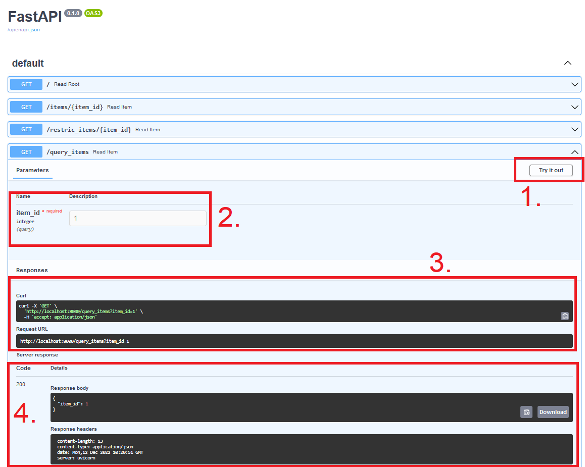

# Requests and APIs
{: .no_toc }

<details open markdown="block">
  <summary>
    Table of contents
  </summary>
  {: .text-delta }
1. TOC
{:toc}
</details>

---

{: .important }
> Core module

Before we can get deployment of our models we need to understand concepts such as APIs and requests. The core reason
for this is that we need a new abstraction layer ontop of our applications that are not python specific. While Python
is the defacto language for machine learning, we cannot expect everybody else to use it and in particular we cannot
expect network protocols (both locally and external) to be able to communicate with our python programs out of the box.
For this reason we need to understand requests, in particular HTTP requests and how to create APIs that can interact
with those requests.

## Requests

When we are talking about requests, we are essentially talking about the communication method used in client-server
types of architechtures. As show in the image below, in this architechture the client (user) is going to send
*requests* to a server (our machine learning application) and the server will give an *response*. For example the user
may send an request of getting the class of a specific image, which our application will do and then send back the
response in terms of a label.

<p align="center">
  
  <br>
  <a href="https://dev.to/adidoshi/http-request-methods-16ik"> Image credit </a>
</p>

The common way of of sending requests are called HTTP (Hypertext Transfer Protocol). It is essentially a specification
of the intermediary transportation method between the clien and server. A HTTP request essentially consist of two
parts:

* A request URL: the location of the server we want to send our request to
* A request Method: what action we want to perform on the server.

The common request methods are (case sensitive):

* GET: get data from the server
* POST/PUT: send data to the server
* DELETE: delete data on the server

You can read more about the different method [here](https://dev.to/adidoshi/http-request-methods-16ik). For most machine
learning applications, GET and POST are the core methods to remember. Additionally, if you want to read more about HTTP
in general we highly recommend that you go over this [comic strip](https://howhttps.works/) protocol, but the TLDR is
that it provides privacy, integrity and identification over the web.

### Exercises

We are going to do a couple of exercises on sending requests using
[requests package](https://requests.readthedocs.io/en/latest/) to get familiar with the syntax.

1. Start by install the `requests` package

   ```bash
   pip install requests
   ```

2. Afterwards, create a small script and try to execute the code

   ```python
   import requests
   response = requests.get('https://api.github.com/this-api-should-not-exist')
   print(response.status_code)
   ```

   As you can see from the syntax, we are sending a request using the GET method. This code should return status
   code 404. Take a look at [this page](https://restfulapi.net/http-status-codes/) that contains a list of status codes.

3. Next lets call a page that actually exists

   ```python
   import requests
   response = requests.get('https://api.github.com')
   print(response.status_code)
   ```

   What is the status code now and what does it mean? Status codes are important when you have a application that are
   interacting with a server and want to make sure that it does not fail, which can be done with simple `if` statements
   on the status codes

   ```python
   if response.status_code == 200:
      print('Success!')
   elif response.status_code == 404:
      print('Not Found.')
   ```

4. Next try to call the following

   ```python
   response=requests.get("https://api.github.com/repos/SkafteNicki/dtu_mlops")
   ```

   which actually gives back a *payload*. Essentially, payload refers to any additional data that is send from the
   client to the server or vice-versa. Try looking at the `response.content` attribute. What is the type of this
   attribute?

5. You should hopefully observe that the `.content` atttribute is of type `bytes`. It is important to note that this is
   the standard way of sending payloads to encode them into `byte` objects. To get a more human readable version of
   the response, we can convert to [JSON](https://www.json.org/json-en.html) format

   ```python
   response.json()
   ```

   Important to remember that a json object in python is just a nested dict, if you ever want to iterate over the object
   in some way.

6. When we use the GET method we can additionally provide an `params` argument, that specifies what we want the server
   to send back for a specific request URL:

   ```python
   response = requests.get(
      'https://api.github.com/search/repositories',
      params={'q': 'requests+language:python'},
   )
   ```

   Before looking at `reponse.json()` can you explain what the code does? You can try looking at this
   [page](https://docs.github.com/en/rest/search?apiVersion=2022-11-28) for help.

7. Sometimes the content of a page cannot be converted into `json`, because as already stated data is send as bytes.
   Say that we want to download a image, which we can do in the following way

   ```python
   import requests
   response = requests.get('https://imgs.xkcd.com/comics/making_progress.png')
   ```

   Try calling `response.json()`, what happens? Next try calling `response.content`. For actually getting the result
   in this case we would need to convert from bytes to a image:

   ```python
   with open(r'img.png','wb') as f:
      f.write(response.content)
   ```

8. The `get` method is the most useful method because it allows us to get data from the server. However, as stated in
   the beginning multiple request methods exist, for example the POST method for sending data to the server. Try
   executing:

   ```python
   pload = {'username':'Olivia','password':'123'}
   response = requests.post('https://httpbin.org/post', data = pload)
   ```

   Investigate the response (this is an artifical example, because we actually does not control the server).

9. Finally, we should also know that requests can be send directly from the command line using the `curl` command.
   Sometimes it is easier to send a request directly from the terminal and sometimes it is easier to do directly from
   a script.

   1. Make sure you have `curl` installed, else find instruction on installing it. To check call `curl --help` for
      the documentation on curl.

   2. To execute `requests.get('https://api.github.com')` using curl we would simply do

      ```bash
      curl -X GET "https://api.github.com"
      curl -X GET -I "https://api.github.com" # if you want the status code
      ```

      Try it yourself.

   3. Try to redo some of the exercise yourself using `curl`.

That ends the intro session on `requests`. Do not worry if you are still not completly comftable with sending requests,
we are going to return do how we do it in practise when we have actually created our own API. If you want to learn more
about the `requests` package you can checkout [this tutorial](https://realpython.com/python-requests/) and if you want
to see more example on how to use `curl` you can checkout
[this page](https://gist.github.com/subfuzion/08c5d85437d5d4f00e58)

## Creating APIs

Requests are all about being on the client side of our client-server architechture. We are now going to move on to the
server side where we will be learning about writing the APIs that requests can interact with. An application programming
interface (API) is essentially the way of the developer (you) telling a user how to use the application that you have
created. The API is an abstraction layer that allows the user the interact with our application in the way we want them
to interact with it, without the user even having to look at the code.

We can take the API from github as an example <https://api.github.com>. This API allows any user to retrieve, integrate
and send data to github without ever having to visit their webpage. The API exposes multiple endpoints that have various
functions:

* <https://api.github.com/repos/OWNER/REPO/branches>: checkout the branches on a given repository
* <https://api.github.com/search/code>: search through github for repositories
* <https://api.github.com/repos/OWNER/REPO/actions/workflows>: check the status of workflows for a given repository

and we could go on. However, there may be functionality that github are not interested in users having access to and
they may therefore choose not to have endpoints for specific features.

The particular kind of API we are going to work with is called REST API (or RESTful API). The REST API specify specific
contrains that a particular API needs to fullfill to be considered RESTful. You can read more about what the six
guiding principals behind REST API is [on this page](https://restfulapi.net/) but on of the most important to have in
mind is that the clien-server architechture needs to be stateless. This means that whenever a request is send to the
server it needs to be self-contained (all information included) and the server cannot rely on any priviously stored
information from privious requests.

To implement APIs in practise we are going to use [FastAPI](https://fastapi.tiangolo.com/). FastAPI is a
*modern, fast (high-performance), web framework for building APIs with Python 3.6+ based on standard Python type hints*.
FastAPI is only one of many frameworks for defining APIs, however compared to other frameworks such as
[Flask](https://flask.palletsprojects.com/en/2.0.x/) and [django](https://www.djangoproject.com/) it offers a sweet
spot of being flexible enough to do what you want without having many additional (unnecessary) features.

### Exercises

The exercises below are an condensed version of [this](https://fastapi.tiangolo.com/tutorial/) and
[this](https://fastapi.tiangolo.com/advanced/) tutorial. If you ever need context for the exercises, we can recommend
trying to go through these.

1. Install FastAPI

   ```bash
   pip install fastapi
   ```

   This contais the functions, modules, variables we are going to need to define our interface.

2. Additionally, also install uvicorn which is a package for defining low level server applications.

   ```bash
   pip install uvicorn[standard]
   ```

3. Start by defining a small application like this in a file called `main.py`:

   ```python
   from fastapi import FastAPI
   app = FastAPI()

   @app.get("/")
   def read_root():
      return {"Hello": "World"}

   @app.get("/items/{item_id}")
   def read_item(item_id: int):
      return {"item_id": item_id}
   ```

   Importantly here is the use of the `@app.get` decorator. What could this decorator refer to? Explain what the two
   functions are probably doing.

4. Next lets lunch our app. Since we called our script `main.py` and we inside the script initialized our API with
   `app = FastAPI`, our application that we want to deploy can be referenced by `main:app`:

   ```bash
   uvicorn --reload --port 8000 main:app
   ```

   this will launch an server at this page: `http://localhost:8000/`. As you will hopefully see, this page will return
   the content of the `root` function, like the image below. Remember to also check the output in your terminal as that
   will give info on when and how your application is being invoked.

   <p align="center">
      
   </p>

   1. What webpage should you open to get the server to return `1`?

   2. Also checkout the pages: `http://localhost:8000/docs` and `http://localhost:8000/redoc`. What does
      these pages show?

   3. The power of the `docs` and `redoc` pages is that they allow you to easily test your application with their simple
      UI. As show in the image below, simply open the endpoint you want to test, click the `Try it out` button, input
      any values and execute it. It will return both the corresponding `curl` command for invoking your endpoint,
      the corresponding URL and response of you application. Try it out.

      <p align="center">
        
      </p>

   4. You can also checkout `http://localhost:8000/openapi.json` to check out the schema that is generated
      which essentially are a `json` file containing the overall specifications of your program.

   5. Try to access `http://localhost:8000/items/foo`, what happens in this case? When you specify types in your API,
      FastAPI will automatically do type validation using [pydantic](https://docs.pydantic.dev/), making sure users can
      only access your API with the correct types. Therefore, remember to include types in your applications!

5. With the fundamentals in place lets configure it a bit more:

   1. Lets start by changing the root function to include a bit more info. In particular we are also interested in
      returning the status code so the end user can easily read that. Default status codes are included in the
      [http](https://docs.python.org/3/library/http.html) build-in python package:

      ```python
      from http import HTTPStatus

      @app.get("/")
      def root():
          """ Health check."""
          response = {
              "message": HTTPStatus.OK.phrase,
              "status-code": HTTPStatus.OK,
          }
          return response
      ```

      try to reload the app and see what is returned now. You should not have to re-launch the app because we
      initialized the app with the `--reload` argument.

   2. When we decorate our functions with `@app.get("/items/{item_id}")`, `item_id` is in the case what we call a
      *path parameters* because it is an parameter that is directly included in the path of our endpoint. We have
      already seen how we can restrict a path to a single type, but what if we want to strict it to specific values?
      This is often the case of we are working with parameters of type `str`. In this case we would need to define a
      enum:

      ```python
      from enum import Enum
      class ItemEnum(Enum):
         alexnet = "alexnet"
         resnet = "resnet"
         lenet = "lenet"

      @app.get("/restric_items/{item_id}")
      def read_item(item_id: ItemEnum):
         return {"item_id": item_id}

      ```

      Add this API, reload and execute both an valid parameter and a non-valid parameter.

   3. In contrast to path parameters we have query parameters. In the requests exersices we saw an example of this where
      we where calling <https://api.github.com/search/code> with the query `'q': 'requests+language:python'`. Any
      parameter in FastAPI that is not a path parameter, will be considered a query parameter:

      ```python
      @app.get("/query_items")
      def read_item(item_id: int):
         return {"item_id": item_id}
      ```

      Add this API, reload and figure out how to pass in a query parameter.

   4. We have until now worked with the `.get` method, but lets also see an example of the `.post` method. As already
      described the POST request method is used for uploading data to the server. Here is a simple app that saves
      username and password in a database (please never implement this in real life like this):

      ```python

      database = {'username': [ ], 'password': [ ]}

      @app.post("/login/")
      def login(username: str, password: str):
         username_db = database['username']
         password_db = database['password']
         if username not in username_db and password not in password_db:
            with open('database.csv', "a") as file:
                  file.write(f"{username}, {password} \n")
            username_db.append(username)
            password_db.append(password)
         return "login saved"

      ```

      Make sure you understand what the function does and then try to execute it a couple of times to see your database
      updating. It is important to note that we sometimes in the following exercises uses the `.get` method and
      sometimes the `.post` method. For our usage it does not really matter.

6. We are now moving to figuring out how to provide different standard inputs like text, images, json to our APIs. It
   is important that you try out each example yourself and in particular you look at the `curl` commands that are
   nessesary to invoke each application.

   1. Here is a small application, that takes a single text input

      ```python
      @app.get("/text_model/")
      def contains_email(data: str):
         regex = r'\b[A-Za-z0-9._%+-]+@[A-Za-z0-9.-]+\.[A-Z|a-z]{2,}\b'
         response = {
            "input": data,
            "message": HTTPStatus.OK.phrase,
            "status-code": HTTPStatus.OK,
            "is_email": re.fullmatch(regex, data) is not None
         }
         return response
      ```

      What does the application do? Try it out yourself

   2. Lets say we wanted to extend the application to check for a specific email domain, either `gmail` or `hotmail`.
      And lets say we want to feed this into our application as a `json` object e.g.

      ```json
      {
         "email": "mlops@gmail.com",
         "domain_match": "gmail"
      }
      ```

      Figure out how to alter the `data` parameter such that it takes in the `json` object and make sure to extend the
      application to check if the email and domain also matches. Hint: take a look at
      [this page](https://fastapi.tiangolo.com/tutorial/body/)

   3. Lets move on to an application that requires a file input:

      ```python
      from fastapi import UploadFile, File
      from typing import Optional

      @app.post("/cv_model/")
      async def cv_model(data: UploadFile = File(...)):
         with open('image.jpg', 'wb') as image:
            content = await data.read()
            image.write(content)
            image.close()

         response = {
            "input": data,
            "message": HTTPStatus.OK.phrase,
            "status-code": HTTPStatus.OK,
         }
         return response
      ```

      A couple of new things are going on here: we use the specialized `UploadFile` and `File` bodies in our input
      definition. Addtionally, we added the `async`/`await` keywords. Figure put what everything does and try to run
      the application (you can use any image file you like).

   4. The above application actually does not do anything. Lets add [opencv](https://pypi.org/project/opencv-python/)
      as an package and lets resize the image. It can be done with the following three lines:

      ```python
      import cv2
      img = cv2.imread("image.jpg")
      res = cv2.resize(img, (h, w))
      ```

      Figure out where to add them in the application and additionally add `h` and `w` as **optional** parameters, with
      a default value of 28. Try running the application where you specify everything and one more time where you leave
      out `h` and `w`.

   5. Finally, lets also figure out how to return a file from our application. You will need to add the following lines:

      ```python
      from fastapi.responses import FileResponse
      cv2.imwrite('image_resize.jpg', res)
      FileResponse('image_resize.jpg')
      ```

      Figure out where to add them to the code and try running the application one more time to see that you actually
      get an file back with the resized image.

7. As the final step, we want to figure out how do include our FastAPI application in a docker container as it will help
   us when we want to deploy in the cloud because docker as always can take care of the dependencies for our
   application. For the following you can take whatever privious FastAPI application as the base application for the
   container

   1. Start by creating a `requirement.txt` file for you application. You will atleast need `fastapi` and `unicorn` in
      the file and we as always recommend that you are specific about the version you want to use:

      ```txt
      fastapi>=0.68.0,<0.69.0
      uvicorn>=0.15.0,<0.16.0
      # add anything else you application needs to be able to run
      ```

   2. Next create a `Dockerfile` with the following content

      ```Dockerfile
      FROM python:3.9
      WORKDIR /code
      COPY ./requirements.txt /code/requirements.txt

      RUN pip install --no-cache-dir --upgrade -r /code/requirements.txt
      COPY ./app /code/app

      CMD ["uvicorn", "app.main:app", "--host", "0.0.0.0", "--port", "80"]
      ```

      The above assumes that your file structure looks like this

      ```txt
      .
      ├── app
      │   ├── __init__.py
      │   └── main.py
      ├── Dockerfile
      └── requirements.txt
      ```

      Hopefully all these step should look familiar if you already went through
      [module M9](../s3_reproducibility/M9_docker.md), except for maybe the last line. However, this is just the
      standard way that we have run our FastAPI applications as the last couple of exercises, this time with some extra
      arguments regarding the ports we allow.

   3. Next build the corresponding docker image

      ```bash
      docker build -t my_fastapi_app .
      ```

   4. Finally, run the image such that a container is spinned up that runs our application. The important part here is
      to remember to specify the `-p` argument (p for port) that should be the same number as the port we have specified
      in the last line of our Dockerfile.

      ```bash
      docker run -d --name mycontainer -p 80:80 myimage
      ```

   5. Check that everything is working by going to the corresponding localhost page <http://localhost/items/5?q=somequery>

This ends the module on APIs. If you want to go further in this direction we highly recommend that you checkout
[bentoml](https://github.com/bentoml/BentoML) that is an API standard that focuses solely on creating easy to understand
APIs and services for machine learning applications. Additionally, we can also highly recommend checking out
[Postman](https://www.postman.com/) that can help design, document and in particul test the API you are writing to make
sure that they work as expected.

<!---
## BentoML

[bentoml](https://github.com/bentoml/BentoML)

In particular

```python
bentoml.pytorch_lightning.save_model
bentoml.pytorch.save
bentoml.onnx.save_model
```

```python
runner = bentoml.pytorch.get("my_torch_model").to_runner()
svc = bentoml.Service(name="test_service", runners=[runner])
@svc.api(input=JSON(), output=JSON())
async def predict(json_obj: JSONSerializable) -> JSONSerializable:
    batch_ret = await runner.async_run([json_obj])
    return batch_ret[0]
```
--->
