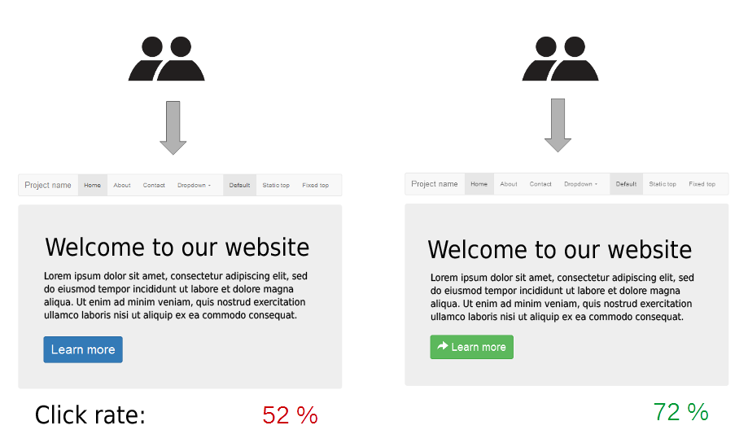
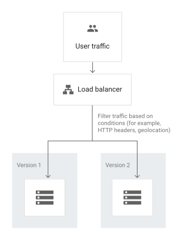
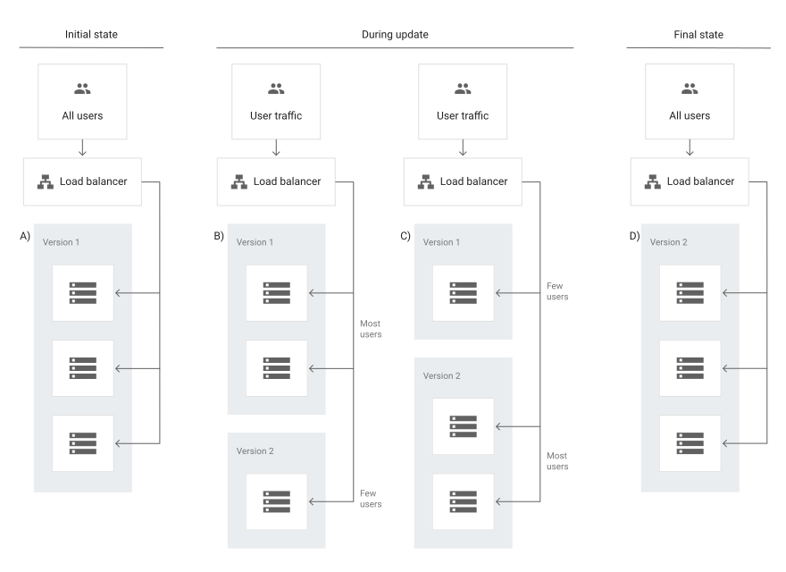
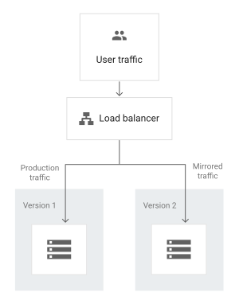

{ align=right width="130"}

# Deployment Testing

In the module on [testing of APIs](testing_apis.md) we learned how to write integration tests for our APIs and how to
run loadtests to see how our API behaves under different loads. In this module we are going to learn about a few
different deployment testing strategies that can be used to ensure that our application is working as expected *before*
we deploy it to production. Deployment testing is designed to minimize risk, enhance performance, and ensure a smooth
transition from development to production. Being able to choose and execute the correct deployment testing strategy is
even more important within machine learning projects as we tend to update our models more frequently than traditional
software projects, thus requiring more frequent deployments.

In general we recommend you start out with reading this
[page](https://cloud.google.com/architecture/application-deployment-and-testing-strategies) from GCP on both application
deployment and testing strategies. It is a good read on the different metrics we can use to evaluate our deployment
(down time, rollback duration, etc.) and the different deployment strategies we can use. In the following we are going
to be looking at the three testing methods

* A/B testing
* Canary deployment
* Shadow deployment

## A/B testing

In software development, [A/B testing](https://en.wikipedia.org/wiki/A/B_testing) is a method of comparing two versions
of a web page or application against each other to determine which one performs better. A/B testing is a form of
statistical hypothesis testing with two variants

<figure markdown>

<figcaption>
In this case we are randomly A/B testing if the color and style of the `Learn more` button affects the click rate. In
this hypothetical example, the green button has a 20% higher click rate than the blue button and is therefore the
preferred choice for the final design.
<a href="https://en.wikipedia.org/wiki/A/B_testing"> Image credit </a>
</figcaption>
</figure>


<figure markdown>

<figcaption>
<a href="https://cloud.google.com/architecture/application-deployment-and-testing-strategies"> Image credit </a>
</figcaption>
</figure>

[text](https://www.surveymonkey.com/mp/ab-testing-significance-calculator/)


Assumed Distribution | Example case | Standard test
-------------------- | ------------ | -------------
Gaussian | Average revenue per user | t-test
Binomial | Click-through rate | Fisher's exact test
Poisson | Number of purchases | Chi-squared test
Multinomial | User preferences | Chi-squared test
Unknown | Time to purchase | Mann-Whitney U test


### ❔ Exercises

In the exercises we are going to perform two different kinds of A/B testing. The first one is going to be a simple
A/B test where we are going to test two different versions of the same service. The second

1. There are a multiple ways to implement A/B testing.

    ```python
    from fastapi import FastAPI, Request, HTTPException
    import geoip2.database

    app = FastAPI()

    # Load the GeoLite2 database
    reader = geoip2.database.Reader('/path/to/GeoLite2-City.mmdb')

    def get_client_ip(request: Request) -> str:
        if "X-Forwarded-For" in request.headers:
            return request.headers["X-Forwarded-For"].split(",")[0]
        if "X-Real-IP" in request.headers:
            return request.headers["X-Real-IP"]
        return request.client.host

    def get_geolocation(ip: str) -> dict:
        try:
            response = reader.city(ip)
            return {
                "ip": ip,
                "city": response.city.name,
                "region": response.subdivisions.most_specific.name,
                "country": response.country.name,
                "location": {
                    "latitude": response.location.latitude,
                    "longitude": response.location.longitude
                }
            }
        except geoip2.errors.AddressNotFoundError:
            raise HTTPException(status_code=404, detail="IP address not found in the database")
        except Exception as e:
            raise HTTPException(status_code=500, detail=str(e))

    @app.get("/geolocation")
    async def geolocation(request: Request):
        client_ip = get_client_ip(request)
        geolocation_data = get_geolocation(client_ip)
        return geolocation_data
    ```

## Canary deployment

<figure markdown>

<figcaption>
<a href="https://cloud.google.com/architecture/application-deployment-and-testing-strategies"> Image credit </a>
</figcaption>
</figure>


### ❔ Exercises

Follow [these](https://cloud.google.com/architecture/implementing-cloud-run-canary-deployments-git-branches-cloud-build)
instructions to implement a canary deployment using Git branches and Cloud Build.

1. Use the following command

    ```bash
    gcloud run services update-traffic
    ```

## Shadow deployment

<figure markdown>

<figcaption>
<a href="https://cloud.google.com/architecture/application-deployment-and-testing-strategies"> Image credit </a>
</figcaption>
</figure>


### ❔ Exercises

1. Google Run does not naturally support shadow deployments, because its loadbalancer requires that the traffic adds up
    to 100%, and for shadow deployments, it would be 200%. To proper implement this you would need to use a kubernetes
    cluster and use a service mesh like Istio. So instead we are going to implement a very simple load balancer ourself.

    1. Create a new script called `loadbalancer.py` and add the following code

        ```python
        import random
        from fastapi import FastAPI, HTTPException
        import requests

        app = FastAPI()

        services = {
            "service1": "http://localhost:8000",
            "service2": "http://localhost:8001"
        }

        @app.get("/shadow")
        async def shadow():
            service = random.choice(list(services.keys()))
            response = requests.get(services[service] + "/shadow")
            return {
                "service": service,
                "response": response.json()
            }
        ```

    2. Because the loadbalancer is just a simple Python script lets just deploy it to Cloud Functions instead of Cloud
        Run. Create a new Cloud Function and deploy the script.

## 🧠 Knowledge check

1. Try to fill out the following table:

    Testing patter | Zero downtime | Real production traffic testing | Releasing to users based on conditions | Rollback duration | Releasing to users based on conditions |
    --------------- | -------------- | -------------------------------- | -------------------------------------- | ----------------- | -------------------------------------- |
    A/B testing     |                |                                  |                                        |                   |                                        |
    Canary deployment |              |                                  |                                        |                   |                                        |
    Shadow deployment |              |                                  |                                        |                   |                                        |

    ??? success "Solution"

        Testing patter | Zero downtime | Real production traffic testing | Releasing to users based on conditions | Rollback duration | Releasing to users based on conditions |
        --------------- | -------------- | -------------------------------- | -------------------------------------- | ----------------- | -------------------------------------- |
        A/B testing     | No             | No                               | Yes                                    | Short             | No                                     |
        Canary deployment | Yes           | Yes                              | Yes                                    | Short             | Yes                                    |
        Shadow deployment | Yes           | No                               | Yes                                    | Short             | Yes                                     |

This ends the deployment testing module.
