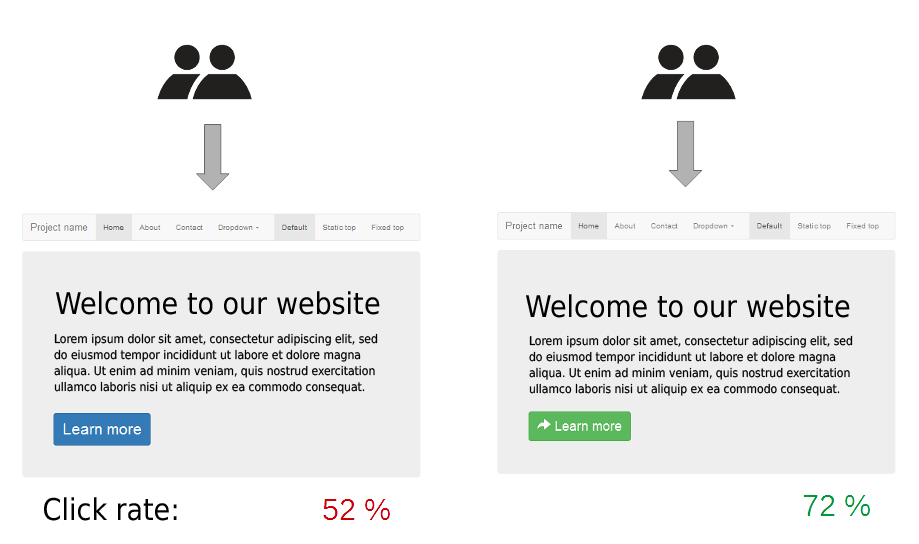
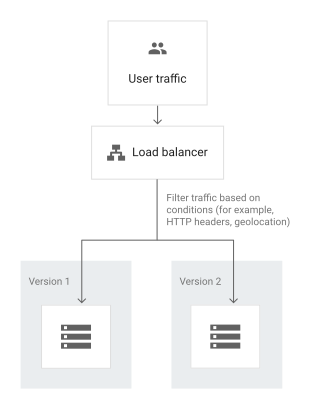
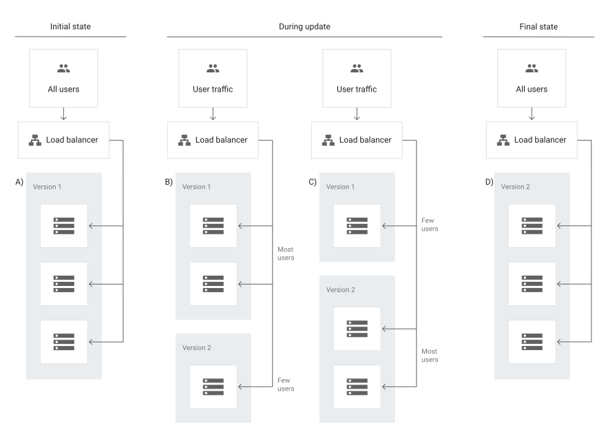
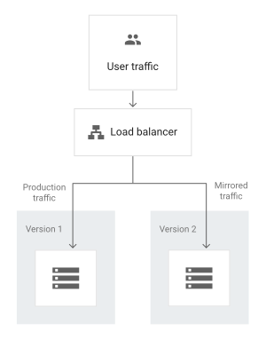

{ align=right width="130"}

# Deployment Testing

---

!!! info "Core Module"

In the module on [testing of APIs](testing_apis.md) we learned how to write integration tests for our APIs and how to run loadtests to see how our API behaves under different loads. In this module we are going to learn about a few different deployment testing strategies that can be used to ensure that our application is working as expected *before* we deploy it to production. Deployment testing is designed to minimize risk, enhance performance, and ensure a smooth transition from development to production. Being able to choose and execute the correct deployment testing strategy is even more important within machine learning projects as we tend to update our models more frequently than traditional software projects, thus requiring more frequent deployments.

!!! quote "Learning Objectives"

    The learning objectives of this module are:

    * Understand the three main deployment testing strategies: A/B testing, canary deployment, and shadow deployment
    * Learn to implement A/B testing with statistical validation for ML models
    * Deploy canary releases with gradual traffic rollout
    * Set up shadow deployments for risk-free testing of new model versions
    * Make informed decisions about which deployment strategy to use in different scenarios

## Prerequisites

Before diving into this module, you should be familiar with:

* **[M22: Requests and APIs](apis.md)** - Understanding how to build and work with APIs
* **[M23: Cloud Deployment](cloud_deployment.md)** - Deploying services to the cloud (specifically Cloud Run)
* **[M24: API Testing](testing_apis.md)** - Testing APIs for functionality and load
* **Basic statistics** - Understanding concepts like hypothesis testing and statistical significance

## Overview of Deployment Testing Strategies

In general we recommend you start out with reading this [page](https://cloud.google.com/architecture/application-deployment-and-testing-strategies) from GCP on both application deployment and testing strategies. It is a good read on the different metrics we can use to evaluate our deployment (down time, rollback duration, etc.) and the different deployment strategies we can use.

Below is a quick comparison of the three deployment testing strategies we'll cover in this module:

| Strategy | Use Case | Risk Level | Complexity | User Impact | Best For |
|----------|----------|------------|------------|-------------|----------|
| **A/B Testing** | Compare two versions statistically | Low-Medium | Medium | Split users see different versions | Choosing between model variants |
| **Canary Deployment** | Gradual rollout with monitoring | Low | Medium-High | Minimal (small % initially) | Safe production rollout |
| **Shadow Deployment** | Test without user impact | Very Low | High | None (responses discarded) | Risk-free validation |

In the following sections, we are going to be looking at each of these three testing methods in detail.

---

## A/B testing

In software development, [A/B testing](https://en.wikipedia.org/wiki/A/B_testing) is a method of comparing two versions of a web page or application against each other to determine which one performs better. A/B testing is a form of statistical hypothesis testing with two variants, where traffic is split between the two versions and metrics are collected to determine which variant performs better.

For machine learning applications, A/B testing is particularly valuable when you want to compare:

* **Model versions**: Testing a newly trained model against the current production model
* **Model architectures**: Comparing different architectures (e.g., CNN vs. Transformer)
* **Preprocessing approaches**: Testing different feature engineering or data augmentation strategies

The key advantage of A/B testing is that it provides statistical evidence about which version performs better in production with real users and real data. However, it requires careful planning to ensure statistical significance and may expose some users to potentially inferior versions during the test period.

<figure markdown>

<figcaption>
In this case we are randomly A/B testing if the color and style of the `Learn more` button affects the click rate. In this hypothetical example, the green button has a 20% higher click rate than the blue button and is therefore the preferred choice for the final design.
<a href="https://en.wikipedia.org/wiki/A/B_testing"> Image credit </a>
</figcaption>
</figure>

<figure markdown>

<figcaption>
<a href="https://cloud.google.com/architecture/application-deployment-and-testing-strategies"> Image credit </a>
</figcaption>
</figure>

### Statistical Considerations

When running an A/B test, you need to ensure you have enough data to make statistically valid conclusions. The type of statistical test you use depends on what metric you're measuring and its underlying distribution:

| Assumed Distribution | Example Case | Standard Test |
|---------------------|--------------|---------------|
| Gaussian | Average revenue per user | t-test |
| Binomial | Click-through rate | Fisher's exact test |
| Poisson | Number of purchases | Chi-squared test |
| Multinomial | User preferences | Chi-squared test |
| Unknown | Time to purchase | Mann-Whitney U test |

For ML applications, common metrics include:

* **Accuracy/Precision/Recall**: Often analyzed with proportion tests (binomial)
* **Latency**: Often analyzed with t-tests (assuming normal distribution) or Mann-Whitney U (if distribution unknown)
* **User engagement metrics**: Depends on the specific metric

To calculate sample sizes and determine statistical significance, you need to consider:

1. **Significance level (α)**: Typically 0.05 (5% chance of false positive)
2. **Statistical power (1-β)**: Typically 0.8 (80% chance of detecting true effect)
3. **Minimum detectable effect**: The smallest difference you care about detecting

You can use online calculators like [this one](https://www.surveymonkey.com/mp/ab-testing-significance-calculator/) or implement your own using Python's `scipy.stats` module.

### ❔ Exercises

In the exercises we are going to perform two different kinds of A/B testing. The first one is going to be a simple A/B test where we are going to test two different versions of the same service using **random traffic splitting**. The second will test **model performance differences** using statistical analysis.

1. **Traffic splitting based on geography**

    One approach to A/B testing is to route users to different versions based on their geographic location. This can be useful when you want to test regional variations of your model. The following code shows how to implement geographic routing using the GeoIP2 library:

    1. First, install the required dependencies:

        ```bash
        pip install geoip2 fastapi
        ```

    2. Download the GeoLite2 database from [MaxMind](https://dev.maxmind.com/geoip/geoip2/geolite2/). You'll need to create a free account.

    3. Here's a sample implementation:

        ```python
        from fastapi import FastAPI, Request, HTTPException
        import geoip2.database

        app = FastAPI()

        # Load the GeoLite2 database
        reader = geoip2.database.Reader('/path/to/GeoLite2-City.mmdb')

        def get_client_ip(request: Request) -> str:
            """Extract client IP from request headers or connection."""
            if "X-Forwarded-For" in request.headers:
                return request.headers["X-Forwarded-For"].split(",")[0]
            if "X-Real-IP" in request.headers:
                return request.headers["X-Real-IP"]
            return request.client.host

        def get_geolocation(ip: str) -> dict:
            """Get geolocation data for an IP address."""
            try:
                response = reader.city(ip)
                return {
                    "ip": ip,
                    "city": response.city.name,
                    "region": response.subdivisions.most_specific.name,
                    "country": response.country.name,
                    "location": {
                        "latitude": response.location.latitude,
                        "longitude": response.location.longitude
                    }
                }
            except geoip2.errors.AddressNotFoundError:
                raise HTTPException(status_code=404, detail="IP address not found in the database")
            except Exception as e:
                raise HTTPException(status_code=500, detail=str(e))

        @app.get("/geolocation")
        async def geolocation(request: Request):
            """Return geolocation data for the client."""
            client_ip = get_client_ip(request)
            geolocation_data = get_geolocation(client_ip)
            return geolocation_data
        ```

    4. Deploy two versions of your model to Cloud Run (e.g., `model-v1` and `model-v2`).

    5. Create a routing service that uses geolocation to direct traffic. For example, route European users to `model-v1` and North American users to `model-v2`.

    6. Add logging to track which version each user receives and the model's performance metrics.

2. **Statistical analysis of A/B test results**

    Once you've collected data from your A/B test, you need to analyze it to determine if there's a statistically significant difference between the variants. Let's practice this with a simulated scenario.

    Imagine you've deployed two versions of an MNIST classifier and collected the following results after one week:

    * **Model A** (baseline): 10,000 predictions, 9,200 correct (92% accuracy)
    * **Model B** (new version): 10,000 predictions, 9,400 correct (94% accuracy)

    Is Model B significantly better? Let's find out:

    ```python
    import numpy as np
    from scipy import stats

    # Data from the A/B test
    n_a, correct_a = 10000, 9200
    n_b, correct_b = 10000, 9400

    # Calculate proportions
    p_a = correct_a / n_a
    p_b = correct_b / n_b

    # Pooled proportion
    p_pooled = (correct_a + correct_b) / (n_a + n_b)

    # Standard error
    se = np.sqrt(p_pooled * (1 - p_pooled) * (1/n_a + 1/n_b))

    # Z-statistic
    z_stat = (p_b - p_a) / se

    # P-value (two-tailed test)
    p_value = 2 * (1 - stats.norm.cdf(abs(z_stat)))

    print(f"Model A accuracy: {p_a:.4f}")
    print(f"Model B accuracy: {p_b:.4f}")
    print(f"Difference: {p_b - p_a:.4f}")
    print(f"Z-statistic: {z_stat:.4f}")
    print(f"P-value: {p_value:.6f}")

    if p_value < 0.05:
        print("Result is statistically significant! Model B is better.")
    else:
        print("Result is NOT statistically significant.")
    ```

    Try this exercise:

    1. Run the code above to verify statistical significance
    2. Modify the code to calculate the required sample size for detecting a 1% difference in accuracy with 80% power
    3. What happens to the p-value if you only had 1,000 samples per model instead of 10,000?

3. **Implement a simple A/B test with Cloud Run**

    Now let's implement a real A/B test using Cloud Run's traffic splitting feature.

    1. Deploy two versions of an MNIST classifier to Cloud Run. You can use different approaches:
        * Model with data augmentation vs. without
        * Different architectures (simple CNN vs. deeper CNN)
        * Different training hyperparameters

    2. Use Cloud Run's built-in traffic splitting to send 50% of traffic to each version:

        ```bash
        gcloud run services update-traffic mnist-classifier \
            --to-revisions=v1=50,v2=50
        ```

    3. Send test requests and log the predictions from each version. Include metadata about which version responded.

    4. After collecting enough data (at least 1000 predictions per version), analyze the results using the statistical methods above.

    5. Based on your analysis, decide which model to promote to 100% traffic.

---

## Canary deployment

[Canary deployment](https://en.wikipedia.org/wiki/Feature_toggle#Canary_release) is a deployment strategy where a new version of an application is gradually rolled out to a small subset of users before being released to everyone. The name comes from the "canary in a coal mine" practice, where canaries were used to detect dangerous gases - if the canary died, miners knew to evacuate.

In the context of ML deployments, canary deployments work by:

1. **Initial deployment**: Deploy the new model version to production but route only a small percentage (e.g., 5%) of traffic to it
2. **Monitor metrics**: Closely watch key metrics like accuracy, latency, error rates, and user engagement
3. **Gradual increase**: If metrics look good, gradually increase traffic (5% → 25% → 50% → 100%)
4. **Rollback if needed**: If any metrics degrade, immediately rollback to the previous version

The key advantage of canary deployments is that they minimize risk - if the new model has issues, only a small percentage of users are affected. This is especially important for ML models where:

* Performance on production data may differ from validation data
* Edge cases may not have been caught during testing
* Model drift or data distribution shifts may cause unexpected behavior

<figure markdown>

<figcaption>
<a href="https://cloud.google.com/architecture/application-deployment-and-testing-strategies"> Image credit </a>
</figcaption>
</figure>

### ❔ Exercises

1. **Learn from GCP's canary deployment guide**

    Google Cloud Platform has an excellent guide on implementing canary deployments using Git branches and Cloud Build. Before implementing your own, read through [this guide](https://cloud.google.com/architecture/implementing-cloud-run-canary-deployments-git-branches-cloud-build) to understand:

    * How to structure your Git workflow for canary deployments
    * How to automate deployment with Cloud Build
    * Best practices for monitoring and rollback

    **What you'll need**: A Git repository, Cloud Build configured, and a Cloud Run service

2. **Implement a manual canary deployment**

    Let's practice a manual canary deployment using the `gcloud` CLI.

    1. Deploy your baseline MNIST model to Cloud Run:

        ```bash
        gcloud run deploy mnist-classifier \
            --image gcr.io/your-project/mnist-v1 \
            --platform managed \
            --region us-central1 \
            --allow-unauthenticated
        ```

    2. Deploy an improved version (e.g., with a different architecture or better preprocessing):

        ```bash
        gcloud run deploy mnist-classifier \
            --image gcr.io/your-project/mnist-v2 \
            --platform managed \
            --region us-central1 \
            --allow-unauthenticated \
            --no-traffic  # Don't send traffic yet
        ```

    3. Start the canary with 10% traffic to the new version:

        ```bash
        gcloud run services update-traffic mnist-classifier \
            --to-revisions=mnist-classifier-v2=10,mnist-classifier-v1=90
        ```

    4. Monitor the logs in Cloud Logging to check for errors and performance metrics:

        ```bash
        gcloud logging read "resource.type=cloud_run_revision AND resource.labels.service_name=mnist-classifier" \
            --limit 50 \
            --format json
        ```

    5. If metrics look good, gradually increase traffic:

        ```bash
        # Increase to 25%
        gcloud run services update-traffic mnist-classifier \
            --to-revisions=mnist-classifier-v2=25,mnist-classifier-v1=75

        # Then to 50%
        gcloud run services update-traffic mnist-classifier \
            --to-revisions=mnist-classifier-v2=50,mnist-classifier-v1=50

        # Finally to 100%
        gcloud run services update-traffic mnist-classifier \
            --to-revisions=mnist-classifier-v2=100
        ```

    6. Create a simple script to automate the gradual rollout with monitoring checks between each step.

3. **Practice a rollback scenario**

    Sometimes canary deployments reveal problems that weren't caught in testing. Let's practice responding to such a scenario.

    1. Simulate a problematic deployment by intentionally introducing an issue (e.g., a model that has higher error rate on certain digits)

    2. Deploy this as a canary with 10% traffic

    3. Monitor the error rates and notice the degradation

    4. Perform an immediate rollback:

        ```bash
        gcloud run services update-traffic mnist-classifier \
            --to-revisions=mnist-classifier-v1=100
        ```

    5. Document what went wrong and what metrics you should monitor more closely in the future

---

## Shadow deployment

Shadow deployment (also called dark launching) is a deployment strategy where a new version of an application receives copies of real production traffic, but its responses are not returned to users. Instead, the responses are logged and compared to the current production version. This provides a completely risk-free way to validate a new model version in production conditions.

For ML applications, shadow deployment is particularly valuable because:

* **Zero user impact**: Users always receive responses from the stable production model
* **Real production data**: Test the new model on actual user requests, not synthetic data
* **Side-by-side comparison**: Directly compare predictions from old and new models on identical inputs
* **Performance validation**: Measure latency and resource usage under real production load

The main trade-off is complexity - you need infrastructure to duplicate requests, run both models, and log/compare results without impacting user latency.

<figure markdown>

<figcaption>
<a href="https://cloud.google.com/architecture/application-deployment-and-testing-strategies"> Image credit </a>
</figcaption>
</figure>

### ❔ Exercises

1. **Implement a shadow deployment with a custom load balancer**

    Google Cloud Run doesn't natively support shadow deployments because its load balancer requires that traffic percentages add up to 100%, and for shadow deployments it would be 200% (100% to production + 100% to shadow). To properly implement this in production, you would typically use a Kubernetes cluster with a service mesh like Istio. However, we can create a simple load balancer ourselves to demonstrate the concept.

    1. Create a load balancer service that duplicates requests to both primary and shadow versions:

        ```python
        import asyncio
        import logging
        from typing import Dict, Any
        from fastapi import FastAPI, Request, HTTPException
        import httpx

        # Configure logging
        logging.basicConfig(level=logging.INFO)
        logger = logging.getLogger(__name__)

        app = FastAPI()

        # Service endpoints
        PRIMARY_SERVICE = "https://mnist-v1-xxx.run.app"
        SHADOW_SERVICE = "https://mnist-v2-xxx.run.app"

        async def call_service(client: httpx.AsyncClient, url: str, payload: Dict[str, Any]) -> Dict[str, Any]:
            """Call a service and return the response."""
            try:
                response = await client.post(f"{url}/predict", json=payload, timeout=5.0)
                response.raise_for_status()
                return response.json()
            except Exception as e:
                logger.error(f"Error calling {url}: {str(e)}")
                return {"error": str(e)}

        @app.post("/predict")
        async def shadow_predict(request: Request):
            """
            Handle prediction requests by sending to both primary and shadow services.
            Return only the primary response to the user, but log both for comparison.
            """
            payload = await request.json()

            async with httpx.AsyncClient() as client:
                # Call both services concurrently
                primary_task = call_service(client, PRIMARY_SERVICE, payload)
                shadow_task = call_service(client, SHADOW_SERVICE, payload)

                # Wait for both responses
                primary_response, shadow_response = await asyncio.gather(primary_task, shadow_task)

            # Log both responses for comparison
            logger.info(
                "Shadow comparison",
                extra={
                    "primary": primary_response,
                    "shadow": shadow_response,
                    "input": payload
                }
            )

            # Compare predictions if both succeeded
            if "error" not in primary_response and "error" not in shadow_response:
                if primary_response.get("prediction") != shadow_response.get("prediction"):
                    logger.warning(
                        f"Prediction mismatch: primary={primary_response.get('prediction')}, "
                        f"shadow={shadow_response.get('prediction')}"
                    )

            # Only return the primary response to the user
            return primary_response

        @app.get("/health")
        async def health():
            """Health check endpoint."""
            return {"status": "healthy"}
        ```

    2. Create a `requirements.txt` for the load balancer:

        ```txt
        fastapi==0.104.1
        httpx==0.25.1
        uvicorn==0.24.0
        ```

    3. Deploy the load balancer to Cloud Run:

        ```bash
        # Build and push the Docker image
        gcloud builds submit --tag gcr.io/your-project/shadow-lb

        # Deploy to Cloud Run
        gcloud run deploy shadow-lb \
            --image gcr.io/your-project/shadow-lb \
            --platform managed \
            --region us-central1 \
            --allow-unauthenticated
        ```

2. **Deploy primary and shadow model versions**

    Now let's deploy two actual model versions to test with our shadow deployment setup.

    1. Deploy your stable production model (v1):

        ```bash
        gcloud run deploy mnist-v1 \
            --image gcr.io/your-project/mnist-baseline \
            --platform managed \
            --region us-central1
        ```

    2. Deploy your experimental model (v2) - this could be a different architecture, different preprocessing, etc.:

        ```bash
        gcloud run deploy mnist-v2 \
            --image gcr.io/your-project/mnist-experimental \
            --platform managed \
            --region us-central1
        ```

    3. Update the `PRIMARY_SERVICE` and `SHADOW_SERVICE` URLs in your load balancer code with the actual Cloud Run URLs.

    4. Send test requests to your load balancer and verify that:
        * Users receive responses from the primary model
        * Both primary and shadow predictions are logged
        * The shadow model doesn't affect user latency significantly

3. **Analyze shadow deployment results**

    After running your shadow deployment for a period of time, you need to analyze the results to decide whether to promote the shadow model to production.

    1. Query logs from Cloud Logging to extract the comparison data:

        ```bash
        gcloud logging read \
            'resource.type="cloud_run_revision" AND
             jsonPayload.message="Shadow comparison"' \
            --limit 1000 \
            --format json > shadow_results.json
        ```

    2. Create a Python script to analyze the results:

        ```python
        import json
        from collections import defaultdict

        # Load the log data
        with open('shadow_results.json', 'r') as f:
            logs = json.load(f)

        # Compare predictions
        total = 0
        matches = 0
        mismatches = []
        primary_errors = 0
        shadow_errors = 0

        for entry in logs:
            payload = entry.get('jsonPayload', {})
            primary = payload.get('primary', {})
            shadow = payload.get('shadow', {})

            total += 1

            if 'error' in primary:
                primary_errors += 1
            if 'error' in shadow:
                shadow_errors += 1

            if 'error' not in primary and 'error' not in shadow:
                if primary.get('prediction') == shadow.get('prediction'):
                    matches += 1
                else:
                    mismatches.append({
                        'input': payload.get('input'),
                        'primary': primary.get('prediction'),
                        'shadow': shadow.get('prediction')
                    })

        # Print analysis
        print(f"Total requests: {total}")
        print(f"Agreement rate: {matches/total*100:.2f}%")
        print(f"Primary error rate: {primary_errors/total*100:.2f}%")
        print(f"Shadow error rate: {shadow_errors/total*100:.2f}%")
        print(f"\nSample mismatches:")
        for mm in mismatches[:5]:
            print(f"  Input: {mm['input']}")
            print(f"  Primary: {mm['primary']}, Shadow: {mm['shadow']}\n")
        ```

    3. Based on your analysis, answer these questions:
        * What percentage of predictions match between primary and shadow?
        * Does the shadow model have a higher or lower error rate?
        * For mismatches, which model appears to be more accurate?
        * Is there a pattern to the mismatches (e.g., specific digits)?

    4. Make a decision: Should you promote the shadow model to production, continue testing, or go back to development?

---

## Comparison of Deployment Testing Strategies

Now that we've explored all three deployment testing strategies, let's compare them to help you choose the right one for your use case.

### When to use which strategy

Here's a decision guide to help you choose:

```
Do you need zero user impact?
├─ YES → Use Shadow Deployment
│         Perfect for initial validation of risky changes
│
└─ NO → Does the change require statistical comparison?
          ├─ YES → Use A/B Testing
          │         Great for comparing model variants or features
          │
          └─ NO → Do you need gradual rollout with easy rollback?
                    ├─ YES → Use Canary Deployment
                    │         Best for standard production rollouts
                    │
                    └─ NO → Consider Blue-Green or direct deployment
```

### Combining strategies

In practice, you often combine these strategies for maximum safety:

1. **Shadow Deployment** → Validate the new model has no critical issues
2. **Canary Deployment** → Gradually roll out to production while monitoring
3. **A/B Testing** (optional) → If canary looks good but you want statistical proof, run an A/B test

This progressive approach minimizes risk at each stage while building confidence in your new model.

---

## Best Practices

### General deployment testing best practices

1. **Define success criteria upfront**
    * What metrics matter for your use case?
    * What thresholds indicate success or failure?
    * How long should the test run?

2. **Monitor key metrics continuously**
    * Model performance (accuracy, precision, recall)
    * Latency and response times
    * Error rates and exceptions
    * Resource usage (CPU, memory)

3. **Have a rollback plan**
    * Test rollback procedures before you need them
    * Automate rollback when possible
    * Keep previous model versions readily available

4. **Document everything**
    * Why you chose a particular strategy
    * What you observed during testing
    * Why you made the decision to proceed or rollback

### ML-specific considerations

1. **Monitor for model drift**
    * Production data may differ from training data
    * Watch for distribution shifts in features
    * Track prediction confidence scores

2. **Watch for feature distribution shifts**
    * Are input features outside the training distribution?
    * Are there new categories or edge cases?
    * Consider retraining if significant drift detected

3. **Consider latency vs. accuracy tradeoffs**
    * A more accurate model may be slower
    * Measure P95 and P99 latency, not just average
    * Ensure SLA requirements are met

4. **Calculate test duration for statistical power**
    * Don't end A/B tests too early
    * Use power analysis to determine required sample size
    * Account for multiple comparisons if testing multiple metrics

5. **Version control for models and data**
    * Track which model version is deployed where
    * Track which data version models were trained on
    * Use tools like DVC or MLflow for model versioning

---

## Advanced Topics

### Blue-Green Deployment

Blue-green deployment is a strategy where you maintain two identical production environments: "blue" (current version) and "green" (new version). Traffic is instantly switched from blue to green when ready, allowing for instant rollback if needed.

**Difference from canary**: While canary deployments gradually shift traffic, blue-green is an instant switch. This is lower risk than direct deployment but higher risk than canary since 100% of users switch at once.

**GCP implementation**: Cloud Run supports blue-green through traffic splitting with instant cutover:

```bash
# Deploy new version without traffic
gcloud run deploy myapp --image gcr.io/project/app:v2 --no-traffic

# Switch all traffic instantly
gcloud run services update-traffic myapp --to-latest
```

### Feature Flags

Feature flags (also called feature toggles) allow you to deploy code to production but control which features are enabled for which users without redeploying. This enables gradual rollout at the application level.

**Tools**:

* **LaunchDarkly**: Commercial feature flag platform
* **Optimizely**: A/B testing and feature flagging
* **Custom implementation**: Can be as simple as a database table

**Example**:

```python
from fastapi import FastAPI, Request

app = FastAPI()

def get_feature_flag(user_id: str, flag_name: str) -> bool:
    """Check if a feature is enabled for a user."""
    # This could query a database or feature flag service
    # For demo, enable new model for 10% of users
    return hash(f"{user_id}{flag_name}") % 100 < 10

@app.post("/predict")
async def predict(request: Request):
    user_id = request.headers.get("X-User-ID", "anonymous")
    payload = await request.json()

    if get_feature_flag(user_id, "new_model"):
        # Use new model
        prediction = new_model.predict(payload)
    else:
        # Use old model
        prediction = old_model.predict(payload)

    return {"prediction": prediction}
```

### Multi-Armed Bandits

Multi-armed bandits are a dynamic form of A/B testing that automatically adjusts traffic allocation to favor better-performing variants over time. Unlike traditional A/B tests which use fixed traffic splits, bandits "explore" different options while "exploiting" the best performers.

**When to use**: High-traffic scenarios where you want to automatically optimize while still gathering data. Particularly useful when you have many variants to test.

**Algorithm overview**: The epsilon-greedy algorithm is a simple bandit approach:

* With probability ε (e.g., 0.1), randomly explore all variants
* With probability 1-ε (e.g., 0.9), exploit the best-performing variant so far

This automatically shifts traffic toward better models while still testing alternatives.

---

## 🧠 Knowledge check

1. Try to fill out the following table based on what you've learned:

    | Testing Pattern | Zero Downtime | Real Production Traffic | User-Based Conditions | Rollback Duration | Negative User Impact |
    |-----------------|---------------|-------------------------|----------------------|-------------------|---------------------|
    | A/B testing     |               |                         |                      |                   |                     |
    | Canary deployment |             |                         |                      |                   |                     |
    | Shadow deployment |             |                         |                      |                   |                     |

    ??? success "Solution"

        | Testing Pattern | Zero Downtime | Real Production Traffic | User-Based Conditions | Rollback Duration | Negative User Impact |
        |-----------------|---------------|-------------------------|----------------------|-------------------|---------------------|
        | A/B testing     | Yes           | Yes                     | Yes                  | Short             | Medium (some users get worse version) |
        | Canary deployment | Yes         | Yes                     | No (percentage-based) | Short            | Low (small % affected) |
        | Shadow deployment | Yes         | Yes                     | No (all users same)   | N/A (no user impact) | None |

2. **Scenario-based questions**:

    ??? question "You've developed a new model version and want to validate it has no critical bugs before exposing it to users. Which strategy should you use?"

        **Shadow deployment** - This is the only strategy that provides zero user impact while testing with real production traffic. You can validate the model works correctly before any users are affected.

    ??? question "You have two different model architectures and want to determine which one users prefer based on engagement metrics. Which strategy should you use?"

        **A/B testing** - This allows you to statistically compare the two models and determine which leads to better user outcomes. Shadow deployment wouldn't tell you which users prefer, and canary is for rollout, not comparison.

    ??? question "You're ready to deploy a new model to production and want to minimize risk with the ability to quickly rollback if issues arise. Which strategy should you use?"

        **Canary deployment** - This gradual rollout approach minimizes risk by initially exposing only a small percentage of users, while still allowing you to monitor real production performance and rollback quickly if needed.

    ??? question "Your A/B test shows Model B has 93.5% accuracy vs Model A's 93.0% after 500 samples each. Should you deploy Model B?"

        **Not yet** - While Model B appears better, with only 500 samples the difference might not be statistically significant. You should:
        1. Calculate the p-value using a proportion test
        2. Check if you have enough statistical power
        3. Continue the test until you reach your predetermined sample size
        4. Only make a decision when you have statistical confidence

---

This ends the deployment testing module. You should now have a solid understanding of the three main deployment testing strategies and when to use each one. Remember that in production ML systems, combining these strategies often provides the best results: shadow first for validation, canary for rollout, and A/B testing when you need to compare alternatives.
