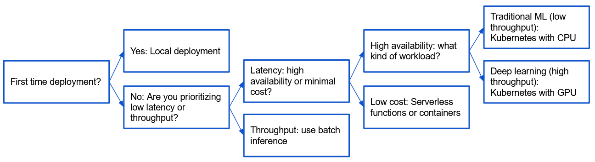
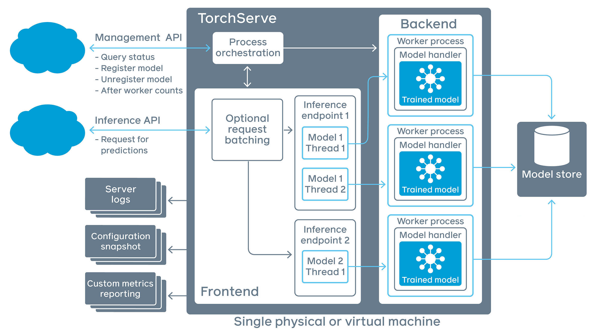

{ align=right width="130"}

# Local Deployment

---

Regardless of your application, model and usecase, the first starting point of serving your model should always be to
deploy it locally. The simple reason for that is debugging: if you deploy directly to the cloud you often get less
verbose error message and/or the iteration time is much slower because it simply takes much longer time to deploy
to the cloud than locally. Locally should therefore always be the first step with any new application.

<figure markdown>
{width="1000"}
</figure>

For this module we are going to focus on deployment of deep learning models, in particular Pytorch models which is used
throughout the course. Pytorch has historically been developed for research purposed, where iterating with quick ideas
was valued over fast computations. This is evident since Pytorch uses an *dynamic* graph underneath to represent the
computational graph that is being created whenever you are running calculations. The graph is important, as it keeps
track on how to do backpropergation though your Pytorch application. However, running code dynamically is notoriously
slower than compiling your code before running it. Lets therefore first consider another way of compiling our code.

## Compilation

If you ever coded in any low-level language such as c, fortran or c++ you should be familiar with the term *compiling*.
Compiling is the task of taken a computer program written in one language and translating it into another. In most cases
this means taken whatever you have written in your preferred programming language and translating it into machine code
that the computer can execute. But what does compilation have to do with coding Pytorch models?

It happens to be that `Pytorch` comes with its own compiler that can optimize your model for you. It can be found in
the submodule `torch.jit`. Jit stands for *just-in-time*, meaning that compilation runs at the same time we are
executing the code. If you know anything about low-level languages such c/c++ you know that we normally compile the code
before we run it. With `jit` we essentially merges the two phases into one. `jit` has two types of compilation modes,
called respective *script* and *trace*. We are in the exercises going to look at script as it is the easiest to get
started with and works without any code changes for nearly all kind of models. If you ever encounter that script does
not work for you then trace can be used which is more general.

The major reasons why we want to compile our models with `torch.jit` are:

* Scriptet code can be invoked in its own interpreter, which is basically a restricted Python interpreter.
    This interpreter does not acquire the Global Interpreter Lock (GIL), and so many requests can be processed on the
    same instance simultaneously.
* This scriptet format allows us to save the whole model to disk and load it into another environment, such as in a
    server written in a language other than Python
* Scriptet code gives us a representation in which we can do compiler optimizations on the code to provide
    more efficient execution
* Scriptet code allows us to interface with many backend/device runtimes that require a broader view of the
    program than individual operators.

### ❔ Exercises

We are here going to look at `torch.jit.script` for compiling our code.

1. To see the difference in the this exercises, we start out with a large model. Download one of the large image
    classification models from `torchvision` such as `ResNet-152`. For the purpose of the exercise it does not matter
    if you work with a random initialized model or a pretrained version.

2. Next try to script the model using `torch.jit.script`. You can find the documentation
    [here](https://pytorch.org/docs/stable/generated/torch.jit.script.html#torch.jit.script).

3. Just to confirm that by compiling our model using `torch.jit.script` did not change the output of our model, try
    checking that the output of the scripted model corresponds to the output of the non-scripted model. You can do this
    on a single random datapoint, and you should check that the top-5 prediced classes are the same

    ```python
    assert torch.allclose(unscripted_top5_indices, scripted_top5_indices)
    ```

    Hint: use [torch.topk](https://pytorch.org/docs/stable/generated/torch.topk.html).

4. Finally, try benchmarking the non-scripted model against the scripted model. I recommend using the built-in
    benchmarker in Pytorch: `torch.utils.benchmark.Timer`, which you can read more about how to use
    [here](https://pytorch.org/tutorials/recipes/recipes/benchmark.html). Do you see a increase in performance of the
    scripted model compared to the non-scriptet model. If so, what is the percentage increase in efficiency?

## Torchserve

For locally deploying our model we are going to look at Torchserve. Torchserve (illustrated below) is a combined
services for packaging and serving multiple Pytorch at the same time.

<!-- markdownlint-disable -->
<figure markdown>
{ width="1000" }
<figcaption>
<a href="https://aws.amazon.com/blogs/machine-learning/deploying-pytorch-models-for-inference-at-scale-using-torchserve/"> Image credit </a>
</figcaption>
</figure>
<!-- markdownlint-restore -->

Before we go into details of Torchmetrics, an important question is why we need such an abstraction on top of our
developed model. Why can't we just do:

```bash
python inference.py --my_model model_checkpoint.pt --new_datapoint img.png
```

If we where never going to do anything else than just calling the model ourself then it is probably not worth adding
anything else. However, if we ever want anyone else to interact with our model, we need to comply with standard ways
of requesting and sending data. This is especially true when the next step is to start deploying our model in the cloud.
Torchserve essentially brings in a inference API on top of our model that turns our model into a client-server type of
system: the client (user) is going to send *requests* to a server (our application) and the server will give an
*response*. The request will be send as a standard
[HTTP requests](https://en.wikipedia.org/wiki/Hypertext_Transfer_Protocol)
which Torchserve will help us decode into a useful input which we can then do inference on and return the result, again
as an standardized HTTP response. Torchserve is in that regard similar to
[FastAPI](https://fastapi.tiangolo.com/) or [Flask](https://flask.palletsprojects.com/en/2.2.x/) if you have ever
used one of those frameworks.

Finally, the packaging part of Torchserve is necessary because we cannot give a Torchserve a raw file of trained model
weights as these essentially is just a list of floats. We need a file that both contains the model definition and the
trained weights, such that the model essentially becomes independent of the python interpreter.

### ❔ Exercises

Torchserve can be a bit rough around the edges but is fairly easy to work with. We are largely going to follow the
instructions listed in the [readme file](https://github.com/pytorch/serve/blob/master/README.md#serve-a-model) for
Torchserve. The intention in these exercises is to serve a Resnet type neural network that is trained for classification
on [ImageNet](https://www.image-net.org/). Additional documentation can be found [here](https://pytorch.org/serve/).

1. Install `torchserve` and its dependencies. There are separate instructions on the
    [homepage](https://github.com/pytorch/serve) depending on you are using Windows, WSL or Linux/MAC.

2. Create a folder called `model_store`. This is where we will store the model that we are going to deploy

3. Try to run the `torchserve --model-store model_store` command. If the service starts with no errors, you
    have installed it correctly and can continue the exercise. Else it is Googling time!

4. Next lets create a model we can serve. If you have done the previous exercises on compiling using scripting, we
    highly recommend to initialize and save such model

    ```python
    model = ResnetFromTorchVision(pretrained=True)
    script_model = torch.jit.script(model)
    script_model.save('deployable_model.pt')
    ```

5. Call the model archiver. We have provided a file called `index_to_name.json` that maps from predicted class
    indices to interpretable class name e.g. `1->"goldfish"`. This file should be provided as the `extra-files`
    argument such that the deployed model automatically outputs the class name. Note that this files of course
    only works for models trained on imagenet.

    ```bash
    torch-model-archiver \
        --model-name my_fancy_model
        --version 1.0 \
        --serialized-file path/to/serialized_model.pt \
        --export-path model_store
        --extra-files index_to_name.json
        --handler image_classifier
    ```

6. Checkout the `model_store` folder. Has the model archiver correctly created a model (with `.mar` extension)
    inside the folder?

7. Finally, we are going to deploy our model and use it:

    1. Start serving your model in one terminal:

        ```bash
        torchserve --start --ncs --model-store model_store --models my_fancy_model=my_fancy_model.mar
        ```

    2. Next, pick a image that you want to do inference on. It can be any image that you want but try to pick
        one that actually contains an object from the set of imagenet classes. I have also provided a image of
        my own cat in the `my_cat.jpg` file.

    3. Open another terminal, which we are going to use for inference. The easiest way to do inference is using
        `curl` directly in the terminal but you are also free to experiment with the `requests` API directly in
        python. Using `curl` should look something like this

        ```bash
        curl http://127.0.0.1:8080/predictions/my_fancy_model -T my_image.jpg
        ```

8. Torchserve supports serving multiple models, not just one. Create a new vision model (either another resnet model
    or something similar), script it, save it, archive it in the save model store folder and then re-run torchserve
    like this

    ```bash
    torchserve --start --ncs --model-store model_store --models all
    ```

    Make sure that you can do inference with both models by calling `curl`.

That ends the module on local deployment. Hopefully in this phase you have gained a bit experience with sending HTTP
requests as this will be very important in the next module when we will try to deploy the models in the cloud.
