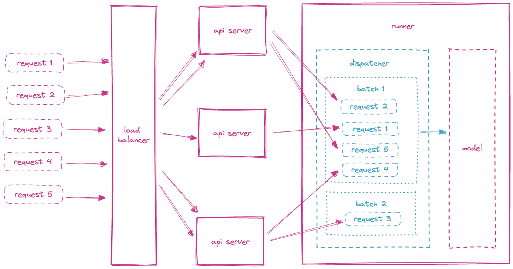

{ align=right width="130"}

# Machine Learning Deployments

---

!!! info "Core Module"

In the [previous module](apis.md) you learned about how to use `FastAPI` to create an API to interact with your machine
learning models. `FastAPI` is a great framework, but it is a general framework meaning that it was not developed with
machine learning applications in mind. This means that there are features which you may consider to be missing when
considering running large scale machine learning models:

1. Micro-batching: if you have a large number of requests coming in, you may want to process them in batches to reduce
    the overhead of loading the model and running the inference. This is especially true if you are running your model
    on a GPU, where the overhead of loading the model is significant.

2. Async inference: FastAPi does support async requests but not no way to call the model asynchronously. This means
    that if you have a large number of requests coming in, you will have to wait for the model to finish processing
    (because the model is not async) before you can start processing the next request.

3. Native GPU support: you can definitely run part of your application in FastAPI if you want to. But again it was not
    build with machine learning in mind, so you will have to do some extra work to get it to work.

It should come as no surprise that multiple frameworks have therefore sprung up that better supports deployment of
machine learning algorithms:

* [Cortex](https://github.com/cortexlabs/cortex)

* [Bento ML](https://github.com/bentoml/bentoml)

* [Ray Serve](https://docs.ray.io/en/master/serve/)

* [Triton Server](https://github.com/triton-inference-server/server)

* [Torchserve](https://pytorch.org/serve/)

* [Tensorflow serve](https://github.com/tensorflow/serving)

The first 4 frameworks are backend agnostic, meaning that they are intended to work with whatever computational backend
you model is implemented in (Tensorflow vs PyTorch vs Jax), whereas the last two are backend specific to respective
Pytorch and Tensorflow. In this module we are going to look at Bento ML, as it has a very simple interface and it
easily integrates with Pytorch and Pytorch Lightning. If you are interested in learning how torchserve works, we have an
[optional learning module](../s10_extra/local_deployment.md) on this framework.

## Bento ML core concepts

You can read much more about Bento ML in the [docs](https://docs.bentoml.com/en/latest/index.html), but we are going
to look at the four core concepts of Bento ML: [Models](https://docs.bentoml.org/en/latest/concepts/model.html),
[Services](https://docs.bentoml.com/en/latest/concepts/service.html),
[Runners](https://docs.bentoml.com/en/latest/concepts/runner.html),
[Bentos](https://docs.bentoml.com/en/latest/concepts/bento.html).

### Models


### Services


### Runners

A runner in Bento ML represents a single unit of computation and is therefore able to scale independently. This is


As mentioned in the beginning, a core feature of Bento ML is that it support micro-batching or
[adaptive batching](https://docs.bentoml.com/en/latest/guides/batching.html). The

<figure markdown>
{ width="800" }
<figcaption> <a href="https://docs.bentoml.com/en/latest/guides/batching.html"> Image credit </a> </figcaption>
</figure>

### Bentos

A *Bento* in BentoML is a format containing all essential components - source code, models, data files, and dependency
configurations required for running a single service. If this sounds familiar, it is because
it is very similar to [docker](../s3_reproducibility/docker.md) in concept. The main difference is that a Bento is
intended to be used for machine learning whereas docker is a general container format.

To create a bento, you just need to write a `bentofile.yaml`

```yaml
service: MyService
labels:
    bentoml.env: production
    bentoml.version: 1.0.0
    bentoml.author: John Doe
    bentoml.author_email: john.doe@company_x.com
include:
- "*.py"  # a pattern for matching files to include
python:
    packages:
    - pytorch
    - torchvision
    - scikit-learn
models:
- iris_clf:latest
```

A bentofile is very similar to a docker file in that it describes what files to include (corresponding to the `COPY`
statement in dockerfiles) and what packages to install as dependencies (the `RUN` statements in dockerfiles). The
benefit of using a bentofile is that it is much easier to create than a dockerfile, as a large part of the configuration
is done automatically by BentoML.

To build a bento, you just need to run

```bash
bentoml build
```

which can then be served with

```bash
bentoml serve MyService:latest
```

it is not strictly necessary to build a bento before serving it and the same functionality can be achieved using
a dockerfile, so what you choose to use is up to you and your team.

## ❔ Exercises

In general we advice looking through the [docs](https://docs.bentoml.com/en/latest/index.html) for Bento ML if you
need help with any of the exercises.

1. Install BentoML

    ```bash
    pip install bentoml #(1)!
    ```

    1. :man_raising_hand: If you in the future want to investigate some of the advanced features of Bento ML, then you
        need to install the `all` dependencies. You can do this by running:

        ```bash
        pip install "bentoml[all]"
        ```

2. You are in principal free to serve any Pytorch model you like, but we recommend to start out with the model you
    trained during the [last module on the first day](../s1_development_environment/deep_learning_software.md) for
    recognizing hand written digits. The first step is to save our model in a format that Bento ML can serve. You
    have three options to choose from here:

    === "Pytorch"

        ```python
        import bentoml
        bentoml.pytorch.save_model(
            "my_torch_model",
            model,
            signatures={"__call__": {"batchable": True, "batch_dim": 0}},
        )
        ```

    === "Pytorch + TorchScript"

        The better option is first to compile your model using `torchscript` like this:

        ```python
        scriptet_model = torch.jit.script(model)
        ```

        and then save it with:

        ```python
        import bentoml
        bentoml.torchscript.save_model(
            "my_torch_model",
            model,
            signatures={"__call__": {"batchable": True, "batch_dim": 0}},
        )
        ```

    === "Pytorch Lightning"

        If you model was trained in Pytorch Lightning e.g. you re-implemented it after following
        [this module](../s4_debugging_and_logging/boilerplate.md) then you can also choose to save the model using

        ```python
        import bentoml
        bentoml.pytorch_lightning.save_model(
            "my_torch_model",
            model,
            signatures={"__call__": {"batchable": True, "batch_dim": 0}},
        )
        ```

    Take either a pre-trained model you have on your computer, load it in and save it again using the above code.
    Alternatively, you can just retrain your model and add the code above to save the model.

3. Regardless of how you choose to save the model, you can also add additional information when saving the model,
    such ad labels and metadata:

    ```python
    bentoml.pytorch.save_model(
        "demo_mnist",   # Model name in the local Model Store
        trained_model,  # Model instance being saved
        labels={    # User-defined labels for managing models in BentoCloud
            "owner": "nlp_team",
            "stage": "dev",
        },
        metadata={  # User-defined additional metadata
            "acc": acc,
            "cv_stats": cv_stats,
            "dataset_version": "20210820",
        },
    )
    ```

    add at least one labels and one metadata key to your saving call.

4. Bento ML come with its own command line interface which provide an easy way to interact with your saved models. Try
    out the following commands and make sure you understand what they do:

    ```bash
    bentoml models list
    bentoml models get <model-name>
    bentoml models export <model-name>
    ```

5. With the model saved in the right format the next step is to create a script that can serve our saved model. Create
    a new script called `service.py` and add the following code:

    ```python
    import bentoml
    runner = bentoml.models.get("<model-name>") #(1)!

    svc = bentoml.Service(name="my-service", runners=[runner])

    @svc.api(input=bentoml.io.Image(), output=bentoml.io.Text()) #(2)!
    async def predict(input: np.ndarray):
        generated = await runner.async_run(input)
        return generated
    ```

    1. :man_raising_hand: Replace `<model-name>` with the name of the model you saved in the previous exercise.

    2. :man_raising_hand: Bento ML comes with a number of nice
        [IO descriptors](https://docs.bentoml.com/en/latest/reference/api_io_descriptors.html) that easily allows you
        to specify the input and output of your service. In this case we are using the `Image` descriptor to specify
        that the input to our service is an image and the `Text` descriptor to specify that the output is text.

    Then run the following command to serve the model locally

    ```bash
    bentoml serve serve:svc #(1)!
    ```

    1. :man_raising_hand: `service` refers to the name of the script with our service and the `svc` refers to the name
        of our service that we want to run. This is exactly the same syntax as when you were working with `FastAPI` and
        `uvicorn` in the [previous module](apis.md).

6. Make sure that you can request to your service. You are free to either use `curl` in the terminal or write a Python
    script and use the `requests` library. Here are some inspiration for how to do it:

    === "curl"

        ```bash
        curl -X 'POST' 'http://0.0.0.0:3000/predict' \
            -H 'accept: application/json' \
            -H 'Content-Type: image/png' \
            --data-binary '@image.jpg'
        ```

    === "Python"

        ```python
        import requests
        file_path = "/path/to/your/image.jpg"
        with open(file_path, 'rb') as file:
            data = file.read()
        headers = {"accept": "application/json", "Content-Type": "image/png"}
        response = requests.post("http://0.0.0.0:3000/predict", headers=headers, data=data)
        print(response.text)
        ```

8. As written in the introduction to this module, the smart feature of Bento ML is that it allows for
    adaptive batching. Lets try to see how this works.

    1. The machine learning application we are going to serve is an object detection model more specifically the
        [YOLOv5 model](https://github.com/ultralytics/yolov5). To download the model run the following command:

        ```python
        import torch
        torch.hub.load("ultralytics/yolov5", "yolov5s")
        print(torch.hub.get_dir())
        ```

        checkout the location returned by `torch.hub.get_dir()` and you should see a folder called `yolov5s`. This
        folder contains the model we are going to serve.

    2. We have already written the same machine learning application in `FastAPI` in the previous module and bentoml.


    2. Create a new script called `hard_hitter.py` where we are going to simulate a large number of requests coming in
        at the same time. Add the following code to the script:

        ```python
        import asyncio
        import time
        import requests

        import numpy as np

        from PIL import Image

        def load_image(path):
            img = Image.open(path)
            img = img.resize((28, 28))
            img = np.array(img)
            img = img / 255.0
            img = img.astype(np.float32)
            return img

        def load_images(paths):
            return [load_image(path) for path in paths]

        def predict(imgs):
            url = "http://localhost:8000/predict"
            data = [img.tolist() for img in imgs]
            response = requests.post(url, json=data)
            return response.json()

        def main():
            paths = ["../figures/numbers/0.png", "../figures/numbers/1.png"]
            imgs = load_images(paths)
            start = time.time()
            predictions = predict(imgs)
            end = time.time()
            print(f"Predictions: {predictions}")
            print(f"Time: {end - start}")

        if __name__ == "__main__":
            main()
        ```

    3. Run the script and see how long it takes to make the predictions for the two images. You should see that it takes
        around 1 second to make the predictions.

    4. Redo the experiments with the `FastAPI` application from the [previous module](apis.md) and see how long it takes
        to make the predictions. You should see that it takes around 1 second to make the predictions.

This ends the module on machine learning deployments with Bento ML. Hopefully you have seen some of the features that
comes with using a framework that was build with machine learning applications in mind.
