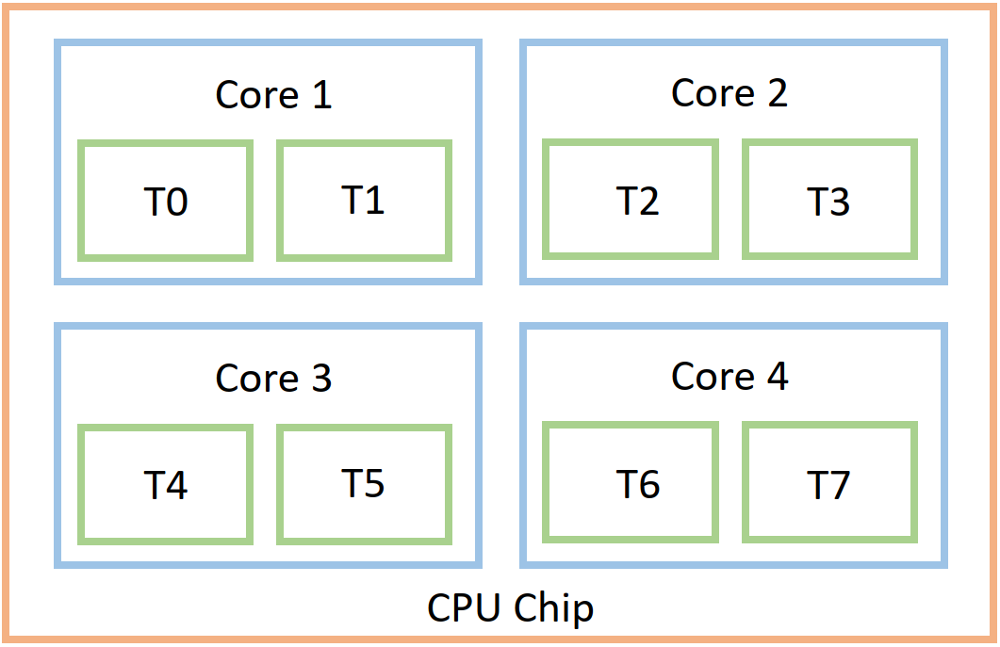
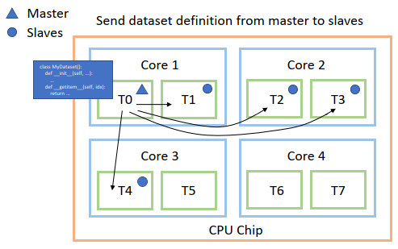
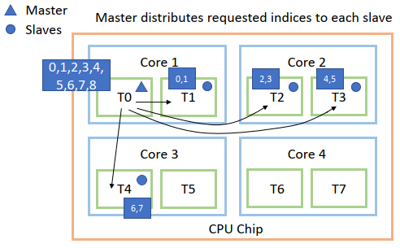
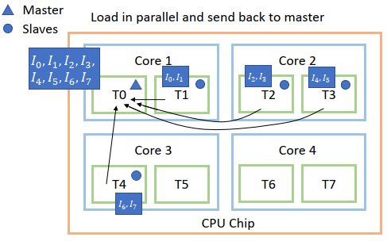

# Distributed Data Loading
{: .no_toc }

<details open markdown="block">
  <summary>
    Table of contents
  </summary>
  {: .text-delta }
1. TOC
{:toc}
</details>

---

The first set of exercises lets focus on distributed data loader, but before we start on the exercises lets try to understand why the parallizing data loading

### A closer look on Data loading 

Before we talk distributed applications it is important to understand the physical layout of a standard CPU (the brain of your computer)

<p align="center">
    
</p>

Most modern CPUs is a single chip that consist of multiple *cores*. Each core can further be divided into *threads*. In most laptops the core count is 4 and commonly 2 threds per code. This means that the common laptop have 8 threds. The number of threds a compute unit haves is important, because that directly corresponds to the number of parallel operations that can be executed i.e. one per thread. In a Python terminal you should be able to get the number of cores in your machine by writing:

```python
import multiprocessing
cores = multiprocessing.cpu_count()
print(f"Number of cores: {cores}, Number of threads: {2*cores}")
```

A distributed application is in general any kind of application that parallelizes some or all of it workload. We are in these exercises only focusing on distributed data loading, which happens primarily only on the CPU. In `Pytorch` it is easy to parallelize data loading if you are using their dataset/dataloader interface

```python
from torch.utils.data import Dataset, DataLoader
class MyDataset(Dataset):
    def __init__(self, ...):
        # whatever logic is needed to init data loading
        self.data = ...

    def __getitem__(self, idx):
        # return one item
        return self.data[idx]

dataset = MyDataset()
dataloader = Dataloader(dataset,
                        batch_size=8,
                        num_workers=4)  # this is the number of threds we want to parallize workload over

```

Lets take a deep dive into what happens when we request a batch from our dataloader e.g. ``next(dataloader)``. First we must understand that we have a thread that plays the role of the *master* and the workers (in the above example we request 4) are called *slaves* (not the best terminology). When the dataloader is created, we create this structure and make sure that all threads have a copy of our dataset definition so each can call the `__getitem__` method.

<p align="center">
    
</p>

Then comes the actual part where we request a batch for data. Assume that we have a batch size of 8 and we do not do any shuffeling. In this step the master thread then distributes the list of requested data points (`[0,1,2,3,4,5,6,7]`) to the four slave threads

<p align="center">
    
</p>

Each thread then calls `__getitem__` method for all the indices it has received. When all processes are done, the loaded images datapoints gets send back to the master thread, collected into a single structure/tensor.

<p align="center">
    
</p>

Each arrow is corresponds to a communication between two threads, which is not a free operations. In total to get a single batch (not counting the initial startup cost) in this example we need to do 8 communication operations. This may seem like a small price to pay, but that may not be the case. If the process time of ``__getitem__`` is very low (data is stored in memory, we just need to index to get it) then it does not make sense to use multiprocessing. The computationally saving by doing the look-up operations in parallel is smaller than the communication cost there is between the master thread and the workers. Multiprocessing makes sense when the process time of ``__getitem__`` is high (data is probably stored on the harddrive). 

This phenomenem is exactly what we are going to investigate in the exercises.

### Exercises

This exercise is intended to be done on the [labeled faces in the wild (LFW)](http://vis-www.cs.umass.edu/lfw/) dataset. The dataset consist images of famous people extracted from the internet. The dataset had been used to drive the field of facial verification, which you can read more about 
[here](https://machinelearningmastery.com/introduction-to-deep-learning-for-face-recognition/). We are going imagine that this dataset cannot fit in memory, and your job is therefore to construct a data pipeline that can be parallelized based on loading the raw datafiles (.jpg) at runtime.

1. Download the dataset and extract to a folder. It does not matter if you choose the non-aligned or
   aligned version of the dataset.

2. We provide the `lfw_dataset.py` file where we have started the process of defining a data class. 
   Fill out the `__init__`, `__len__` and `__getitem__`. Note that `__getitem__` expect that you
   return a single `img` which should be a `torch.Tensor`. Loading should be done using 
   [PIL Image](https://pillow.readthedocs.io/en/stable/), as `PIL` images is the default input format for
   [torchvision](https://pytorch.org/vision/stable/transforms.html) for transforms (for data augmentation).  

3. Make sure that the script runs without any additional arguments
   ```
   python lfw_dataset.py
   ```
4. Visualize a single batch by filling out the codeblock after the first *TODO* right after defining the dataloader. 
   The visualization should show when launching the script as
   ```
   python lfw_dataset.py -visualize_batch
   ```

5. Experiment how the number of workers influences the performance. We have already provide code that will pass over the dataset 5 times and calculate how long time it took, which you can play around with by calling
   ```
   python lfw_dataset.py -get_timing -num_workers 1
   ```
   Make a [errorbar plot](https://matplotlib.org/stable/api/_as_gen/matplotlib.pyplot.errorbar.html) with number of workers along the x-axis and the timing along the y-axis. The errorbars should correspond to the standard deviation over the 5 runs. HINT: if it is taking too long to evaluate, use a subsection of the dataset. Also if you are not seeing an improvement, try increasing the batch size (since data loading is parallelized per batch).

6. (Optional, requires access to GPU) If your dataset fits in GPU memory it is beneficial to set the
   `pin_memory` flag to `True`. By setting this flag we are essentially telling Pytorch that they can
   lock the data in-place in memory which will make the transfer between the *host* (CPU) and the
   *device* (GPU) faster.

