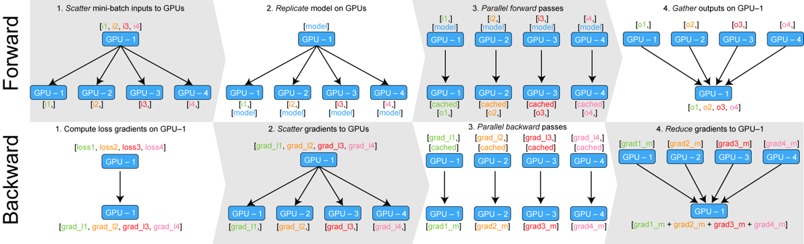

# Distributed Training
{: .no_toc }

<details open markdown="block">
  <summary>
    Table of contents
  </summary>
  {: .text-delta }
1. TOC
{:toc}
</details>

---

In this module we are going to look at distributed training. Distributed training is one of the key ingredients
to all the awesome results that deep learning models are producing. For example: 
[Alphafold](https://deepmind.com/blog/article/alphafold-a-solution-to-a-50-year-old-grand-challenge-in-biology)
the highly praised model from Deepmind that seems to have solved protein structure prediction, was trained
in a distributed fashion for a few weeks. The training was done on 16 TPUv3s (specialized hardware), which
is approximately equal to 100-200 modern GPUs. This means that training Alphafold without distributed training
on a single GPU (probably not even possible) would take a couple of years to train! Therefore, it is simply 
impossible currently to train some of the state-of-the-art (SOTA) models within deep learning currently, 
without taking advantage of distributed training.

When we talk about distributed training, there are a number of different paradigms that we may use to parallelize
our computations

* Data parallel training
* Distributed data parallel training
* Sharded training

## Data parallel

While data parallel today in general is seen as obsolete compared to distributed data parallel, we are still going to investigate it a bit since it offers the most simple form of distributed computations in deep learning pipeline.

In the figure below is shown both the *forward* and *backward* step in the data parallel paradigm

<p align="center">
   
</p>

The steps are the following:

* Whenever we try to do *forward* call e.g. `out=model(batch)` we take the batch and divide it equally between all devices. If we have a batch size of $N$ and $M$ devices each device will be sent $N/M$ datapoints.

* Afterwards each device receives a copy of the `model` e.g. a copy of the weights that currently parametrizes our neural network

* In this step we perform the actual *forward* pass in parallel. This is the actual steps that can help us scale our training

* Finally we need to send back the output of each replicated model to the primary device.

Similar to the anaysis we did of parallel data loading, we cannot always expect that this will actual take less time than doing the forward call on a single GPU. If we are parallizing over $M$ devices, we essentially need to do $3\cdot M$ communication calls to send batch, model and output between the devices. If the parallel forward call does not outweigh this, then it will take longer.

In addition, we also have the *backward* path to focus on 

* As the end of the *forward* collected the output on the primary device, this is also where the loss is accumulated. Thus, gradients are first calculated on the primary device

* Next we scatter the 


One of the big downsides of using data parallel is that all the replicas are destroyed after each *backward* call. This means that we over and over again need to replicate our model and send it to the devices that are part of the computations. 

Eventhough it seems like a lot of logic is going into data paralle, in practise in Pytorch we can very simply enable data parallel training by wrapping our model in the [nn.DataParallel](https://pytorch.org/docs/stable/generated/torch.nn.DataParallel.html) class.
```python
from torch import nn
model = MyModelClass()
model = nn.DataParallel(model, device_ids=[0, 1])  # data parallel on gpu 0 and 1
preds = model(input)  # same as usual
```

### Exercises

Please note that the exercise only makes sense if you have access to multiple GPUs.

1. Create a new script (call it `data_parallel.py`) where you take a copy of model `FashionCNN` from the `fashion_mnist.py` script. Instantiate the model and wrap `torch.nn.DataParallel` around it such that it can be executed in data parallel.

2. Try to run inference in parallel on multiple devices (pass a batch multiple times and time it) e.g.
   ```python
   import time
   start = time.time()
   for _ in range(n_reps):
      out = model(batch)
   end = time.time()
   ```
   Does data parallel decrease the inference time? If no, can you explain why that may be? Try playing around with the batch size, and see if data parallel is more beneficial for larger batch sizes.


## Distributed data parallel

For the exercises we are mainly going to focus on distributed data parallel training as it is the most common one to use.

### Exercises


### Exercises

1. Take a look at the `distributed_example.py` and `distributed_example.sh` files and try to understand
   them. They are essentially what you would need to implement yourself to get this working. Try to
   answer the following questions (HINT: try to google around a ):
   
   1. What is the function of the `DDP` wrapper?

   2. What is the function of the `DistributedSampler`?

   3. Why is it necessary to call `dist.barrier()` before passing a batch into the model?

   4. What does the different enviroment variables does in the `.sh` file

2. The last exercise have hopefully convinced you that it can be quite the trouble writing distributed training applications yourself.
   Luckly for us, `Pytorch-lightning` can take care of this for us such that we do not have to care about the specific details. To
   get your model training on multiple GPUs you need to change two arguments in the trainer: the `accelerator` flag and the `gpus` flag.
   In addition to this, you can read through this [guide](https://pytorch-lightning.readthedocs.io/en/latest/advanced/multi_gpu.html)
   about any additional steps you may need to do (for many of you, it should just work). Try running your model on multiple GPUs.

3. Try benchmarking your training using 1 and 2 gpus e.g. try running a couple of epochs and measure how long time it takes. 
   How much of a speedup can you actually get? Why can you not get a speedup of 2?

3. (Optional) Calling `self.log` by default will only log the result from process 1. Try chaning the `sync_dist` flag to accumulate
   the values across devices.


### Sharded

The two approaches we have looked at until now assumes one thing: that you can actually fit the computations going on in your
model and the model itself on every single device in the distributed environment. However, if your model has a lot
of parameters (around 500 millons or more on modern GPUs) you simply cannot fit the model on each device and we therefore have
to rethink our distributed paradigm.


