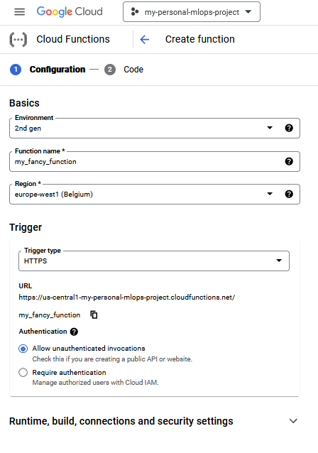
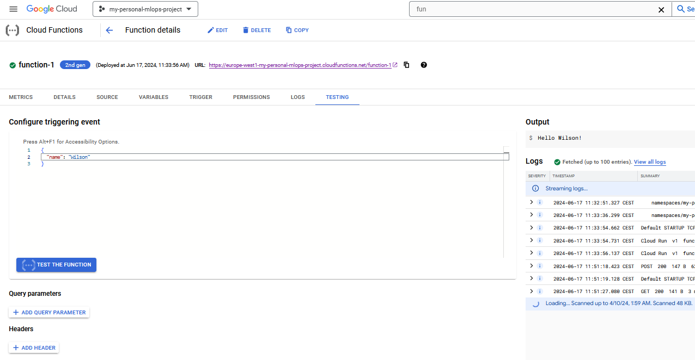

# Cloud deployment
{: .no_toc }

<details open markdown="block">
  <summary>
    Table of contents
  </summary>
  {: .text-delta }
1. TOC
{:toc}
</details>

---

We are now returning to using the cloud. In module [M18](../s6_the_cloud/M18_using_the_cloud) you should have
gone through the steps of having your code in your github repository to automatically build into a docker
container, store that, store data and pull it all together to make a training run. After the training is
completed you should hopefully have a file stored in the cloud with your trained model weights.

Todays exercises will be about serving those model weights to an end user. We focus on two different ways
of deploying our model, `Google cloud functions` and `Google Vertex AI endpoints`.

## Cloud Functions

Cloud functions are the easiest way to get started with deployment because they are what is called *serverless*.
For serverless deployment we still need a server to do the actual workload, however the core concept is that **you** 
do you have to manage the server. Everything is magically taken care of behind the scene.

### Exercises

1. Go to the start page of `Cloud Functions`. Can be found in the sidebar on the homepage or you can just
   search for it. Activate the service if not already active.

2. Click the `Create Function` button which should take you to a screen like the image below. Give it a name,
   set the server region to somewhere close by and change the authetication policy to 
   `Allow unauthenticated invocations` so we can access it directly from a browser. Remember to note down the
   *URL* of the service somewhere.
   <p align="center">
     
   </p>

3. On the next page, for `Runtime` pick the `Python 3.9` option. This will make the inline editor show both
   a `main.py` and `requirements.py` file. Look over them. Click the `Deploy` button in the lower left corner.

4. Afterwards you should see a green check mark beside your function meaning that it is deployed. Click the
   `Test function` button which will take you to the testing page.
   <p align="center">
     
   </p>

5. If you know what the application does, it should come as no surprise that it can run without any input. We
   therefore just send an empty request by clicking the `Test The Function` button. Does the function return
   the output you expected? Wait for the logs to show up. What do they show?

   1. What should the `Triggering event` look like in the testing prompt for the program to respond with
      ```
      Good day to you sir!
      ```
      Try it out.

   2. Click on the metrics tab. Identify what each panel is showing.

   3. Go to the trigger tab and go to the url for the application.

   4. Checkout the logs tab. You should see that your application have already been invoked multiple times.

6. Next, we are going to create an application that actually takes some input so we can try to send it requests.
   We provide a very simple `sklearn_cloud_function.py` script to get started.

   1. Figure out what the script does and run the script. This should create a file with trained model.

   2. Next create a storage bucket and upload the model file to the bucket. You can either do this through the
      webpage or run the following commands:
      ```
      gsutil mb gs://<bucket-name>  # mb stands for make bucket
      gsutil cp <file-name> gs://<bucket-name>  # cp stands for copy
      ``
      check that the file is in the bucket.
   
   3. Create a new cloud function with the same initial settings as the first one. Choose also the `Python 3.9`
      but this time change code to something that can actually use the model we just uploaded. Here is a code
      snippet to help you:
      ```python
      from google.cloud import storage
      import pickle

      BUCKET_NAME = ...
      MODEL_FILE = ...

      client = storage.Client()
      bucket = client.get_bucket(BUCKET_NAME)
      blob = bucket.get_blob(MODEL_FILE)
      my_model = pickle.loads(blob.download_as_string())

      def knn_classifier(request):
         """ will to stuff to your request """
         request_json = request.get_json()
         if request_json and 'input_data' in request_json:
               data = request_json['input_data']
               input_data = list(map(int, data.split(',')))
               prediction = my_model.predict([input_data])
               return f'Belongs to class: {prediction}'
         else:
               return 'No input data received'

      ```
      Some notes:
         * For locally testing the above code you will need to install the `google-cloud-storage` python package
         * Remember to change the `Entry point`
         * Remember to also fill out the `requirements.txt` file. You need at least two packages to run the application
           with `google-cloud-storage` being one of them. 
         * If you deployment fails, try to go to the `Logs Explorer` page in `gcp` which can help you identify why.
   
   4. When you have successfully deployed the model, try to make predictions with it.
      
7. You can finally try to redo the exercises deploying a Pytorch application. You will essentially
   need to go through the same steps as the sklearn example, including uploading a trained model
   to a storage, write a cloud function that loads it and return some output. You are free to choose
   whatever Pytorch model you want.

## AI Platform

Cloud functions are great for simple deployment, however they are really not meant to be used in combination
with containers. For that we have to move to more complex systems. For that we return to 

1. Follow this [tutorial](https://cloud.google.com/ai-platform/prediction/docs/getting-started-pytorch-container) 
   that goes through the process of constructing a docker image that can be used for prediction
   (which includes `torchserve`) and afterwards how that image can be deployed using the
   *AI Platform Prediction*  interface. 

The exercises above is just a small taste of what deployment has to offer. In both exercises we have explicitly
not talked about management of clusters. That is taken care of by Google such that you can focus on the application.
That said for those of you that are really interested in taking deployment to the next level should get started
on *kubernetes* which is the de-facto open-source container orchestration platform that is being used in production
enviroments. If you want to deep dive we recommend starting [here](https://cloud.google.com/ai-platform/pipelines/docs)
which describes how to make pipelines that are a nessesary component before you start to `
[create](https://cloud.google.com/ai-platform/pipelines/docs/configure-gke-cluster) your own
kubernetes cluster.
