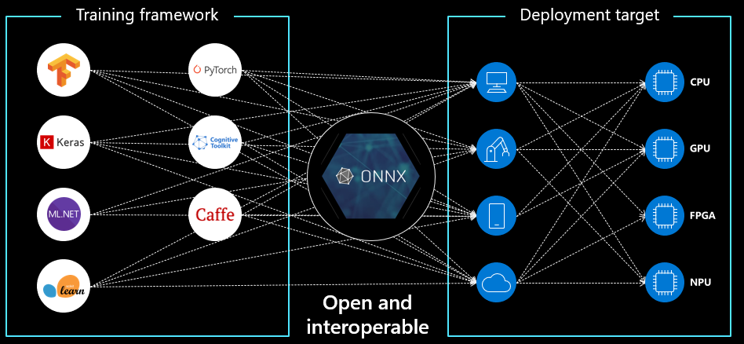

# Model packaging (work in progress)

ONNX is 

  

Open Neural Network Exchange (ONNX) is an open source standard for creating and sharing AI models.
ONNX provides an open source format for AI models, both deep learning and traditional ML. 
It defines an extensible computation graph model, as well as definitions of built-in operators and standard data types.

Models can be build using a varity of frameworks (Pytorch, Tensorflow, Scikit-learn) 

https://github.com/onnx/onnx